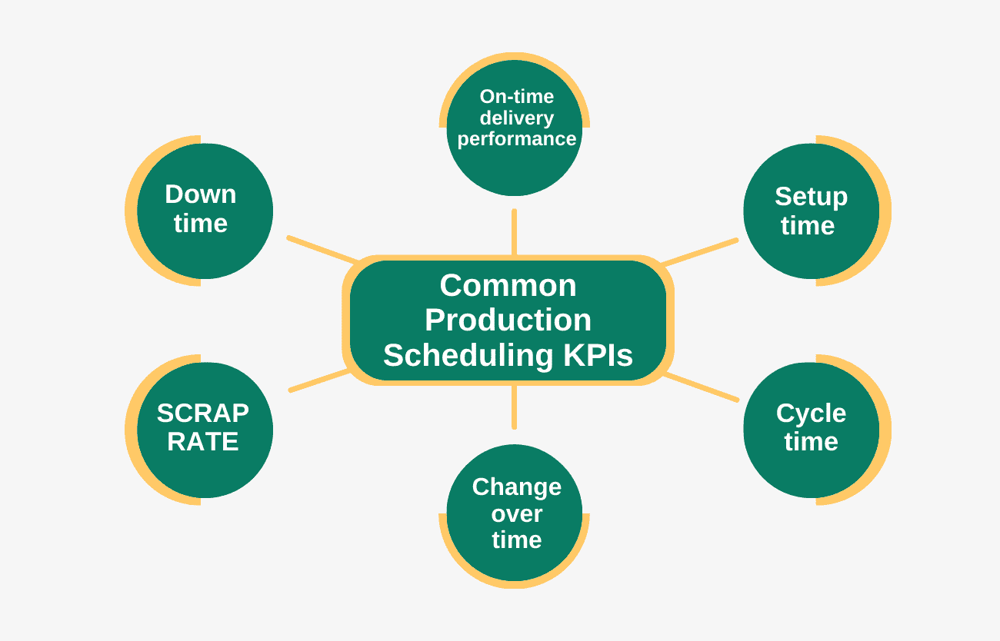
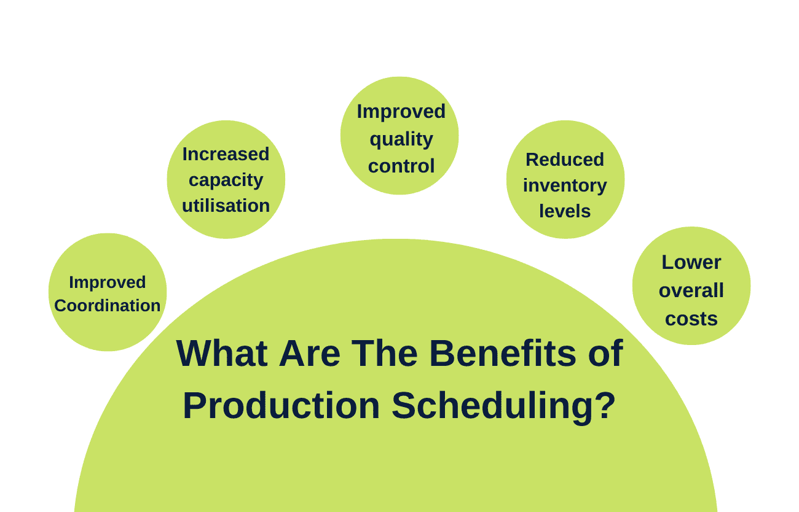

# 运营管理和生产流程中的调度是什么？

> 原文：<https://www.edureka.co/blog/scheduling-in-operations-management/>

大多数人都熟悉个人生活中的时间安排——为特定的活动留出时间，组织活动等等。但是商业世界呢？[运营管理](https://www.edureka.co/blog/beginners-guide-to-operations-management/)中的调度是什么，它在生产过程中起什么作用？这篇博客文章将探索答案和更多。我们将讨论运营管理中使用的不同调度方法以及相关的优势和挑战。最后，你应该更好地理解什么是调度，以及如何用它来改善生产过程。

## **什么是生产过程调度？**

在运营管理和生产过程中，调度是计划、协调和控制生产过程中事件和活动顺序的过程。调度旨在确保资源得到优化和有效利用，以满足客户需求。

生产流程中使用的计划主要有三种:

1.  **主生产计划(MPS):** 它是一个计划，指明产品组合中的每一项何时生产。
2.  **生产活动控制(PAC):**PAC 计划通过制造流程跟踪单个生产订单的进度。
3.  **产能计划:** 产能计划时间表确保有足够的产能满足客户需求。

调度是运营管理的一个重要组成部分，因为它有助于确保快速高效地生产产品。如果操作得当，它可以帮助最小化成本和最大化利润。

## **什么是运营管理中的调度？**

运营管理中的调度是计划、协调和控制资源使用以完成生产过程的过程。它包括决定何时开始和完成每项任务，为每项任务使用哪些资源，以及执行任务的顺序。在制造业中，运营管理中的调度通常使用计算机软件来完成，该软件考虑了各种约束条件，如可用资源、客户需求和生产能力。

## **常用生产调度 KPI**

一些关键绩效指标(KPI)通常用于衡量运营管理和制造流程中生产调度的有效性。以下是六个最常见的关键绩效指标:

1.  **准时交付绩效:** 此 KPI 衡量生产计划在交付时间方面满足客户需求的程度。目标是尽可能按时(或尽早)交付尽可能多的产品。
2.  **准备时间:** 此 KPI 衡量机器准备生产所需的时间。目标是最大限度地缩短准备时间，以便更快地启动生产流程。
3.  **周期时间:** 此 KPI 衡量生产一个产品单位所需的时间。目标是最大限度地缩短周期时间，以便在给定的时间内生产更多的产品。
4.  **转换时间:** 此 KPI 衡量从生产一种产品转换到生产另一种产品所需的时间。目标是最大限度地减少转换时间，使生产更加灵活，适应不断变化的客户需求。
5.  **废品率:** 此 KPI 衡量由于缺陷或质量差而报废或拒绝的产品的百分比。目标是最大限度地降低废品率，从而减少资源浪费，让更多产品符合客户标准。
6.  **停机时间:** 此 KPI 衡量机器由于维护、修理等原因而不使用的时间。

## **解释生产计划的各个阶段**

生产计划有四个主要阶段:计划、排序、发布和监控。

1.  **计划:** 生产调度的第一阶段是计划。在这一阶段，经理制定一个主计划，概述下一阶段的期望产出。该计划考虑了客户需求、可用资源和每种产品的交付周期等因素。这个阶段的目标是创建一个可行的计划，既能满足客户需求，又不会使系统过载。
2.  **排序:** 生产调度的第二个阶段是排序。在这一阶段，经理决定产品生产的具体顺序。该顺序应考虑产品依赖性和机器容量等因素。这一阶段的目标是创建一个高效的生产计划，最大限度地减少瓶颈，最大限度地提高产量。
3.  **发布:** 生产调度的第三阶段是发布。在这一阶段，经理为每个生产订单指定具体的到期日。这个发布日期应该考虑每个产品的交付周期和系统中的任何空闲时间。这一阶段旨在确保每个订单都按时完成，并且没有 WIP 库存积压。
4.  **预测:** 生产计划的第一阶段是预测，这涉及到对一项服务或产品的未来需求的估计。这可以通过使用统计方法、市场研究或其他预测技术来实现。
5.  **产能计划:** 生产计划的第二阶段是产能计划，这涉及到确定需要多少产能来满足预测的需求。它包括考虑将需要的物质和人力资源。
6.  **排产:** 生产排产的第三个阶段是创建进度计划。这包括决定任务需要以什么顺序完成，以及它们应该何时开始和结束。它还包括为任务分配资源，并确保考虑所有的限制。
7.  **监控与控制:** 生产计划的第四个阶段是监控与控制，它涉及到确保计划得到遵守，任何偏差都得到纠正。这可以通过定期的状态报告、挣值管理或其他监控技术来实现。
8.  **调整:** 生产计划的第五个阶段是调整，这涉及到根据需求或其他因素的变化，根据需要对计划进行更改。这可能包括重新排定任务日程、重新分配资源或将新任务添加到日程中。

**也读:[运营管理的范围是什么？](https://www.edureka.co/blog/what-is-the-scope-of-operations-management/)**

## **生产调度类型**

为了适应不同类型的生产系统，需要不同类型的生产计划。三种最常见的生产计划类型是按库存生产(MTS)、按订单生产(MTO)和混合模式。

**按库存生产调度:**

MTS 的目标是提前生产产品，这样当顾客需求增加时，它们就可以被储存起来并准备销售。这种类型的生产通常用于需求相对稳定和可预测的情况，例如快速消费品。为了保持有效的库存水平，MTS 计划员必须了解生产一个项目所需的提前期和客户需求的预期速度。

**按订单生产调度:**

与 MTS 不同，MTO 是在客户订单之前生产货物，MTO 计划员要等到收到客户订单后才开始生产。该系统通常用于定制或个性化产品，其中每个单元都必须为订购它的客户专门制造。虽然这种方法消除了库存短缺，但如果制造流程中存在能力限制，则会导致交付周期过长。

**混合模式生产调度:**

混合模式生产计划是指创建包括制造和装配工序的生产计划的过程。这种类型的调度可用于提高制造过程中的效率和灵活性。混合模式生产调度是有益的，因为它促进了制造和装配操作之间的协调。这可以改善质量控制、缩短交付周期并降低库存水平。此外，混合模式生产调度可通过减少浪费和提高资源利用率来帮助降低制造成本。

## **在运营管理和生产** **中优化调度的步骤是什么？**

为了优化生产调度，企业需要考虑几个因素，包括:

*   正在生产的产品或服务的类型
*   所需产品或服务的数量
*   可用资源(劳动力、材料、设备)
*   完成每个生产过程所需的时间
*   生产限制(例如，到期日、产能限制)

一旦考虑了所有这些因素，企业就可以制定一份生产计划，概述生产过程中的每一步应该何时完成。该时间表可用于确保资源得到有效利用，并符合截止日期。

## **调度在运营管理和生产中有什么好处？**

生产调度的好处多种多样，但大致可以概括如下:

**协调性提高:**

改善不同部门和[职能之间的协调是生产](https://www.edureka.co/blog/functions-of-production-and-operations-management/)调度的主要好处之一。对所有即将到来的生产任务有一个集中的视图，可以更容易地确保每个人都在同一页上，朝着相似的目标前进，并且不会形成瓶颈。它可以提高效率和产量，改善全面的沟通。

**产能利用率提高:**

生产调度有助于确保尽可能高效地利用所有生产资源，从而提高产能利用率。通过减少停机时间和最大限度地利用可用资源，生产计划有助于提高整体生产率和降低成本。此外，有效的生产调度有助于确保订单如期交付，从而提高客户满意度。

**改进的质量控制:**

改进的质量控制是生产调度的主要优势之一。通过更好地了解和预测客户的需求，企业可以相应地规划生产，并确保交付更高质量的产品。此外，通过减少浪费和最大限度地利用资源，企业还可以节省生产成本。

**降低库存水平:**

降低库存水平是生产计划的主要好处之一。通过减少现有库存量，企业可以节省存储成本并降低缺货风险。此外，制定时间表有助于确保订单及时完成，并将生产线中断降至最低。

**降低总体成本:**

生产调度可以通过减少生产产品或服务所需的时间和资源来降低整体成本。通过更好地了解生产过程和每个阶段的要求，企业可以更有效地规划工作，避免不必要的浪费。这可以减少生产时间，减少停工时间，提高质量控制。反过来，这些效率可以节省材料、劳动力和其他运营成本。

**也读:[运营管理的目标是什么？](https://www.edureka.co/blog/what-are-the-objectives-of-operations-management/)**

## **在运营管理和生产中，调度面临哪些挑战？**

生产计划会带来许多挑战，有些挑战比其他挑战更常见。下面是一些潜在挑战的例子:

**1)没有足够的信息:** 要创建一个有效的时间表，你需要获得准确和最新的信息。它包括了解可用的原材料、每个组件/零件的交付周期等。如果需要包含或更新这些信息，就很难创建一个有效的时间表。

**2)改变优先级:** 一旦创建了计划，就很难在不中断整个生产流程的情况下对其进行更改。这通常是由相关任务造成的——如果一个任务发生变化，它会对其他任务产生连锁反应。因此，时间表通常需要灵活，以适应优先级的变化或意外的延迟/问题。

**3)长交付周期:** 一些产品可能有交付周期很长的组件(例如，几周甚至几个月)。这使得准确预测成品何时可以装运变得困难。在这些情况下，可能有必要创建一个涵盖更长时间的“滚动”计划。

## 生产经理的角色是什么？

生产经理负责制造或生产设施的日常运营。他们监督整个生产过程，从原材料到最终成品。生产经理通常在工业和制造业工作。

生产经理的主要职责是确保生产过程平稳高效地进行。他们制定时间表，协调工人和资源以满足需求。生产经理还会在问题出现时排除故障，确保生产目标得以实现。

除了管理工厂的日常运营，生产经理还在规划和[战略](https://www.edureka.co/blog/operations-management-strategy/)中扮演着重要角色。他们制定满足需求、提高效率和扩大产能的长期计划。生产经理也可能参与新产品开发和制造过程变更的决策。

## **结论**

总之，运营管理和生产流程中的调度至关重要。通过了解什么是调度以及它是如何工作的，您可以简化您的生产流程，并从整体上提高您的运营效率。关于运营经理，你需要学习的还有很多。如果我们说我们有一门课程可以让你领先一步呢？去看看我们的[运营、供应链和项目管理](https://www.edureka.co/highered/advanced-program-in-operations-supply-chain-project-management-iitg)高级证书，微调你的技能，甚至从一个新生开始。

更多信息:

IT 运营管理包括哪些职能？

[运营管理中的产品设计是什么？](https://www.edureka.co/blog/product-design-in-operations-management/)

[医院运营管理——了解关键职能](https://www.edureka.co/blog/operations-management-in-hospitals)

[运营管理中的决策:要点](https://www.edureka.co/blog/operations-management-decisions)