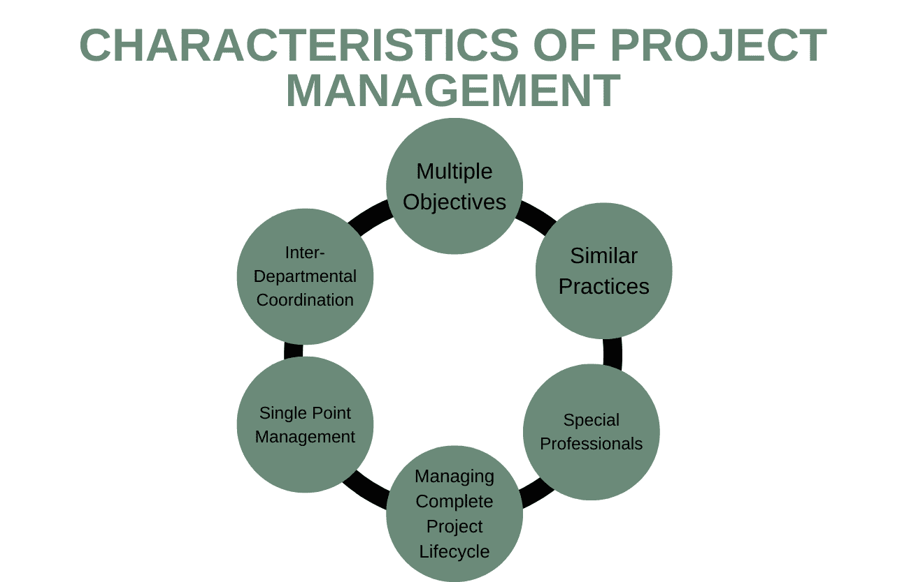
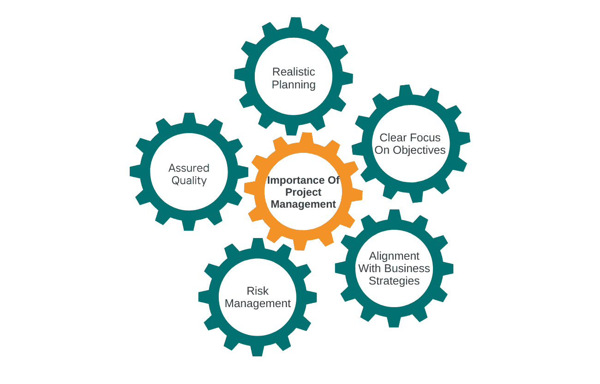

# 项目管理的关键特征:了解基本要点

> 原文：<https://www.edureka.co/blog/characteristics-of-project-management/>

公司定期执行项目，以实现某些常规工作无法实现的目标。项目帮助公司实现某些目标，而不是常规生产或服务的一部分。它可以是新产品、服务或应用的发布。当组织必须立即对现有产品或服务做出一些改变时，他们也会承担项目。项目没有预先的知识，因此公司需要项目管理来成功地完成它们。我们将在本文中尝试理解项目管理的特征。

在知名机构举办的运营、供应链和项目管理高级证书课程中，您可以了解项目管理及其特点。访问我们的网站会告诉你更多关于这门课程的信息。在我们继续学习它的特性之前，让我们了解什么是项目管理。

**什么是项目管理？**

[项目管理涉及从始至终对一项任务的计划](https://www.edureka.co/blog/project-planning)和执行，以实现其目标。项目经理还必须确保他们用可用的资源和时间完成工作，并达到期望的质量。它还包括与寻求资源的各个部门进行协调。随着时间的推移，项目变得越来越复杂，需要项目经理应用特殊的技能。在我们看项目管理的特征之前，我们需要看一下两种不同的项目管理结构。

**内部项目管理**

这是最常见的项目管理形式，在组织内部组建一个特殊的团队来完成一项任务。将会有独立的专业领域，如销售、营销、金融、会计和运营。项目经理根据员工的技能从公司内部挑选员工，并将他们分配到一个或多个项目中。项目管理在公司内部运作的主要特征如下。

*   [项目经理](https://www.edureka.co/blog/become-a-better-project-manager)负责管理该项任务。
*   他们独立于正常运作的权力机构。
*   作为职能经理，这些专业人士对共享资源拥有同等的权力。
*   在项目结束之前，项目经理对所有分配的资源拥有完全的权力。
*   与职能经理进行谈判，以从他们那里获得资源。
*   项目经理，将来自不同部门的具有不同技能的人作为一个多学科团队来工作。
*   职能经理和项目经理之间可能会因为过度分配共享资源的时间而发生冲突。

**也可阅读:[项目管理中的 PERT:了解基本概念](https://www.edureka.co/blog/pert-in-project-management/)**

**外部项目管理**

在这项工作中，项目经理仅为项目的目的和期限而被聘用。然后，外部项目经理任命其他团队负责人，组成由不同技能的人组成的团队来完成项目。这些团队在项目经理的领导下，按照组织的要求实现目标。由外部团队组成的项目管理的特征如下。

*   外部项目经理作为组织的代理人，在代理协议的条件下工作。
*   这是一个更加灵活的系统，因为公司可以在任何需要的时候雇佣项目经理。
*   项目经理和组织之间的有效沟通必须跨越边界，这可能是一个障碍。

既然我们已经看到了这两种项目管理的特点，现在是时候看看项目管理的一般特点了。

**项目管理的特点**

**多重目标**

项目管理通常有多个目标。需要满足时间、成本和质量目标。对其中一个因素的任何决定都会影响到其他因素。公司设定项目的成功标准。项目管理必须确保在不断变化的成本、时间和质量限制内满足这些标准。项目管理最重要的特征之一是总有多个成功标准需要满足。一个项目只有在满足组织设定的时间、成本和质量目标的情况下才能被称为成功。

**类似做法**

每个项目都各不相同。项目的目标、资源和类型各不相同。但是这并不意味着项目管理的实践有所不同。无论是什么行业或产品，项目管理中使用的方法都是一样的。计划和控制技术对于项目实现成本、时间和质量目标非常重要。这些技术不会因项目而异。它们适用于所有项目，无论其目标如何。这是项目管理的另一个重要特征。

**特殊专业人员**

传统上，公司聘用设计师或金融专家作为项目经理。公司从组织内部挑选他们来指导项目团队。这些官员被期望领导团队，并确保他们在成本、时间和质量方面达到项目目标。不幸的是，他们只专注于项目的一个方面。工程师和财务专家只能分别保证质量和成本管理。项目管理的一个重要特征是，它需要有人能够控制一项工作的所有三个方面。

当公司意识到他们需要能够控制项目各个方面的人时，他们开始寻找有成功完成项目经验的专业人士。今天，各种各样的人都经过特殊的教育和训练来领导项目并使其成功。许多课程提供这方面的辅导。各种知名机构提供的运营、供应链和项目管理高级证书课程是成为专家项目经理的最佳课程。在这个课程中，你可以学到项目管理的特征。所有课程详情都可以在我们的网站上找到。

**管理完整的项目生命周期**

早期的公司在项目的特定阶段使用顾问为他们提供建议。它们要么用于准备设计，要么用于制造产品。这导致了项目生命周期[的不同阶段](https://www.edureka.co/blog/project-lifecycle)之间缺乏协调。这可能会导致困难，因为在生命周期的某个阶段做出的任何决策都会影响后面阶段的决策。项目管理确保了对项目生命周期所有阶段的控制。项目管理最有益的特征之一是所有的决策都是在考虑全局的情况下做出的。

项目生命周期的不同阶段如下:

:这是客户决定用项目实现目标的第一个阶段。项目的基本建议已经制定。

**可行性** :项目组研究项目各种因素的可行性。他们探索项目是否能在期望的时间和成本内完成，并保持所需的质量。

原型:在一些行业中，在制作最终产品之前会先制作一个原型。它有助于客户在制作最终产品之前测试产品的各个方面。

最终产品 :一旦团队根据所有参数测试了原型，他们就进行必要的调整并继续生产最终产品。

**招标&合同** :客户在批准最终产品后，会与各个公司签订合同，购买零部件和原材料。

**试运行** :在此阶段，项目被完全试运行以达到其预期目的。在某些项目中，这意味着打开系统以供最终使用。

**关闭** :当项目完成并开始运作时，项目管理团队必须解散，人们可以回到他们的正常工作岗位。这也是项目经理对项目进行全面评估的时候，看看哪里有失败，可以从中吸取什么教训。项目管理的主要特征之一是它允许从错误中学习，并在下次改进。

**也读:[了解项目选择及其重要性](https://www.edureka.co/blog/project-selection)**

**单点管理**

一个项目会有来自多个职能部门的人。他们精通各种能力，来自不同的组织部门。其他资源也来自不同的地方。该项目还实现了多个目标。然而，项目的完全控制权掌握在一个人手中。[项目经理自始至终管理整个过程](https://www.edureka.co/blog/project-management-processes-and-phases-explained/)。他们必须确保工作成功完成，实现所有成本、时间和质量目标。这是项目管理的特征之一，它给了客户只与一个人打交道的优势。

**跨部门协调**

项目管理最好的特点之一就是它促进不同部门之间的合作，方便不同部门的人一起工作。根据完成工作所需的技能，参与项目的人员来自不同的部门。这意味着部门经理必须相互协调，并与项目经理协调，以提供必要的资源。

我们已经看到了项目管理的特点。我们必须知道为什么组织实施项目管理是重要的。

**项目管理的重要性**

**现实规划**

公司经常会误算完成一个项目的时间。他们还低估了项目的成本，没有为其风险做好计划。这就是项目管理的帮助所在。项目经理着眼于全局，计算实现目标的障碍。这些专业人士知道可能导致项目脱轨和延迟完成的风险。项目管理的一个重要特点是，它帮助公司对实际成本做出现实的估计。

**明确关注目标**

一个项目需要不同部门的人一起工作。他们在项目中都有自己的任务和要实现的目标。如果没有项目管理，团队可能会忘记最终目标。项目经理有助于时刻牢记这个目标，并确保团队记住项目目标。项目开始时有一个明确的最终期限，在此之前完成目标。项目经理确保为项目工作的不同人员总是能看到最后期限。

**与业务战略保持一致**

公司计划项目来帮助他们实现整体商业目标。但是如果项目处理不当，团队成员可能会忘记组织目标。这意味着该项目不会给客户带来任何好处。项目管理的一个重要特征是，项目经理总是保持业务目标，同时确保项目按时进行，并在提议的成本范围内。项目管理对于公司来说很重要，以确保它服务于实现其总体目标的目的。

**风险管理**

一个项目可能会遇到许多障碍。一个项目需要很多人来完成。他们中的许多人可能没有预料到风险，并可能对风险做出反应而不是计划。它会导致项目完工的延迟和成本的增加。项目经理总是对整个项目有所了解，并接受过预测风险的培训。它帮助人们采取替代措施。这些专业人员还帮助将项目分解成在期限内完成的易于管理的任务。

**有保证的质量**

时间和成本并不是项目必须遵循的唯一参数。质量很重要。如果一个项目在预算内按时完成，但没有达到预期的质量，它就不会给组织带来预期的收益。团队总是面临在时间和预算内完成任务的压力。它有时会导致质量上的妥协。项目管理的众多特征之一是，它帮助项目经理始终关注质量，并确保按预期交付。

在[运营、供应链和项目管理高级证书课程](https://www.edureka.co/highered/advanced-program-in-operations-supply-chain-project-management-iitg)中，你可以学到关于项目管理及其特点的一切。访问我们的网站可以让你完全了解该课程以及它教给一个有抱负的项目经理的东西。

**总结**

项目管理是在时间和成本范围内完成工作，同时保持预期质量的绝佳方式。公司可以放心，项目将按预期完成，因为项目经理心中只有这个目标。项目经理没有任何其他常规工作，这有助于他们全力以赴地管理项目。他们还被训练来管理来自不同部门的具有不同技能的人。项目管理有助于公司在成功完成项目的同时专注于日常业务。

## **更多信息:**

[印度项目经理薪资:2023 洞察](https://www.edureka.co/blog/project-manager-salary-in-india)

将项目管理视为职业？你需要知道的一切

[主要项目管理活动——你必须知道的](https://www.edureka.co/blog/project-management-activities)

为什么预防性维护工具对项目成功至关重要？