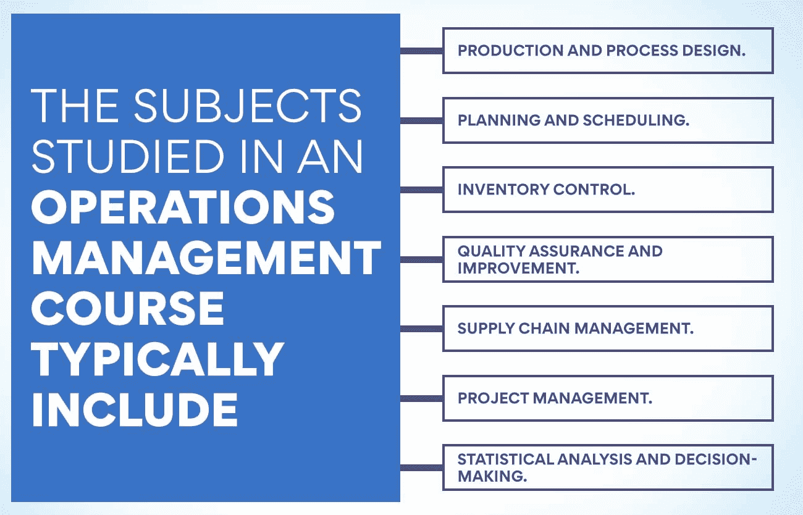
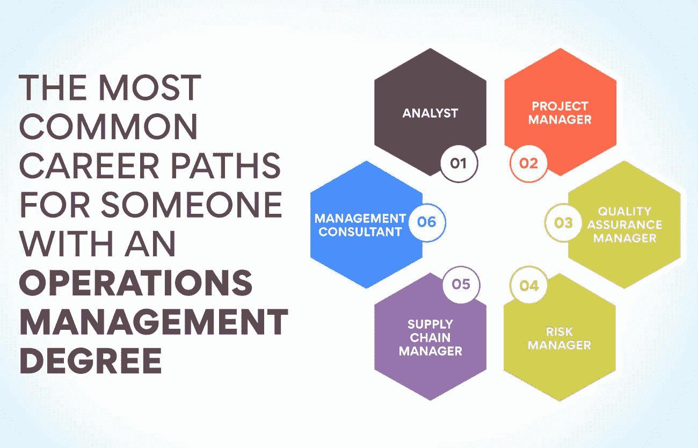

# 运营管理:教学大纲、课程和认证

> 原文：<https://www.edureka.co/blog/syllabus-for-operations-management/>

[运营管理](https://www.edureka.co/blog/beginners-guide-to-operations-management/)是对公司或组织运营管理的研究和实践。它涵盖了从运营战略规划到日常运营管理的方方面面。运营管理对于任何组织来说都至关重要，可确保所有运营高效运行。这篇博文将探讨运营管理的教学大纲、课程和认证。它会让你深入了解在这个领域从事职业需要什么，以及它是否适合你。

## 什么是运营管理？

它是管理企业日常运营的过程。它包括监督商品和服务的生产，管理供应链和资源。运营经理致力于提高效率和质量控制，同时确保符合所有安全法规。

运营经理的角色对企业的成功至关重要。他们负责在满足客户需求的同时，确保运营的各个方面平稳高效地运行。运营经理必须具备很强的解决问题的能力，并且必须能够在快节奏的环境中快速做出决策。

一个成功的运营经理必须具备优秀的领导素质，并且能够激励团队。他们必须有效地与其他部门以及外部供应商和客户沟通。

**又读:[运营管理:战略&影响](https://www.edureka.co/blog/operations-management-strategy/)**

## **印度和其他国家的运营管理范围**

运营管理是一门重要的、但往往被低估的商业学科。它负责协调、计划和执行与公司运营相关的所有活动。它包括从产品设计和开发到资源分配和客户服务的一切。在过去的几年里，随着印度公司努力提高效率和生产率，印度运营管理的范围一直在扩大。

在印度，运营管理对于制造业、零售业、酒店业和金融业至关重要。随着电子商务和数字技术的兴起，越来越多的公司正在利用运营管理来简化流程并确保最佳的客户服务。印度组织也采用了人工智能(AI)和自动化等新技术，以提高运营效率。

在其他国家，运营管理在许多不同的行业中都扮演着重要的角色。例如，在美国，许多大公司使用高科技系统来跟踪库存水平，优化供应链，并监控客户服务绩效。在欧洲，随着组织采用新方法来提高效率和绩效，运营管理变得越来越受欢迎。

无论在哪个国家或哪个行业，运营管理都是一门基本的商业学科，可以帮助公司取得更大的成功。通过简化流程和利用新技术，运营经理可以确保他们的组织以最高的效率和盈利能力运行。随着运营管理的范围在印度和其他国家不断扩大，它也有可能帮助组织达到新的成功高度。

随着越来越多的学生将其作为职业，运营管理专业也越来越受欢迎。随着业务流程越来越复杂，运营经理正成为印度和世界各地公司越来越有价值的资产。对于那些对运营管理感兴趣的人来说，有很多学习和成长的机会。从专业认证到硕士学位，那些有兴趣让自己的职业生涯更上一层楼的人有很多选择。

## 运营管理的 UG & PG 入学考试有哪些不同？

*   通用入学考试(CAT)是 MBA/PGDM 的入学考试。它由印度管理学院每年轮流进行。
*   XAT: 泽维尔能力倾向测验(XAT)是另一种很受欢迎的管理学(包括运营管理)研究生入学考试。XLRI·贾姆谢德布尔每年都会举办一次。
*   管理能力倾向测试(MAT)是一项国家级的入学考试，用于 MBA/PGDM 和其他管理项目的入学。无论是线上还是线下，每年都会发生四次。
*   **CMAT:** 普通管理招生考试是由国家考试机构实施的国家级入学考试。它每年举行一次，并提供各种管理课程的入场券，包括运营管理。
*   **JMET:** 贾瓦哈拉尔·尼赫鲁理工大学海德拉巴分校举办了联合管理入学考试(JMET)，这是一种很受欢迎的各种管理课程的入学考试，包括运营管理。
*   **NMAT:**【NAR see mon JEE 管理能力倾向测验(NMAT)是由 GMAC 管理研究生入学委员会举办的入学考试。它向所有希望从事运营管理职业的毕业生和研究生开放。
*   印度管理与技术学院(ISMAT)为运营管理课程的入学进行入学考试，ISMAT 入学考试。
*   **ATMA:** 印度管理学校协会(AIMS)负责管理招生考试(ATMA)。这是一个全印度水平的入学考试，允许参加各种管理和运营管理课程。
*   IBS at:IBS at(IBS at)由位于海德拉巴的 ICFAI 高等教育基金会(IFHE)实施。这是 MBA/PGDM 课程(包括运营管理课程)的热门入学考试。
*   运营管理是与生产和交付商品和服务有关的业务领域。它包括资源、流程和信息系统的管理。

## **运营管理教学大纲:运营管理的课程科目有哪些？**

运营管理是负责生产和制造过程的计划、[调度、](https://www.edureka.co/blog/scheduling-in-operations-management/)和控制的业务领域。它包括战略和日常决策，以确保一个组织的运作是高效和有效的。

运营管理的课程主题可能会因你参加的项目或学校而异，但通常包括供应链管理、项目管理、质量控制、统计和会计等主题。也可能有针对你希望从事的行业的课程，比如医疗保健或酒店管理。

这是一个关注有效利用资源以确保组织成功运作的研究领域。它涵盖了各种活动，包括库存管理，分销系统，质量保证，客户服务，预测和规划。

运营管理课程中学习的主题通常包括:

*   生产和工艺设计。
*   计划与调度。
*   库存控制。
*   质量保证和改进。
*   供应链管理。
*   项目管理。
*   统计分析和决策。

运营经理监督组织的日常运营，以确保其平稳运行。因此，课程可能还包括领导技能和有效沟通、成本控制、目标设定和解决问题。

除了运营管理原则，运营管理课程还会讨论一些概念，如全面质量管理(TQM)、六适马、准时制(JIT)生产系统和精益制造。这些话题对于当今全球化和竞争激烈的商业环境中的经理们来说意义重大。

运营管理课程通常强调技术在运营中的应用，包括有助于简化流程和提高效率的信息系统和软件应用。学生还可以学习如何设计有效的组织结构和工作流程来提高生产率。

最终，运营管理课程教给学生成功管理组织运营所需的技能。通过理解和应用运营管理的原则，学生可以更好地成为有效和高效的管理者。

## 完成运营管理课程后，有哪些不同的职业选择？

运营经理负责公司运营的平稳运行。他们计划、协调和控制生产公司产品和服务所需的资源和流程。

运营管理是一个广阔的领域，提供了许多不同的职业选择。一些运营经理在特定行业工作，如医疗保健或制造业。其他人可能专注于供应链管理或项目管理等领域。

在运营管理课程中学到的技能可以应用于许多行业。完成运营管理课程的学生应该对企业如何运营有很好的理解，并能运用这些知识来提高效率和效果。

如果你已经完成了运营管理课程，你可能会想知道你有哪些职业选择。有许多不同的道路向你敞开。

查看拥有运营管理学位的人最常见的职业道路:

1.  分析师: 如果你非常注重细节，并且有解决问题的能力，你可能会考虑成为一名运营分析师。分析师收集数据，分析流程和运营，并提出建议以提高效率。
2.  项目经理:项目经理负责监督项目的各个方面。他们必须能够计划和执行项目、管理资源、协调任务和监控进度。
3.  **质量保证经理:** 质量保证经理确保所有产品满足顾客的期望和要求。他们必须能够识别潜在的问题，并采取必要的措施从一开始就防止问题发生。
4.  **风险经理:** 风险经理负责识别潜在风险，并采取措施减轻风险。他们必须能够分析风险因素，制定减少潜在损失的策略，并监控运营以确保风险最小化。
5.  **供应链经理:** 供应链经理管理整个供应链。它包括管理库存水平，优化交付路线，并确保产品在预算内按时交付。
6.  **管理顾问:** 管理顾问被组织雇佣来帮助他们提高效率和降低成本。他们进行研究，分析数据，推荐解决方案，并制定战略来帮助公司改善运营。

无论你选择走哪条职业道路，运营管理学位都可以开启一个新的机会领域。有了合适的技能和经验，你很快就可以在你选择的领域领导项目并提高效率。

## **解释运营管理大纲**

运营管理是对企业如何生产商品和服务的研究。它包括管理将原材料转化为最终产品的过程，以及管理这些产品向客户的分销。运营管理旨在简化这些流程，尽可能提高效率和生产力。

运营管理是一门旨在为学生提供有效管理组织运营的知识和技能的课程。教学大纲通常涵盖过程分析、[产能规划](https://www.edureka.co/blog/what-is-capacity-planning-in-operations-management/)、质量管理、库存控制、生产调度和项目管理。

还可能包括与供应链管理和物流相关的主题。根据机构的不同，课程还可能包括精益管理、风险管理和/或可持续发展主题。

教学大纲通常以运营管理及其相关概念的概述开始。接下来是对过程分析的讨论，包括理解资源在生产过程中的使用效率。之后，学生学习容量规划，包括评估可用资源的最佳使用。

库存控制是运营管理大纲中的另一个重要主题。学生学习不同的库存模型和监控库存水平的技术。还讨论了质量管理，包括诸如适马和 ISO 9001 等主题。接下来是生产调度，包括作业排序和调度算法等主题。最后，学生学习项目管理，包括项目的计划和执行等主题。

运营管理课程的教学大纲也可能包括与供应链管理(SCM)相关的主题。这包括了解影响供应链管理的外部因素，分析库存和运输成本，以及通过有效的供应链流程管理客户关系。最后，一些教学大纲可能包括与精益管理和/或可持续性相关的主题。

总体而言，运营管理教学大纲旨在为学生提供成为高效运营经理所需的必要知识和技能。通过涵盖广泛的主题，学生可以获得对该领域及其相关概念的全面理解。

值得注意的是，不同院校的运营管理课程大纲可能会有所不同。因此，向你的老师或学校咨询最新的教学大纲是很重要的。这将确保您获得成功完成本课程所需的所有信息。

**也读:[运营管理中的产品设计是什么？](https://www.edureka.co/blog/product-design-in-operations-management/)**

## **运营管理有哪些不同的认证？**

运营管理有几种不同的专业认证，每一种都有其特定的重点和专业领域。最受欢迎和最广泛认可的认证是 AOM 运营管理协会的生产和库存管理认证。其他受欢迎的认证包括 APICS 的认证供应链专家(CSCP)，ASQ 的六适马黑带，以及 PMI 的项目管理专家(PMP)。

这些认证在资格、经验和教育方面都有不同的要求。然而，他们都需要通过考试才能获得认证。此外，这些认证中的许多必须在几年内更新以保持最新。

对于任何寻求优化生产和库存流程的组织来说，运营管理都是一个关键的专业领域。这些认证可以帮助个人脱颖而出，并展示他们在这一领域的卓越承诺。

## **结论**

运营管理是任何企业的一个重要方面，有许多资源可以帮助你了解更多。本文概述了运营管理和一些关键概念。它还概述了学习这一重要主题的不同选择，包括教学大纲、课程和认证。无论你决定走哪条路，增加你的运营管理知识无疑将有益于你的职业生涯。

想深入了解运营管理中的某个特定主题吗？查看我们的[运营、供应链和项目管理](https://www.edureka.co/highered/advanced-program-in-operations-supply-chain-project-management-iitg)高级证书，它涵盖了该领域的所有关键主题。您还可以在我们的网站上了解我们的课程和其他学习资源。

## **更多信息:**

[运营管理的角色和职能](https://www.edureka.co/blog/roles-and-functions-of-operations-management/)

运营管理的目标是什么？

什么是运营和供应链管理(OSCM)？

[医院运营管理——了解关键职能](https://www.edureka.co/blog/operations-management-in-hospitals)