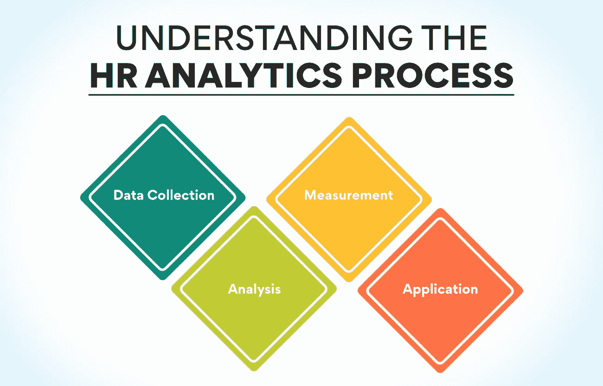
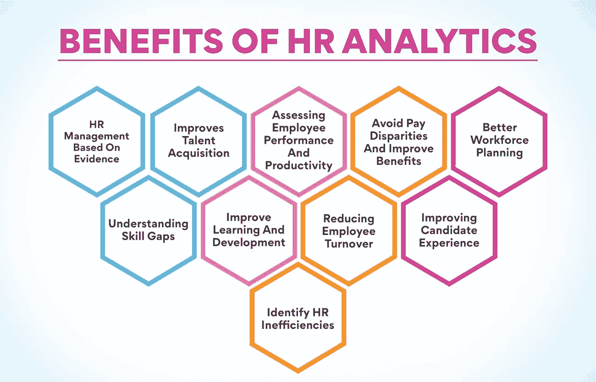

# 人力资源分析:它是什么，如何使用它？

> 原文：<https://www.edureka.co/blog/hr-analytics/>

毫无疑问，一个公司的人力资源是其最有价值的资产。没有他们，什么都不能进步，组织也不能希望实现它的商业目标。关于公司员工的每个决定都是至关重要的。当公司招聘、培训、提升或支付员工时，它必须做出决策，以充分利用员工。早先，组织基于本能和直觉做出决策。但是今天，每一个决定都是根据从人力资源分析获得的洞察力做出的。

如果你想知道什么是人力资源分析**、**、，了解它的最好地方是由一家知名机构举办的[人力资源管理](https://www.edureka.co/blog/role-of-human-resource-management-in-an-organization/)研究生证书课程。你可以从我们的网站上了解更多关于这门课程的信息。然而，我们将在本文中讨论这个过程的几个重要方面。

**什么是人力资源分析？**

每个组织都会在日常工作中产生大量的数据。这些数据包含有价值的信息，专家可以利用这些信息来分析和找出各种事件背后的原因。利用这些数据做出更好的决策被称为人力资源分析。这一过程也被称为人才分析、人员分析或劳动力分析。分析专家分析常规数据，并将它们与人力资源部门的[目标相关联。](https://www.edureka.co/blog/objectives-of-human-resource-management/)

使用人力资源分析不仅仅是为了改善现有的劳动力。公司还可以利用就业市场上的可用数据，找出如何招聘最优秀的人才。这个过程也有助于找到最适合某个职位的人。这些分析有助于确定哪些人力资源方法效果好，哪些不好。分析还帮助公司发现高价值的职业道路和领导候选人。这就是为什么越来越多的组织投资任命这一领域的专家，并为这一过程购买工具。

另请阅读:[什么是利益相关者参与？重要性、规划和实施](https://www.edureka.co/blog/stakeholder-engagement)

**为什么组织需要人力资源分析？**

如果公司在日常工作中产生大量数据，为什么他们不能直接使用这些数据，而不是投资一个昂贵的人力资源分析流程？不幸的是，这样的原始数据不能为官员提供任何见解。他们需要被组织和分析，以获得必要的信息，帮助做出更好的决定。这些数据可以揭示员工流动的模式。它还可以告诉公司招聘新员工需要多长时间。还可以确定让员工充分发挥生产力所需的投资。

另一个重要的信息是关于人们离开公司。从数据中可以知道哪些员工有可能在年内离职。组织还可以发现向员工提供的培训是否反映了他们的表现。许多企业现在都在使用人力资源分析，因为他们可以根据确凿的事实做出决定，而不是猜测。有了数据支持的证据，公司可以做出必要的改进和改变，从员工那里获得最大的利益。

**了解人力资源分析流程**

仅仅了解什么是人力资源分析是不够的。人们还必须知道专家是如何执行这一过程的。这个过程从收集数据开始。

**数据收集**

分析师的首要任务是收集高质量的数据。数据必须易于获取，并准备好集成到报告系统中。信息可以来自内部或外部来源，如云数据、移动设备甚至可穿戴设备。数据收集系统必须能够对数据进行分类和组织，以便将来进行分析。作为人力资源分析的一部分，公司收集员工档案、绩效、薪资和晋升历史、人口统计数据、培训、参与度、保留率、离职率等信息。

**测量**

在这个阶段，数据经历连续的测量和比较，也称为 HR 度量。人力资源部门将收集的数据与历史标准和公司标准进行比较。这个过程需要持续的数据流。公司还必须事先定义规范以便比较。数据进行比较，找出流动率，旷工率和招聘结果。通过这种比较，您可以找到需要优化的地方。这种人力资源分析也有助于发现部门日常活动的有效性。

**分析**

在人力资源分析的这一阶段，专家们审查指标报告的结果，以发现可能影响公司工作的趋势和模式。描述性、预测性和规范性等分析方法用于获得有价值的见解。描述性分析有助于查看历史数据，并确定需要改进的地方。在预测分析的情况下，专家使用统计模型来分析历史数据，以预测未来的风险和机会。规定性分析预测预测结果的后果。

**应用**

人力资源分析的结果用于制定更好的人力资源活动决策。其中一个方面是你可以将结果应用于减少雇佣时间。如果公司找到了招聘延迟的原因，它可以纠正并确保及时招聘。理解人们离开组织的原因有助于纠正这个因素。专家们还运用这些发现来了解员工长期缺勤的原因。找到原因有助于公司改善工作环境，提高员工出勤率。

报名参加人力资源管理研究生证书课程，可以了解什么是HR analytics 及其详细流程。你可以从我们的网站上了解更多关于这门课程的信息。

**人力资源分析的优势**

1.  **基于证据的人力资源管理**

HR analytics的最大优势在于，它可以帮助公司根据确凿的证据来管理人力资源。在使用该流程之前，工作是基于趋势、偏见或临时解决方案完成的。随着数据分析的引入，人力资源经理可以根据信息以清晰的洞察力履行职责。基于证据的人力资源管理侧重于根据来自内部数据、研究结果和现实生活经验的事实做出决策。

2.  **提高天赋获得**

让优秀的人为你工作仍然不是一件容易的事情。找到适合这个组织的合适人选很困难。高流失率严重影响着公司。知道雇佣谁来提高企业生产率和降低离职率是非常重要的。人力资源分析帮助您将新申请中的所有技能和其他信息与公司顶尖员工的能力和行为进行比较。这将大大有助于从成千上万的申请者中筛选出最佳候选人。这为人事官员节省了大量时间。

3.  **评估员工绩效和生产力**

人力资源分析结合关键绩效指标，帮助公司评估所有员工的投资回报率。它显示了公司中表现最好的人和那些可能需要帮助来提高工作效率的人。分析可用数据可以更好地了解动机、生产率和效率，使员工能够提高绩效并为公司增加利润。信息分析有助于公司优化内部流程，简化员工的工作流程。它带来了更好的性能、协作和生产力。人力资源经理还可以发现员工如何与某些应用程序进行交互，以及这些应用程序对他们工作的影响。

4.  **避免薪酬差距，提高福利**

同一个公司的员工和同行业其他公司的员工之间的工资差异是过早离开公司的主要原因之一。人力资源分析让公司了解这种差异，并帮助他们调整差异，以确保更好地留住员工。通过分析历史数据，人力资源官员还可以找出员工认为最有价值的福利。有时候，让人们留在公司的不是薪水，而是其他福利。使用可用的数据将有助于公司找到这样的事实，并迫使员工留在公司。

5.  **更好的劳动力规划**

劳动力规划不仅仅发生在一个组织的开始阶段。这是一个持续的过程，因为人们出于各种原因离开公司。公司发现他们突然缺少人手来完成所有的工作。如果他们能够预测流失率，这种情况就不会发生。使用人力资源分析公司可以找出流失率，并提前计划如何填补这些空缺。他们还可以了解随着公司的发展壮大而出现的员工需求。提前计划招聘有助于公司找到最适合这个职位的人。

6.  **了解技能差距**

每一个组织都必须确保公司里随时都有具备所有必要技能的人。这方面的任何不足都会极大地影响公司的业绩，阻碍目标的实现。现代人力资源分析工具非常先进，可以识别现有员工在技能和知识方面的差距。你可以将现有的技能和基本技能绘制在一个表格上。分析还能帮助公司找出哪些员工最适合提升技能。

7.  **改善学习和发展**

一旦你了解了技能差距，就该为员工提供培训了。同样，您可以使用人力资源分析来确定将从培训中受益最多的最佳员工。这种分析也有助于发现哪些人可以从在职培训中受益，哪些人需要课堂培训。了解这些事实有助于为不同的员工制定最合适的培训计划。人力资源官员也可以发现培训对个人生产力的影响。

**也读:[HRM 中的薪酬是什么？](https://www.edureka.co/blog/compensation-in-hrm)你需要知道的一切**

8.  **降低员工流失率**

大多数公司面临的一个主要问题是员工流动率高。有了更多的机会，员工在离开一个组织之前不会三思。使用人力资源分析，公司可以找出人们离开公司的原因。它还可以显示哪些部门的流失率较高，以及流失率高的原因。了解这些信息有助于公司降低人员流动率。找出员工早退的原因，有助于公司解决问题，提高员工保留率。

9.  **改善候选人体验**

公司发现许多候选人中途离开招聘流程。这是由于申请过程中的一些技术问题。找出原因可以帮助公司避免此类事件，并有更好的机会招聘更多合适的人。确定这种放弃过程的原因有助于公司避免这种情况。人力资源分析是挖掘旧数据并找出导致人们没有完成申请流程就离开的原因的绝佳方式。解决这些问题可以让公司雇佣更好的员工。

10.  **发现人力资源效率低下的问题**

人力资源分析不仅仅帮助发现其他流程中的问题。它还能让人力资源经理发现他们部门的低效之处。分析过去的数据有助于找到提高团队绩效的方法，并从每个成员身上获得更好的结果。他们可以发现是否有软件程序将有助于使过程更快和更有效。该分析还将有助于该部门寻找改善对员工服务的方法，从而更好地留住员工并提高效率。

现在我们已经知道了什么是人力资源分析，以及如何利用它来提高员工和组织的绩效，现在是时候看看如何让自己成为更好的人力资源人员了。[人力资源管理研究生证书课程](https://www.edureka.co/highered/human-resourse-management-course-iim-shillong)是一个很好的项目，可以让你更多地了解分析过程，以及它如何帮助你做得更好。访问我们的网站会让你了解课程细节。

**结论**

人力资源是一项至关重要的职能，因为它与对一个组织的绩效有帮助的员工打交道。提高他们的效率，确保他们留在公司，对公司的进步非常重要。留住员工也为公司节省了大量用于招聘替代人员的资金。确保这一点的最佳方式是使用分析等现代技术来做出更准确的数据驱动型决策。所有渴望成为人力资源专业人士的人都将受益于用分析技能武装自己。

## **更多信息:**

[什么是战略性人力资源管理？定义和示例](https://www.edureka.co/blog/strategic-human-resource-management)

[分解人力资源管理的范围](https://www.edureka.co/blog/scope-of-human-resource-management/)

[目标&人力资源管理的本质](https://www.edureka.co/blog/nature-of-human-resource-management/)

[人力资源管理的演变:过去和未来](https://www.edureka.co/blog/evolution-of-human-resource-management)