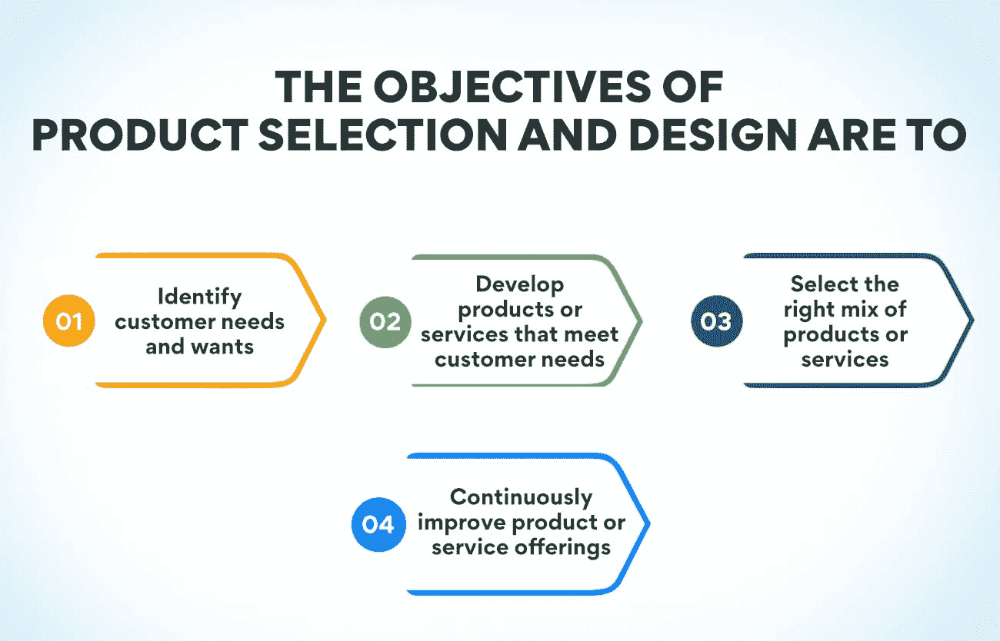
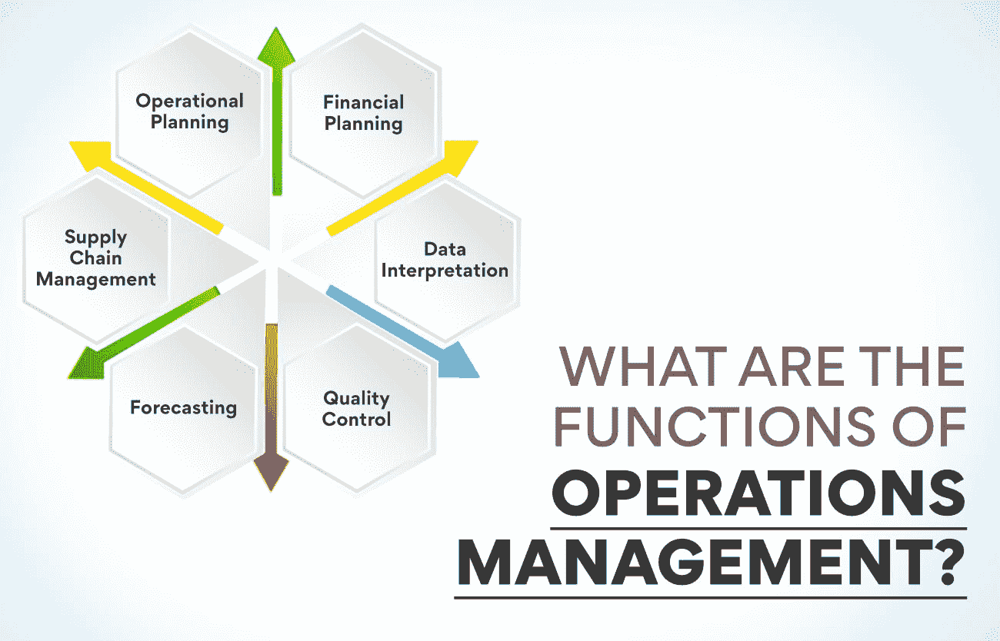

# 运营管理导论:含义、目标和功能

> 原文：<https://www.edureka.co/blog/introduction-to-operations-management/>

运营管理简介:[运营管理](https://www.edureka.co/blog/beginners-guide-to-operations-management/)对于任何组织来说都是一项至关重要的职能。它负责计划、协调和控制生产商品和服务所需的资源。运营管理旨在确保一个组织的运营是高效和有效的。为了实现这一目标，运营经理必须计划、组织和监督生产商品和服务所需的资源和流程。

在这篇博文中，我们将介绍运营管理的概念，并探讨其含义、目标和功能。我们还将讨论运营管理在当今组织中的重要性。

## **运营管理入门:你所理解的运营管理是什么？**

运营管理关注的是设计、运营和改进一个组织的生产系统。包括管理原材料、设备、人力资源等资源。运营管理旨在确保组织的生产系统平稳高效地运行。

运营管理职能包括计划、调度、控制和监控组织的生产过程。运营经理还监督生产系统的日常运营，并就如何提高效率做出决策。

## **运营管理简介:运营管理在企业中的重要性**

运营管理关注的是确保公司的运营高效且有效，并满足客户的需求。它还负责确保公司的产品和服务在预算内按时交付。

运营管理对于确保公司的运营与其战略目标保持一致至关重要。它有助于确保公司以最有效的方式使用资源，并对需求的变化做出快速反应。

运营管理简介:运营管理对于各种规模的企业来说都是必不可少的，但对于快速增长或正在经历重大变革的企业来说意义重大。在这些情况下，运营管理可以帮助确保公司的运营能够跟上市场的需求。

**运营管理简介:运营管理的[目标是什么？](https://www.edureka.co/blog/what-are-the-objectives-of-operations-management/)**

**产品选择和设计**

产品选择和设计是一个关键的[运营管理职能](https://www.edureka.co/blog/roles-and-functions-of-operations-management/)决定公司将向客户提供哪些产品或服务。产品选择和设计的目标是:

1.  **确定客户的需求和想要:** 第一步是从公司提供的产品或服务中了解客户想要和需要什么。这可以通过市场研究、调查、焦点小组等方式实现。
2.  **开发满足客户需求的产品或服务:** 一旦了解了客户的需求，下一步就是开发满足那些需求的产品或服务。这包括设计安全、可靠和高效的产品或服务。
3.  **选择正确的产品或服务组合:** 一旦产品或服务被开发出来，公司必须决定向客户提供哪些。这个决定是基于几个因素，如市场需求、生产能力、成本等。
4.  **持续改进产品或服务:** 即使在产品或服务推出后，根据客户和其他[利益相关方](https://www.edureka.co/blog/stakeholder-engagement)的反馈持续改进它们也是很重要的。这有助于确保公司保持竞争力，并提供高质量的产品或服务。

**材料处理**

物料搬运的主要目标是高效地将物料从一个地方移动到另一个地方。材料处理的其他目标包括:

*   最大限度减少处理材料的时间
*   最大限度降低移动材料的成本
*   安全最大化
*   尽量减少对材料的损害

## **产能规划**

[产能规划](https://www.edureka.co/blog/what-is-capacity-planning-in-operations-management/)的主要目标是确保公司拥有满足客户需求的必要资源。这包括确保有足够的能力生产所需的产品或服务，并在需要时提供这种能力。

为了实现这一目标，产能规划必须考虑几个因素，例如客户需求、产品组合、生产率和交付周期。它还必须考虑原材料、设备和劳动力的可获得性。考虑到所有这些因素，就有可能制定一个计划来确保公司有必要的资源来满足客户的需求。

**生产计划和控制**

生产计划和控制的主要目标是确保生产过程平稳高效地运行。在计划和控制生产时，需要考虑许多因素，如需求预测、生产能力计划、库存管理、调度和质量控制。

生产计划和控制在运营管理中至关重要，可确保所有资源得到最佳利用，以满足客户需求。通过精心计划和控制生产，企业可以最大限度地减少浪费，降低成本，提高质量。

**也读:[运营管理的范围是什么？](https://www.edureka.co/blog/what-is-the-scope-of-operations-management/)**

**库存控制**

库存控制是确保库存水平维持在最佳水平的过程。库存控制的目标是确保维持正确的库存水平，需要时有库存，不持有不必要的库存。

必须仔细监控库存水平，以避免缺货和库存过多。缺货会导致销售损失和客户不满，而过多的库存会占用资金并导致存储成本。

库存控制的目标是确保维持正确的库存水平，从而不会出现缺货或库存过多的情况。这需要一个微妙的平衡，因为库存太少会导致销售损失，而库存太多会占用营运资金。

**质量保证和控制**

质量保证和控制(QA/C)的目标是确保组织提供的产品和服务符合要求的标准和规范。这是通过质量保证活动的组合来完成的，如质量控制、质量保证计划和质量改进。

QA/C 目标很重要，因为它有助于确保组织提供的产品和服务符合其预期目的并满足客户的需求。这也有助于提高客户满意度和减少投诉。

有几种方法可以用来实现 QA/C 目标，例如统计质量控制、六适马、精益制造和全面质量管理(TQM)。每种方法都有自己的优缺点，因此针对每种情况选择最合适的方法非常重要。

QA/C 目标是运营管理不可或缺的一部分，在任何组织中都应得到应有的重视。

## **运营管理简介:运营管理的职能是什么？**

**运行规划**

运营规划是设定目标并设计实现这些目标的策略。运营规划职能是建立目标、制定政策、设定优先事项、分配资源和创建程序。

为了确保一个组织的活动与其使命和目标相一致，运营规划是必要的。有了运营计划，一个组织可以实现其目标，并在无助于其目标的活动上节省资源。

运营规划是一个动态的过程，应定期审查和更新，以确保其有效性。运营规划职能可以分为四个主要类别:目标设定、政策制定、资源分配和程序创建。

目标设定是运营规划的首要职能。目标应该是具体的、可衡量的、可实现的、相关的和有时间限制的。目标应与组织的使命宣言保持一致。

政策制定是运营规划的第二个功能。政策指导决策，并有助于确保组织的活动与其目标相一致。应定期审查政策，并根据需要进行更新。

资源分配是运营规划的第三个功能。必须分配资源来支持组织目标的实现。分配资源时，必须考虑组织的长期需求和特定项目或计划的短期需求。

**财务规划**

运营管理最重要的职能之一是财务规划。财务规划确保公司有足够的钱购买生产产品或服务所需的原材料。这也确保了公司能够支付员工和其他费用。

运营经理使用财务规划来确保公司的生产过程是盈利的。他们创建预算并跟踪支出。他们还与公司的其他部门合作，如市场营销，以确保其产品或服务的价格是正确的。

**数据解释**

数据解释是理解和使用数值数据的过程。在运营环境中，数据解释通常采取分析数据的形式，以确定趋势并做出改进运营的决策。

有几种不同类型的数据可以在运营环境中进行解释，但最常见的是财务绩效和客户数据。财务数据可以用来了解盈利能力，业绩数据可以用来了解效率，客户数据可以用来了解满意度。

数据解释在运营管理中至关重要，因为它允许管理者做出关于改善运营的明智决策。如果没有准确和及时的数据解释，管理人员将很难识别其运营中的问题和机会。

**质量控制**

质量控制是确保产品和服务满足顾客期望的过程。它包括制定标准，测量和测试产品和服务，并在必要时采取纠正措施。

质量控制有两种主要方法:预防和纠正。预防性质量控制侧重于从一开始就防止问题的发生。纠正性质量控制侧重于在问题发生后识别和纠正问题。

质量控制的主要功能是确保产品和服务满足顾客的要求，识别和纠正缺陷，并从一开始就防止缺陷的发生。为此，质量控制团队使用各种工具和技术，如检查、测试和统计分析。

检验是对产品或服务进行目视检查，以符合标准。测试是评估产品或服务是否满足特定要求的过程。统计分析是一种技术，用于识别数据中的趋势或模式，以便在必要时采取纠正措施。

质量控制团队还制定质量计划，概述用于确保产品或服务满足客户要求的程序和方法。质量计划通常包括进行检查、测试和统计分析的详细说明。它们还规定了这些活动应该在何时以及多久进行一次。

**预测**

预测是运营管理的一项重要职能。它帮助企业规划未来需求，并确保必要的资源可用。有几种不同的预测方法，各有利弊。

最常见的预测方法是趋势分析、回归分析和时间序列分析。趋势分析用于确定数据的长期趋势。回归分析用于确定变量之间的关系。时间序列分析用于根据过去的数据预测未来的值。

这些方法各有优缺点。时间序列分析是最复杂的，但可以提供最准确的预测。趋势分析很简单，但如果数据包含异常值，可能会不准确。回归分析更复杂，但可能更准确。

运营经理必须仔细选择最适合他们需求的预测方法。方法的选择将取决于可用数据的类型、期望的准确度以及可用于执行预测的资源。

**供应链管理**

供应链管理是管理商品和服务从供应商到客户的流动。它包括计划、协调和控制供应链中的所有活动，以确保高效和有效的运作。

## 运营管理简介:成为一名运营经理需要具备哪些技能？

运营经理负责公司运营的日常管理。他们计划、协调和控制生产公司产品和服务所需的资源和活动。

运营经理需要有很强的解决问题、决策和领导能力。他们必须能够有效地与员工沟通并激励员工。他们还需要很好地理解业务流程，并能够使用各种工具和技术来管理运营。

## **结论**

总之，运营管理是一个组织的战略职能，有助于确保组织平稳高效地运行。运营管理负责所有生产和制造过程的计划、安排和控制。此外，运营经理确保所有资源都得到有效利用，以满足客户需求。

你在寻找一种在事业中占上风的方法吗？看看我们的[运营、供应链和项目管理](https://www.edureka.co/highered/advanced-program-in-operations-supply-chain-project-management-iitg)高级证书就知道了。这一全面的计划为您提供了核心运营、供应链和项目管理概念以及行业最佳实践的全面概述。我们的专家团队将帮助您了解不同类型的运营、供应链和项目管理技术，以及它们在现实世界中的应用。

## **更多信息:**

[如何实现最佳职业成长](https://www.edureka.co/blog/professional-growth/)

[了解人才管理及其重要性](https://www.edureka.co/blog/talent-management/)

[战略性劳动力规划:步骤和流程](https://www.edureka.co/blog/workforce-planning/)

[更好的员工关系可以带来快速的业务扩张:知道 11 个技巧](https://www.edureka.co/blog/better-employee-relation-can-lead-to/)