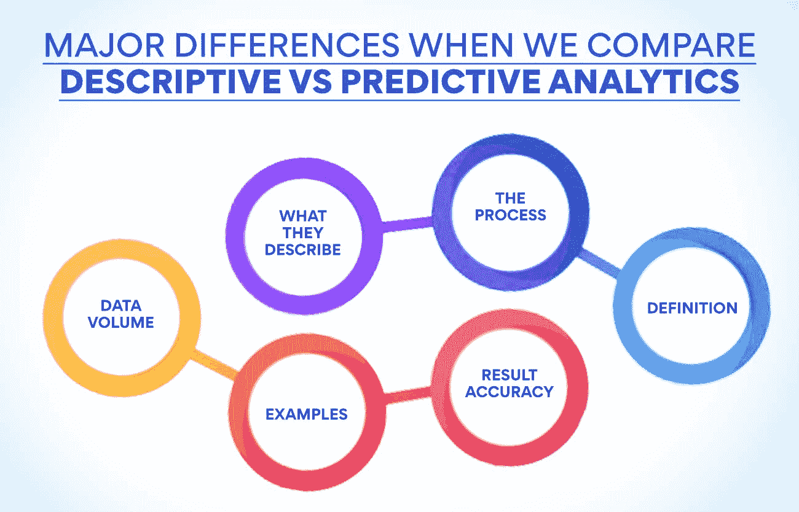

# 描述性分析与预测性分析:它是什么&如何执行？

> 原文：<https://www.edureka.co/blog/descriptive-vs-predictive-analytics/>

凭经验或直觉做决定的日子已经一去不复返了。当今的企业依靠数据驱动的决策运行。作为日常运营的一部分，每个企业都会产生大量的数据。这些信息可以让你对公司的表现有一个有价值的了解。但是它们的存在不能被使用。分析专家让它们随时可供使用。有不同类型的分析，通过这篇文章，我们将做一个描述性与预测性分析的比较，并了解它们是什么。

什么是商业分析？

商业分析是计算机科学的一个分支，它使用统计学、数学和机器学习在可用数据中寻找有价值的模式。这项技术使用大量数据集来寻找和使用有助于做出更好决策的见解。执行分析有助于找出过去某些事件发生的原因。了解早期导致成功或失败的因素有助于在未来做出更好的决策。有三种类型的分析——描述性的、预测性的和规范性的。如果我们想比较描述性分析和预测性分析，我们必须详细了解这两者。

在知名机构提供的产品管理高级管理人员证书课程中，你可以学到关于分析的一切。人们可以从我们的网站上了解更多的课程。

**同时阅读:[如何成为更好的产品经理:10 大技巧](https://www.edureka.co/blog/product-manager)**

什么是描述性分析？

如果一个企业必须在未来做出决策，它必须知道过去发生了什么以及为什么会发生。这就是描述性分析有助于发现的。这种类型的分析使用过去和现在的信息来发现模式，这些模式提供了关于企业绩效的有价值的细节。看到过去的趋势将有助于公司在未来做出更好的决策。此任务生成业务指标、报告和 KPI，帮助组织跟踪其绩效。研究事情发生的原因将有助于预测未来会发生什么。

描述性分析在市场营销中非常有用。一家公司使用各种社交媒体平台来营销其产品。执行描述性分析有助于 it 了解哪个平台提供了最大的客户接触。它有助于了解客户参与率、关注者数量以及不同平台的回报。该公司可以利用这一点来决定专注于哪些平台，放弃哪些平台。了解这些活动涵盖的内容有助于我们了解描述性分析与预测性分析的比较。企业在金融、[供应链](https://www.edureka.co/blog/how-to-formulate-advanced-supply-chain-strategy/)和其他功能中也使用这些分析。

公司从描述性分析中获得了什么？

描述性分析告诉一家公司它的表现如何，以及它与竞争对手相比处于什么位置。这个练习也能带出销售部门的个人和团队表现。它可以告诉高层谁做得好，哪个人需要改进。由于它分析长期收集的数据，因此还可以提供不同时期的性能信息。公司可以使用各种指标来评估进展。当我们比较描述性分析和预测性分析时，我们看到前者给出了过去和现在的细节。

做这项练习的主要好处是，它有助于公司了解自己的优缺点。这种分析提供了公司哪些地方做得好，哪些地方需要改进的信息。了解这一点有助于做出改变战略的决定，以加强薄弱领域。进行描述性分析的另一大好处是，组织可以从他们公布的结果中与行业中的其他人进行比较。当我们研究描述性分析和预测性分析的比较时，了解这项工作是如何完成的是至关重要的。

**描述性分析示例**

描述性分析有助于公司更好地细分客户。通过分析访问者在其网站上的行为，该组织可以找到对不同产品感兴趣的顾客。然后，该公司继续利用对每个客户群都有用的信息开展再营销活动。这大大提高了公司的转换率。

**描述性分析流程**

企业必须从陈述它希望通过分析产生的指标开始。销售部门可能希望了解每个季度的销售增长情况。但是会计部门可能有兴趣知道公司花了多长时间才从客户那里拿到收藏品。只有当指标设定后，公司才能决定他们需要分析的数据。下一步是看哪里有数据。在许多公司中，信息可能分散在不同的来源中。

下一步是提取和准备数据。由于数据分散在不同的来源，这项工作会耗费大量的时间和精力。另一个需要完成的重要任务是清理可用数据。在使用数据进行分析之前，必须消除数据中的不一致和错误。一旦数据准备就绪，分析过程就开始了。专家为此使用各种工具。分析了不同部门所需的细节。分析结果以每个人都能理解的方式呈现。

我们正在对描述性分析和预测性分析进行比较。下一步是理解什么是预测分析。人们可以在产品管理高级管理人员证书课程中学习所有形式的商业分析方法。您可以访问我们的门户网站，了解有关该计划的更多信息。

**了解预测分析**

这个术语本身暗示了这个分析是关于什么的。它是利用过去和现在的数据预测未来的事件。这个练习着眼于过去发生的事情，以及现在正在发生的事情，看看同样的事情是否会在未来重演。这使得企业能够利用这些发现并改变他们的活动，以便在未来利用这些情况。在比较描述性分析和预测性分析时，很明显后者有助于提高未来的绩效。

这项练习使用人工智能、数据挖掘、机器学习、建模和统计等各种技术来预测未来的事件。它帮助公司制定有效的营销策略和预测销售。准确的预测有助于公司更好地规划库存和生产。投资和金融专家使用预测分析来准备更好的投资组合并降低风险。这种方法确定数据中的关系、模式和结构，以了解变化如何影响结果。它使用一组预期的未来条件来观察结果。

**执行预测分析的优势**

在任何组织中，预测都是一项重要的任务，因为它有助于他们优化利用资源，防止浪费。供应链的组成部分，如[库存管理](https://www.edureka.co/blog/inventory-management/)、[生产计划](https://www.edureka.co/blog/product-planning/)等。，依赖于准确的预测。专家使用预测模型来清理和优化预测数据的质量。这种类型的分析在信用评级中非常有用。那些向客户提供信贷的公司使用预测分析，利用客户的信贷数据来评估他们是否会按时付款。一旦我们了解了描述性分析和预测性分析的优势，就很容易理解它们之间的区别。

营销是另一项非常依赖预测分析的活动。众所周知，公司在营销上花费巨大，他们不能在这方面失败。组织使用这种类型的分析来了解客户在各种情况下的反应。这使得他们能够发起一场吸引顾客注意力的营销活动。公司也可以用它来看看一个产品组合是否会在一个新的市场吸引顾客。股票交易者使用预测分析来决定卖出或买入某一特定股票。

**预测分析示例**

一家受欢迎的 OTT 流媒体公司使用人们观看的可用数据，并对这些客户可能想要观看的其他节目提出建议。这家公司还开始根据人们喜欢看的信息制作内容。这是预测分析的一个理想例子。这在很大程度上帮助公司提高了客户忠诚度。

**也可理解为:[创建成功上市战略的步骤](https://www.edureka.co/blog/go-to-market-strategy/)**

**预测分析是如何执行的**

与其他分析一样，第一步是定义练习的目标，然后决定要收集的数据。这种方法依赖于使用大量数据，因此有必要确定来源。这是非常关键的一步，结果将取决于所收集数据的有效性。数据可以是非结构化的，也可以是结构化的，需要清理才能变得有用。当我们比较描述性分析和预测性分析时，我们可以发现，到目前为止，过程非常相似。

统计是预测分析的一个非常重要的部分。它非常有助于验证基于数字而非直觉做出的假设和结果。公司官员所持有的大多数假设都要经过检验，看它们是否正确。下一步是[建模](https://www.edureka.co/blog/supply-chain-modeling/)，最好使用基于库的现有工具，这些库是使用像 R 和 Python 这样的开源程序构建的。在将模型部署到常规用途之前，必须对其进行测试，并找到足够的信息。公司必须重新审视该模型，并确保它随着时间的推移保持有效。

**描述性分析与预测性分析有何不同？**

描述性分析使用可用的数据来告诉公司过去发生了什么以及为什么会发生这样的事件。这些信息有助于公司根据过去的事件做出更好的决策。预测分析也使用相同的数据集以及其他外部数据来预测未来会发生什么。基于过去的经验，这种类型的分析给出了尚未发生的事件的信息。这些预测对于公司规划未来的活动非常有帮助。当我们比较描述性分析和预测性分析时，我们会发现这些主要差异。

现在，让我们对这两种类型的分析方法进行一个面对面的比较。

**他们所描述的**–描述性分析使用存储的数据来描述之前发生的事件及其原因。另一方面，预测分析分析可用的数据并预测未来会发生什么。

**过程**——数据挖掘和数据汇总是描述性分析的主要任务。专家在预测分析中使用统计和预测技术来预测未来事件。

**定义**–描述性分析被定义为通过分析大量可用数据来帮助公司找到有用信息的过程。预测分析的定义是，它是一项旨在了解一个组织的未来的活动。

**数据量**–两个过程中使用的数据量都很大。虽然在描述性分析的情况下仅使用过去的数据，但是预测性分析的过程使用过去和现在的数据。

**示例**–销售报告、公司收入分析和绩效评估都是描述性分析的示例。情感分析、客户信用评级和预测报告是预测分析的一些成果。

**结果准确性**–在描述性分析的情况下，结果非常准确。但在另一种情况下，人们不能期望结果是精确的，因为它只是基于可用数据和基于过去信息计算的变化进行预测。但预测分析的结果有助于公司根据硬数据而不是猜测做出决策。

要了解更多关于描述性和预测性分析**s**s比较的信息，您可以参加由知名机构提供的[产品管理高级管理人员证书课程](https://www.edureka.co/highered/advanced-executive-program-in-product-management-iitg)。我们的[网站](https://www.edureka.co/)上有关于本课程的更多详细信息。

**结论**

在竞争激烈的市场中，公司仅仅依靠直觉来做出关键决策是不够的。市场瞬息万变，每个决定对公司的成长和发展都很重要。大多数公司已经意识到，他们可以从日常活动中产生的数据中学到很多东西。这就是为什么他们聘请专家来使用数据，发现有助于他们做出更好决策的见解。精通分析的人现在和将来都有很好的职业前景。

**更多信息:**

[品牌管理 v/s 产品管理:了解关键差异](https://www.edureka.co/blog/brand-and-product-management/)

[什么是产品流程矩阵？](https://www.edureka.co/blog/what-is-the-product-process-matrix/)

[每个 PM 都必须知道的产品管理框架](https://www.edureka.co/blog/product-management-frameworks)

[11 个重要的产品管理指标和 KPI](https://www.edureka.co/blog/product-management-metrics)