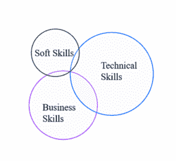
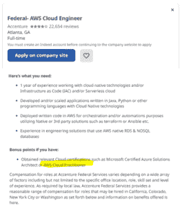
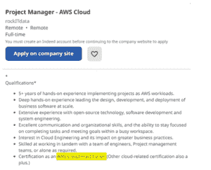
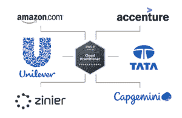

# AWS 云从业人员工资、工作描述和技能

> 原文：<https://www.edureka.co/blog/aws-cloud-practitioner-salary>

**与云相关的努力正在快速推进，企业正在大举招聘**。到 2023 年，全球最终用户在公共云服务上的支出预计将增长 20.7%，达到 5918 亿美元。AWS 控制着云计算 41.5%的市场。**这个 AWS 云从业者认证**是新手入门的最佳地方，因为它是**为了帮助非技术人员充分理解云计算思想**而制作的。这篇 ***AWS 云从业者薪资*** 博客将帮助您了解印度和美国的薪资范围，并且您还将了解成为 AWS 云从业者所需的技能

**内容:**

*   [印度 AWS 云从业者薪资](#AWScloudpractitionerSalaryinIndia)
*   [美国 AWS 云从业者薪资](#AWScloudpractitionerSalaryintheUSA)
*   [AWS 云从业者的顶级技能](#TopSkillsforAWScloudPractitioner)
*   [AWS 云从业人员岗位说明书](#AWScloudpractitionerJobDescription)
*   [公司招聘 AWS 云从业者](#CompaniesHiringAWSCloudPractitioner)
*   [按键提示](#KeyTips)

## **印度 AWS 云从业者平均薪资**

印度 AWS 从业者的平均年薪为**卢比。根据 PayScale，1297000**。以下是印度几位 AWS 证书持有者的估计年收入。

| **工资** | **职位头衔** | **工作** **职责** |
| ₹9,60,979 公共广播 | AWS 认证开发人员助理 | 为无服务器应用程序编写代码，使用 AWS 创建、部署和调试基于云的应用程序，以及了解 AWS 服务的关键特性都是必须掌握的技能。 |
| ₹6,53,000 公共广播 | AWS 认证解决方案架构师助理 | 利用各种 AWS 服务展示 AWS 技术的专业技能和知识。该认证通过专注于成本和性能优化解决方案的设计，展示了对 AWS 良好架构框架的透彻理解。 |
| ₹7,31,000 公共广播 | AWS 认证高级网络专业 | 创建并实施混合 it 网络网络设计和实施、AWS 中的任务自动化、网络和应用服务集成、完整性和安全性、网络管理、优化和故障排除 |
| ₹994560年均 | AWS 认证大数据专业 | 要获得该认证，需要具备使用 AWS 服务进行数据收集、存储、处理和可视化的深入知识。他们展示了他们可以使用 AWS 分析工具从数据中获取商业价值。 |
| ₹9,94,560 公共广播 | AWS 认证 SysOps 管理员助理 | AWS 或内部网络系统的管理、操作和行政属于 AWS 系统管理员的职责范围。亚马逊的全球数据中心是公共云服务亚马逊网络服务(AWS)的所在地。 |

## ****

## **美国 AWS 云从业者平均薪资**

根据 PayScale 的数据，美国 AWS 从业者的平均年薪为 13 万美元。以下是美国几位 AWS 证书持有者的估计年收入

| **工资** | **职位名称** | **工作** **职责** |
| 每年 9.2 万美元 | 

### Operation Support Engineer

 | 运营支持工程师的职责包括跟踪和解决支持问题。他们还协助完成许多其他任务，包括系统和环境更新。 |
| 每年 9.5 万美元 | 云开发者 | 交付企业级软件服务和应用属于云开发人员的职责范围。他们必须完全熟悉最流行的云流程编排工具。 |
| 每年 15 万美元 | AWS 解决方案架构师 | AWS 解决方案架构师的日常职责包括设计、构建和维护可扩展的、经济的 AWS 云基础设施。此外，他们必须紧跟云计算领域的发展。 |
| 16.5 万美元 | 高级 AWS 云架构师 | 经验丰富的 AWS 云架构师是工程师和客户之间的联络人。他们必须成功地将最新技术集成到客户的环境中，同时管理实施流程并提供技术架构。 |
| 每年 144，000 美元 | 开发工程师 | 工程师和客户之间的中介是高级 AWS 云架构师。他们负责指导实施过程，提供技术架构，并将最新技术成功集成到客户环境中。 |

## **顶级 AWS 云修炼者** **技能**

该组织鼓励那些乐于学习新技能的人。在面试中，你会体验到一种更精彩的个性。具备以下技能，你的求职申请、求职信和简历会更好:

## 

### 技术技能

*   通过技术和软件方面的实用知识将商业理念变为现实。
*   了解如何处理可伸缩性问题。
*   了解每个项目的技术细节，这样他们可以鼓励其他人支持他们。
*   控制与第三方产品集成的问题。
*   为了找到提高效率的解决方案，了解最终用户的问题及其工作流程至关重要。

### 商业技能

*   通过掌握技术和软件方面的工作知识，将商业想法变为现实。
*   了解如何处理可伸缩性问题。
*   了解每个项目的技术细节，这样他们可以鼓励其他人支持他们。
*   控制第三方产品集成的问题。
*   为了找到提高效率的解决方案，理解最终用户的问题及其工作流程非常重要。

### 软技能

*   决策能力
*   强大的管理能力
*   好奇心和求知欲
*   很强的沟通能力
*   创新。
*   总是愿意学习和改变。

## **AWS 云从业人员岗位说明书**

顾名思义，云从业者负责一个组织的云计算架构。他们的职责包括参与云迁移项目、检查工作负载设计，以及管理其组织的团队来解决高风险问题。

他们还在公司采用云的技术和商业组件之间架起了桥梁。因此，他们的部分责任是确保开发人员做出的技术选择与公司目标密切相关。

从业者必须理解 AWS 设计原则、行业标准和架构的最佳实践。他们必须基于 AWS 良好架构的框架和行业最佳实践开发解决方案并付诸实践。

让我们看看知名公司根据我们上面讨论的资格或技能提供的一些 AWS 云从业者的职位描述。

### 例子

*   **联邦- AWS 云工程师** 

*   **项目经理 AWS 云**

*   **云架构师**

## **公司招聘** **AWS 云从业者**

既然我们已经讨论了薪水和工作角色，让我们看看一些寻找云从业者的顶级科技公司。

## **按键提示**

由于 AWS 是全球使用最广泛的云平台之一，技术和非技术专业人士寻求获得 AWS 云从业者认证的个人。认证云从业者可以极大地帮助组织的成长之旅。选择这条职业道路的专业人士应该记住以下重要的经验:

*   任何背景的候选人都可以申请认证，因为云从业者的角色是跨职能的，不需要技术技能。
*   考生必须在这四个领域的 1000 分中取得 700 分才能通过考试。
*   该课程为学生提供了广泛的技能组合，适用于许多不同类型的工作，包括云架构师、云开发人员、开发运维工程师等。
*   六位数的工资对这个行业的专家来说是典型的。

## **结论**

所以这完全是关于 AWS 云从业者的工资、工作描述和技能。这个博客将定期更新，以适应趋势和当前的变化。如果你对这个话题有任何其他想法或疑问，请在下面留下评论。

如果你想参加 [AWS 云从业者认证](https://www.edureka.co/aws-certification-training)课程，让你的简历快速入围，请查看。

如果您有兴趣进一步学习，并希望获得其他认证方面的帮助，您可以访问我们的 [Edureka](https://www.edureka.co/) 网站。直到那时，快乐学习！

