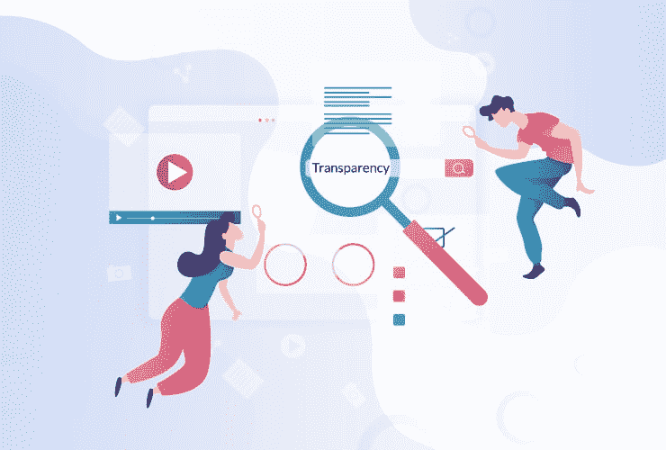
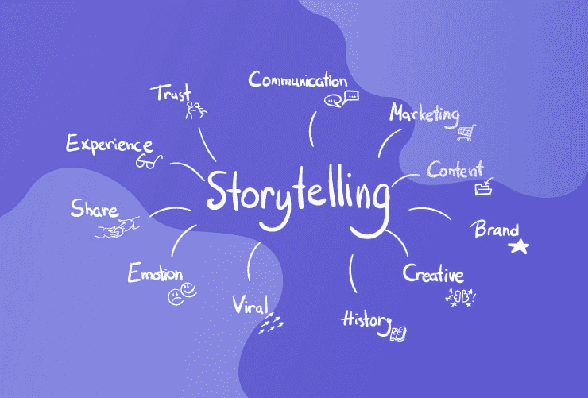
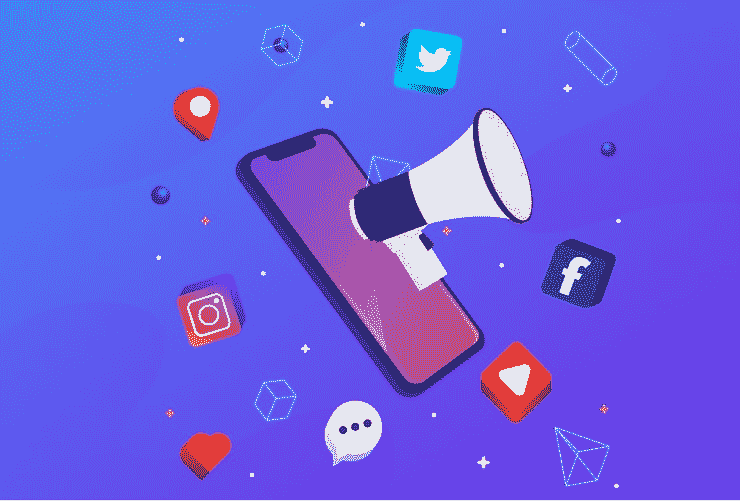

# 影响内容营销的 5 大趋势

> 原文：<https://www.edureka.co/blog/5-trends-shape-content-marketing/>

你的内容是你所有[数字营销](https://www.edureka.co/post-graduate/digital-marketing-certification)努力的基础。它可以决定营销活动的成败。内容是你的客户和你的品牌之间的纽带。用真实的内容联系你的观众将会成倍地增加你的结果。内容营销是创建和分发内容，以实现您的业务或营销目标。它可以帮助建立你的品牌，传播你的品牌意识，获得网站流量，并推动销售。

因此，让自己跟上内容营销趋势，并根据这些趋势设计自己的内容策略总是一个好主意。因此，让我们来看看一些关键的内容营销趋势，可以帮助你塑造你的内容战略——

*   [真实性和透明性](#authenticityandtransparency)

*   [创建可视内容](#VisualContent)

*   [品牌评书](#BrandStorytelling)

*   [广告作为内容营销策略的一部分——内容广告](#ContentAdvertising)

*   

## 真实性和透明度

内容营销就是通过教育你的受众来为他们提供价值。这样做，你可以通过你的内容传达一种真实和透明的感觉，建立对你的品牌的信任。因此，真实性和透明度是帮助你的内容增值的两个最重要的因素。

通过内容营销计划提供价值的最佳方式是创建内容:

*   与你的总体信息和使命保持一致。

*   帮助你的目标受众实现他们的目标。

*   让你的受众在未来乐于接触你的品牌。

*现在，让我们继续深入了解“读者为什么会对透明性做出反应？”*

透明度影响的关键要素有两个——**价值** 和 **信任**

人们看重内容主要是因为它的有用性，透明性有助于让内容更有用。通过提供高度透明的细节，比如个人的例子和经历，你可以帮助读者看到你的建议在起作用。当你的内容以个人故事和经历为后盾时，它会增加你试图传达的内容的价值。它让你从一个建议者变成一个可靠的信息来源和真正的解决方案。

然后还有信任……

当人们阅读产品评论或案例研究时，他们的怀疑雷达处于高度戒备状态。因此，赢得读者的信任不是一件容易的事情。但是当涉及到与你的观众建立信任的时候，透明度会有很大的帮助。

*现在，来到“为什么读者对真实性做出反应？”*

诚实和真实可以为你的内容营销努力建立信任，因为真实是无法伪造的。它需要承诺兑现承诺，并以诚实的态度参与其中。

你的观众希望你是可靠的。吸引观众的关键不仅仅是谈论你的产品或服务，而是创造他们能够认同的可靠内容。以诚实的方式提供权威的内容为你当前的读者和潜在的未来联系建立了基础。

你的品牌在真实内容中总是表现得更好，因为你的观众会留下来，因为他们知道他们只了解真实可靠的东西。

## ****创建可视内容****

人们不再喜欢阅读了。另一方面，视频是如今人们最喜欢的观看内容的方式。 大多数人更喜欢视觉内容，而不是文本，因为它更容易消费和理解。为了充分利用这种偏爱，品牌不断蓬勃发展，将视频纳入内容营销。在你的内容策略中加入更多的视觉内容，无论是信息图、照片、视频还是迷因，随你挑选并开始创作。

就视觉内容而言，视频将继续占据主导地位。根据思科的一项研究，到 2021 年，视频将占在线流量的 82%。这表明视频对于内容营销越来越重要。让视频内容在品牌中如此受欢迎的是它们以迷人的形式提供各种内容的能力。视频可用于提高品牌认知度，或展示客户的励志历程。视频内容让观众与你的品牌联系得更紧密。创建视觉内容时需要记住的重要因素是—

*   引人入胜且独一无二

*   相关，以及

*   确保你的内容适合移动设备。

因此，如果你还没有开始在你的内容营销策略中使用视频内容，现在是时候开始了。成功的秘诀是尝试新事物而不会立刻上瘾。尝试和测试新的格式和媒介，但也要愿意尽快抛弃它们，以防它们对你不起作用。唯一真正重要的是，你的内容必须为你的观众提供价值。

如果你已经在处理长格式的内容，尝试更短、更小的格式可能会有好处，比如 Instagram 和脸书故事。或者，如果你一直专注于较短的视频内容，尝试测试较长形式的内容，可以在搜索排名，增加流量，并提供搜索引擎优化的好处。

花时间计划一个可靠的内容策略，吸引你的理想客户，服务你当前的观众，并朝着你更广阔的目标努力。

## ****品牌评书****

我们都知道故事的力量。它们为我们的交流增添了色彩、人性、生命和意义。现在，想象一下将一个美丽的故事融入内容营销活动。故事不可否认的力量赋予你的营销吸引观众的能力。讲故事赋予你的内容生命，使它变得有关联、可理解和个性化。这是营销人员的一个大话题。故事吸引人，人们更容易记住它们。

品牌故事内容营销是一门关于你公司的叙事艺术，它能让你的观众更容易联想到你是谁，你做什么。它在情感层面上吸引客户，因此他们认为与你打交道是他们的正确选择。品牌故事讲述是关于分享您的体验以及您如何与客户互动。它更深入地了解你是谁，以及你为什么做你正在做的事情。它涉及:

*定义你是谁:* 这是关于让你的观众了解你业务背后的人。你为什么以及如何开始创业？你面临过哪些挑战？颠簸的道路如何为你的客户创造惊人的体验，为什么？你的故事有助于人们理解是什么驱使你去做你所做的事情，从而帮助他们理解为什么他们应该支持你。

*定义你做什么:* 传播你的品牌意识很重要，你可以通过在故事中加入你的作品来做到这一点。

*定义核心价值观:* 你的核心价值观定义了你为什么做你所做的事情。它们解释了你的业务是如何运作的，你的业务目标是什么。

品牌故事结合了所有这些元素，创造了一个引人注目的故事，让潜在客户更容易记住你是谁和你做什么，也更容易理解为什么你的公司适合他们。

如何创造你的品牌故事？

*了解你的客户:* 设身处地为客户着想，了解他们面临的挑战。请记住，让你的故事以客户为中心，并宣传你的产品，帮助他们改变自己的产品。

*【超越你所做的:* 给你的潜在客户一个有说服力的理由向你购买很重要。你需要给他们一个基于价值的理由，让他们向你求助。

*诚实:* 你的故事需要真实可信，即使有时这意味着谈论你的失败。一个失败者的故事比一个虚假的成功故事更受赞赏。

## ****广告作为内容营销策略的一部分——内容广告****

内容广告是指创造内容，意图通过付费分销渠道进行推广。根据内容的目的和潜在受众，您可以使用各种付费渠道来发布您的内容。这可以包括付费社交、PPC 活动、赞助投放和任何其他类型的付费推广机会。这里的想法是将数字营销和内容营销结合在一起，以推动销售。

说到广告，要点就是集思广益，是什么让一个人点击你的广告？顾客对你的品牌有什么期望？一旦你对此有了清晰的认识，你就能设计出你的品牌所需要的广告文案。

以下是内容广告需要牢记的要点-

*   了解你的受众。

*   精确设定你的商业目标。

*   始终投资于优质内容。

*   重新利用顶级有机内容的概念。

*   尝试新的广告形式。

*   对结果进行 A/B 测试。

作为内容广告活动的一部分，可以创建任何内容格式。例如，你可以创建一个关注行业中常见问题的白皮书，并通过付费社交广告进行推广。

接下来，让我们来看看内容广告的一些优势。

与有机内容营销相比，内容广告的最大优势在于它不依赖于搜索或可发现性。这意味着，如果你付费推广你的内容，你不必担心吸引更广泛的观众，或试图安抚搜索引擎优化神产生影响。你只需要找到你的观众，并使用任何符合你要求的分销渠道。

内容广告的另一个优势是，它能让你聚焦于激光聚焦的主题，这些主题可能被认为过于小众而无法获得有机的成功。这意味着您可以找到具体的要点，并定制您的内容以满足客户的需求。

请记住，利用用户意图并了解转化漏斗中消费者的痛点，对于任何内容广告活动的成功都至关重要。确保你的内容在正确的时间，以正确的报价，提供给正确的人。

内容营销和社交媒体相辅相成。这里有一些适用于内容营销和社交媒体营销的元素。为了在你的内容和社交媒体营销战略中取得成功，你必须同时解决这两个问题-

*   目标

*   买人

*   产品

*   编辑计划

*内容和社交媒体方面的目标是什么？*

*   帮助你的观众理解主题的专业化。

*   用有趣且相关的内容来娱乐你的观众。

*   向你的听众介绍新的最佳实践。

*   用强有力的内容说服你的观众购买你的产品。

要将你的商业目标转化为社交媒体目标，你首先需要将其转化为营销等价物，然后是内容营销等价物，最后转化为社交媒体营销。

社交媒体是互联网上把你的内容引向正确方向的主要工具。它有许多你可以使用的可靠平台，这意味着你不是在一条街上驾驶你的内容营销车。社交媒体可以吸引你的目标受众，给你一个全球发布平台，接触到广大受众，建立品牌知名度。

为了让你的内容营销活动取得巨大成功，与社交媒体保持一致至关重要。这种协调需要一些计划和策略。

公司需要变得有创造力，并充满热情地将他们的内容传播给合适的人。不要坐拥一些最有价值的营销资产，让你在内容营销上的投资白白浪费。

*那么，这篇文章有什么重要的启示呢？*

随着技术的进步，内容变得容易获取，甚至变得更加重要。内容不再只是国王，它是王国；随着内容营销趋势的演变，它们将塑造营销的未来。

内容规划和创作的方式不断变化，这使得内容创作对品牌来说更具挑战性。随着品牌不断完善其战略，不冷不热的内容方法将不再足够。因此，企业必须采用营销人员看待和应对趋势的方式，因为他们可以决定企业的命运。

对于品牌和营销人员来说，未来几年将是激动人心的，充满了学习。因此，让自己跟上这些趋势，看看你的品牌如何利用它们，因为它们将被证明是你在这个混乱的营销世界中的关键优势。

我希望这篇关于“内容营销”的博客对你有所帮助。要深入了解营销和内容战略，请查看我们的互动、实时[在线数字营销课程](https://www.edureka.co/digital-marketing)，该课程提供全天候支持，在整个学习期间为您提供指导。