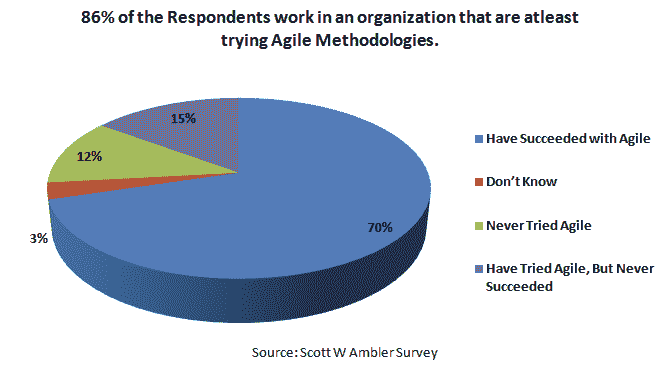
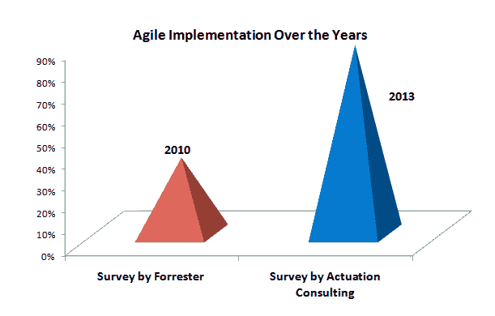
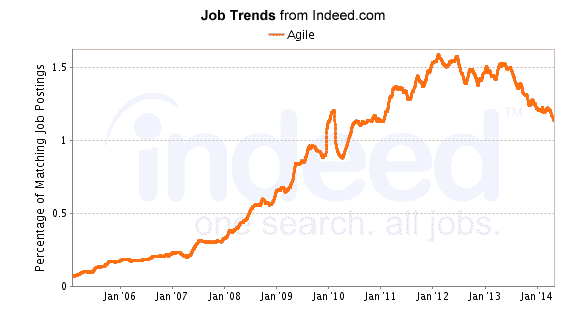
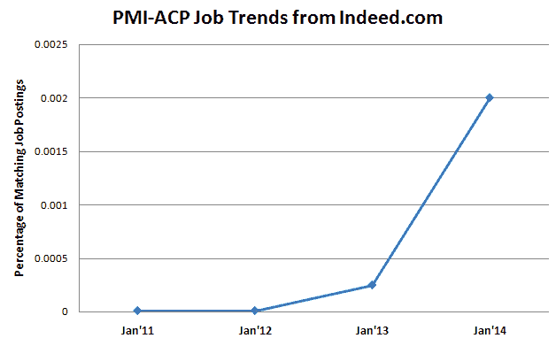
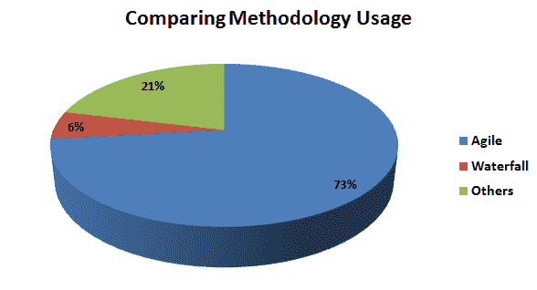

# 学习 PMI-ACP 的 8 个理由

> 原文：<https://www.edureka.co/blog/Reason-to-learn-pmi-acp>

20 世纪 90 年代早期，敏捷开发过程作为项目管理方法论中已建立的“计划驱动”瀑布模型的替代方案进入人们的视野。这种方法适用于工作范围有限且变量较少的小型项目。了解 [更多关于 PMI-ACP 的信息](https://www.edureka.co/blog/importance-of-agile-pmi-acp/ "Agile Methodology and Importance of PMI-ACP®") 以便更清楚地了解它。

看看敏捷的实施速度和它的日益流行，你为什么应该选择 PMI-ACP 就很明显了。这里有更多的理由来证明你的决定。这里的理由数量惊人，并为你提供了继续学习 PMI-ACP 的事实。

## **超越同行的竞争优势:**

敏捷认证专家接受改变团队绩效的原则和实践的培训。在敏捷培训中，人们学会了结合最好的敏捷方法来确保完成项目的卓越交付。作为一名认证专家，保证快速响应，从而赋予他竞争优势，并帮助他保持领先于同行。这有助于你的职业生涯，因为有些组织正在寻找最有能力和知识的专业人士来领导他们的项目。

## **敏捷采用增加:**

根据 Standish group 最近的报告，组织在采用敏捷方法方面已经开始看到更多的成功。

采用敏捷是一个持续的趋势，而且势头越来越猛。根据 Forrester 在 2010 年进行的一项调查，35%的组织使用敏捷，根据 Actuation Consulting 在 2013 年进行的一项调查，86.9%的用户使用敏捷。实施它的用户/组织数量有了巨大的飞跃，使它成为一种流行的使用方法。

## **对敏捷专业人才的巨大需求:**

ESI International 在其 2014 年项目管理十大趋势中预测，项目经理需求量很大，同时似乎很难找到合适的人才。随着全球范围内敏捷方法的稳步增长，对顶级项目管理人才的需求也不可避免地相应增长。ESI 还预测，由于缺乏熟练的项目管理专业人员，关键的项目管理职位将很难填补。

研究表明，项目管理从业者正在成功地实施敏捷原则和实践，使之成为一种流行的选择。考虑到它越来越受欢迎和使用，甚至 PMI 在 2012 年也开设了一门课程。下图显示了 Indeed.com PMI-ACP 的就业趋势。从这幅图可以明显看出，对精通敏捷的专业人员的需求正在激增。

## **比传统瀑布方法更敏捷:**

可以理解的是，瀑布方法或其他类似的方法将适用于某些业务类型，但是现在有证据表明，这些组织也在寻找其他的方法，而敏捷似乎处于最前沿。根据 Actuation Consulting 的一项调查，65.8%的瀑布用户将敏捷与利润增加联系在一起，只有 13.2%的用户认为纯粹的瀑布会导致利润增加。

在敏捷状态进行的年度调查中，73%的受访者认为敏捷帮助他们更快地完成工作，33%的受访者认为敏捷加快了上市时间，92%的受访者表示敏捷提高了他们管理优先级的能力，87%的受访者表示提高了工作效率。大约 23%的回答者同意敏捷确实帮助他们更好地协调 IT 和业务。

报告显示敏捷越来越受欢迎，吸引了瀑布用户的心。结果，敏捷用户越来越多，越来越多的用户将敏捷方法与瀑布方法结合在一起。

## **强烈的职业机会:**

敏捷环境正在为 IT 项目经理、测试人员和 QA 专业人员创造大量的职业机会，他们可以进入专业岗位，如“敏捷导师”或“敏捷 Scrum 大师”、“技术业务分析师”和“敏捷蔻驰”。世界各地的许多组织都在寻找精通敏捷的专业人士。在认证的帮助下，这些专业人员很容易获得权威职位，因为认证证明了一个人拥有如何处理具有挑战性的项目的理论知识。

## **生产率提高:**

大量的调查清楚地表明，实施敏捷方法的组织在加速上市时间、管理不断变化的优先级、用更少的时间完成、在预算和时间框架内完成项目方面比其他方法更有成效。在降低成本和提高效率方面，敏捷方法已经证明了自己。

敏捷方法提高了团队绩效，为团队内的共同决策、学习和解决紧急问题创造了友好的环境，从而提高了团队以及团队每个成员的生产力。

## **认证=即时验证:**

获得认证几乎是同义词(从对认证 PM professional 的需求中可以明显看出),证明了你的知识和对使用敏捷方法提高项目的标准和绩效的奉献。正因为这个原因，与非认证的专业人员相比，组织更信任认证的敏捷专业人员来有效地计划和执行项目。当招聘人员在寻找项目管理专家时，该认证会立即给你带来优势。获得认证会自动增加你事业成功的机会。 [认证带来更多的好处。](https://www.edureka.co/blog/importance-of-agile-pmi-acp/ "Agile Methodology and Importance of PMI-ACP®")

## **更好的报酬:**

根据项目管理协会最近的一项调查，美国、瑞士、澳大利亚、德国和荷兰的项目管理专业人员的平均工资超过 10 万美元。PMI-ACP 认证的平均年薪约为 123，000 美元。经认证的 PMI-ACP 和未经认证的 PMI-ACP 之间的薪酬差距约为 28%，前者的薪酬更高。我们已经讨论过关于 [工资方面的问题。](https://www.edureka.co/blog/how-valuable-is-pmi-acp-to-your-career/ "How Valuable is PMI-ACP® to your Career")

最后但并非最不重要的；虽然没有被列为原因之一，但是项目管理的激增趋势总体上是学习敏捷的一个很好的理由

## **项目管理整体上升趋势:**

项目管理趋势持续上升，已被评为 2014 年十大 IT 技能之一。它仍然是 It 部门最需要的技能之一。

你有它！以上是你学习 PMI-ACP 的理由。PMI-ACP 是 IT 项目经理的理想资格。所以，继续前进，在项目管理领域留下你的印记。

有问题要问我们吗？请在评论区提及它们，我们将会回复您。

**相关帖子:**

[PMI-ACP 培训](https://www.edureka.co/pmi-acp)

[PMI-ACP 对你的职业生涯有多大价值？](https://www.edureka.co/blog/how-valuable-is-pmi-acp-to-your-career/ "How Valuable is PMI-ACP® to your Career")

[敏捷方法论与 PMI-ACP 的重要性](https://www.edureka.co/blog/importance-of-agile-pmi-acp/ "Agile Methodology and Importance of PMI-ACP®")

*PMI-ACP 是项目管理协会的注册商标。Edureka 是全球 PMI 代表:ID 4021*