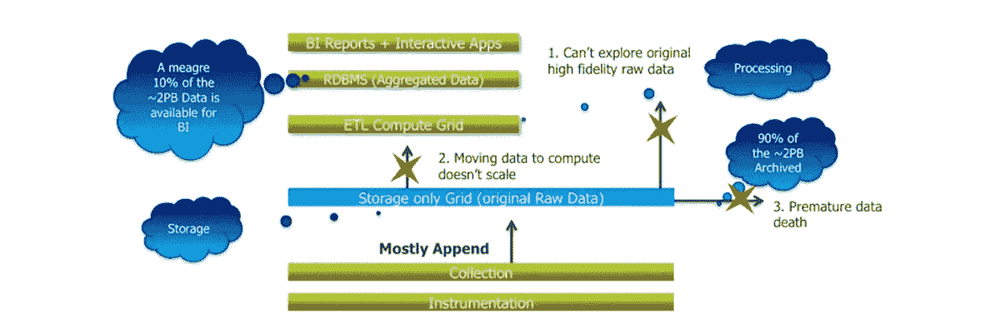
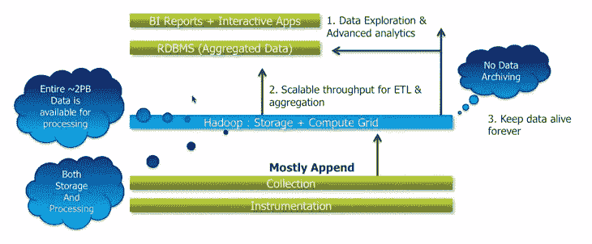
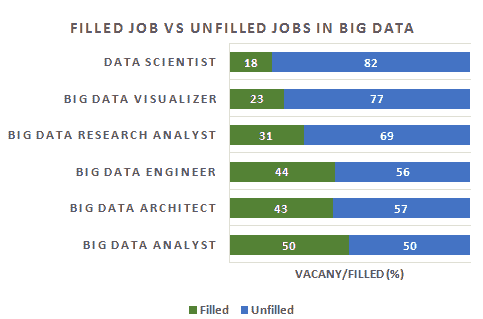

# 理解大数据和 Hadoop 的初学者指南

> 原文：<https://www.edureka.co/blog/a-beginners-guide-to-understanding-big-data-and-hadoop>

[//www.youtube.com/embed/q2Oz1xOZB3Q](//www.youtube.com/embed/q2Oz1xOZB3Q)

这是 2014 年 9 月 4 日举行的 Techgig 网络研讨会的录像。它详细涵盖了以下主题-

*   什么是大数据
*   传统仓库 Vs Hadoop
*   为什么要学习 Hadoop 及相关技术
*   大数据中的工作和趋势
*   Hadoop 架构和生态系统

以下是视频的节选:

**大数据的定义** 大数据不一定与 TB 和 Pb 的数据即数据的大小有关。术语“大数据”用于表示庞大而复杂的数据集集合，难以使用可用的数据库管理工具或传统的数据处理应用程序进行处理。

大数据包括结构化和非结构化数据。流入的数据量太大，并且主要包括非结构化数据。2012 年，仅来自互联网的数据流就超过 2，500 EB，自那以来，数字世界增长了 62%。数据量已经从去年的 80 万兆字节增长到今年的 1.2 兆字节。

**大数据的现实应用:**

**易贝——网络和零售:**

*   推荐引擎
*   广告定位
*   搜索质量
*   滥用和点击欺诈检测

**中国移动-电信:**

*   防止客户流失
*   网络性能优化
*   呼叫数据记录(CDR)分析
*   分析网络以预测故障

**摩根大通银行和金融服务:**

*   模拟真实风险
*   威胁分析
*   欺诈检测
*   贸易监督
*   信用评分和分析

**西尔斯零售:**

*   销售点交易分析
*   客户流失分析
*   情感分析

**西尔斯——案例分析:**  最初，西尔斯使用的是 Oracle Exadata、Teradata、SAS 等传统系统。存储和处理客户活动和销售数据。随着更多数据的到来，西尔斯希望分析顾客行为，更多地了解他们的购买模式，并根据这些数据推荐产品。由于数据分析结构中“ETL”点和存储网格的限制，当时的现有系统无法满足这一期望。几乎 90%的流入数据都被归档，在某个时间点之后，这些数据太大，存储网格无法处理。因此，只有有限的数据可供分析。在任何时候，只有 10%的数据可用于生成报告并从这些数据中获得有意义的见解。  西尔斯通过实施 Hadoop 克服了这一挫折。有了 Hadoop，100%的数据都可供处理。Sears 完全从数据分析结构中移除了 ETL 和存储网格。随着 Hadoop 的实施，现在可以对所有数据进行分析。西尔斯现在能够获得有意义的见解并加以利用，收集具有重大商业价值的关键早期指标，并能够对数据进行精确分析。

## **迁移到 Hadoop 的理由:**

Hadoop 已经成为处理大数据的流行且成功的平台。让我们来看看已经赢得这一地位的一些特性:

*   Hadoop 允许使用简单的编程模型在计算机集群上分布式处理大型数据集。
*   Hadoop 已经成为存储、处理和分析数百 TB 和数 Pb 数据的事实标准。
*   与 Oracle、IBM 等其他传统专有技术相比，Hadoop 的使用成本更低。它可以在低成本的商用硬件上运行。
*   Hadoop 可以处理来自不同系统的所有类型的数据，如服务器日志、电子邮件、传感器数据、图片、视频等。

## **Hadoop 带来的成长和工作机会:**

Dice.com 董事总经理爱丽丝·希尔(Alice Hill)表示，拥有 Hadoop 技能的数据专业人员在 IT 行业的薪酬最高。根据 Dice 2013 年的薪酬调查，大数据对薪酬的影响不成比例。精通 Hadoop 和 NoSQL 的专业人士的薪水超过 10 万美元

## **对 Hadoop 专业人才的巨大需求:**

据 Gartner 称，到 2015 年，全球将创造 440 万个 IT 岗位来支持大数据。对 Hadoop 专业人员的巨大需求已经存在，但由于缺乏具有 Hadoop 技能的专业人员，这种需求没有得到满足。

## **Hadoop 生态系统:**

Hadoop 生态系统由各种组件组成，如 Sqoop 和 Flume，它们是与 Hadoop 一起使用的一些工具。它还包括 HDFS，扮演管理员和蜂巢，猪和看象人的角色，由开发人员负责。这里，HBase 用于存储 MapReduce 数据。

在浏览了 Hadoop 及其组件之后，你有足够多的理由来详细理解为什么黄色玩具如此重要。

有问题要问我们吗？在评论区提到它们，我们会给你回复。

**查看我们关于这个话题的相关帖子:**

[大数据与 Hadoop 培训。](https://www.edureka.co/big-data-and-hadoop)

[什么是大数据？](https://www.edureka.co/blog/what-is-big-data/ "Answering the Big Question : What is Big Data")

[学习 Hadoop 的 5 个理由](https://www.edureka.co/blog/5-reasons-to-learn-hadoop "5 Reasons to Learn Hadoop")