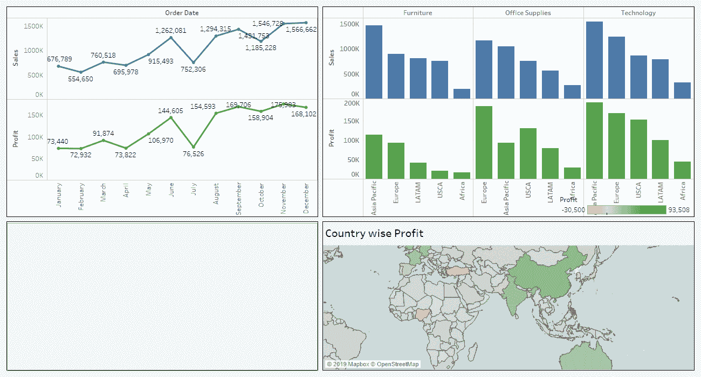
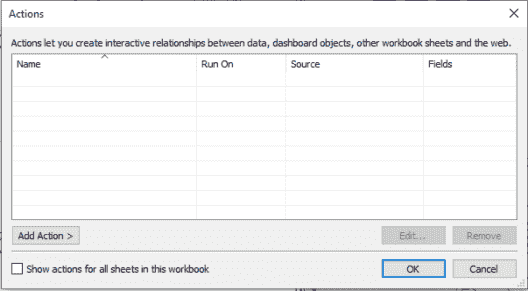
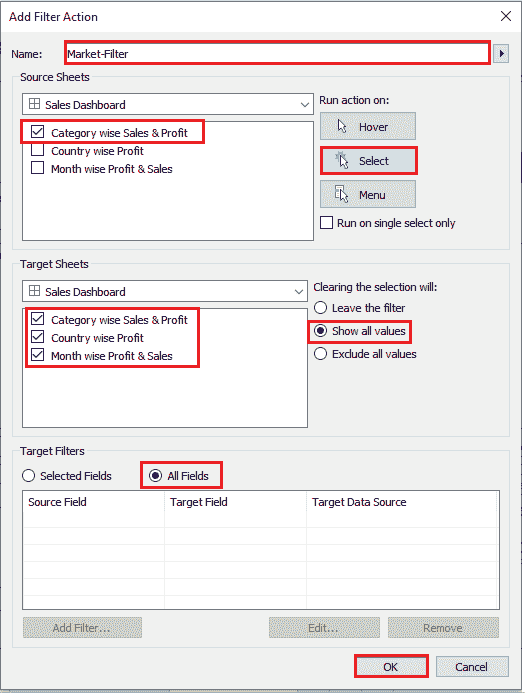

# 为什么在 Tableau 中需要动作？

> 原文：<https://www.edureka.co/blog/actions-in-tableau/>

Tableau 席卷了商业智能行业，它是数据可视化的最佳工具之一。这篇文章解释了一个重要的 Tableau 概念，即 Tableau 中的动作。本文将涉及以下几点:

*   为什么 Tableau 中需要“动作”？
*   表格动作
*   [使用 Tableau 仪表板上的过滤工作表](#UsingaFilterWorksheetonTableauDashboard)

如果你想温习一些 Tableau 的基础知识，我建议你在 Tableau 中继续这个动作之前做，看看这个视频

[https://www.youtube.com/embed/TjzJKTwfrUQ](https://www.youtube.com/embed/TjzJKTwfrUQ)

所以让我们赶快开始吧，

## 为什么 Tableau 中需要“动作”？

嗯，通过使用 Tableau 中的动作，您可以为您的数据带来交互性。无论是仪表盘还是工作表，用户只需在你的 viz 中悬停或点击，就可以被重定向到你设置的特定操作。

我们现在将学习一些动作，

**了解我们在顶级城市的 Tableau 培训课程**

| 印度 | 美国 | 其他热门城市 |
| [班加罗尔的 Tableau 培训](https://www.edureka.co/tableau-certification-training-bangalore) | [达拉斯的 Tableau 球场](https://www.edureka.co/tableau-certification-training-dallas) | [华盛顿的 Tableau 课程](https://www.edureka.co/tableau-certification-training-washington) |
| [海德拉巴的 Tableau 培训](https://www.edureka.co/tableau-certification-training-hyderabad) | [夏洛特的 Tableau 课程](https://www.edureka.co/tableau-certification-training-charlotte) | [奥斯汀的 Tableau 课程](https://www.edureka.co/tableau-certification-training-austin) |
| [金奈的 Tableau 培训](https://www.edureka.co/tableau-certification-training-chennai) | [纽约的 Tableau 课程](https://www.edureka.co/tableau-certification-training-new-york-city) | [西雅图的 Tableau 课程](https://www.edureka.co/tableau-certification-training-seattle) |

## 表格动作

首先，让我们使用全球超市数据创建 3 个工作表:

*   月度利润和销售额
*   国家利润
*   分类销售和利润
*   另外，从左侧的对象窗格中拖放“网页”,然后单击“确定”。(稍后我会告诉你我们为什么要这样做)

最后，将它们组合起来，形成这样一个仪表板:

现在我们将逐一使用*动作。*

当你在 Tableau 仪表板上时，你可以通过点击仪表板>动作，或者简单地按下“Ctrl+Shift+D”来打开动作对话框。您将看到此对话框:

******

让我们看看如何使用一些过滤器，

## **使用 Tableau 仪表板上的过滤工作表**

您可以使用任何工作表作为仪表板的过滤器。当用户在工作表上选择一个给定的参数时，整个仪表板就会根据所选的参数进行过滤。

*   点击添加操作>过滤器
*   为您的过滤器命名以避免混淆。我给它起了个名字“市场——过滤器”
*   选择您想要用作仪表板过滤器的源表，我使用的是类别式销售和利润
*   在右窗格中，选择“选择时运行操作”
*   选择目标表，一般来说，我们在这里选择仪表板的所有表，但是你可以根据你的要求选择。
*   当用户选择源表上的参数时，这些表将被过滤掉。(这里的源表是:类别销售和利润)。
*   单击确定并关闭操作对话框。

现在，当您点击亚太地区时，您会看到仪表盘上的所有表格都显示了与亚太地区相关的数值。这是一个非常有用的交互式过滤器，因为它使最终用户能够从可视化本身中过滤出工作表。

当用户点击某个特定字段时，如果您想将他/她重定向到某个特定的网页，该怎么办？

这可以使用 Tableau 中的动作轻松完成。

这里，我举一个例子，打开用户在地图上选择的特定国家的维基百科页面。

这可以通过以下步骤轻松完成:

*   打开“动作”对话框(使用 Ctrl+Shift+D ),然后单击“添加动作”。
*   给链接起一个名字，并根据您的可视化选择包含地图或国家名称的源表。
*   一般来说，不同国家的维基百科网址是:https://en.wikipedia.org/wiki/

就像在 https://en.wikipedia.org/wiki/India 一样

*   您可以通过单击“测试链接”来测试此链接。如果它工作，那么你是好的，如果不是，请重新检查一般网址。
*   选择“网页对象”作为 URL 目标。如果您希望在浏览器上重定向用户，而不是将他限制在仪表板上，您可以选择第一个或最后一个选项。
*   现在单击确定并关闭操作对话框。

当用户点击地图上的任何一个国家时，该国的维基百科页面就会显示出来:

这些是最常用的 Tableau 仪表板操作。我们会尽我们所能来构建一个交互式的信息面板，而动作在为你的表单带来交互性的过程中扮演着重要的角色。

这就把我们带到了这篇关于 Tableau 中的动作的文章的结尾。如果你希望掌握 Tableau，Edureka 有一个关于 **[Tableau 课程](https://www.edureka.co/tableau-certification-training)** 的策划课程，该课程深入涵盖了数据可视化的各种概念。

*有问题吗？请在这篇文章的评论部分提到它，我们会尽快回复你。*