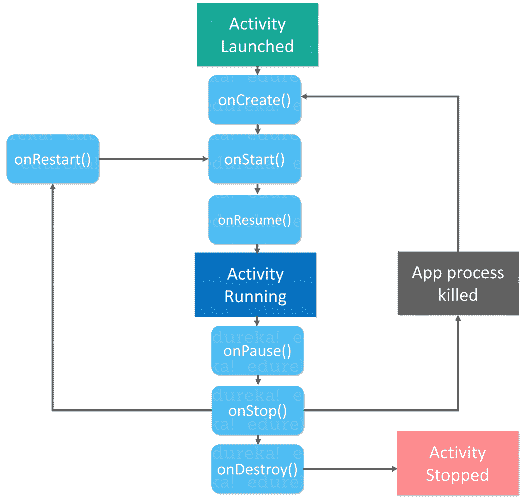

# Android 活动生命周期是什么？

> 原文：<https://www.edureka.co/blog/activity-lifecycle/>

Android 是开源操作系统，对许多任务都很有用。当您启动或打开您的 [android 应用程序](https://www.edureka.co/blog/android-tutorial/)时，它将经历各种状态，这被称为 android 活动生命周期。

本文涵盖以下主题:

*   [安卓简介](#IntroductiontoAndroid)
*   [什么是 Android 活动生命周期？](#WhatisAndroidActivityLifeCycle?)
*   [生命周期方法和回调](#LifeCycleMethodsandCallbacks)
*   [演示:实施活动生命周期](#Demo)

我们开始吧！

## **安卓简介**

**Android** 是一个基于 Linux 的开源操作系统，带有一个 [Java 编程](https://www.edureka.co/blog/java-tutorial/)接口，适用于智能手机等移动设备(支持 Android OS 的触摸屏设备)。

它由多个 API 组成，以支持基于位置的服务，如 GPS。它还广泛支持多媒体硬件控制，使用摄像头和麦克风进行回放或录制。它支持多任务处理，我们可以从一个任务窗口移动到另一个任务窗口，多个应用程序可以同时运行。它将提供一个机会来重用应用程序组件和替换本地应用程序。

有了这个，我们再进一步，知道什么是 Android 活动生命周期。

## **什么是 Android 活动生命周期？**

当用户浏览应用程序时，应用程序中的[活动](https://developer.android.com/reference/android/app/Activity.html)实例在其生命周期的不同阶段进行转换。activity 类提供了许多回调函数，允许 activity 知道状态已经改变:系统正在创建、停止或恢复一个 activity，或者销毁 Activity 所在的进程。

现在让我们借助生命周期方法和回调来更详细地了解 Android 活动生命周期。

## **生命周期方法和回调**

通常，活动生命周期有七种回调方法:

1.  onCreate()
2.  onStart()
3.  onResume()
4.  onPause()
5.  onStop()
6.  onRestart()
7.  onDestroy()

现在让我们进入 Android 活动生命周期方法和回调的细节。请看下图，了解生命周期。

你一定知道一个程序是从不同编程语言的 main()函数开始的。类似地，android 通过调用 *onCreate()* 回调方法来启动活动中的程序。在上面的活动生命周期图中，有一系列的回调方法，它们启动一个活动，然后以不同的方法分解:

**1。onCreate()** : 在这种状态下，活动被创建。

**2。onStart():** 当活动对用户可见时，调用这个回调方法。

**3。onResume()** : 活动在前台，用户可以与之交互。

**4。onPause()** : 活动被另一个活动部分遮挡。前景中的另一个活动是半透明的。

**5。onStop()** : 活动完全隐藏，用户看不到。

**6。onRestart():** 从停止状态，活动要么返回与用户交互，要么结束运行并离开。如果活动返回，系统调用`onRestart()`

**7。onDestroy():** 活动被破坏并从记忆中清除。

这就是活动生命周期的各种方法。现在让我们看看生命周期方法和状态将出现的情况。

*   **当你打开应用程序时，它会经历以下状态:**

oncreate()–> on startup()>on resume()

*   **当您按下返回键并退出应用程序时**

    on paused()—> on stop()–> on destory()

*   **当你按下 home 键**

    on paused()–> on stop()

*   **按下 home 键后，再次打开 app 时从最近的任务列表中调出**

    onRestart() –> onStart() –> onResume()

*   **关闭对话框或从对话框中返回按钮后**

    onResume()

*   **如果电话铃响，用户正在使用应用**

    on pause()–> on resume()

*   **通话结束后**

    onResume()

*   **当你的手机屏幕关闭时**

    on paused()–> on stop()

*   **当你的手机屏幕重新打开**

    onRestart() –> onStart() –> onResume()

这是你的应用程序经历各种状态时的一些情况。现在，让我们借助下面的例子来看看如何实现这一点。

## **演示:实施活动生命周期**

首先，你需要使用 [Java](https://www.edureka.co/blog/what-is-java/) 或 [Kotlin 编程语言](https://www.edureka.co/blog/kotlin-programming-language/)开发一个简单的 Android 应用。在这个演示中，我使用 Kotlin 编程语言，因为与 Java 相比，Kotlin 的代码行数更少。如果你想知道如何使用 Java 创建一个 Android 应用程序，请参考 [Android 教程](https://www.edureka.co/blog/android-tutorial)。此外，如果你想使用 Kotlin 创建一个 Android 应用程序，那么看看这篇关于 Kotlin Android 教程[的文章。](https://www.edureka.co/blog/kotlin-android-tutorial/)

**步骤 2:** 一旦你构建了你的应用程序，你需要配置你的 *MainActivity.kt 类*文件并覆盖回调方法。让我们看看下面的代码，从更广泛的角度来理解这一点。

```
package com.example.activitycycle
import androidx.appcompat.app.AppCompatActivity
import android.os.Bundle
import android.util.Log
import android.widget.Toast

class MainActivity : AppCompatActivity() {
override fun onCreate(savedInstanceState: Bundle?) {
super.onCreate(savedInstanceState)
setContentView(R.layout.activity_main)
print("***App state: OnCreate***n")
Toast.makeText(getApplicationContext(),"App state: OnCreate",Toast.LENGTH_LONG).show();
}
override fun onStart() {
super.onStart()
print("***App state: OnStart***n")
Toast.makeText(getApplicationContext(),"App state: OnStart",Toast.LENGTH_LONG).show();
}
override fun onResume() {
super.onResume()
print("***App state: OnResume***n")
Toast.makeText(getApplicationContext(),"App state: OnResume",Toast.LENGTH_LONG).show();
}
override fun onStop() {
super.onStop()
print("***App state: OnStop***n")
Toast.makeText(getApplicationContext(),"App state: OnStop",Toast.LENGTH_LONG).show();
}
override fun onPause() {
super.onPause()
print("***App state: OnPause***n")
Toast.makeText(getApplicationContext(),"App state: OnPause",Toast.LENGTH_LONG).show();
}
override fun onRestart() {
super.onRestart()
print("***App state: OnReStart***n")
Toast.makeText(getApplicationContext(),"App state: OnRestart",Toast.LENGTH_LONG).show();
}
override fun onDestroy() {
super.onDestroy()
print("***App state: OnDestroy***n")
Toast.makeText(getApplicationContext(),"App state: OnDestroy",Toast.LENGTH_LONG).show();
}
}
```

基本上，在上面的例子中，我覆盖了所有的方法并打印了状态。此外，我还使用了 `Toast.makeText()`，来显示应用程序本身的生命周期方法。每当应用程序经历各种状态时，它调用并显示应用程序本身中的方法。Android 活动生命周期就是这么运作的。如果你希望了解 Android 的基本原理，那么请查看这篇关于  [Android 教程](https://www.edureka.co/blog/android-tutorial)的文章。

这就把我们带到了这篇关于 Android 活动生命周期的文章的结尾。 希望你清楚本文与你分享的一切。

*现在你已经看完了我们的 Kotlin Android 教程，可以查看一下 Edureka 的  [Android App 开发认证培训](https://www.edureka.co/android-development-certification-course)* *有问题要问我们吗？请在“Android Activity Life Cycle”博客部分的评论中提到它，我们会给你回复。*