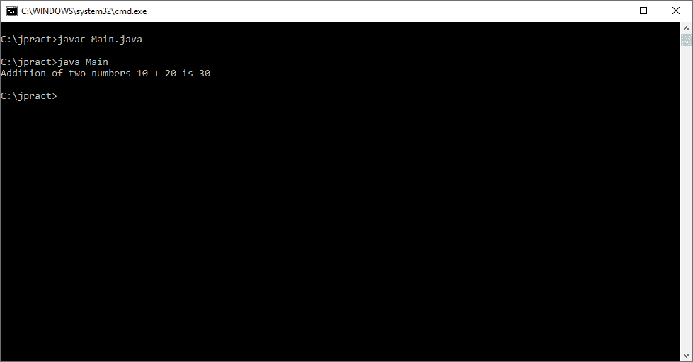
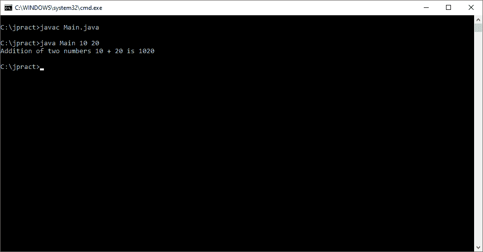
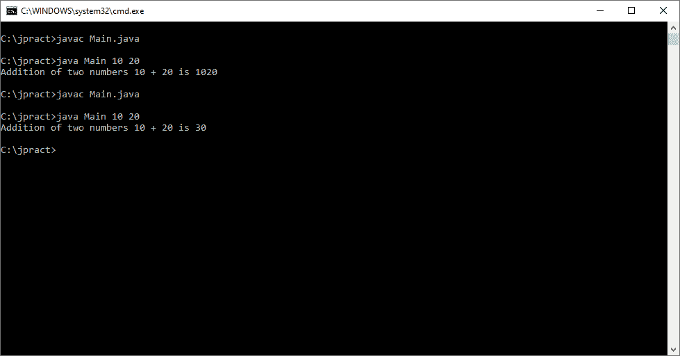

# 如何用 Java 实现两个数的加法？

> 原文：<https://www.edureka.co/blog/addition-of-two-numbers-in-java/>

在这篇文章中，我将向你介绍一个简单而重要的概念，那就是 Java 中两个数的相加。但在继续之前，我建议你先熟悉一下“什么是 Java”，Java 的特性以及如何在你的系统上安装 Java，这些你都可以在之前的 [博客](https://www.edureka.co/blog/what-is-java/) 中找到。这将有助于你快速轻松地掌握即将到来的概念。由我们的 [Java 培训](https://www.edureka.co/java-j2ee-soa-training) 专家撰写的这个 Java 教程系列中的其他博客将深入覆盖 Java & J2EE 的所有重要主题，

本文将涉及以下几点:

*   [方法 1](#Method1)
*   [方法二](#Method2)
*   [重复的一元运算符](#RepeatedUnaryOperator)
*   [初始循环表](#InitialLoopTable)
*   [Java 中的按位和位移运算符](#BitwiseAndBitshiftOperatorInJava)
*   [递归](#Recursion)

那么让我们开始吧，

## **Java 中两个数的相加**

## **方法 1**

用 Java 开发一个程序在屏幕上打印“两个数相加”来直接理解吧。

```
Class AddTwoNumbers
{
public static void main(String[] args)
{
System.out.println(“Addition of two numbers 10 + 20 is ” + (10 + 20));
}
}
```

**输出**



我们必须明白这一点，这里的数字是直接相加的，比如说 10 + 20 就是 30。但是我们从控制台得到的数字。在这种情况下，这些值将存储在一个变量中。就 Java 而言，字符串数组变量将根据它们的索引存储这些数字。

```
public class Main
{
public static void main(String[] args)
{
System.out.println("Addition of two numbers " + args[0] + " + " + args[1] + " is " + (args[0] + args[1]));
}
}
```

当我们传递相同的数字 10 和 20 时，输出将如控制台所示。



嗯，我们在这里得到的结果并不理想。请记住 String[] args，您从控制台获得的每个输入都用 String 表示。所以这里我们要把那些字符串转换成整数来计算加法。

```
public class Main
{
public static void main(String[] args)
{
//System.out.println("Addition of two numbers " + args[0] + " + " + args[1] + " is " + (args[0] + args[1]));
System.out.println("Addition of two numbers " + args[0] + " + " + args[1] + " is " + (Integer.parseInt(args[0]) + Integer.parseInt(args[1])));
}
}
```

**输出**



现在期望的输出就是我们想要的。也就是说，在我们将它从字符串解析为整数后，10 和 20 相加就是 30。

本文的下一篇是关于 Java 中两个数的加法

## **方法二**

1.  使用减法运算符 :我们可以使用减法将两个数字相加，这样它将否定负值，从而得到加法。

```
public class AddTwoNumbers
{
public static int add(int a, int b)
{
return a – (-b);
}
public static void main(String[] args)
{
System.out.println(add(10, 20));
System.out.println(add(-10, 20));
}
}
```

**输出**

30

10

本文的下一篇是关于 Java 中两个数的加法

## **重复的一元运算符**

这涉及到 while 循环，其背后的基本思想是将第一个操作数的值归零。并且继续以相同的迭代次数增加其对应的第二操作数。考虑下面的例子。

```
public class HelloWorld
{
public static void main(String []args)
{
System.out.println("add " + add(10, 20));
System.out.println("add " + add(-10, 20));
}
public static int add(int a, int b)
{
//System.out.println("---> " + a + " : " + b);
while(a > 0)
{
//System.out.println("while a>0---> " + a + " : " + b);
b++;
a--;
}
while(a < 0)
{
//System.out.println("while a<0---> " + a + " : " + b);
b--;
a++;
}
//System.out.println("return b---> " + a + " : " + b);
return b;
}
}
```

**输出**

```
$javac HelloWorld.java
$java -Xmx128M -Xms16M HelloWorld
add 30
add 10
```

本文的下一篇是关于 Java 中两个数的加法

## **Java 中的按位和位移运算符**

我们还可以使用 XOR 按位运算符将两个整数相加，并通过 and 运算符获得进位。要将进位加到和中，我们需要使用带符号的左移运算符。这是怎么发生的？我们先来看一个例子。

```
public class HelloWorld{
public static void main(String []args){
System.out.println("Addition using +ve " + addUsingBits(10, 20));
System.out.println("Addition using -ve " + addUsingBits(-10, 20));
}
public static int addUsingBits (int a, int b){
while (b != 0){
int carry = (a & b);
a = a ^ b;
b = carry << 1;
}
return a;
}
}
```

**输出**

$贾瓦茨·HelloWorld.java

$ Java-xmx 128m-Xms16M hello world

使用+ve 30 的加法

使用-ve 10 的加法

永远记住，XOR 运算是用来计算两位相加的。AND 运算用于评估两位的进位。我们来分析一下，好吗？根据输入值，第一个条件是 a = 10，b = 20。

| **操作** | **表情评价** | **二进制当量** | **十进制值** |
| 答 | 10 | 00001010 | 10 |
| b | 20 | 00010100 | 20 |
| while(b！= 0) | 真 |  |  |
| int 进位= (a & b) | 10 & 20 | 0 | 0 |
| a = a ^ b | 10 ^ 20 | 00011110 | 30 |
| b =进位<1 | 0<1 | 0 | 0 |
| 返回一个 | 30 | 00011110 | 30 |

现在，让我们假设 a 为负输入，比如-10。让我们看看在下表中会发生什么。 这让我们在循环中，直到进位的十进制值变为负值。

本文的下一篇是关于 Java 中两个数的加法

## **初始循环表**

| **操作** | **表情评价** | **二进制当量** | **十进制值** |
| 答 | -10 | 11110110 | -10 |
| b | 20 | 00010100 | 20 |
| while(b！= 0) | 真 |
| int 进位= (a & b) | -10 & 20 | 00010100 | 20 |
| a = a ^ b | -10 ^ 20 | 11100010 | -30 |
| b =进位<1 | 20<1<1 | 00101000 | 40 |

循环 1。

| **操作** | **表情评价** | **二进制当量** | **十进制值** |
| 答 | -30 | 11100010 | -30 |
| b | 40 | 00101000 | 40 |
| while(b！= 0) | 真 |
| int 进位= (a & b) | -30 & 40 | 00100000 | 32 |
| a = a ^ b | -30 ^ 40 | 11001010 | -54 |
| b =进位<1 | 32<1 | 00101000 | 64 |

以此类推…直到循环结果是 b = 0；为了简洁起见，这里没有显示所有结果。因此，下表代表该操作中最后一个循环。

| **操作** | **表情评价** | **二进制当量** | **十进制值** |
| 答 | -2147483638 | 11111111111111111111111111110000000000000000000001010 | -2147483638 |
| b | -2147483648 | 111111111111111111111111111100000000000000000000 | -2147483648 |
| while(b！= 0) | 真 |
| int 进位= (a & b) | -2147483638&-2147483648 | 111111111111111111111111111100000000000000000000 | -2147483648 |
| a = a ^ b | -2147483638 ^ -2147483648 | 00001010 | 10 |
| b =进位<1 | -2147483648<1 | 0 | 0 |
| 返回一个 | 10 | 00001010 | 10 |

这就是加法的计算方法。唷！想法到此为止。试想一下，如果这个计算是人工完成的，主要是二进制计算。

本文的下一篇是关于 Java 中两个数的加法

## **递归**

我们也可以用递归来写上面的程序。计算部分略有不同，让我们把它作为你们的家庭作业，好吗？我将给出递归的摘录，你可以试着建立你自己的表，这样你就知道它内部是如何工作的。另外，除非你对这里的内部工作很感兴趣，否则没有必要对这些仅仅是为了表现的目的而大动干戈。

```
public static int addUsingRecursion(int a, int b){
if(b == 0) return a;
int sum = a ^ b;
int carry = (a & b) << 1;
return add(sum, carry);
}
```

这些都是在 Java 中使用+运算符和不使用+运算符的两个数的加法。选择这两种方法的原因完全取决于项目的需要和要求。

我还没有评估和测试这两个场景的工作情况，以得出性能。我猜只有当你建造火箭并把它送上太空时，这种想法才会生效。

为了简洁起见，我只解释了与整数相关的数字，这有其自身的内存限制。我把进一步探索使用 float、double 等留给了您。永远记住，如果你超过了基本类型的极限值，那么结果将显示不同的答案。

查看 Edureka 提供的 [Java 认证课程](https://www.edureka.co/java-j2ee-training-course) ，edu reka 是一家值得信赖的在线学习公司，在全球拥有超过 250，000 名满意的学习者。我们在这里帮助你的旅程中的每一步，为了成为你最好的，我们提出了一个课程，它是为想成为 Java 开发者的学生和专业人士设计的。