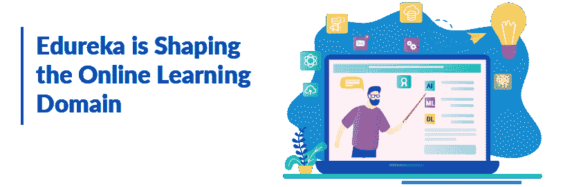
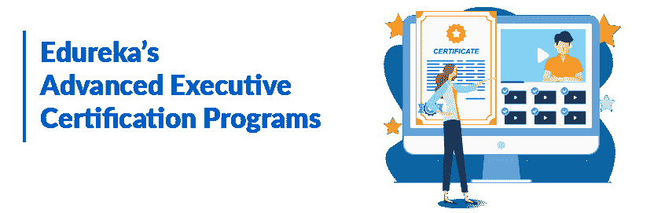
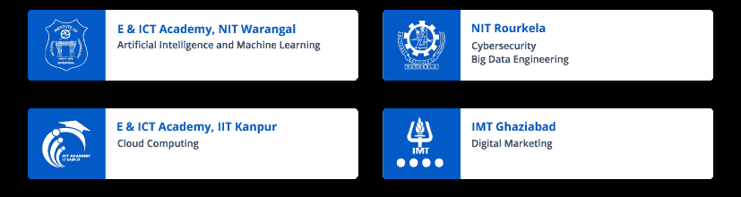
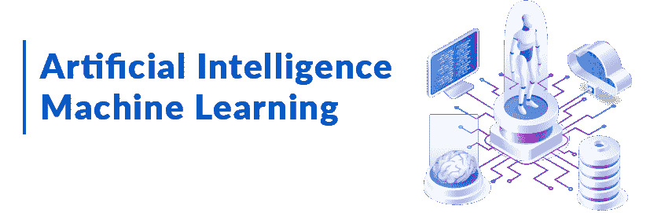
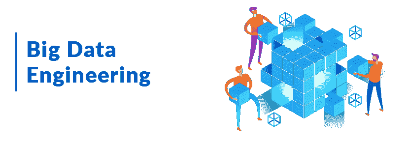

# 高级主管认证项目:在线学习的游戏改变者

> 原文：<https://www.edureka.co/blog/advanced-executive-certification-programs/>

在线学习、杂货、食谱、Zoom、网飞和在线游戏是新冠肺炎封锁期间印度谷歌搜索的热门搜索。

教育技术、电子商务、娱乐、OTT、在线协作工具、游戏和 MOOC(大规模开放式在线课程)是疫情期间蓬勃发展的一些在线行业，因为它们广泛的大规模数字存在。数据、人工智能、技术和软件开发将站在这场变革的最前沿。

## 为什么在线学习已经成为时代的需要？

封锁期间在线课程的兴起也是前所未有的。商学院目前关闭了，就业市场看起来严峻，未来看起来不确定。因此，提高技能和追求在线课程似乎是一个好主意。但是你不能随便选一门课吧？

不！它必须是有价值的东西，在新冠肺炎·疫情结束后仍然有用。这正是我们可以为您提供帮助的地方， [Edureka](https://www.edureka.co/) 是一个全球在线学习平台，为学生和在职专业人士提供交互式学习体验、专业化和高级管理人员认证计划。

## **Edureka 正在塑造在线学习领域**

我们帮助职业人士实现梦想，帮助那些希望提高技能、保持相关性或为自己争取更好未来的学习者。我们与一流的 IIT 和 nit 合作，推出了针对各种趋势技术的高级管理人员认证计划，如人工智能、大数据工程、数据科学、云计算、网络安全和数字营销。

**Edureka 的高级管理人员认证项目**

Edureka 的高级管理人员认证计划是独一无二的。与在线提供的其他短期认证课程不同，高级管理人员认证计划通过让 IT 专业人员深入学习前沿技术，推动他们在职业和薪酬方面的发展。这些项目的短期模块设计使学习者能够快速完成认证&尽早将技能组合添加到他们的投资组合中。去年，当我们推出大数据工程和人工智能的课程，以测试 IT 专业人士的反应&兴趣时，我们赢得了很多赞赏和高度兴趣。

你不需要呆在校园里就能获得一流的教育。我们与这些印度顶尖大学的合作伙伴关系为您带来了精心策划的课程&让您有机会在家舒适地向行业从业者学习。

我们的课程由行业资深人士和顶尖大学的教授设计。它包括:

*   现场&互动课堂
*   行业从业者当导师
*   实时疑点清除会议
*   终身访问课程内容、作业&更多
*   全天候访问主题专家
*   专门的个人学习管理器
*   建立个人档案和职业指导的技巧
*   就业援助服务

到目前为止，超过 200，000 名学员申请了该计划下推出的五门课程，自该计划推出以来的 6 个月内，需求增长了 115%。

## **提供的课程**

目前，我们在以下领域提供高级管理人员认证计划:

### **AI-ML**

人工智能正在重新定义我们的生活方式，使机器能够做人们曾经认为只有人类才能做的事情。为了帮助掌握 AI-ML 领域，我们推出了人工智能和机器学习的[研究生项目，在那里你将获得诸如 Google Colab (IDE)、Jupyter Notebook (IDE)、Seaborn、Matplotlib、Numpy 和 Pandas 等工具的实践经验。](https://www.edureka.co/post-graduate/machine-learning-and-ai)

#### **美国药典:**

*   450 多个小时的直播课
*   20 多个项目，100 多个案例研究
*   30 多项任务

### **大数据工程**

在当今以数据为导向的经济中，大数据在跨行业核心业务流程的创新和优化中发挥着至关重要的作用。为了帮助掌握大数据领域，我们在大数据工程推出了一个[高级管理人员项目，您将获得 Spark、Scala、Hive、Kafka、Sqoop、Flume、HBase、Cassandra 等工具的实践经验。](https://www.edureka.co/post-graduate/big-data-engineering)

#### **美国药典:**

*   450 多个小时的直播课
*   20 多个项目，100 多个案例研究
*   30+实习

### **网络安全**

网络安全已经成为任何现代企业的关键。随着一次又一次的攻击成为头条新闻，每个人都清楚，组织需要更多专注于网络安全的专业人员。为了帮助掌握网络安全领域，我们在网络安全推出了一个[高级管理人员项目，您将获得 Nmap、OpenVAS、BurpSuite、Dirbuster、Hashcat、John the Ripper、Aircrack-ng、Metasploit 等工具的实践经验。](https://www.edureka.co/post-graduate/cybersecurity)

#### **美国药典:**

*   400 多个小时的强化学习
*   21+作业
*   27+网络实验室实习

### **云计算**

根据 IDC 的预测，到 2021 年，云计算支出将占所有软件、服务和技术支出的 60-70%。印度云计算市场从 2018 年的 22 亿美元增长到 2020 年的 40 亿美元。为了帮助掌握云计算领域，我们在云计算推出了[高级认证，在这里您将获得关于](https://www.edureka.co/post-graduate/advanced-cloud-computing-program) [Python](https://www.python.org/) 、Bash、Linux、Beanstalk、Lambda、Azure、谷歌云平台、AWS、Glacier 等工具的实践经验。

#### **美国药典:**

*   450 多个小时的直播课
*   5+作业
*   高级云实验室

### **数字营销**

预计到 2021 年初，仅在英国就有 200 万个工作机会，随着互联网使用的增加，现在是开始你的数字营销职业生涯的最佳时机。为了帮助掌握数字营销领域，我们推出了一个专门从事数字营销的 [PG 认证计划](https://www.edureka.co/post-graduate/digital-marketing-certification)，您将获得关于消费者营销、内容营销、网络分析、搜索引擎营销、社交媒体营销、移动营销、联盟营销、搜索引擎优化、电子邮件营销的实践经验。

#### **美国药典:**

*   150 多个小时的直播课
*   15 种以上的营销工具和 15 种以上的案例研究
*   顶点工程

## 来和我们一起学习吧！

到目前为止，来自 150 多个国家的学习者已经使用我们的学习平台成功提升了自己的技能。我们还与思科、微软、IBM、Mphasis、Cognizant、Wipro、Accenture、Mindtree 等各种组织合作，在全球范围内提升他们员工的技能。到目前为止，我们已经从印度和其他国家培训了超过 750，000 名学生&工作专业人员。