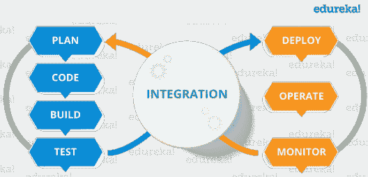

# Python 有哪些重要的优缺点？

> 原文：<https://www.edureka.co/blog/advantages-and-disadvantages-of-python/>

让我们深入研究这个关于 [Python](https://www.edureka.co/blog/python-tutorial/) 的系列中的另一篇文章。在本文中，我们将看到 python 的优缺点。显然，我们最终会看到，利远大于弊。

为了充分利用这篇文章，整篇文章被分成了以下几类:

*   [Python 的应用](#ApplicationsofPython)
*   [python 的优势](#Advantagesofpython)
*   [python 的缺点](#Disadvantagesofpython)
*   [关于讨论的最终想法](#Finalthoughtsondiscussion)

让我们开始吧！

## **Python 的应用:**

#### 创建基于 GUI 的桌面小程序。

使用 Tkinter、pyQt 和 pyGame 这样的库，开发者可以开发支持 GUI 的桌面小程序。

#### Web 服务器编程。

使用像 django 和 flask 这样的库，开发者可以为后端开发的 web 服务器进行服务器端编程。

#### **原型制作**

Python 提供了任何软件模型的快速原型，因此可以呈现给客户。

#### **游戏开发**

使用像 pygame 这样的库，开发者可以开发具有 GUI 的游戏。

#### **数据科学和机器学习**

到目前为止，python 最常用的应用是在数据科学和机器学习领域。凭借其强大的社区和庞大的库，python 中的数据处理变得相当容易。无论是数据操作、数据可视化还是数据清理，python 都有自己的库。如果你有数据，你必须知道 python。

到目前为止，我们已经了解了 Python 的应用，让我们继续这篇关于 Python 的优缺点的文章。

## **Python 的优势**

随着 python 社区和开源库的出现，python 已经发展成为一个完整的软件开发包。

#### **由庞大而活跃的社区驱动**

Python 有一个最著名和最活跃的社区，帮助他们不断改进 python。难怪它是堆栈溢出排名最高的平台。Python 语言是在开源许可下发布的，这使得它的开发通过开源贡献变得容易。

#### **学习曲线**

对于大多数编程语言来说，它们的学习曲线倾向于随时间呈抛物线增长，这意味着早期很难掌握，但是一旦你熟悉了这种语言，学习就变得容易了。但是对于 python 来说，学习很容易，因为语法简单，书写简单。

继续这篇关于 Python 的优缺点的文章，

#### **第三方库**

标准 python 包安装程序(PIP)可以帮助您安装众多模块，使 python 具有交互性。这些库和模块可以通过互联网协议、操作系统调用等进行交互。您可以为网络进行套接字编程，并将操作系统模块用于运行用户级线程的系统调用。

#### **与其他语言的整合**

像 Cython 和 Jython 这样的集成库使得 python 可以与 c/c++和 java 集成，以进行跨平台开发。这使得 python 变得更加强大，因为我们都知道没有一种语言是完整的，使用单一语言来开发任何东西都是不明智的。每种语言都有自己的长处，所以使用这些库你可以享受每种语言的强大功能。

#### **生产率**

有了 python 电池内含的理念，开发人员无需下载单独的模块和软件包就能领先一步。除了 python 简单的语法和快速原型制作，与传统编程语言相比，生产率提高了近 40%。

**结论**

与不同的编程语言相比，Python 是目前开发者使用最广泛的语言。Python 语言的主要好处是易于阅读，易于检查和学习。用 Python 安装软件包和编写软件没有用 C 或 C++复杂。python 编程的一些其他好处是，由于 Python 中没有指针或引用的概念，所以没有计算机病毒会引发分段错误。与传统编程语言相比，Python 语言的一个重要优势是它具有广泛的适用性和可接受性，并被科学家、工程师和数学家广泛使用。正是由于这一点，Python 对于原型和各种实验是如此有益。它还可以同时用于为电影生成动画以及机器学习和深度学习。

继续这篇关于 Python 优缺点的文章，

## **python 的缺点**

我们已经看到了流行的编程语言 Python 的主要优势。但是我们都知道硬币有两面！Python 确实也有一些缺点，这使得开发者对它敬而远之。所以让我们一个一个来看:-

#### 低速

Python 使用解释器一行一行地加载它，而不是使用编译器一次执行整个文件。这使得编译速度较慢，并且往往执行缓慢。这是有竞争力的程序员不使用 python 的主要原因。C++比 python 提供了更多的每秒计算量。此外，这也是 python 在应用程序开发中没有被广泛使用的原因。

#### 代码中的错误检测

因为 python 使用解释器，所以在代码编译过程中不会出现代码错误。Python 使用动态类型的变量，这使得测试更加繁忙。所有这些错误都是运行时错误，没有一个开发人员希望他们的程序出现这种错误。这使得 python 不太适合 GUI 小程序开发。

#### 在移动设备方面表现不佳:

我们已经在 web 服务器和桌面应用程序中看到了 python 以及它所使用的脚本。但是它被认为不适合移动设备，因为与其他语言相比，它使用更多的内存和缓慢的处理。

继续这篇关于 Python 的优缺点的文章，

#### 大量内存消耗

Python 的设计结构是这样的，与 C/C++等其他语言相比，它在处理时使用大量内存。这使得 Python 完全不适合在严格的内存限制下进行开发。

**结论:**

这种语言被视为不太适合手机开发和游戏开发的平台。它经常在桌面和服务器上使用，但是有几个最方便的移动包主要用于 Python。Python 的另一个缺点是运行时错误。这种语言有很多设计限制。Python 使用解释器而不是编译器执行，这降低了性能。

让我们看看最后的想法。

**最终想法:**

虽然 python 有很多缺点，但是我们可以清楚地看到它的优点远远超过缺点。每种编程语言都有自己的长处和让开发人员感兴趣的领域。Python 有自己广泛使用的领域。虽然在 web 开发等领域主要使用 JavaScript，但在游戏开发中同样使用 unity 或 real engine。Python 在脚本编写、数据处理、数字数学和研究中都有应用。

这是我这边的！

如果您发现这篇文章与“Python 的优缺点”相关，请查看一下  [Edureka Python 认证培训](https://www.edureka.co/python-programming-certification-training)，这是一家值得信赖的在线学习公司，拥有遍布全球的 250，000 多名满意的学习者。本培训帮助学习者获得 Python 脚本方面的专业知识，并为个人抓住 Python 工作机会做好准备。

*有问题吗？请在“Python 的优点和缺点”博客的评论部分提到它，我们会尽快回复您。*