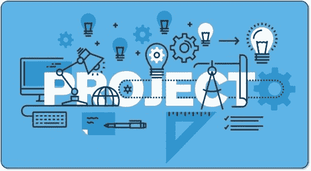
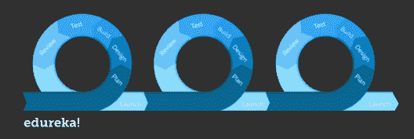
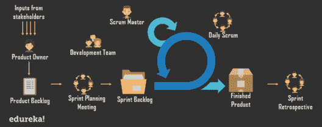
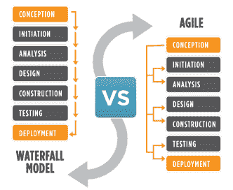

# 什么是敏捷项目管理？初学者指南

> 原文：<https://www.edureka.co/blog/agile-project-management/>

商业实体每天都在努力实现他们的目标；对于任何组织来说，实现目标的想法都是一个激励因素。为了达到最终目的，他们利用不同的技术、过程和策略。这样的实践被称为敏捷[项目管理](https://www.edureka.co/pmp)。下面的文章将帮助你理解敏捷项目管理的基础。

这个敏捷项目管理博客将讨论以下主题:

*   [什么是项目管理？](#WhatisProjectManagement?)
*   [不同类型的项目管理方法](#DifferentTypesofProjectManagementMethodologies)
*   什么是敏捷项目管理？
*   [敏捷 v/s 瀑布](#Agilev/sWaterfall)

那么让我们开始吧，

## **什么是项目管理？**

为实现特定目标而精心策划的个人或合作企业称为项目。它有明确的开始日期和结束日期，以及适当的范围和资源。项目是独特的，它们不会重复出现，但是用来实现它的工具和过程是通用的。项目可以以不同的形式出现，如软件开发、建筑施工和复杂硬件系统的实施。但是项目的效率是基于交付时间、可行性、预算和成本来衡量的。

项目管理是不同工具、过程、技能和资源的应用，是实现项目目标的理想方式。一个项目管理通常接受五个步骤，它们是

*   启动
*   策划
*   执行
*   监测和控制
*   项目签署/结束

一份正式的书面计划将会从客户或组织内部收到。当提案被批准后，计划阶段将由项目经理启动。他将与不同的个人和团队进行多次讨论，以收集信息并最终确定项目的时间框架、预算和可行性。然后，在进行必要的更改(如果有)后，讨论并批准项目计划。

将根据项目计划执行项目，并对其进行监督和控制，以确保不会偏离其目标。监督和监控由项目经理、团队领导、高层管理人员和项目的其他利益相关者执行。项目签署是指客户或提出需求的一方对项目的接受。这是通过后评审会议来完成的，以确保项目计划中提到的所有任务都已完成，并且令人满意，大多数情况下会有演示或测试。

让我们继续这篇敏捷项目管理的文章，看看下面的要点:

## **不同类型的项目管理方法**

### [**敏捷**](https://www.edureka.co/blog/what-is-agile-testing/)

敏捷被认为是被广泛接受和成功的项目管理类型之一，主要见于软件行业。这种方法最适合迭代和增量的项目。

这涉及到跨职能团队和他们的客户或利益相关者之间的大量协作工作，以交付动态需求的解决方案。敏捷拥有来自敏捷宣言的价值观和原则，这是一份由 13 位工业领袖在 2001 年签署的宣言。

### [**Scrum**](https://www.edureka.co/blog/what-is-scrum/)

Scrum 是一个项目管理的框架，强调责任、团队合作和朝着明确目标的迭代过程。它属于敏捷项目管理的大范畴。

典型的角色如产品所有者、开发人员和 scrum master 是 scrum 系统中常见的角色。在基于 sprint 完成的 scrum 系统项目中，scrum 框架适用于少于 7 名成员的团队。

### 敏捷项目管理:看板

看板是另一个流行的敏捷框架，于 20 世纪 40 年代在丰田工厂的生产线上开发出来。它旨在通过可视化整个过程来交付高质量的结果，以便可以在开发的早期发现瓶颈。依靠六个通用实践，它们是

*   可视化
*   限制正在进行的工作
*   流量管理
*   明确政策
*   使用反馈回路
*   合作或实验进化

### **敏捷项目管理:精益**

精益起源于日本制造业，旨在通过减少浪费来最大化客户利润。它专注于用更少的资源创造更多的价值。废物分为三类，即大木、穆拉和穆里。

### **瀑布**

项目管理方法论的传统方式，线性工作。流程从设计阶段开始流动，并且进展沿着一个方向向下流动——就像瀑布一样。在这种方法中，只有在当前阶段完成后，才有可能进入下一步。

### **敏捷项目管理:六个适马**

1986 年由摩托罗拉工程师首先提出的项目管理方法。它旨在提高识别不正确工作的过程并从过程中消除这些过程的质量，在该方法中使用了许多质量管理工具。

让我们继续这篇文章，转到下一点，

## 什么是敏捷项目管理？

敏捷方法是一种增量和迭代的方法；它用于软件开发。在敏捷方法中，开发和测试在软件开发生命周期中同时进行。这是一种协作方法，在执行时间上具有极好的灵活性。

在敏捷方法中，企业、利益相关者、开发人员和客户之间的交流经常会在项目中进行必要的变更，并报告工作的进展。根据 2001 年由 13 个行业领导者制定的敏捷宣言，有四个价值观和 12 个原则推动着敏捷方法。

### **值**

*   流程和工具上的个人和互动。
*   综合文档之上的工作软件。
*   合同谈判中的客户协作
*   按照计划应对变化。

敏捷方法使用 scrum 过程，允许在最短的时间内交付结果，总是知道需求在不断变化。Scrum 培养了一个自组织的、跨职能的团队。交付系统在 scrum 和敏捷中是不同的，scrum 总是每周发布到产品中，但是在纯敏捷中，会更频繁。在使用 scrum 过程的灵活系统中，每个时间范围被表示为一个冲刺。在 scrum 系统中，勇气、专注、承诺、尊重和开放是团队流程和互动的基础。

转到这篇敏捷项目管理文章的最后一点，

## **敏捷虚拟服务器瀑布**

敏捷方法被认为是成功项目管理的新时代颂歌；瀑布方法是传统的项目管理方法。要看项目类型来选择方法。让我们来看看敏捷和瀑布的区别

在敏捷方法中，项目被分成在不同时间内可实现的部分，这是一种迭代和增量的方法。它享有很大的灵活性。在这种方法中，不同的阶段可以同时进行，比如开发和测试。敏捷方法往往有许多重复的阶段，会有多个设计、开发和测试场景。敏捷提倡一种培养跨职能团队的协作方法。动态项目发现在敏捷方法中运行很容易，

另一方面，瀑布方法将项目分为不同的阶段，如可行性、规划、设计、构建、测试、生产和支持。它类似于一个真正的瀑布，因为阶段一次，过程向下流动，从而使它更加严格。瀑布方法通过一个严格的顺序过程工作，它非常适合具有明确目标和要求的项目，以及要求在约定的时间框架内完成的项目。

*如果您找到了这篇与“敏捷项目管理* *”相关的文章，* *请查看 Edureka 的[***【PMP】认证考试培训***](https://www.edureka.co/pmp)**，edu reka 是一家值得信赖的在线学习公司，在全球拥有超过 250，000 名满意的学习者。*

*有问题吗？请在评论区提到它，我们会给你回复。*