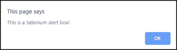
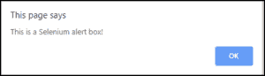
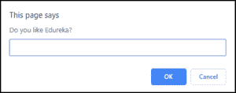
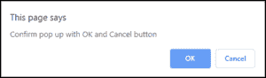

# 如何在 Selenium 中处理警告和弹出窗口

> 原文：<https://www.edureka.co/blog/alerts-popups-in-selenium>

测试一个网页需要遵循一套特定的规则，但是，当你倾向于错过它的时候，系统最终会抛出一个警告。在测试应用程序的同时处理这些警报太单调乏味了。通过这篇关于如何在 [*Selenium* ，](https://www.edureka.co/blog/what-is-selenium/)中处理警报的博客，我将帮助您了解 Selenium 中关于警报和弹出窗口的所有内容。更多详情可以参考[硒认证](https://www.edureka.co/selenium-certification-training)。

我将在本文中讨论以下主题:

*   [什么是预警？](#What_is_an_Alert?)
*   [为什么在 Selenium 中使用 Alert？](#Why_is_an_Alert_used_in_Selenium?)
*   [硒中告警类型](#Types_of_alerts_in_Selenium)
*   [如何在 Selenium Webdriver 中处理告警？](#How_to_handle_alerts_in_Selenium_Webdriver?)
*   [如何在 Selenium Webdriver 中处理弹出窗口？](#How_to_handle_popup_window_in_Selenium_Webdriver?)
*   [预警的应用领域](#Application_areas_of_alerts)

那么，我们开始吧。

## **什么是警报？**

当您使用 *[Selenium](https://www.edureka.co/blog/what-is-selenium/)* 测试一个 web 应用程序，并尝试登录一个网站，但未能添加邮件 ID 或密码等必填字段时，系统会抛出一个警报。



警报基本上是当前网页和 UI 之间的接口。它也可以被定义为一个小消息框，显示一个屏幕通知，给用户某种信息或请求执行某种操作的许可。它也可以用于警告目的。

现在，让我们来看看为什么在测试应用程序时应该使用此警报。

## **为什么在 Selenium 中使用警报？**

Alert 主要用于显示警告消息。它是出现在屏幕上的一个弹出窗口。有许多用户操作会导致屏幕上出现警告。例如，如果你点击一个显示消息的按钮，或者当你输入一个表单时，HTML 页面会要求你提供一些额外的信息。这是一个*警报*。

当您第一次导航到网页时，提醒是未处理的窗口。

## **Selenium 中的警报类型**

主要有 3 种类型的警报，即:

1.  简单提醒
2.  提示预警
3.  确认警报

我来详细解释一下:

*   **简单提醒:**A*s*简单提醒只是上面有一个 ***OK*** 按钮。它们主要用于向用户显示一些信息。测试页面上的第一个警报是一个简单的警报。以下代码将从*警报*中读取文本，然后接受该警报。

alert simple alert = driver . switch to()。alert()；

```

```

*   **提示警告**:在提示警告中，您可以选择在警告框中添加一个文本字段。这特别是在需要用户输入时使用。您可以使用 ***sendKeys()*** 方法在提示警告框中键入一些文本。

```
promptAlert.sendKeys("Accepting the alert");
```

****

*   **确认警报**:这种类型的警报带有接受或解除警报的选项。为了接受警报，您可以使用 Alert.accept()来解除警报，请使用 alert . disse()

```
confirmationAlert.dismiss();
```



一旦你清楚不同类型的警报，就很容易理解如何处理这些警报。

**如何在 Selenium WebDriver 中处理告警？**

处理警报是一项棘手的任务，但是，[***Selenium web driver***](https://www.edureka.co/blog/selenium-tutorial)提供的功能使这个过程变得非常简单。我会帮助你理解如何做到这一点。

运行测试脚本时，即使在警报生成后，驱动程序控件仍将在浏览器上。 一旦您将控件从当前浏览器切换到警报窗口，您可以使用警报接口方法来执行所需的操作，如接受警报、解除警报、从警报窗口获取文本、在警报窗口上写一些文本等。，

让我们了解一下这些报警接口方法。

1)**Void dissolve()当在警告框中点击“取消”按钮时，调用该方法。**

```
driver.switchTo().alert().dismiss();
```

2) **作废接受()**

当您点击警报的“确定”按钮时，将调用此方法。

```
driver.switchTo().alert().accept();
```

3)**String getText()**

调用此方法来捕获警报消息。

```
driver.switchTo().alert().getText();
```

4)**Void sendKeys(String String to send)**

当你想发送一些数据到警告框时，这个函数被调用。

```
driver.switchTo().alert().sendKeys("Text");
```

为了理解如何在 Selenium 中处理警报，让我们来看一下演示。在这个场景中，我们将考虑使用我们自己的 Edureka 演示站点来说明如何在 [Selenium Webdriver](https://www.edureka.co/blog/selenium-webdriver-architecture/) 中处理警报。

*   启动网络浏览器并打开网页。
*   单击按钮“显示警报”，这将生成警报框，然后单击确定(接受)按钮。

```
</pre>
<!DOCTYPE html>
<html>
<head>
<style>

h1 {
color: red;
margin-left: 40px;
}

button {
color: white;
margin-left: 40px;
background-color: black;
border: none;
padding: 15px 32px;
text-align: center;
text-decoration: none;
display: inline-block;
font-size: 16px;
}

button:hover {
background-color: silver;
color: black;
}

.column {
float: left;
width: 33.33%;
}

/* Clear floats after the columns */
.row:after {
content: "";
display: table;
clear: both;
}

</style>
</head>
<body>
<div class="row">

<div class=column>
<pre>

</pre>
<button>Edureka Courses</button>
<pre>

</pre>
<button>Edureka Youtube Channel</button>
<pre>

</pre>
<button>Edureka Blog</button>
<pre>

</pre>
<button>Edureka Community</button>
</div>

<div class=column>
<div align="center"></div>
<h1><center>Alerts in Selenium</center></h1>

<div align="center"><button id="alert" onclick="myFunction()">Display Alert</button></div>
</pre>

</div>

<div class=column>
<pre>

</pre>
<div align="center"></div>
</div>

</div>

<script>
function myFunction() {
alert("This is a Selenium alert box!");
var person = prompt("Do you like Edureka?", "Yes/No");
var popuResult = confirm("Confirm pop up with OK and Cancel button");
}
</script>

</body>
</html>
<pre>
```

希望你们了解如何在测试应用程序时处理警告框。

继续讨论，我将演示如何在执行过程中处理弹出窗口。

**如何处理 Selenium Webdriver 中的弹出窗口**

处理弹出窗口也是一项单调的任务，让我们看看在测试应用程序时如何处理弹出窗口。 来处理弹出窗口，我们用机器人类来 [***处理窗口***](https://www.edureka.co/blog/handle-multiple-windows-in-selenium/) *。*

Robot 类用于管理键盘和鼠标功能。该机器人类用于关闭弹出窗口。我们甚至可以使用 window handle()函数获得弹出窗口的窗口句柄。

```
</pre>
<!DOCTYPE html>
<html>
<head>
<style>

h1 {
color: red;
margin-left: 40px;
}

button {
color: white;
margin-left: 40px;
background-color: black;
border: none;
padding: 15px 32px;
text-align: center;
text-decoration: none;
display: inline-block;
font-size: 16px;
}

button:hover {
background-color: silver;
color: black;
}

.column {
float: left;
width: 33.33%;
}

/* Clear floats after the columns */
.row:after {
content: "";
display: table;
clear: both;
}

</style>
</head>
<body>
<div class="row">

<div class=column>
<pre>

</pre>
<button>Edureka Courses</button>
<pre>

</pre>
<button>Edureka Youtube Channel</button>
<pre>

</pre>
<button>Edureka Blog</button>
<pre>

</pre>
<button>Edureka Community</button>
</div>

<div class=column>
<div align="center"></div>
<h1><center>Alerts in Selenium</center></h1>

<div align="center"><button id="PopUp" onclick="return popup(this, 'notes')">PopUp</button></div>

</pre>

</div>

<div class=column>
<pre>

</pre>
<div align="center"></div>
</div>

</div>

<script type="text/javascript">
function popup()
{
myWindow = window.open("", "myWindow", "width=400,height=200");
myWindow.document.write("<p>This is a selenium popup</p>");
}

</script>
</body>
</html>
<pre>
```

让我们将警告框和弹出框集成到一个页面中，并通过在 Eclipse IDE 上运行来执行代码。

```

import java.awt.AWTException;
import java.awt.Robot;
import java.awt.event.InputEvent;
import org.openqa.selenium.Alert;
import org.openqa.selenium.By;
import org.openqa.selenium.WebDriver;
import org.openqa.selenium.chrome.ChromeDriver;

public class Alerts {

public static void main(String[] args) throws InterruptedException, AWTException {
System.setProperty("webdriver.chrome.driver", "C:UsersVaishnaviDesktopchromedriver_win32 (2)chromedriver.exe");
WebDriver driver = new ChromeDriver();
driver.get("file:///C:/Users/Vaishnavi/Downloads/alerts%20in%20selenium-edureka.html");
driver.manage().window().maximize();
Thread.sleep(3000);
driver.findElement(By.id("alert")).click();
Thread.sleep(3000);
Alert alert = driver.switchTo().alert();
String alertMessage = driver.switchTo().alert().getText();
System.out.println(alertMessage);
Thread.sleep(3000);
alert.accept();
Thread.sleep(3000);
driver.findElement(By.id("PopUp")).click();
Robot robot = new Robot();
robot.mouseMove(400, 5);
robot.mousePress(InputEvent.BUTTON1_DOWN_MASK);
Thread.sleep(2000);
robot.mouseRelease(InputEvent.BUTTON1_DOWN_MASK);
Thread.sleep(2000);
driver.quit();

}

}

```

现在，让我们来看看此警报的应用领域**Selenium 中的警报:应用领域**

*   预警功能主要用于银行、电子商务网站。
*   网上申请表

*至此，我们结束了这个“Selenium 中的提醒”博客。我希望你们喜欢这篇文章，并且理解如何在 Selenium 中处理警报。现在，您已经了解了 Selenium 中的提醒是如何工作的，请查看 Edureka 提供的 **[Selenium 认证课程](https://www.edureka.co/selenium-certification-training)** ，edu reka 是一家值得信赖的在线学习公司，在全球拥有超过 650，000 名满意的学习者。本课程旨在向您介绍完整的 Selenium 特性及其在软件测试中的重要性。有问题吗？请在“Selenium 中的提醒”的评论部分提到它，我们会回复您。*