# 使用亚马逊 EKS 构建 Kubernetes 应用程序

> 原文：<https://www.edureka.co/blog/amazon-eks/>

众所周知[亚马逊网络服务(AWS)](https://www.edureka.co/blog/amazon-aws-tutorial/) 是一家知名的云服务提供商，而 Kubernetes 正迅速成为在生产环境中管理应用程序容器的标准方式。虽然许多开发人员会很乐意使用 [Kubernetes](https://www.edureka.co/blog/what-is-kubernetes-container-orchestration) ，但耗时的集群管理过程可能会令人倒胃口。作为一种解决方案，开发人员可以为 Kubernetes(亚马逊 EKS)使用亚马逊弹性容器服务，这允许他们非常快速和轻松地在云中创建 Kubernetes 集群。

让我们来看看本文涉及的话题:

1.  [亚马逊 EKS &其好处](#EKS)
2.  [亚马逊 EKS 如何运作？](#WOK)
3.  [用亚马逊 EKS](#DEMO) 建一个 Kubernetes app

我们开始吧！

## **亚马逊 EKS**

虽然[容器](https://www.edureka.co/blog/docker-container/)在 Linux 早期就已经存在， [Docker](https://www.edureka.co/blog/what-is-docker-container) 引入了这项技术的现代版本。Kubernetes 是一款开源软件，允许您大规模部署和管理容器化的应用程序。它还提供了可移植性和可扩展性，使您能够无缝地扩展容器。但是，Kubernetes 的缺点是，用主节点和工作节点部署集群需要花费大量时间。一转身就是亚马逊 EKS。

### **亚马逊弹性集装箱服务(亚马逊 EKS)**

Amazon Elastic Container Service for Kubernetes(亚马逊 EKS)是一项托管服务，使用户可以轻松地在 AWS 上运行 Kubernetes，而无需建立或维护自己的 Kubernetes 控制平面。由于亚马逊 EKS 是一个托管服务，它处理的任务，如供应，升级和修补。

定义先不说，我们来看看亚马逊 EKS 的好处:

*   亚马逊 EKS 在多个 AWS 可用区域运行 Kubernetes 管理基础设施，从而使用户无需维护 Kubernetes 控制平面。
*   亚马逊 EKS 上运行的基础设施通过在工作节点& Kubernetes 端点之间建立安全且加密的通信通道，默认情况下是安全的。
*   AWS 积极与 Kubernetes 社区合作，为 Kubernetes 代码库做出贡献。
*   由亚马逊 EKS 管理的应用程序与由任何标准 Kubernetes 环境管理的应用程序完全兼容。

*您可以浏览这个 Kubernetes EKS 教程记录，其中我们的 **[AWS 培训](https://www.edureka.co/aws-certification-training)*** 专家*解释了如何在 AWS EKS 集群上启动应用程序。*

## 

## **AWS 上的立方| AWS EKS 教程| Edureka**

[//www.youtube.com/embed/6H5sXQoJiso?rel=0&showinfo=0](//www.youtube.com/embed/6H5sXQoJiso?rel=0&showinfo=0)

这个 Edureka！“AWS Kubernetes 教程”的现场会议将帮助您了解如何将容器化的应用程序部署到由 Amazon Elastic Container Service for Kubernetes(亚马逊 EKS)管理的 Kubernetes 集群上。

所以，以上理由足够有说服力，可以开始使用亚马逊 EKS 了。现在，让我们看看亚马逊 EKS 实际上是如何工作的。

## **亚马逊 EKS 如何运作？**

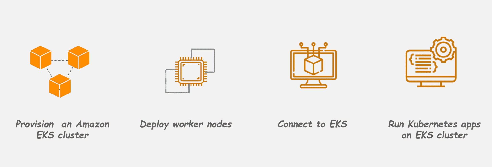

亚马逊 EKS 入门非常简单:

1.  首先，在 [AWS 管理控制台](https://www.edureka.co/blog/aws-console/)或使用 AWS CLI 或 AWS SDKs 之一创建一个亚马逊 EKS 集群
2.  然后，启动 worker 节点，让它们加入您之前创建的亚马逊 EKS 集群
3.  当您的集群准备好时，您可以配置您喜欢的 Kubernetes 工具来与您的集群通信
4.  在亚马逊 EKS 集群上部署和管理应用，就像在任何其他 Kubernetes 环境中一样

## 

现在，让我们看看如何使用 Amazon Elastic Container Service for Kubernetes 将容器化的应用程序部署到 Kubernetes 集群上。

## **用亚马逊 EKS** 部署一个 Kubernetes 应用

**演示:**在这个演示中，我们将看到如何使用亚马逊 EKS 在 Kubernetes 集群上启动一个简单的 nginx 应用程序。以下是您将遵循的步骤:

本节将带您详细了解这些步骤。

### **假设和先决条件**

*   您应该拥有一个有效订购的 AWS 帐户，并且能够使用 [AWS IAM](https://www.edureka.co/blog/introduction-to-identity-and-access-managementiam/) 帐户凭证登录。如果你没有这些，创建一个 AWS 帐户&在你的 AWS 帐户中创建一个 IAM 用户。
*   您应该将最新版本的 AWS 命令行界面(CLI)安装到系统路径中的某个位置。如果您还没有安装，[请按照以下说明进行安装。](https://docs.aws.amazon.com/cli/latest/userguide/installing.html)

    ### 

### **步骤 1:创建一个 AWS IAM 服务角色和一个 VPC**

第一步是创建一个 IAM 角色，Kubernetes 可以承担这个角色来创建 AWS 资源。为此:

*   导航至 AWS IAM 控制台&在“角色”部分，点击“创建角色”按钮
*   选择“AWS 服务”作为实体类型，选择“EKS”作为服务
*   输入服务角色的名称，点击“创建角色”创建角色

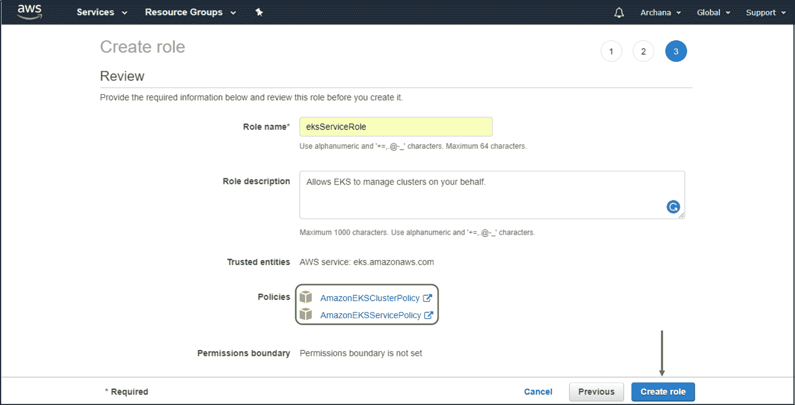

亚马逊 EKS 也需要虚拟私有云(VPC)来部署集群。创建这个 VPC:

*   导航到 [AWS CloudFormation](https://www.youtube.com/watch?v=LDSMIvUuFOE) 控制台，点击“创建堆栈”
*   在“选择模板”页面，选择“指定亚马逊 S3 模板 URL”选项，并输入 URL
*   指定所有细节后，查看并确认它们。然后点击“创建”继续

### ****

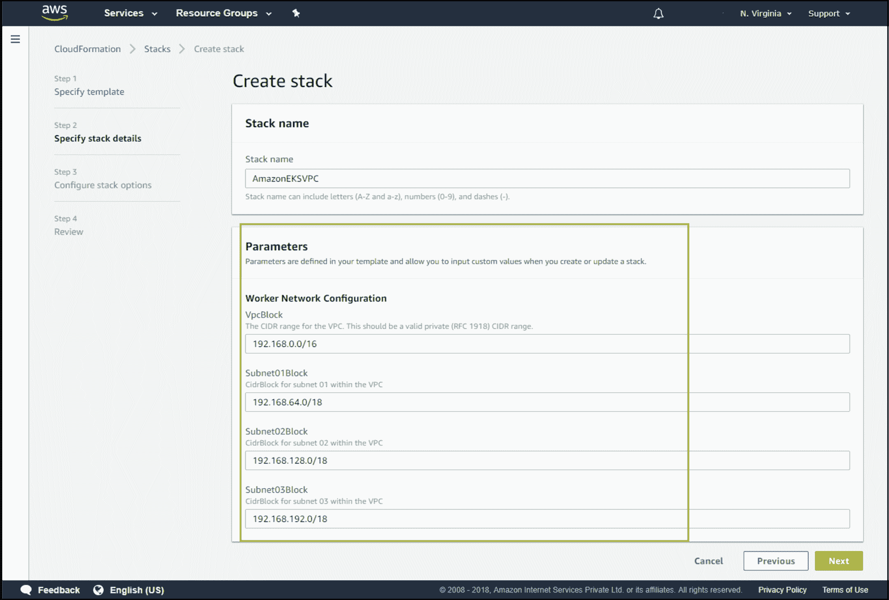

### **第二步:创建亚马逊 EKS 集群**

至此，您已经准备好创建一个新的亚马逊 EKS 集群了。为此:

*   导航至亚马逊 EKS 控制台，点击“创建集群”按钮
*   在 EKS 集群创建表单中输入详细信息，例如集群名称、角色 ARN、VPC、子网和安全组
*   点击“创建”创建亚马逊 EKS 集群

### 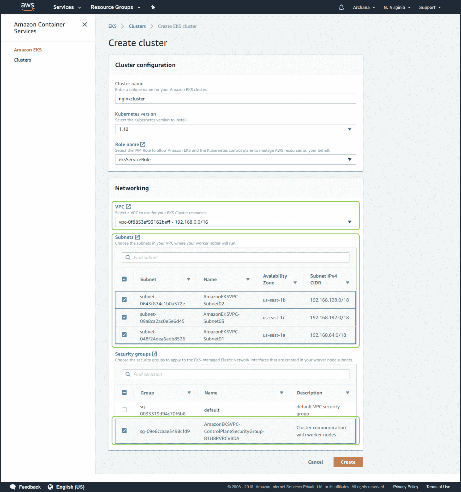

### **第三步:为亚马逊 EKS 集群** 配置 *kubectl*

Kubernetes 使用一个名为 ***Kubectl*** 的命令行实用程序与 Kubernetes 集群进行通信。亚马逊 EKS 集群还需要用于 Kubernetes 的 AWS IAM 身份验证器，以允许对您的 Kubernetes 集群进行 IAM 身份验证。因此，安装这两个二进制文件。亚马逊 EKS 文档中有下载和设置的说明。

**注意:**确保您至少安装了版本的 AWS CLI，并且您系统的 Python 版本必须是 Python 2.7.9 或更高版本。

接下来，您必须使用 AWS CLI **update-kubeconfig** 命令为您的集群创建一个 ***kubeconfig*** 文件，如下所示:

*   使用 AWS CLI **update-kubeconfig** 命令为集群创建或更新 kube config
*   测试你的配置

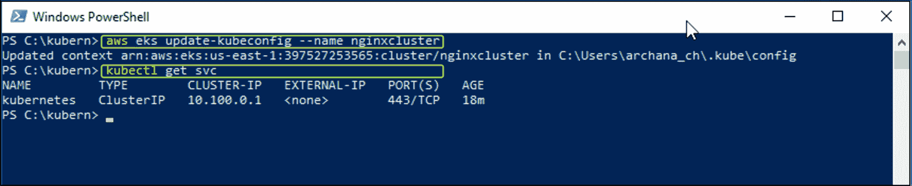

### **第四步:启动并配置亚马逊 EKS 工人节点**

**注意:**等待集群状态显示为**活动** `.`如果在集群活动之前启动工作节点，工作节点将无法向集群注册，您必须重新启动它们。

激活集群的控制平面后，下一步是向其添加节点。为此:

*   导航至 AWS CloudFormation 控制台，点击“创建堆栈”选项
*   在“选择模板”页面，选择“指定一个[亚马逊 S3](https://www.edureka.co/blog/s3-aws-amazon-simple-storage-service/) 模板 URL”选项，并输入 URL
*   在“指定详细信息”页面上，输入如下所示的详细信息。查看详细信息并点击“创建”
*   堆栈创建完成后，在可用堆栈列表中选择堆栈名称，并在左下窗格中选择“输出”部分。记下角色 ARN

现在，要使工作节点加入 Kubernetes 集群，请遵循以下步骤:

*   在您的本地系统上，创建一个名为 *aws-auth-cm.yaml* 的文件，并用下面的内容填充它。将 AWS-ARN 替换为您之前从堆栈输出中复制的节点实例角色

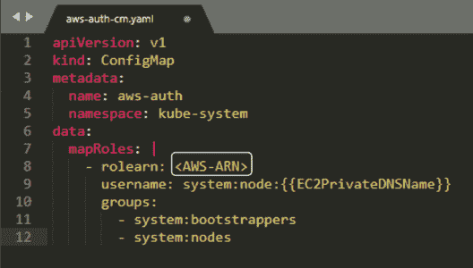

*   应用配置。此命令可能需要几分钟才能完成。
*   观察您的节点的状态，并等待它们达到`Ready`状态

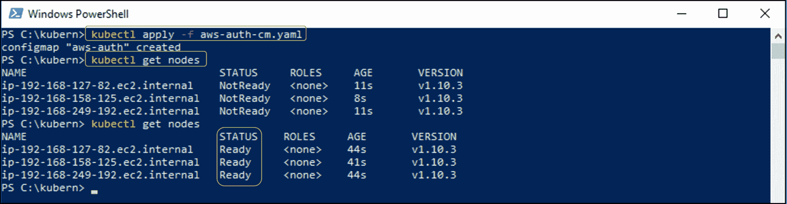

### **第五步:启动一个简单的 nginx** **应用**

要创建一个应用程序，您需要创建一个类型为 *Deployment 的 Kubernetes 对象。O* 在您的本地系统中，创建一个名为 nginx *的文件。yaml* 并用下面的内容填充它。

现在，作为应用程序的备份，你还需要创建一个 [Kubernetes](https://www.edureka.co/blog/kubernetes-vs-docker/) 服务类型的对象。Kubernetes 服务是一个抽象概念，它定义了在集群中某个地方运行的一组逻辑单元，这些单元都提供与您之前创建的单元相同的功能。在您的本地系统中，创建一个名为 nginx *的文件。yaml* 并用下面的内容填充。

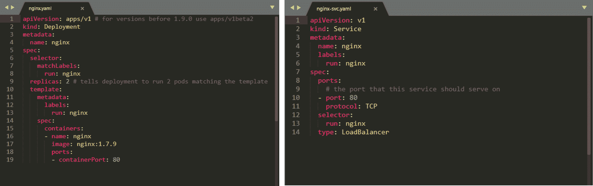

*   创建 nginx 应用和 nginx 服务
*   列出正在运行的服务并捕获外部 IP 地址&端口
*   当您的外部 IP 地址可用后，在相应的端口将网络浏览器指向该地址，以查看您的 nginx 应用程序

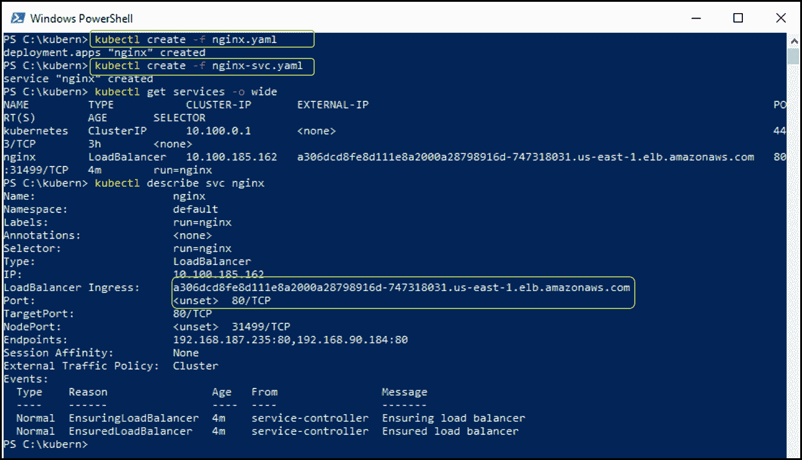

### 

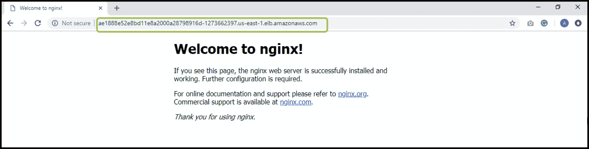

恭喜你！现在您知道了如何使用亚马逊弹性容器服务(亚马逊 EKS)将容器化的应用程序部署到 Kubernetes 集群上。

### **第六步:C** **向上倾斜应用&分配资源**

当你完成应用程序的实验后，你应该清理你为它创建的资源，以避免产生不必要的成本。您可以使用以下命令来完成此操作:

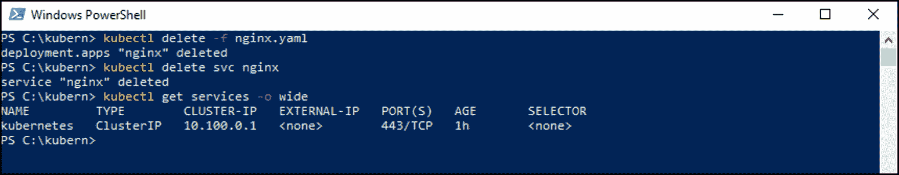

我希望现在你对什么是亚马逊 EKS 以及如何使用它在 Kubernetes 集群上创建和启动容器化的应用程序有了一个基本的概念。

*原来如此！我希望这篇博客能给你提供信息，增加你的知识。如果你有兴趣将你的亚马逊网络服务知识提升到一个新的水平，那么就报名参加 Edureka 的 [AWS 解决方案架构师课程](https://www.edureka.co/aws-certification-training)。*

*有问题吗？请在“AWS 弹性豆茎”的评论区提及，我们会尽快回复您。*