# Amazon Route 53:关于基于延迟的路由您需要知道的一切

> 原文：<https://www.edureka.co/blog/amazon-route-53/>

在这个互联网和数字数据时代，我们看到大量在线数据被生成和消费。它带来了巨大的在线流量。因此，对于在线平台来说，管理这种流量并更好更快地为客户服务变得非常重要。这篇亚马逊 Route 53 ( [AWS](https://www.edureka.co/blog/amazon-aws-tutorial/) Route 53)教程将帮助你理解并实现上述做法。

本文主要关注以下几点:

*   [亚马逊 53 号公路](#AmazonRoute53)
*   [路由类型](#TypesOfRouting)
*   [延迟路由策略](#LatencyRoutingPolicy)
*   [演示:路由一个样本网站](#Demo:RoutingASampleWebsite)

所以让我们用下面的服务来学习亚马逊 53 号路线教程，

## **亚马逊 53 号公路**

它是一种可扩展的 (DNS)服务，提供了一种可靠的方式将流量  重定向到应用程序。为了实现这一点，域名被转换成 IP 地址，以帮助计算机更好地连接。使用 Amazon Route 53 可以将查询连接到 AWS 中的弹性负载平衡器之类的实体。因此，开发者可以将域名映射到  S3 桶或其他资源。有了 Amazon Route 53，企业可以轻松监控和路由全球数据流量。简单来说，53 号干线主要有三个用途

*   DNS 注册
*   路由互联网流量
*   检查健康状况

现在让我们继续这个亚马逊路线 53 教程，看看下一个主题，

## **路由类型**

Amazon Route 53 使用不同的路由策略来路由全球通行的流量。这是相同的列表，

*   简单路由
*   基于延迟的路由
*   故障转移路由
*   地理定位路由
*   地理邻近路径(仅交通流量)
*   多值应答路由
*   加权路由

在这篇关于 Amazon Route 53 教程的文章中，我们将重点关注延迟路由策略

## **延迟路由策略**

绩效在网站的成功中扮演着重要的角色。一个网站的响应时间和它的流量有直接的关系。据谷歌报道，

*   Pinterest 减少了 40%的感知等待时间，增加了 15%的搜索引擎流量和注册人数
*   英国广播公司发现，他们的网站每多加载一秒钟，就会多失去 10%的用户

如果一个网站或 CRM 应用程序拥有来自多个地点的客户，那么该网站可以跨多个 AWS 区域安装或托管。对网站的任何请求都可以从 AWS 区域得到服务，这提供了最低的延迟以提高整体客户满意度。该功能由“延迟路由策略”提供，它是 AWS Route53 服务 的一部分。

让我们进入亚马逊 53 号公路教程的最后一章，

## **演示路由一个样本网站**

在本教程中，我们将在两个不同的地区(比如北弗吉尼亚和孟买)建立一个简单的静态网站，然后使用一个域名访问该网站，注意我们会被自动重定向到最近的 AWS 地区。选择地区时的模式是，其中一个地区应该是离你最近的，另一个地区应该像对跖地一样朝向世界的另一端。

以下是相同的高级步骤序列。此外，整个演示可以在 AWS 免费层中完成。

1.  从 Freenom 创建一个免费域名
2.  在不同的 AWS 区域创建两个 Ubuntu EC2 实例
3.  安装 Apache web 服务器并创建一个简单的静态网站
4.  将 Route53 配置为“延迟路由策略
5.  将 Route53 中的名称服务器添加到 Freenom
6.  测试整个设置。

**先决条件是什么？**

*   在北弗吉尼亚和孟买地区访问两个正在运行的 Ubuntu EC2 实例(在一个地区选择可用区域并不重要)。t2.micro 类型的 EC2 实例应该足够好，因为我们将安装一个简单的静态网站，好的方面是 t2.micro 也属于 AWS 自由层 。Edureka 教程[Amazon Elastic Compute Cloud](https://www.edureka.co/blog/ec2-aws-tutorial-elastic-compute-cloud/)中提到了创建 EC2 实例的过程以及如何连接它们。

*   确保为 AMI 选择最新的 Ubuntu。还要确保端口 80 (http)和端口 22 (ssh)在安全组中是打开的
*   必须从官方 [文档](https://my.freenom.com/knowledgebase.php?action=displayarticle&id=28) 中提到的 Freenom 创建一个自由域。任何域提供商提供的现有域名也可以在本教程中使用，但是本教程中的步骤适用于从 Freenom 创建的域。

#### **第一步:安装网络服务器，在 Ubuntu 上创建一个简单的静态网站**

使用 Putty 或其他软件登录到两个 Ubuntu 服务器，发出以下命令安装 web 服务器并创建一个静态网站。

**步骤 1.1:** 成为 root 用户执行后续命令。

`*sudo su*`

**步骤 1.2:** 获取软件列表

`*apt-get update*`

**步骤 1.3:** 安装 Apache webserver 及其依赖项并启动。

`*apt-get install apache2**service apache2 start*`

**步骤 1.4:** 在/var/www/html 文件夹下创建一个静态网页‘index . html’。

`*cd /var/www/html**echo “I am in Mumbai” > index.html*`

就这样，你几乎有了一个可以使用的网站，

**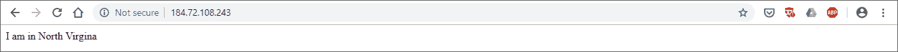**

对于北弗吉尼亚服务器，将字符串改为“我在北弗吉尼亚”。通常，同一组网页将被部署在所有区域。但是，为了区分 Route53 重定向到哪个 AWS 区域，有必要在每个服务器上有不同的网页。

**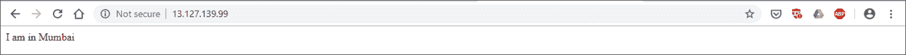**

**步骤 1.5:** 在浏览器中键入 EC2 服务器的 IP 地址，确保网站启动并运行。

#### **步骤 2:为基于延迟的路由策略配置 Route53(亚马逊 Route 53 教程)**

根据关于 [托管区域定价](https://aws.amazon.com/route53/pricing/) 的 AWS 文档，创建 托管区域不需要额外费用。 如果从创建之日起 12 小时内删除相同内容。

**步骤 2.1:** 进入 AWS 管理控制台，查找 Route53 服务，点击 DNS 管理下的“立即开始”。

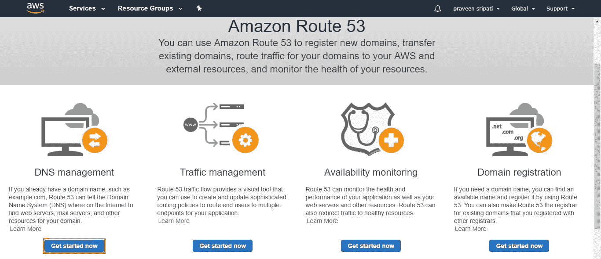

**步骤 2.2:** 点击“创建托管区”，输入在 Freenom 中创建的域名，点击创建。

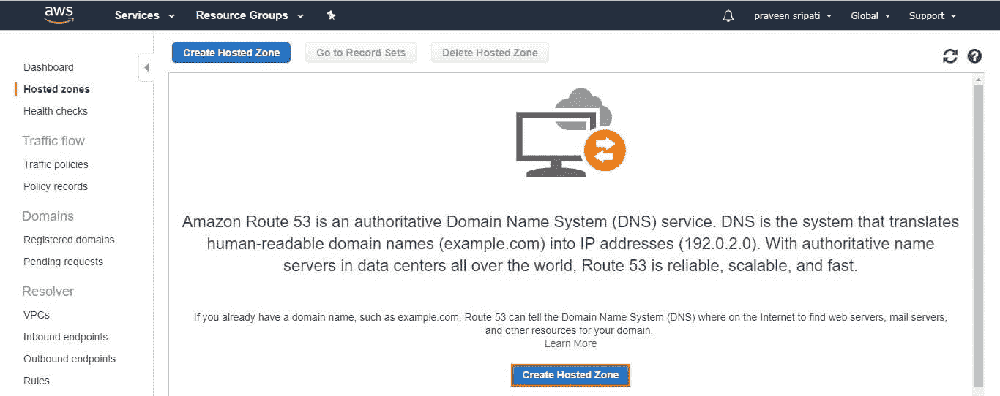

托管区域应已创建，名称服务器应如下所示。我们稍后将在 Freenom 控制台中使用相同的方法。

**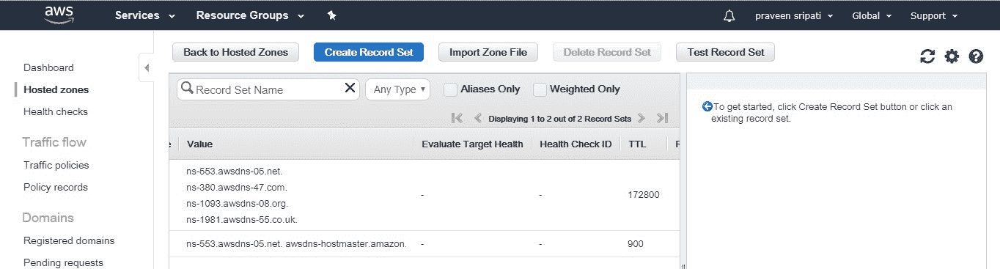**

**步骤 2.3:** 为每台 Ubuntu 服务器点击一次“创建记录集”，并指定如下所示的详细信息。请注意，值字段中提到的 IP 地址是 EC2 实例的 IP 地址。此外，两个记录的名称应该相同(在本例中为 test ),两个记录的“SET ID”应该不同。

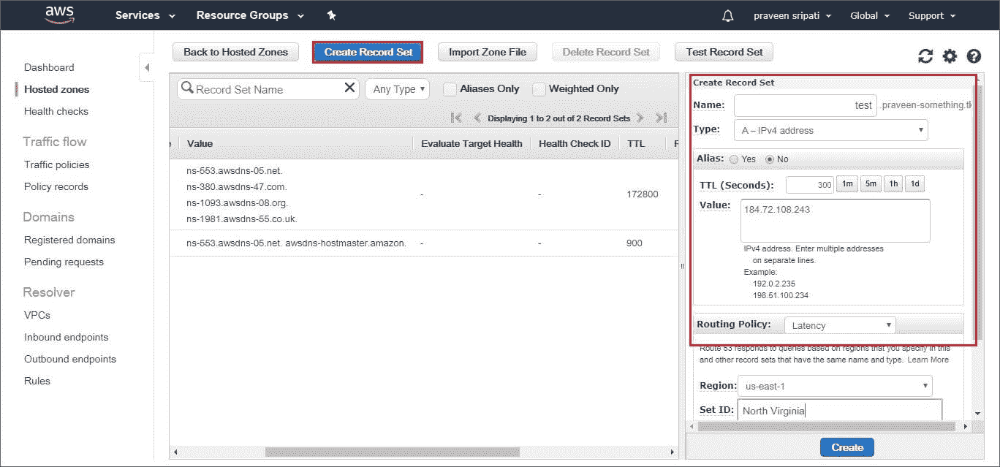

最后，名称记录应该如下所示。

**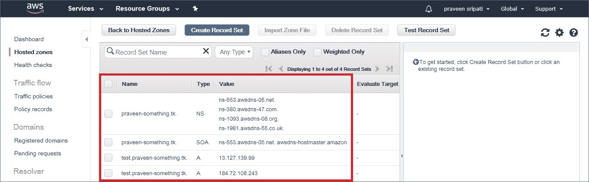**

#### **步骤 3:将 Route53 的域名服务器添加到 Freenom** **(亚马逊 Route 53 教程)**

来自 Route53 托管区域的名称服务器详细信息应添加到之前创建的 Freenom 域名中，这将使 Freenom 能够将域名解析为 IP 地址。

**步骤 3.1:** 在浏览器中导航至 [Freenom](https://my.freenom.com/clientarea.php) ，进入“服务- >我的域名”。将显示所有当前拥有的域。点击“管理域”进行更改。

**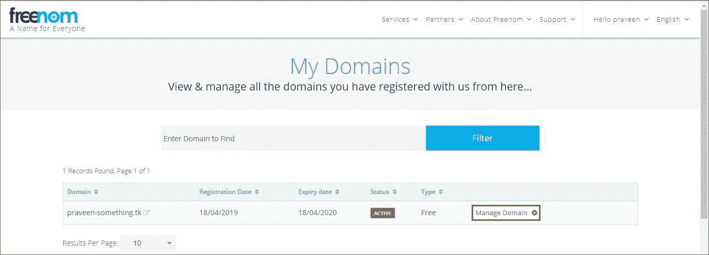**

**步骤 3.2:** 转到“管理工具- >名称服务器”并选择“使用自定义名称服务器”。

**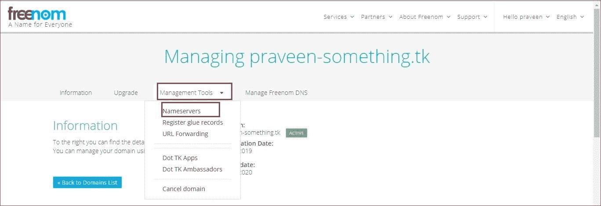**

**步骤 3.3:** 输入从 AWS Route53 托管区域接收的名称服务器，点击“更改名称服务器”完成 Freenom 中的设置。

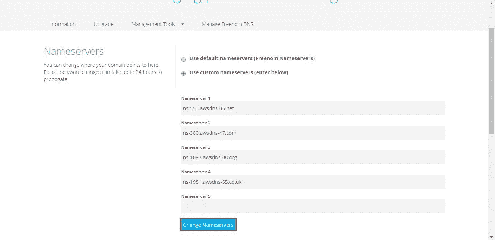

如果该域名已经在 GoDaddy 注册，则按照 [官方说明](https://in.godaddy.com/help/set-custom-nameservers-for-domains-registered-with-godaddy-12317) 设置自定义域名服务器。以上步骤是针对 Freenom 的。

**步骤 4:测试整个设置**

现在整个设置已经完成。在浏览器中输入域名的 URL，Route53“延迟路由策略”应根据最佳延迟自动重定向到网页。由于本教程是在印度编写的，我们会自动重定向到孟买 AWS 区域，如下所示，

**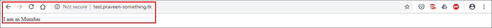**

在本教程中，我们注意到“延迟路由策略”会根据延迟时间将用户重定向到该区域，最终为客户提供最佳体验。这种方法的唯一问题是 web 服务器必须跨多个区域复制，这导致了额外的成本。

在接下来的教程中，我们将了解“加权路由策略”,它允许流量根据 EC2 实例的大小按比例重新路由。现在在你离开之前，m 确保删除作为本教程的一部分而创建的资源，因为免费层之外的资源是有成本的。

伙计们，这就把我们带到了这篇关于亚马逊 53 号路线教程的文章的结尾。如果您希望获得这方面的专业知识，Edureka 已经提供了一套课程，该课程完全涵盖了您通过解决方案架构师考试所需的内容！你可以看看 **[AWS 解决方案架构师认证培训](https://www.edureka.co/aws-certification-training)** 的课程详情。

如果您对本博客有任何疑问，欢迎在下面的评论区提问，我们将非常乐意尽快回复您。