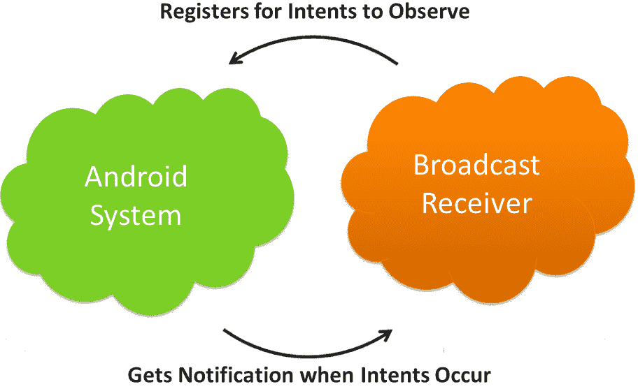
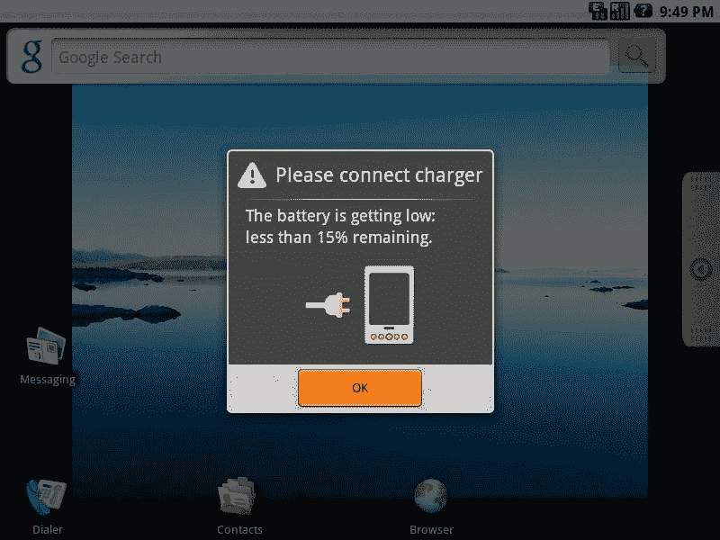
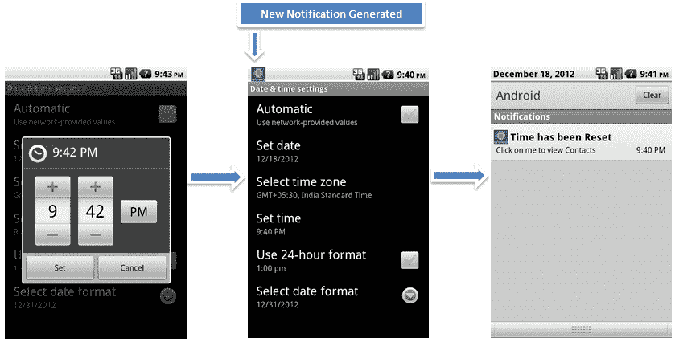

# Android 广播接收器:初学者教程- 5

> 原文：<https://www.edureka.co/blog/android-tutorials-broadcast-receivers/>

这是我们 Android 初学者教程系列的第五篇，讨论 Android 系统的另一个非常重要的组件: **Android** ***广播接收器*** 。我们希望您已经阅读了本系列之前的 Android 教程！如果没有，这里分别是: [活动](https://edureka.co/blog/android-tutorials-for-beginners-activity-component/ "Android Tutorials Activity component") ， [意图](https://edureka.co/blog/android-tutorials-intent-component/ "Android Tutorials Intent") ， [服务](https://edureka.co/blog/android-tutorials-beginners-service-component/ "Android Tutorials Service component") ， [内容提供者](https://edureka.co/blog/beginner-android-tutorials-content-provider/ "Android Tutorials Content Provider") 。对于 Android 的基本概念有一个基层的清晰认识，你可以追求这个 ***[在线 Android 认证培训](https://www.edureka.co/android-development-certification-course)*** ，了解每个&技术的每一个细微差别。

在本 Android 教程的最后，给出了一个 Android 广播接收机的例子和示例代码。[在这里下载代码](https://www.edureka.co/blog/android-tutorials-broadcast-receivers/ "Code for Broadcast Receiver")！

## **什么是安卓广播接收机？**

广播接收器是 Android 系统的休眠组件。只有一个意图(它是为这个意图而注册的)才能将它付诸行动。广播接收器的工作是在特定事件发生时向用户发送通知。

使用广播接收器，应用程序可以注册特定的事件。一旦事件发生，系统将通知所有注册的应用程序。

[](https://www.edureka.co/blog/android-tutorials-broadcast-receivers/)

例如，一个广播接收器触发了你在手机屏幕 上看到的 ***电池电量低通知。***

由广播接收器引起的其他实例是 ***新朋友通知、新朋友馈送、新消息*** 等。在你的脸书应用上。

事实上，你随时都可以看到广播接收机在工作。**通知，如*传入消息*** 、 ***WiFi 激活/停用消息*** 等。都是 Android 系统和应用程序中正在发生的事情的实时公告。

[](https://www.edureka.co/blog/android-tutorials-broadcast-receivers/)

考虑一下这个:

你要参加一个重要的社交聚会。由于你的记忆力不好，你要求你的朋友在活动前一天通知你。现在，因为你已经“注册”了这位朋友的帮助，你会收到他的提醒。这大概就是广播接收机的工作原理。

我们在这篇 Android 教程的最后还讨论了一个例子(在这个例子中，一旦系统时间改变，就会生成一个通知)。

#### **正确实施广播接收机有多重要？**

如果你想创建一个好的 Android 应用程序，这是最重要的。如果广播事件不能很好地完成它们的工作(发送通知来支持应用程序的主要任务)，那么应用程序就不会是直观的和用户友好的。

#### **广播接收机的注册**

注册广播接收器有两种方式:一个是静态的，另一个是动态的。

1) **Static:** 在您的清单文件中使用< receiver >标签。(AndroidManifest.xml)

2) **动态:**使用 Context.registerReceiver()方法动态注册实例。

#### **广播类别**

两大类广播是:

**1)** **有序广播:**这些广播是同步的，因此遵循特定的顺序。使用 **android: priority 属性**定义顺序。具有更高优先级的**接收器将首先接收广播**。如果存在具有相同优先级的接收器，则广播将不会遵循顺序。每个接收器(当它接收到广播时)可以将通知传递给下一个接收器，或者完全中止广播。在中止时，通知不会传递给队列中的下一个接收者。

**2)** **正常播出:**正常播出是**不有序**。因此，注册的接收器通常同时运行。这非常有效，但是**接收器不能利用结果**。

有时为了避免系统过载，系统一次传送一个广播，即使在正常广播的情况下也是如此。然而，接收者仍然不能使用结果。

#### **活动意图和广播意图的差异**

你必须记住，广播的意图不同于用来开始一项活动或一项服务的意图(在以前的 Android 教程中讨论过)。用于启动活动的意图对用户正在交互的操作进行更改，因此用户知道该过程。然而，在广播意图的情况下，操作完全在后台运行，因此对用户是不可见的。

#### **实现广播接收机**

您需要按照以下步骤来实现广播接收器:

**1)** **创建 Android 的 BroadcastReceiver 的子类**

**2)实现 onReceive()方法:**为了发送通知，必须实现 onReceive()方法。每当接收方注册的事件发生时，调用 onReceive()。例如，在电池电量低通知的情况下，接收器被注册为 Intent。动作 _ 电池 _ 电量低事件。一旦电池电量低于定义的水平，就调用这个 onReceive()方法。

下面是 onReceive()方法的两个参数:

*   **上下文:**这用于访问附加信息，或者启动服务或活动。
*   **Intent:**Intent 对象用于注册接收方。

#### **安全**

由于广播接收机有一个全球性的工作空间，因此安全性是非常重要的考虑因素。如果您没有为注册的接收者定义限制和过滤器，其他应用程序可能会滥用它们。以下是一些可能有帮助的限制:

*   每当您在应用程序的清单中发布接收器时，请使用***Android:exported = " false "***使其对外部应用程序不可用。您可能会认为在发布接收者时指定意图过滤器会为您完成任务，但实际上它们还不够。
*   当您发送广播时，外部应用程序也有可能接收到它们。这可以通过指定一些限制来避免。
*   同样，当您使用 **registerReceiver** 注册您的接收器时，任何应用程序都可以向其发送广播。这也可以使用权限来防止。

***(PS:从 Android 3.1 开始，Android 系统不会接收到任何外界的意图，所以现在系统是比较安全的。)***

#### **长时间操作**

广播接收器对象仅在 onReceive(上下文，意图)期间有效。因此，**如果接收到通知后需要允许一个动作的服务应该被**触发，而不是广播接收者。

*   要显示一个对话框，那么您应该使用 **NotificationManager API**
*   如果您希望发送一个即使在广播完成后仍然存在的广播意图，您必须使用**sendStickyBroadcast(Intent)**方法。

#### **广播接收机示例**

在这个示例应用程序中，当您更改系统时间时，会生成一个通知。单击通知会将用户引向联系人。应用程序是这样工作的:

[](https://www.edureka.co/blog/android-tutorials-broadcast-receivers/)

#### **样本代码**

以下是这个广播接收器的示例代码:

```
public class MyBroadcastReceiver extends BroadcastReceiver {

	private NotificationManager mNotificationManager;
	private int SIMPLE_NOTFICATION_ID;

	@Override
	public void onReceive(Context context, Intent intent) {

		mNotificationManager = (NotificationManager) context
				.getSystemService(Context.NOTIFICATION_SERVICE);

		Notification notifyDetails = new Notification(R.drawable.android,
				"Time Reset!", System.currentTimeMillis());

		PendingIntent myIntent = PendingIntent.getActivity(context, 0,
				new Intent(Intent.ACTION_VIEW, People.CONTENT_URI), 0);

		notifyDetails.setLatestEventInfo(context, "Time has been Reset",
				"Click on me to view Contacts", myIntent);

		notifyDetails.flags |= Notification.FLAG_AUTO_CANCEL;
		notifyDetails.flags |= Notification.DEFAULT_SOUND;

		mNotificationManager.notify(SIMPLE_NOTFICATION_ID, notifyDetails);
		Log.i("hisham_debug", "Sucessfully Changed Time");

	}

```

### **[你对这个安卓教程有什么疑惑吗？问我们！](https://www.edureka.co/android-development-certification-course "get started with Android Development")**

我们希望你喜欢在这些基本的 Android 教程中学习 Android 构建模块。即将发布的 Android 教程将会涉及比这更高级的主题！敬请关注！

快乐学习！

*以下资源用于创建本 Android 教程: [**开发者**。](http://developer.android.com/index.html "Android Tutorials Official")**[Edureka.co](https://www.edureka.co/android-development-certification-course "Android tutorials")***

#### **你可能也会喜欢这些相关的帖子:**

*   [Android 教程第六部分:Android 事件监听器](https://www.edureka.co/blog/android-tutorials-event-listeners/ "Android Tutorials Part-6: Android Event Listeners")
*   [安卓初学者教程:安卓意图](https://www.edureka.co/blog/android-tutorials-intent-component/ "Android Tutorials for Beginners-2: Android Intent")
*   [如何创建 Android Widgets:Android 中的 rating bar](https://www.edureka.co/blog/tag/how-to-create-android-widgets/ "How to create Android widgets: RatingBar in Android")
*   [大一新生 5 大安卓面试题](https://www.edureka.co/blog/interview-questions/top-5-android-interview-questions-for-freshers/ "Top 5 Android Interview Questions for freshers")