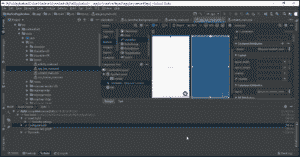

# Android 布局设计教程:你需要知道的一切

> 原文：<https://www.edureka.co/blog/android-ui-design/>

如果你是第一次接触 [*Android 开发*](https://www.edureka.co/blog/android-tutorial/) ，那么你已经找到了开始学习布局设计的绝佳地点。这篇关于 Android 布局设计教程的文章将为你提供一些有用的技巧来做一个更好的 UI 设计，同时也解释了如何设计一个 UI。

我将讨论以下主题:

*   [UI 组件介绍](#Introduction_to_UI_components)
*   [视图](#Views)
*   [布局类型](#Types_of_Layouts)
*   [测量单位](#Units_of_measurement)
*   [演示](#Demo)

那么，我们开始吧！

## **安卓布局设计教程:UI 组件介绍**

谈到 UI 组件，任何 Android 应用程序的典型 UI 都由以下组件组成:

*   主操作栏
*   视图控制
*   内容区域
*   分割动作栏

当你开发一个复杂的应用程序时，这些扮演着重要的角色。当我们到达本文的演示部分时，您将会清楚地看到这一点。

帮助定制 UI 设计的另一个重要因素是视图组件。

让我们看看 *[Android 开发中的一个视图是什么。](https://www.edureka.co/android-development-certification-course)*

## **安卓布局设计教程:** **观点**

一个*视图*被认为是一个合适的用户界面的基本构件，它实际上是从*视图类*中创建的。它占据了屏幕上的一个矩形区域，最终负责绘图和事件处理。

视图是小部件的基类，小部件用于创建交互式 UI 组件，如按钮、文本字段等。现在来谈谈矩形区域或盒子，它可以是一幅图像、一段文本、一个按钮或任何 android 应用程序可以显示的东西。这里的矩形实际上是不可见的，但是每个视图都占据一个矩形形状。

你可能会问，这个矩形有多大？

答案是，您可以通过指定确切的大小(使用适当的单位)或使用一些预定义的值来手动设置它。这些预定义的值是*match _ parent 和 wrap_content。*这个 *match_parent* 表示它将占据设备显示屏上的全部可用空间。然而， *wrap_content* 表示它将只占据显示其内容所需的空间。

现在让我们指出视图和视图组之间的主要区别。

**视图**

1.  *视图*对象是 Android 中 UI 元素的基本构建块。
2.  视图是一个简单的矩形框，它响应用户的动作。
3.  View 指的是 android.view.View 类，是所有 UI 类的基类。
4.  例如编辑文本、按钮、复选框等..

**视图组**

1.  *视图组*是保存视图和视图组的不可见容器。
2.  ViewGroup 是*布局*的基类。
3.  例如，LinearLayout 是包含按钮(视图)的视图组，其他布局也是如此。

现在，让我们继续前进，了解现有的布局。

## **安卓布局设计教程:** **布局类型**

一个**布局**定义了应用程序中用户界面的结构。布局中的所有元素都是使用**视图**和**视图组**对象的层次结构构建的。

现在我们来看看如何声明布局。

您可以通过两种方式声明布局:

*   在 XML 中声明 UI 元素。Android 提供了一个简单的 XML 词汇表，它对应于视图类和子类，比如小部件和布局。

***注意:**您也可以使用 Android Studio 的布局编辑器，通过拖放界面构建您的 XML 布局。*

*   **在** **运行时**实例化布局元素。应用程序可以创建*视图*和*视图组*对象，并以编程方式操作它们的属性。

让我们讨论不同类型的布局。

Android 中的 UI 是视图和视图组的层次结构。视图组将是层次结构中的中间节点，而视图将是终端节点。

*   线性布局
*   绝对布局
*   相对布局
*   表格布局
*   框架布局

我们来详细讨论一下。

**线性布局**

线性布局用于在每行放置一个元素。因此，所有的元素都将被有序地从上到下放置。这是在 Android 上创建表单的一种非常广泛使用的布局。它也可以被称为一个视图组，该视图组将所有子视图沿垂直或水平方向对齐。

**绝对布局**

在绝对布局中，可以指定要放置的每个控件的确切坐标。在这种布局中，您可以给出每个控件的精确 X 和 Y 坐标。它使您能够指定其子节点的确切位置。

**相对布局**

相对布局是一个在相对位置显示子视图的*视图组*。您可以指定元素相对于其他元素或者相对于父容器的位置。

**表格布局**

使用表格布局，您可以创建包含行和列的表格，并在其中放置元素。在每一行中，您可以指定一个或多个元素。你可以使用这个命令 *< TableRow >* 来创建一个新的表格布局。

**框架布局**

当您想要在每个屏幕上显示一个项目时，可以使用框架布局。使用框架布局，您可以拥有多个项目。该框架布局是屏幕上的占位符，可用于显示单个视图。

## **安卓布局设计教程:** **计量单位**

当你在 Android UI 上指定一个元素的大小时，你一定要记住下面的度量单位。

| 单位 | **描述** |
| **dp** | 密度无关像素。 **1dp** 相当于 **160dpi** 屏幕上的一个像素。 |
| **sp** | 缩放独立像素。这与 dp 非常相似，但只是推荐用于指定字体大小。 |
| **pt** | 点。一点被定义为 1/72 英寸。 |
| **px** | 像素。对应于屏幕上的实际像素 |

现在，让我们进入本文的最后一个主题。

## **安卓布局设计教程:** **Demo**

在本演示部分，让我们了解如何在 [Android Studio](https://www.youtube.com/watch?v=ZLNO2c7nqjw) 中使用布局。

请参考 Android Studio 的[逐步安装指南](https://www.edureka.co/blog/android-tutorial/#installation)。

这是布局的样子。只要选择 drawable，你会发现几个类，选择这个 drawable 下的任何其他类。您可以对布局结构进行编码，也可以查看设计并在设计空间中拖放组件。

您可以在组件树下查看您选择的组件。

您也可以在布局中找到这些。

1.  **Palette** :它保存了视图和视图组的列表，您可以将它们拖到您的布局中。
2.  **组件** **树**:由布局的视图层次组成。
3.  **工具栏**:在编辑器中配置布局外观和改变一些布局属性的按钮。
4.  **设计编辑器**:设计或蓝图视图中的布局，或两者。也被认为是设计空间。
5.  **属性**:控制选中视图的属性。

说到这里，我们来结束这篇关于“Android 布局设计教程”的文章。希望你们清楚本教程中与你们分享的内容。敬请关注其他博客，祝你的 Android 开发事业好运。

*既然你已经了解了 Android 布局设计的基础知识，那就来看看 Edureka 的 [**Android** **培训**](https://www.edureka.co/android-development-certification-course)* *吧，edu reka 是一家值得信赖的在线学习公司，拥有遍布全球的 25 万多名满意的学习者。*

*Edureka 的安卓应用开发认证培训课程，是为希望成为安卓开发者的学生和专业人士设计的。该课程旨在让您在 Java 编程方面有一个良好的开端，并训练您掌握核心和高级概念，以及一个希望您在 Android 中创建一个应用程序的项目。*

*有问题吗？请在这个“Android 布局设计教程”博客的评论部分提到它，我们会尽快回复你。*