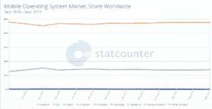
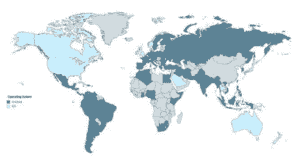

# Android vs iOS:哪个更好？

> 原文：<https://www.edureka.co/blog/android-vs-ios-development/>

Android vs iOS，两大应用开发平台的对决。本文将指导您根据您的组织选择在哪个平台上工作。

我将讨论以下主题:

*   [市场份额](#Market_Share)
*   [要比较的参数](#Parameters_to_compare)
*   [安卓 vs iOS](#Android_vs_iOS)
*   [哪个平台更优越？](#Which_platform_is_superior?)

我们开始吧！

## **市场份额**

说起应用开发， *[安卓](https://www.edureka.co/blog/java-for-android/)* 和 iOS 独占鳌头。这是因为它们的受欢迎程度、效率和客户满意度。更有可能的是，Android 和 iOS 就像一枚硬币的两面。

谈到市场份额，谷歌的 Android 拥有接近 88%的市场份额，这似乎是一个更好的选择，但你能忽视苹果 iOS 平台提供的高货币化前景吗？你能想到的第一个简单的解决方案是，同时开发两个平台，但不是每个公司都有预算。

*来源:[StatCounter](https://gs.statcounter.com/os-market-share/mobile/worldwide)*

你可以在移动开发部分看到 Android 的领先优势。

您还可以看到人口统计数据，想象使用 Android 和 iOS 的客户数量，Android 以 74.45%的比例遥遥领先。这太大了。

现在，我们来看看参数来对比一下 Android 和 iOS。

## **要比较的参数**

以下是我在比较 Android 和 iOS 时会考虑的参数。

*   开发复杂性
*   费用
*   程序设计语言
*   安全性
*   速度

现在，让我们了解这两者之间的主要区别。

## **安卓 vs iOS**

| **参数** | **安卓** | **iOS** |
| **开发复杂度** | 高的 | 低的 |
| **成本** | 由于测试时间更长，成本更高 | 成本更低 |
| **编程语言** | Java 和 Kotlin | 需要 Objective C 或 Swift 进行原生开发 |
| **安全** | 不太安全 | 高度安全 |
| **速度** | 更快意味着下载 | 比安卓快多了 |

## **哪个平台更优越？**

为应用程序开发选择合适的平台取决于用户。尽管用户有选择更适合该组织的一个的眼光。可能有很多 Android 用户，但 iOS 提供的质量和阻力永远无法匹敌。所以，知道自己在开发什么，才能选择合适的平台。说到选择合适的平台，没有什么比这更好的了。

Android 有自己的优势，iOS 也有自己的优势。所以，确保你选择了一个完美的。

说到这里，我们来结束这篇关于“Android vs iOS”的文章。我希望你们清楚讨论的主题。

*现在您已经浏览了我们的 Android vs iOS* *博客，您可以查看 Edureka 的 [Android App 开发认证培训](https://www.edureka.co/android-development-certification-course)* 来快速开始您的学习。

*有什么疑问吗？别忘了在这篇“Android vs iOS”博客的评论中提到他们。我们会回复你的。*