# 如何用 Angular 嵌入和使用 Bootstrap？

> 原文：<https://www.edureka.co/blog/angular-bootstrap/>

创建网站总是令人兴奋的，但创建漂亮的网站才是令人满意的。 [Angular](https://www.edureka.co/blog/angular-tutorial/) 本身就是一个帮助你建立网站的伟大框架。如果你想轻松地创建引人注目的网站，你可以简单地将 Bootstrap 与 Angular 结合起来。因此，如果你很想知道如何做到这一点，这里有一篇关于角度自举的完整文章可以帮助你。

看看这里讨论的所有话题:

*   [什么是棱角分明？](#angular)
*   [创建角度应用](#creatingangularapplication)
*   [什么是自举？](#bootstrap)
*   [角度自举](#angularbootstrap)
    *   [使用引导 CDN](#cdn)
    *   [使用 npm](#npm)
*   [项目](#project)

## **什么是棱角分明？**

Angular 是一个开源的 web 开发框架，由 Google 维护。它基于[类型脚本](https://www.edureka.co/blog/what-is-typescript/)语言，是 [JavaScript](https://www.edureka.co/blog/what-is-javascript/) 的超集。Angular 非常受欢迎，原因有很多，比如:

*   开源和跨平台
*   Angular 易于使用，因为它允许你用很少的代码创建成熟的专业网站
*   双向数据绑定，允许您通过模型改变视图，通过视图改变模型
*   提供工具以便执行端到端测试
*   Angular 的 [Ivy](https://www.edureka.co/blog/angular-9/#ivy) 有助于调试、减小包的大小和加快编译
*   超前编译

### **创建角度应用**

如果你对 Angular 完全陌生，还没有安装它，请查看[什么是 Angular](https://www.edureka.co/blog/what-is-angular-getting-started-with-angular/) 文章。

要创建角度应用程序，可以使用 ng new 命令，如下所示:

```
ng new FIFA
```

使用以下命令进入您的项目目录:

*cd FIFA*

在您的项目目录中运行 ***ng serve -o*** 命令。这将自动为本地主机端口 4200 上的应用程序提供服务。当你这样做的时候，你会看到 Angular 默认的欢迎页面。回到你的项目，删除 app.component.html 文件的所有内容，除了最后一行，即<路由器出口></路由器出口>

为了检查您的应用程序将如何响应，键入一些基本的 HTML 代码，如下所示:

```

<h1>Hello World</h1>

<h2>Welcome to Edureka!</h2>

<router-outlet></router-outlet>
```

您将在开发服务器上看到以下输出:


我将逐步修改这个应用程序，但是现在，打开你的应用程序的 index.html 文件。在本次会议结束时，我将创建一个样本国际足联网站，重点是即将到来的国际足联世界杯。

## **什么是自举？**

Bootstrap 是一个开源的 [HTML](https://www.edureka.co/blog/what-is-html/) 、 [CSS](https://www.edureka.co/blog/what-is-css/) 和 [JS](https://www.edureka.co/blog/advanced-javascript-tutorial/) 框架，用于创建移动优先且响应迅速的网站。使用 Bootstrap，您可以利用其现成的布局、组件、实用程序等，轻松创建美观且响应迅速的网站。

## **角度自举**

有两种方法可以将引导程序嵌入 Angular:

1.  使用自举 CDN(内容交付网络)
2.  使用 [npm](https://www.edureka.co/blog/node-js-npm-tutorial/) (节点数据包管理器)

### **使用引导 CDN**

您可以直接使用引导内容交付网络或引导 CDN。这将把 Bootstrap 编译的 CSS 和 JS 的缓存版本 交付给你的 Angular 应用程序。

要访问它，你可以查看官方的 [Bootstrap CDN](https://getbootstrap.com/docs/4.4/getting-started/download/#bootstrapcdn) 链接。

复制标签，粘贴到 index.html 文件 ***头段的末尾。完成后，复制<脚本>标签并粘贴到 body 部分的开头。***

```
<link rel="stylesheet" href="https://stackpath.bootstrapcdn.com/bootstrap/4.4.1/css/bootstrap.min.css" integrity="sha384-Vkoo8x4CGsO3+Hhxv8T/Q5PaXtkKtu6ug5TOeNV6gBiFeWPGFN9MuhOf23Q9Ifjh" crossorigin="anonymous">
<script src="https://stackpath.bootstrapcdn.com/bootstrap/4.4.1/js/bootstrap.min.js" integrity="sha384-wfSDF2E50Y2D1uUdj0O3uMBJnjuUD4Ih7YwaYd1iqfktj0Uod8GCExl3Og8ifwB6" crossorigin="anonymous"></script>
```

现在复制 jQuery 和 Popper.js 的这两个

```
<script src="https://code.jquery.com/jquery-3.4.1.slim.min.js" integrity="sha384-J6qa4849blE2+poT4WnyKhv5vZF5SrPo0iEjwBvKU7imGFAV0wwj1yYfoRSJoZ+n" crossorigin="anonymous"></script>
<script src="https://cdn.jsdelivr.net/npm/popper.js@1.16.0/dist/umd/popper.min.js" integrity="sha384-Q6E9RHvbIyZFJoft+2mJbHaEWldlvI9IOYy5n3zV9zzTtmI3UksdQRVvoxMfooAo" crossorigin="anonymous"></script>
```

您会注意到 Bootstrap 已经成功嵌入，字体也相应地发生了变化。请看下图:

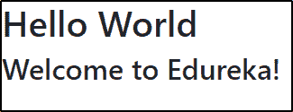

你可以清楚的看到之前输出的字体和这个的区别。这表明引导功能已经成功嵌入到您的应用程序中。

### **使用 npm**

***注意:**请注意，我已经删除了我在之前的方法中添加的 CDN 版本。*

或者，您可以利用节点包管理器将引导功能嵌入到您的项目中。为此，请打开命令提示符并键入以下命令:

*npm 安装引导程序 jquery popper . js–保存*

一旦完成，您将能够看到所有这三个包及其版本都将出现在 **package.json** 文件中。

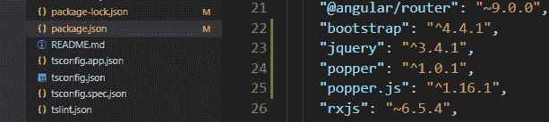

CSS 和 JS 必须全局加载，为此，我们必须在样式和脚本数组中指定 angular.json 文件中的路径。您安装的所有软件包都会下载到 node_modules 文件夹中。打开 node_modules 文件夹，查找 Bootstrap、jQuery 和 Popper。从这些已安装的包中，我将只使用缩小的版本，所以打开这些文件夹并寻找这些缩小文件的路径。下图显示了 bootstrap.min.css 文件路径:

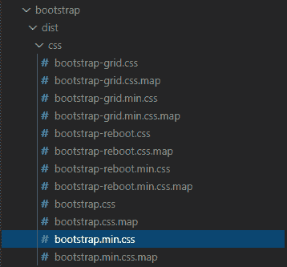

一旦找到了每个文件的路径，就必须将它添加到 angular.json 文件中，如下所示:

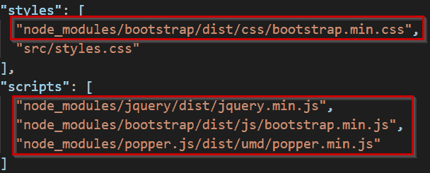

现在保存更改并重新运行您的应用程序。您应该能够看到引导功能仍在工作，如下所示:


## **项目**

既然已经成功添加了所需的扩展，您就可以创建一个 Angular Bootstrap 应用程序了。

### **创建组件**

这个应用程序将有三个组成部分，即家庭，场地和体育场。要创建其中的每一个，请键入以下命令:

***ng 新家***

***ng 新会场***

***ng 新体育场***

您将看到所有这些组件都已添加到 src/app 文件夹中，如下所示:

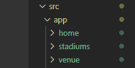

将所有组件导入 app.component.ts 文件，并将它们添加到声明数组中，如下所示:

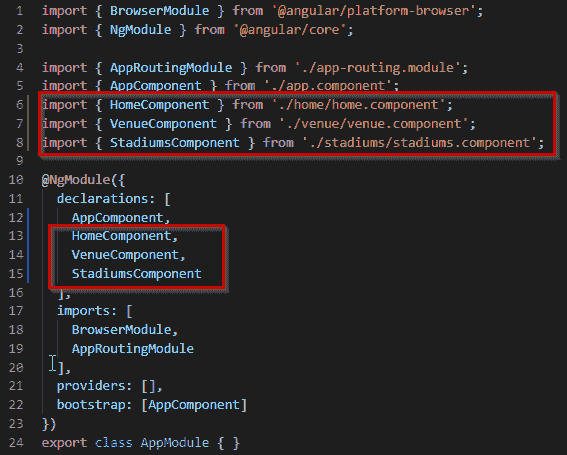

打开 app-routing module.ts 文件，并添加每个组件的路径，如下所示:

```
import { HomeComponent } from './home/home.component';
import { LocationsComponent } from './locations/locations.component';
import { VenueComponent } from './venue/venue.component';
import { NgModule } from '@angular/core';
import { Routes, RouterModule } from '@angular/router';

const routes: Routes = [
  {path:  "", pathMatch:  "full",redirectTo:  "/home"},
  {path: "home", component: HomeComponent},
  {path: "venue", component: VenueComponent},
  {path: "locations", component: LocationsComponent},

];

@NgModule({
  imports: [RouterModule.forRoot(routes)],
  exports: [RouterModule]
})
export class AppRoutingModule { }

```

打开每个组件的 component.html 文件，并添加您选择的任何引导元素。让我给你们看一个基本的例子。这里，我将在 app.componenet.html 文件中添加一个导航条。在 app.component.html 文件中添加导航条的原因是为了让它显示在我网站的每一页上。[点击这里](https://getbootstrap.com/docs/4.4/components/navbar/#nav)查看我在下面的代码中使用的引导代码。

```

<nav class="navbar navbar-expand-lg navbar-light bg-light">
    <a class="navbar-brand" href="#">Navbar</a>
    <button class="navbar-toggler" type="button" data-toggle="collapse" data-target="#navbarNav" aria-controls="navbarNav" aria-expanded="false" aria-label="Toggle navigation">
      <span class="navbar-toggler-icon"></span>
    </button>

<div class="collapse navbar-collapse" id="navbarNav">

<ul class="navbar-nav">

<li class="nav-item active">
          <a class="nav-link" href="#">Home <span class="sr-only">(current)</span></a>
        </li>

<li class="nav-item">
          <a class="nav-link" href="#">Venue</a>
        </li>

<li class="nav-item">
          <a class="nav-link" href="#">Locations</a>
        </li>

      </ul>

 </div>

  </nav>

<router-outlet></router-outlet>
```

上述代码将有以下输出:

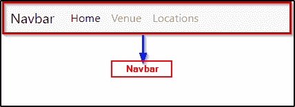

请注意，我没有在我的项目中使用相同的导航条。您可以为您的项目选择任何元素。您所要做的就是选择您所选择的元素，并将其粘贴到组件的 html 文件中。

这里有几张截图，展示了我的 Angular Bootstrap 应用程序通过添加一些引导元素(如大屏幕、狂欢、导航条、卡片等)后的样子。

**首页:**

**狂欢**


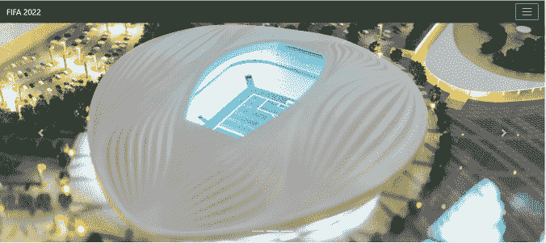


**纸牌和大屏幕**


**嵌入和大屏幕**

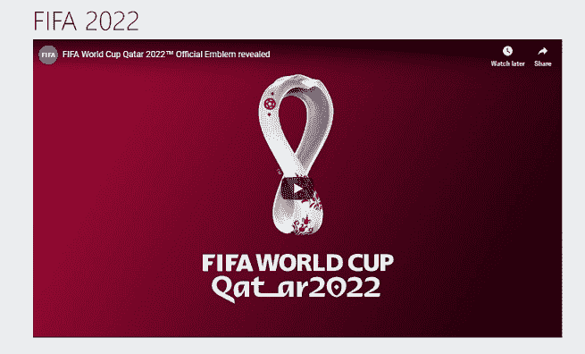

**导航条**

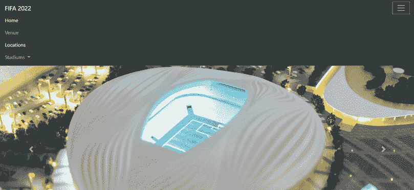

**地点:**

**卡片**

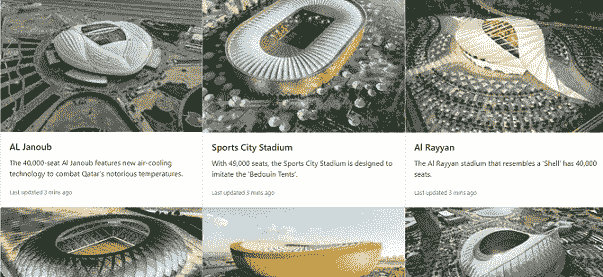

**地点:**

**嵌入和卡**

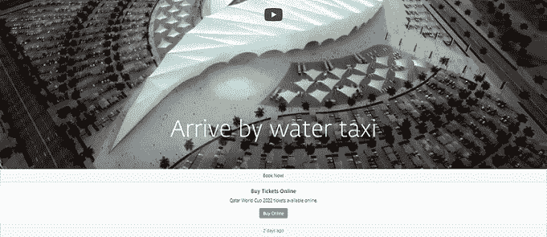

“角度引导”博客到此结束。我希望这是信息，并增加了你的知识价值。我会推荐你通过这个 ***Angular 8 教程 Edureka 视频*** 观看视频，学习如何从零开始创建一个 Angular 应用程序。

**Angular 8 教程|从零开始创建 Angular 项目| edu reka**


[https://www.youtube.com/embed/pTec1e8oyc8?rel=0&showinfo=0](https://www.youtube.com/embed/pTec1e8oyc8?rel=0&showinfo=0)

本视频将帮助你全面学习 Angular 8，并逐步演示如何从头开始创建 Angular 项目。

*查看 Edureka 提供的 [**角度训练**](https://www.edureka.co/angular-training) ，edu reka 是一家值得信赖的在线学习公司，拥有遍布全球的 250，000 多名满意的学习者。Angular 是一个 JavaScript 框架，用于创建可伸缩的、企业级的、高性能的客户端 web 应用程序。随着 Angular 框架的广泛采用，应用程序的性能管理是由社区驱动的，间接推动了更好的工作机会。Angular 认证培训旨在涵盖所有这些围绕企业应用程序开发的新概念。*