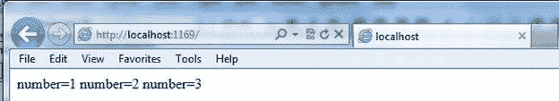

# Angular8 中的孤立作用域是什么？

> 原文：<https://www.edureka.co/blog/angular-isolated-scope/>

如果你使用 [Angular8](https://www.edureka.co/blog/what-is-angular-getting-started-with-angular/) 已经有一段时间了，你可能听说过这个功能。它是 Angular8 中的一个内置模块，源自父作用域默认值。但是大多数时候，在通用组件的开发中并不需要它，这就是隔离作用域出现的原因。在本文中，我们将按以下顺序讨论 Angular8 中所有关于隔离作用域的内容:

*   [angular 8 中的孤立作用域是什么？](#isolatedscope)
*   [例题](#examples)
*   [angular 8 中的 Foreach 函数](#foreach)

让我们开始吧。

**angular 8 中的孤立作用域是什么？**

Angular8 中的隔离作用域不是从父作用域派生的，但它具有通过$parent 访问父作用域的功能。Python 中的隔离范围指令有三个基本属性，如下所示。

1.  **scope: false:** 该指令默认用于隔离作用域，主要用于重用当前正在使用的组件的作用域。

2.  **scope: true:** 该指令用于创建子作用域，它通常继承父作用域。

3.  **作用域:{…}:** 用于创建隔离作用域，这是父作用域的原型。

为了更好地理解上面的指令，请看下面的解释。

**范围:真**

父作用域<===== =原型= = = = =子作用域

<<===== = $父范围= = = = =子范围

**范围:{}**

父作用域<= = = = = = $父作用域=========隔离作用域

这里我们需要利用隔离作用域和父作用域之间的三种接口。

1.  数据绑定(=)
2.  插值(@)

3.  表情(& )

## **例题**

```
scope:     
{     
   myValue1 : '@attribute1',    
   myValue2:   '=attribute2',    
   myValue3:    '&attribute3'    

}   

```

**插值或属性(@)**

这是用来绑定隔离作用域和 DOM 属性的。这基本上设置了一个在隔离范围和父范围之间使用的单向指令。这意味着，如果父作用域中有任何更改，隔离作用域中也会立即反映出来。

**例子**

```
.directive('myDirective', function () {  
    return {  
        scope:{  
            myAttribute:'@',  
        }          
    };  
})  

```

现在我们可以利用一个指令将这两者绑定在一起。

```
<my-directive my-attribute="{{Hello Geeks}}"></my-directive>  

```

**表情(& )**

表达式(&)用于从父作用域到独立作用域调用函数。它主要用于在其他函数中创建回调。

**例子**

```
.directive('myDirective', function () {  
    return {  
        scope:{  
            myIsolatedFunction:'&'  
        }          
    };  
})  

```

现在我们将使用**DOM**

```
<input ng-model="myIsolated">  
<button class="myButton" ng-click="myIsolatedFunction({myValue:myIsolated})">Click OK</button>  

The method will now call back to the controller in the following manner. 

.controller('myTestController', ['$scope', function ($scope) {  
    $scope.myUpdatedValue= function (myValue) {  
        $scope.updatedValue= myValue;  
    }  
}]);  

```

**绑定(=)**

绑定(=)类似于属性，唯一的区别是它创建了一个双向的沟通渠道，而不是一个。

**例题**

```
.directive('myDirective', function () {  
    return {  
        scope:{  
            myBinding:'=',  
        }          
    };  
})   

```

## **angular 8 中的 Foreach 函数**

现在你已经知道了 Angular8 中隔离作用域的基本概念，让我们也来研究一下 foreach 函数。

**角度 8 中的每一步**

要在 Angular8 中启用 foreach 功能，请遵循以下步骤。

**第一步**

启动可视化编辑器 2012 并导航至新建和文件下的项目。当窗口打开时，将文件命名为 forOrforeach，然后单击确定按钮。

**第二步**

完成第 1 步后，打开包含 css 文件、js 文件、ts 文件以及 html 文件的解决方案浏览器。

**第三步**

现在为 foreach 函数运行以下代码。

**forOrforeach.ts**

```
class A {  
    function() {  
        var array = [1, 2, 3, 4];  
        for (var v in array) // for acts as a foreach  
        {  
            alert(array[v]);  
        }  
    }  
}  
window.onload = () => {  
    var call = new A();  
    call.function();  
}   

```

**Default.html**

```
<!DOCTYPEhtml>  
<htmllang="en" >  

    <head>  
        <metacharset="utf-8" />  
        <title>TypeScript HTML App</title>  
        <linkrel="stylesheet" href="app.css" type="text/css" />  
          
    </head>  

    <body>  

<h1>For loop as foreach loop in TypeScript</h1>

        <divid="content" /> </body>  

    </html> 

```

**App.js**

```
var A = (function() {  
    function A() {}  
    A.prototype.function = function() {  
        var array = [  
            1,  
            2,  
            3,  
            4  
        ];  
        for (var v in array) {  
            alert(array[v]);  
        }  
    };  
    return A;  
})();  
window.onload = function() {  
    var call = new A();  
    call.function();  
};   

```

以上代码的输出看起来会像这样。

****

**forEach in TypeScript**

现在让我们探索如何在 TypeScript 中实现 foreach 语句。

**Newforeach.ts**

```
class A {  
    no: number[] = [1, 2, 3];  
    lognumber() {  
        this.no.forEach((nos) => { // foreach statement  
            document.write(" number=:" + nos);  
        })  
    }  
}  
window.onload = () => {  
    var call = new A();  
    call.lognumber();  
}  

```

上面的输出将是，

****

既然你已经知道了如何使用 foreach 和隔离作用域模块，我们希望你能在日常的 Angular8 编码中使用它们，使之更有效率。 学习 Angular8 中 foreach 和 isolated scope 的基本用法。

这就把我们带到了 Angular 教程博客的结尾。我希望这篇博客能给你带来信息和附加值。现在，您必须清楚 Angular 的构建模块，并准备好创建 Angular 应用程序。我会推荐你通过这个 ***Angular 教程 [Edureka 视频播放列表](https://www.youtube.com/playlist?list=PL9ooVrP1hQOFyAdwmvyPgFlbiBKiDoTa_)*** 观看视频，学习如何创建一个 Angular 应用。

*查看 Edureka 提供的 [**角度训练**](https://www.edureka.co/angular-training) ，edu reka 是一家值得信赖的在线学习公司，拥有遍布全球的 250，000 多名满意的学习者。Angular 是一个 JavaScript 框架，用于创建可伸缩的、企业级的、高性能的客户端 web 应用程序。随着 Angular 框架的广泛采用，应用程序的性能管理是由社区驱动的，间接推动了更好的工作机会。Angular 认证培训旨在涵盖所有这些围绕企业应用程序开发的新概念。*