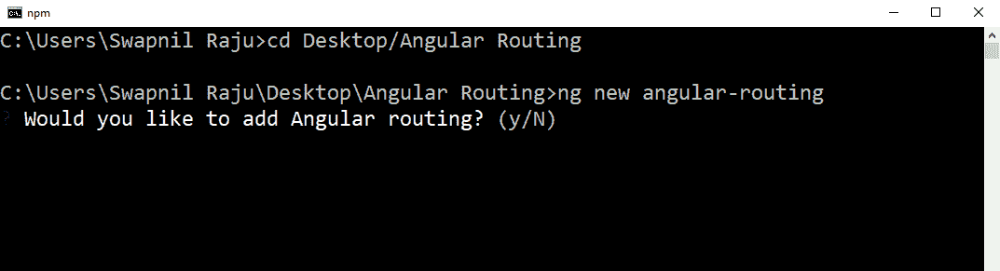
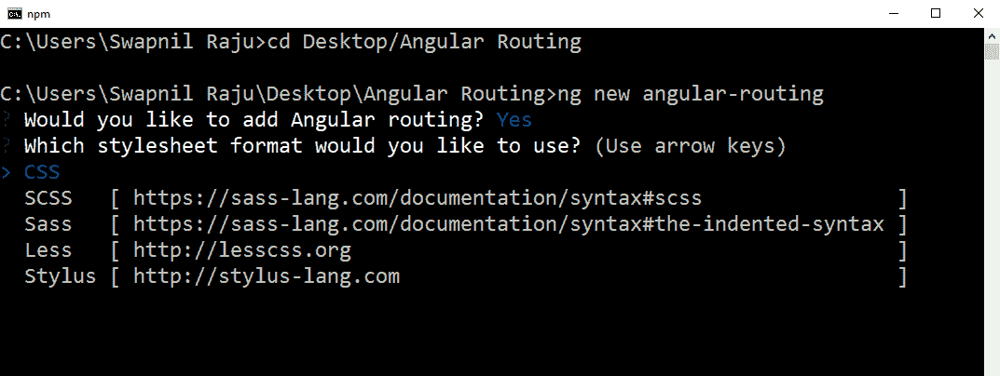
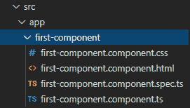
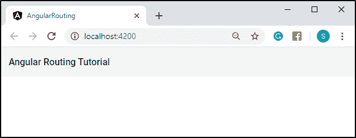
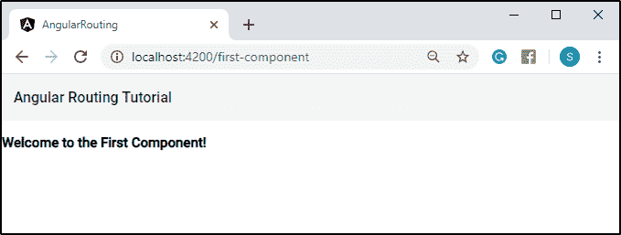
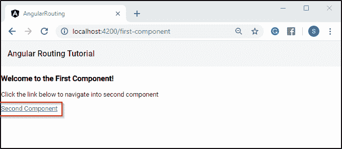
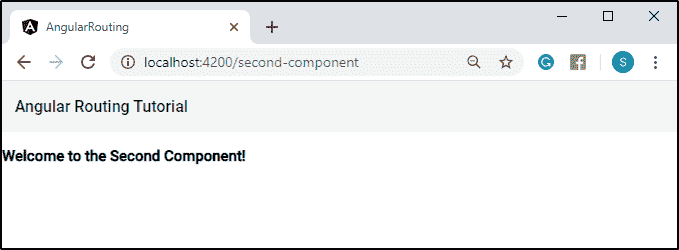
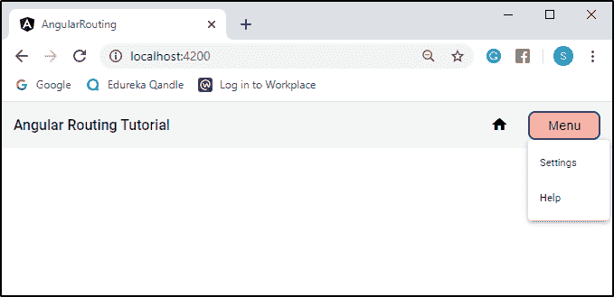
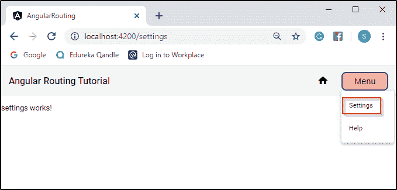
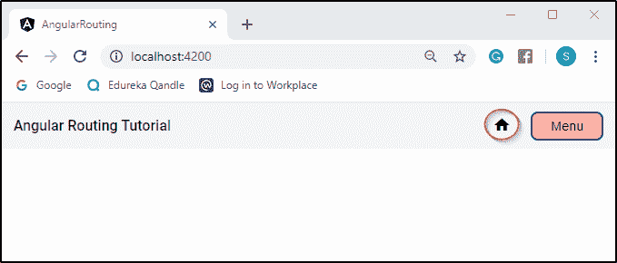

# 角度路由:初学者完全指南

> 原文：<https://www.edureka.co/blog/angular-js-routing/>

**路由** 有助于在 web 应用程序中从一个页面导航到另一个页面。在[角线](https://www.edureka.co/blog/angular-tutorial/)中，俗称 **角线** 。然而，如果你还没有意识到，这里有一篇文章可以帮助你详细地学习角度路由。还有，想要深入了解 Angular，可以考虑报名参加 Edureka 的 [***Angular 认证培训***](https://www.edureka.co/angular-training?qId=39f968589d8ac35242a3b66e9059322e&amp;index_name=prod_courses&amp;objId=885&amp;objPos=1) 。

在本文中，我将讨论以下主题:

*   [角度布线介绍](#intro)
*   [角度路由安装](#install)
*   [App 和第一个组件之间的路由](#route)
*   [组件间路由](#component)
*   [通过按钮路由](#button)
*   [特殊字符串路径](#special)

## **角度布线介绍**

浏览器通常遵循 web 应用程序中众所周知的导航模型，例如:

*   假设您在地址栏中输入一个 URL，浏览器会导航到相应的页面。
*   如果单击页面上的链接，浏览器将导航到新页面。
*   如果你点击浏览器的后退和前进按钮，浏览器会分别向后和向前浏览你浏览过的网页。

****

**角度路由**借鉴了这个模型，在应用程序的不同页面中导航。它将**浏览器 URL** 解释为导航到**客户端生成的视图**的指令。您可以将 ***路由器*** 绑定到页面上的链接，当用户点击链接时，帮助导航到适当的**应用视图**。当用户点击**按钮**或从**下拉框**中选择一个选项时，您也可以进行必要的导航。*路由器*也在浏览器的历史日志中保存一个**活动日志**，因此前进和后退按钮也起作用。请立即查看此[全栈开发课程](https://www.edureka.co/masters-program/full-stack-developer-training)，了解更多信息。

## **角度路由安装**

现在，让我们从如何在应用中安装角度路由的快速教程开始。首先，确保你的系统中安装了 Angular。如果您不熟悉 Angular，请参考 [Angular CLI 安装](https://www.edureka.co/blog/angular-cli/#angular)上的链接。一旦你设置好了一切，让我们建立一个新的 Angular 项目。

首先，您需要创建一个目录，您想要在其中创建您的项目。稍后，您需要在 Windows 命令提示符或您正在使用的任何其他 CLI 上使用 *cd* 命令来更改该目录的路径。假设您在桌面上有一个名为“Angular Routing”的目录，您需要键入以下命令来导航到该目录。

```
cd C:Users/System_Name/Desktop/Angular Routing
```

稍后，您需要键入以下命令来创建新的 Angular 项目。

```
ng new angular-routing
```

首先，它会问你是否在你的项目中加入角度路由，大概是这样的:

 您需要选择 *y* 即*是*来为您的项目添加路线。接下来，它会询问您希望使用哪种样式表格式，如下所示:

 你需要点击 [CSS](https://www.edureka.co/blog/what-is-css/) 在你的应用程序上安装默认的 CSS 样式表，它包括所有其他的样式表。随后，这将在你的目录下创建一个名为*角路由*的新项目。您可以使用以下命令导航到您的项目:

```
cd angular-routing
```

如果您已经有了一个 Angular 项目，并想为其添加路由，您只需在命令提示符下键入以下命令。

```
ng generate module app-routing --flat --module=app
```

这会将路由添加到您的项目中，并在您的*src/app*目录中生成*app-routing . module . ts*文件。生成的文件将类似于这样:

```
import { NgModule } from '@angular/core';
import { Routes, RouterModule } from '@angular/router';

const routes: Routes = [ ];

@NgModule({
   imports: [RouterModule.forRoot(routes)],
   exports: [RouterModule]
})

export class AppRoutingModule { }
```

## **App 和第一个组件之间的路由**

首先，您需要使用以下命令生成一个名为 *first-component* 的组件:

```
ng g c first-component
```

这将在您的 *src/app* 目录中创建名为‘first-component’的组件。这包括以下子组件:



1.  第一个组件
2.  first-component.component.html
3.  首个组件。组件规格
4.  第一个组件

现在，假设您想要将路由从*app . component*添加到您的 *第一个组件* 。首先，你需要进入你的应用程序上的*app.component.html*文件，清除所有现有的代码。接下来，您需要编写如下新代码:

```
<mat-toolbar>
   <span>Angular Routing Tutorial</span>
</mat-toolbar>

<router-outlet></router-outlet>
```

这里，*<mat-toolbar>*是来自 **Angular Material** 的一个容器，用于页眉和标题。万一不熟悉，可以参考[角材](https://www.edureka.co/blog/what-is-angular-material/)的文章进行安装，并有演示教程。

***<router-outlet>***是路由器库中的一个路由器指令，用于指示路由器在哪里显示路由视图。要使用该指令，首先需要使用以下命令将其从 *angular router* 目录导入到 *app.module.ts* 文件中:

```
import { Routes, RouterModule } from '@angular/router';
```

之后，还需要在 *中添加这个模块，导入: *中的* 段，位于 app.module.ts* 文件中。

```
imports: [
   BrowserModule,
   AppRoutingModule,
   BrowserAnimationsModule,
   MatToolbarModule,
   RouterModule.forRoot(routes)
],
```

对于路线，需要添加“*routermodule . forroot(路线)* ”。

现在，让我们使用下面的命令来服务您的项目:

```
ng serve -o
```

这将在系统的默认浏览器上打开您的项目，如下所示:



比方说，现在你要为你的 *创建一个根首组件* 。首先，让我们编写一个代码来显示第一个组件页面的内容，在*第一个组件*中。*component.html*文件。

```

<h3>Welcome to the First Component!</h3>

```

接下来，让我们进入*app . module . ts*文件，在*Routes =[]*部分为 *第一个组件* 创建一个路径。

```
const routes: Routes = [
   { path: 'first-component', component: FirstComponentComponent }
];
```

这将为 *第一个组件* 创建一个路由，您可以在浏览器上使用以下 URL 查看该组件:

```
http://localhost:4200/first-component
```

这将显示 *第一元件* 文件的内容如下:



## **组件间路由**

假设你想在组件间导航。首先，您需要在应用程序中生成另一个组件。稍后，您需要将您的文件上的路由器链接添加到您的文件中，如下:

```
<h3>Welcome to the First Component!</h3>
<p>Click the link below to navigate into second component</p>
<nav>
   <a routerLink = "/second-component">Second Component</a>
</nav>

```

接下来，您需要按照相同的步骤为 *第二组件* 创建一条路线，就像您在 *app.module.ts* 文件 中为 *第一组件* 所做的一样。一旦您的 *第二组件* 路径被创建，您就可以在您的浏览器上查看它。



您需要点击“二次元”链接，导航到 *二次元* 页面并显示其中的内容。



## **通过按钮路由**

假设您想通过按钮导航。首先，让我们给你的应用程序添加一个“菜单”选项和一个“主页”图标。你需要打开你的*app.component.html*文件，编辑代码如下:

```
<mat-toolbar>
   <span>Angular Routing Tutorial</span>
   <span class="homespace"></span>
   <button class="example" mat-icon-button routerLink="/">
      <mat-icon aria-hidden="false" aria-label="Example home icon">home</mat-icon>
   </button> 
   <span class="space"></span>
   <button class="btns" mat-button [matMenuTriggerFor]="menu">Menu</button>
   <mat-menu #menu="matMenu">
      <button mat-menu-item routerLink="/settings">Settings</button>
      <button mat-menu-item routerLink="/help">Help</button>
   </mat-menu>
</mat-toolbar>

<router-outlet></router-outlet>
```

这里， *< mat-icon >* 是一个由角状材料制成的容器，用来表示各种图标。要使用这个，你需要像从 *'@angular/material'* 目录中的 *MatToolbarModule* 一样，在你的 *app.module.ts* 文件中导入 *MatIconModule* 。

你甚至需要生成两个组件，即*设置*和*帮助*组件。现在，,你需要按照和上面一样的步骤为这些组件创建一个路径。在上面的 HTML 代码中， *routerLink="/"* 是指向您的第一个页面 URL 的路径，即 *http://localhost:4200* 。

接下来，您需要在您的 *app.component.css* 文件中编写以下代码。

```
.space{
    flex: 1 1 auto;
}

.homespace{
    flex: 20 0 auto;
}

.btns{
    width: 100px;
    height: 40px;
    font-size: large;
    border-radius: 10px;
    border: 3px solid #113c89;
    background-color: rgb(252, 173, 173);
    cursor: pointer;
}

.example {
    background-color: Transparent;
    background-repeat:no-repeat;
    border: none;
    cursor:pointer;
    overflow: hidden;
    outline:none;
}
```

为*设置*和*帮助*组件创建路径后，您可以通过服务您的项目在浏览器上查看它。



现在，你只需要点击“设置”或“帮助”选项来浏览这些页面。我将向你展示一个“设置”选项的例子。



如上图所示，我刚刚点击了“设置”选项，稍后，它被重定向到“/ *设置*页面。

要返回到您的第一页，您只需点击“主页”图标，它会将您重定向到您的第一页，如下所示。



## **特殊字符串路径**

还有一个特殊的字符串' **** 【T2 '，可以添加到路径中。如果请求的 URL 与您定义的任何路径或路由都不匹配，此字符串用于重定向到您定义的路径。这个字符串可以添加到您的***Routes =[]*节中，该节位于*app . module . ts*文件中。

```
const routes: Routes = [ 
   { path: 'first-component', component: FirstComponentComponent },
   { path: 'second-component', component: SecondComponentComponent },
   { path: 'settings', component: SettingsComponent },
   { path: 'help', component: HelpComponent },
   { path: '**', redirectTo: '', pathMatch: 'full' }
];
```

例如，您可以在您的应用程序中看到定义的路径。在您的浏览器 URL 部分，您需要键入以下地址:

```
http://localhost:4200/third-component
```

由于第三方组件不存在，它将重定向到您的第一页 URL，即*http://localhost:4200*，并显示其中的内容。

我想以此结束我的博客。我希望您清楚角度路由的基本原理。如果你对这篇文章有任何疑问，请在下面的评论区留言。

*如果你想学习你刚刚从这个博客中学到的所有知识，以及更多关于 [Angular](https://angular.io/) 的知识，并把你的职业生涯定位于一个精通 Angular 的开发者，那么考虑报名参加我们的 [**Angular 认证课程**](https://www.edureka.co/angular-training?qId=39f968589d8ac35242a3b66e9059322e&index_name=prod_courses&objId=885&objPos=1) 。*

*有问题吗？请在这个“角度路由”博客的评论部分提到它，我们会尽快回复你。*