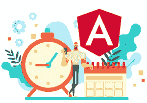

# 关于 Angular JS 手表功能你需要知道的一切

> 原文：<https://www.edureka.co/blog/angular-js-watch-function/>

[Angular](https://www.edureka.co/blog/angular-tutorial/) JS $scope 函数是一些主要函数。在本文中，我们将按以下顺序讨论 Angular JS 手表功能:

*   [angular JS 手表功能是什么？](#what)
*   [如何使用 angular JS 手表功能](#how) [n？](#how)
*   [代号](#html-code)

## **angular JS 手表功能是什么？**

angular JS $ watch 函数用于观察范围对象。$watch 关注变量，当变量的值改变时，angular JS $运行一个函数。这个函数有两个参数，一个是新值，另一个是旧值。



## **如何使用 angular JS 手表功能？**

我们举个简单的例子，angular JS 中的手表功能到底是做什么的。因此，在我们的 angular JS 程序中，我们创建了两个文件，index.js 负责前端，app.js 负责处理后端。这里我们用一个表单制作一个简单的程序，这个表单有一个输入字段。当我们在输入字段中输入名称时，输出消息会显示旧值和新值。

## **HTML 代码**

我们的 index.html 页面有一个名为 ngWatchApp 的 angular 应用程序和一个名为`watchController`的控制器。然后我们创建一个带有输入字段名称的表单，输入字段的值打印在 h1 标签中，消息打印在< p >标签中。

```
<!DOCTYPE html>
<html lang="en">
<head>
    <meta charset="UTF-8">
    <title>Angular watch example</title>
</head>
<body ng-app="ngWatchApp">

<div ng-controller="watchController">

    <form>
        <label>Enter you name</label>
        <input type="text" ng-model="name">
    </form>
    <h1>Hello {{name}}</h1>
    <p>{{message}}</p>

</div>

<!--angular js library-->
<script src="assets/js/angular.js"></script>
<script src="app.js"></script>
</body>
</html>

```

## **JavaScript 代码**

在 app.js 中，我们创建了一个名为 ngWatchApp 的应用程序和一个名为`watchController`的控制器。接下来，我们在作用域中定义两个变量 name、name 和 message，并在监视函数中传递两个参数，一个是更改时受影响的字段的名称，另一个是也有两个参数 new value 和 old value 的函数。最后，我们在消息变量中添加两个值，消息变量显示在`index.html`页面上。

```
var app = angular.module('ngWatchApp', []);

app.controller('watchController', function($scope) {

// adding scope variable
$scope.name = "";
$scope.message = "";

// add watch with name field
$scope.$watch("name", function (newValue='', oldValue='') {
$scope.message = `new valus is ${newValue} and old value is ${oldValue}`;
});

});

```

每当我们观看一个函数时，那么这个函数就根据 digest 被多次调用。每当代码执行时，AngularJS 都会将当前的$scope 引用作为第一个参数传入。这不仅意味着我们可以从函数体内引用正确的作用域，还意味着我们可以观察任何需要$scope 引用的函数。

这就是我们如何在应用程序中使用 angular js watch()函数来观察$scope 变量的变化。使用$watch 还有其他一些事情，比如$digest()函数遍历$scope 对象中的所有观察器当`$digest()`遍历观察器时，它为每个观察器调用 value 函数。`$scope.$apply()`函数将一个函数作为被执行的参数，然后在内部调用 `$scope.$digest()`。

到此，我们结束这篇有角度的 JS 手表功能文章。*如果您希望了解更多关于 Angular framework 的信息，请查看我们的**[Angular Training&Certification](https://www.edureka.co/angular-training)**，它附带有讲师指导的现场培训和真实项目经验。这个训练将帮助你深入了解 Angular，并帮助你掌握这个主题。*

有问题要问我们吗？请在“Angular JS 手表功能”的评论区提及，我们会给你回复。