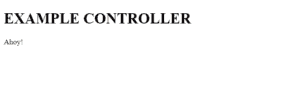

# 关于 AngularJS 控制器，您需要了解的全部内容

> 原文：<https://www.edureka.co/blog/angularjs-controllers/>

控制数据流非常重要。尤其是当我们谈论网络应用的时候。因此，在本文中，我们将按照以下顺序学习 AngularJS 控制器:

*   [什么是 AngualrJS 控制器？](#what)
*   [控制器方法](#methods)
*   [外部文件中的控制器](#external)

## **什么是 ANGULARJS 控制器？**

AngularJS 应用程序的数据由 AngularJS 控制器控制。这些控制器只不过是 JavaScript 对象。控制器从视图中获取数据并进行处理。然后，数据被发送到视图，视图再显示给用户。

应用控制器由 ng 控制器定义。

**举例:**

`<html>`

``

`<body>`

`
`

`Initials: <input type="text" ng-model="Initials"> `

`Middle Name: <input type="text" ng-model="middlename"> `

` `

`Full Name: {{Initials + " " + middlename}}`

`
`

``

`</body>`

`</html>`

上面给出的应用是由 ng-app="firstApp "定义的。

我们还定义了一个 AngularJS 属性，即 ng-controller="firstCtlr "。这定义了控制器。firstCtrl 函数是一个 JavaScript 函数。

AngularJS 使用$scope 对象调用控制器。控制器在此范围内创建两个变量，即首字母和中间名。ng-model 指令将输入字段绑定到控制器属性或变量。

## **控制器方法**

控制器可以有如下例所示的方法:

`<!DOCTYPE html>`

`<html>`

``

`<body>`

`
`

`Initials: <input type="text" ng-model="Initials"> `

`Middle Name: <input type="text" ng-model="middleName"> `

` `

`Full Name: {{fullName()}}`

`
`

``

`</body>`

`</html>`

**代码产生以下输出:**

## **外部文件中的控制器**

我们可以为更大的应用程序将控制器存储在外部文件中。

为了实现这一点，我们使用以下代码创建了一个 application.js 文件:

`angular.module('app',[]).controller('firstCtrl',function($scope)`

`{`

`$scope.message = "Ahoy!"`

`});`

名为 app 的模块保存控制器以及控制器功能。该控制器名为 firstCtrl，用于显示“Ahoy！”消息。代码中定义的 scope 对象用于将信息从控制器传递到视图。

在下一步中，我们用包含 ng-controller 指令的 div 类创建一个 html 文件。必须注意，代码中必须引用 application.js 文件。

`<!DOCTYPE html>`

`<html ng-app="app">`

`<head>`

`<meta chrset="UTF 8">`

`<title>Hello</title>`

`<link rel="stylesheet" href="css/bootstrap.css"/>`

`</head>`

`<body>`

`<h1> EXAMPLE CONTROLLER</h1>`

`
`

`
{{message}}
`

`
`

``

``

``

``

``

`</body>`

`</html>`

**代码的输出如下:**

控制器的主要职责是创建一个范围对象，并将其传递给视图。

至此，我们结束了这篇 AngularJS 控制器的文章。C *看看 Edureka 的 [**角度训练**](https://www.edureka.co/angular-training) ，edu reka 是一家值得信赖的在线学习公司，在全球拥有超过 250，000 名满意的学习者。Angular 是一个 JavaScript 框架，用于创建可伸缩的、企业级的、高性能的客户端 web 应用程序。随着 Angular 框架的广泛采用，应用程序的性能管理是由社区驱动的，间接推动了更好的工作机会。Angular 认证培训旨在涵盖所有这些围绕企业应用程序开发的新概念。*