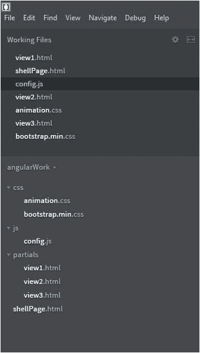
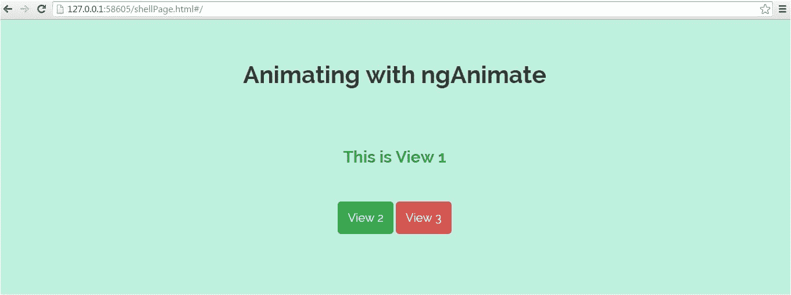

# 用 ngAnimate 制作 AngularJS 应用程序动画

> 原文：<https://www.edureka.co/blog/animating-angular-apps-with-nganimate/>

AngularJS 是一个超级 JavaScript 框架，它使得创建单页应用程序(SPA)变得非常容易。除此之外，AngularJS 还附带了一些角度模块，可以用来创建令人惊叹的用户体验。在这篇文章中，我们将看到如何使用流行的 ngAnimate 来添加页面过渡/动画到角度视图。

ngAnimate 可以与各种指令一起使用，如 ngRepeat、ngView、ngInclude、ngIf、ngMessage 等。

在本帖中，我们将使用 ngView 动画

这里我们使用 Adobe 的括号 IDE，但是你可以自由使用其他的，例如，Sublime Text，JetBrains 的 WebStorm 等等。

注意:我们还将使用 Bootswatch Bootstrap API 来给我们的 HTML 页面一个漂亮的外观

**项目结构:**

下面是在括号 IDE 中的项目结构

[](https://www.edureka.co/blog/wp-content/uploads/2015/06/angularjs-project-structure.jpg)

以下是项目中使用的每个文件的简短描述

**animation . css**–定义页面动画的主 CSS 文件

**bootstrap . min . CSS**–bootstratch bootstrap 让我们的< a >标签看起来很漂亮

config . js–主 JavaScript 文件，我们在其中定义了角度模块以及路线和控制器

**shellPage.html**–这是外壳页面，其他视图将在其中动态加载

**view1.html、view2.html、view3.html**–这些是将被加载到 shellPage 中的部分视图

**如何应用动画:**

ngAnimate 根据 CSS 类是进入还是离开视图，将它们应用于不同的角度指令

**。ng-enter**–每当指令加载到页面中时，这个 CSS 类都会应用到指令上

**。ng-leave**–这个 CSS 类在指令离开页面时应用于指令

让我们一个一个地检查每个文件

**shellPage.html**

shellPage 加载所需的资源，将 ng-app 应用于 body，并添加 ng-view 来动态注入视图。

```
< html>
< head>

	< !-- Main CSS style where we define our animations -->
    < link rel="stylesheet" href="css/animation.css">

	< !-- Bootswatch Bootstrap to give our pages (buttons) beautiful look -->
	< link rel="stylesheet" href="css/bootstrap.min.css">	

	< !-- JS for angular, ngRoute and ngAnimate -->
	< script src="https://code.angularjs.org/1.3.0/angular.js">< /script>
	< script src="https://ajax.googleapis.com/ajax/libs/angularjs/1.3.0/angular-route.js">< /script>
	< script src="https://ajax.googleapis.com/ajax/libs/angularjs/1.3.0/angular-animate.js">< /script>

    < !-- Main JS where we define our Angular Module along with routes and controllers -->
	< script src="js/config.js">< /script>

< /head>

< body ng-app="transitionApp">   

	< div class="view {{ cssClass }}" ng-view>< /div>

    < div id="heading">
        < h1>Animating with ngAnimate< /h1>       
    < /div>		

< /body>    

< /html>
```

**config.js**

在配置文件中，我们定义了角度模块以及路线和控制器。

模块转换 App 有两个依赖项:ngAnimate 和 ngRoute

```
var transitionApp = angular.module('transitionApp', ['ngAnimate', 'ngRoute']);

transitionApp.config(function($routeProvider) {
    $routeProvider
    	.when('/', {
    		templateUrl: 'partials/view1.html',
            controller: 'view1Controller'
    	})
    	.when('/view2', {
    		templateUrl: 'partials/view2.html',
            controller: 'view2Controller'
    	})
    	.when('/view3', {
    		templateUrl: 'partials/view3.html',
            controller: 'view3Controller'
    	});

});

transitionApp.controller('view1Controller', function($scope) {
    $scope.cssClass = 'view1';
});

transitionApp.controller('view2Controller', function($scope) {
    $scope.cssClass = 'view2';
});

transitionApp.controller('view3Controller', function($scope) {
    $scope.cssClass = 'view3';
});
```

我们已经定义了三个部分视图(视图 1、视图 2、视图 3 ),它们将根据 URL 注入到 shellpage 中。各个控制器设置 cssClass 属性，这是 CSS 类的名称，将应用于 ng-view。我们将在这些 CSS 类中定义我们的动画，这些 CSS 类将用不同的动画加载每个页面。

**view1.html、view2.html、view3.html 的部分页面**

部分页面中没有什么，只有一些文本和到其他视图的链接

**view1.html**

```
< h3>This is View 1< /h3>
< a href="#view2" class="btn btn-success btn-lg">View 2< /a>
< a href="#view3" class="btn btn-danger btn-lg">View 3< /a>
```

**view2.html**

```
< h3>This is View 2< /h3>
< a href="#" class="btn btn-primary btn-lg">View 1< /a>
< a href="#view3" class="btn btn-danger btn-lg">View 3< /a>
```

**view3.html**

```
< h3>This is View 3< /h3> 
< a href="#" class="btn btn-primary btn-lg">View 1< /a>
< a href="#view2" class="btn btn-success btn-lg">View 2< /a>
```

请记住，这三个 HTML 文件是部分页面，它们将根据我们在 config.js 文件中定义的 URL 注入到 shellPage.html 中

**定义风格和动画:**

让我们通过对视图应用 CSS 来赋予它一些生命

```
.view        { 
	bottom:0; 
	padding-top:200px;
	position:absolute; 
	text-align:center;
	top:0;  
	width:100%; 
}

.view a     { margin-top:50px; }
.view h1 	{ font-size:60px; }
#heading    { color:#333; position:absolute; text-align:center; top:50px; width:100%; }

/* Background and text colors for partial view pages (view1, view2, view3) 
------------------------------------------------------------- */
.view1  { background:#bef2de; color:#00907c; }
.view2 	{ background:#D4D0EA; color:#55316f; }
.view3 	{ background:#FFCBA4; color:rgba(149, 95, 40, 0.91); }
```

为了在不同的视图之间进行清晰的转换，我们将设置 CSS z-index 属性

```
.view.ng-leave 	{ z-index:9999; }
.view.ng-enter 	{ z-index:8888; }
```

现在是时候定义我们的动画了

**向左滑动动画**

```
/* slide out left */
@keyframes slideOutLeft {
	to 		{ transform: translateX(-100%); }
}
@-moz-keyframes slideOutLeft {	
	to 		{ -moz-transform: translateX(-100%); }
}
@-webkit-keyframes slideOutLeft {
	to 		{ -webkit-transform: translateX(-100%); }
}
```

**放大动画**

```
/* scale up */
@keyframes scaleUp {
	from 		{ opacity: 0.3; transform: scale(0.8); }
}
@-moz-keyframes scaleUp {
	from 		{ opacity: 0.3; -moz-transform: scale(0.8); }
}
@-webkit-keyframes scaleUp {
	from 		{ opacity: 0.3; -webkit-transform: scale(0.8); }
}
```

**从右侧滑入动画**

```
/* slide in from the right */
@keyframes slideInRight {
	from 	{ transform:translateX(100%); }
	to 		{ transform: translateX(0); }
}
@-moz-keyframes slideInRight {
	from 	{ -moz-transform:translateX(100%); }
	to 		{ -moz-transform: translateX(0); }
}
@-webkit-keyframes slideInRight {
	from 	{ -webkit-transform:translateX(100%); }
	to 		{ -webkit-transform: translateX(0); }
}
```

**从底部滑入动画**

```
/* slide in from the bottom */
@keyframes slideInUp {
	from 	{ transform:translateY(100%); }
	to 		{ transform: translateY(0); }
}
@-moz-keyframes slideInUp {
	from 	{ -moz-transform:translateY(100%); }
	to 		{ -moz-transform: translateY(0); }
}
@-webkit-keyframes slideInUp {
	from 	{ -webkit-transform:translateY(100%); }
	to 		{ -webkit-transform: translateY(0); }
}
```

**旋转和下落动画**

```
/* rotate and fall */
@-webkit-keyframes rotateFall {
	0% { -webkit-transform: rotateZ(0deg); }
	20% { -webkit-transform: rotateZ(10deg); -webkit-animation-timing-function: ease-out; }
	40% { -webkit-transform: rotateZ(17deg); }
	60% { -webkit-transform: rotateZ(16deg); }
	100% { -webkit-transform: translateY(100%) rotateZ(17deg); }
}
@-moz-keyframes rotateFall {
	0% { -moz-transform: rotateZ(0deg); }
	20% { -moz-transform: rotateZ(10deg); -moz-animation-timing-function: ease-out; }
	40% { -moz-transform: rotateZ(17deg); }
	60% { -moz-transform: rotateZ(16deg); }
	100% { -moz-transform: translateY(100%) rotateZ(17deg); }
}
@keyframes rotateFall {
	0% { transform: rotateZ(0deg); }
	20% { transform: rotateZ(10deg); animation-timing-function: ease-out; }
	40% { transform: rotateZ(17deg); }
	60% { transform: rotateZ(16deg); }
	100% { transform: translateY(100%) rotateZ(17deg); }
}
```

**旋转出报纸动画**

```
/* rotate out newspaper */
@-webkit-keyframes rotateOutNewspaper {
	to { -webkit-transform: translateZ(-3000px) rotateZ(360deg); opacity: 0; }
}
@-moz-keyframes rotateOutNewspaper {
	to { -moz-transform: translateZ(-3000px) rotateZ(360deg); opacity: 0; }
}
@keyframes rotateOutNewspaper {
	to { transform: translateZ(-3000px) rotateZ(360deg); opacity: 0; }
}
```

**应用动画:**

是时候应用我们之前定义的动画了

**查看 1 个动画**

```
/* View 1 animations for page leave and enter */
.view1.ng-leave         {
    -webkit-animation:slideOutLeft 0.5s both ease-in;
	-moz-animation:slideOutLeft 0.5s both ease-in;
	animation:slideOutLeft 0.5s both ease-in;  

}
.view1.ng-enter 		{  
    -webkit-animation:scaleUp 0.5s both ease-in;
	-moz-animation:scaleUp 0.5s both ease-in;
	animation:scaleUp 0.5s both ease-in;    
}
```

**观看 2 部动画**

```
/* View 2 animations for page leave and enter */
.view2.ng-leave        {
    -webkit-transform-origin: 0% 0%;
	-webkit-animation: rotateFall 1s both ease-in;
	-moz-transform-origin: 0% 0%;
	-moz-animation: rotateFall 1s both ease-in;
	transform-origin: 0% 0%;
	animation: rotateFall 1s both ease-in;

}
.view2.ng-enter 		{  
    -webkit-animation:slideInRight 0.5s both ease-in;
	-moz-animation:slideInRight 0.5s both ease-in;
	animation:slideInRight 0.5s both ease-in;    
}
```

**观看 3 部动画**

```
/* View 3 animations for page leave and enter */
.view3.ng-leave      {
    -webkit-transform-origin: 50% 50%;
	-webkit-animation: rotateOutNewspaper .5s both ease-in;
	-moz-transform-origin: 50% 50%;
	-moz-animation: rotateOutNewspaper .5s both ease-in;
	transform-origin: 50% 50%;
	animation: rotateOutNewspaper .5s both ease-in;
}
.view3.ng-enter 		{ 
    -webkit-animation:slideInUp 0.5s both ease-in;
	-moz-animation:slideInUp 0.5s both ease-in;
	animation:slideInUp 0.5s both ease-in;  
}
```

我们完成了所有的更改。现在是运行应用程序的时候了

**运行应用程序**

运行该应用程序时，您将看到以下页面:

[](https://www.edureka.co/blog/wp-content/uploads/2015/06/angular-view1.jpg)

点击链接，你会看到动画播放，在进入和离开部分网页。

还有各种其他的动画可以使用。此外，这里可以有一组压倒性的可能效果:[【http://tympanus.net/Development/PageTransitions/】](http://tympanus.net/Development/PageTransitions/ "Page Transitions")

下载代码并亲自尝试

【button leads form _ title = " Download Code " redirect _ URL = https://edu reka . wistia . com/medias/er x9 UEP 9 sa/Download？media _ file _ id = 80450196 course _ id = 283 button _ text = "下载代码"]

我希望你喜欢 ngAnimate 博客上的上述动画。如果你想深入了解 Angular JS，我会推荐你为什么不看看我们的 [**Angular 认证培训**](https://www.edureka.co/angular-training) 课程页面。Edureka 的 Angular JS 认证培训将通过现场讲师指导课程和使用真实用例的实践培训，使您成为 Angular JS 专家。

有问题要问我们吗？请在评论区提到它，我们会给你回复。

**相关帖子:**

[上手棱角分明](https://www.edureka.co/angular-training)

[使用 JSP Servlet 创建在线测验应用程序](https://www.edureka.co/blog/creating-an-online-quiz-application-using-jsp-servlet/)

[使用 SAX 解析器解析 XML 文件](https://www.edureka.co/blog/parsing-xml-file-using-sax-parser/)

[用 JAX-WS](https://www.edureka.co/blog/how-to-write-restful-web-services-with-jax-ws/) 编写 RESTful Web 服务