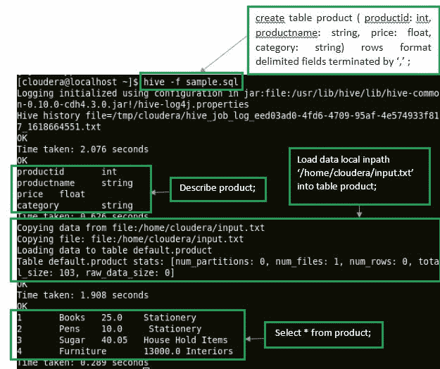

# Apache Hadoop:创建您的第一个 HIVE 脚本

> 原文：<https://www.edureka.co/blog/apache-hadoop-hive-script/>

就像 SQL、Unix Shell 等其他语言的脚本一样。， **Hive 脚本**用来共同执行一组 *Hive 命令*。这有助于减少手动编写和执行每个命令所花费的时间和精力。这个博客一步一步地指导你写第一个 *Hive 脚本*并执行它。查看这个[大数据课程](https://www.edureka.co/big-data-hadoop-training-certification)，了解更多关于真实项目中的 Hive 脚本和命令。

Hive 支持从 **Hive 0.10.0** 及以上版本的脚本。用于 *hadoop (CDH4)* 的 Cloudera 发行版 quick VM 附带预装的 *Hive 0.10.0* (CDH3 演示 VM 使用 Hive 0.90，因此无法运行 Hive 脚本)。

执行以下步骤创建您的第一个配置单元脚本:

## **第一步:写剧本**

在您的 *Cloudera CDH4 发行版*中打开一个终端，给出下面的命令来创建一个 Hive 脚本。

命令: **gedit sample.sql**

*Hive 脚本文件*应该用**保存。sql** 扩展来启用执行。

编辑该文件并编写几个将使用该脚本执行的 Hive 命令。

在这个示例脚本中，我们将创建一个表，描述它，将数据加载到表中，并从该表中检索数据。

*   #### Create a "product" table in the configuration unit:

命令:**创建表 product ( productid: int，productname: string，price: float，category: string) rows 格式分隔字段，以'，'结尾；**

这里{ productid，productname，price，category}是“产品”表中的列。

“*字段*以'，'”结束，表示输入文件中的*列*由分隔符'，'分隔。您也可以使用其他分隔符。例如，输入文件中的记录可以由一个*换行符(’)字符*分隔。

*   #### Description table:

命令:**描述产品；**

*   #### Load data into the table:

为了将数据加载到表中，创建一个输入文件，其中包含需要插入到表中的记录。

命令: **sudo gedit input.txt**

在**输入文本**文件中创建几条记录，如图所示。

命令:**将数据本地 in path '/home/cloud era/input . txt '加载到表产品中；**

*   #### Retrieving data:

为了*检索*数据，使用选择命令。

命令:**从产品中选择*；**

上述命令将从表*‘product’*中检索所有记录。

该脚本应该如下图所示:

保存 sample.sql 文件并关闭编辑器。您现在已经准备好执行您的第一个 Hive 脚本了。

## **第二步:执行蜂巢脚本**

使用以下命令执行配置单元脚本:

命令:**hive–f/home/cloud era/sample . SQL**

在执行脚本时，确保给*提供了*脚本位置*的完整路径*。由于示例脚本存在于*当前目录*中，我没有提供脚本的完整路径。

下图显示所有命令都已成功执行。

**祝贺您成功执行了第一个 Hive 脚本！！！！。这种 Hive 脚本知识是通过[大数据认证所必需的。](https://www.edureka.co/blog/top-big-data-certifications)**