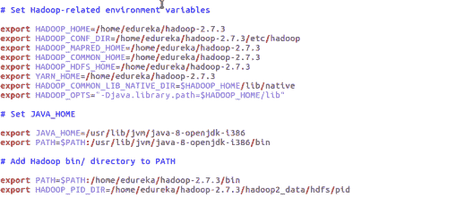
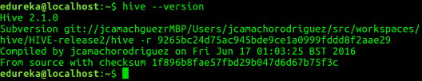
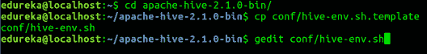
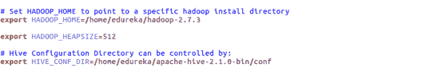
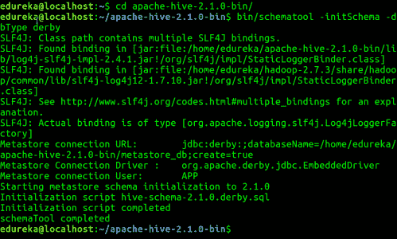
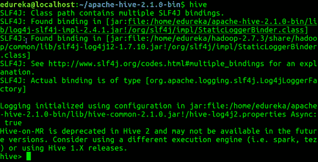

# Ubuntu 上的 Apache Hive 安装

> 原文：<https://www.edureka.co/blog/apache-hive-installation-on-ubuntu>

Apache Hive 是 Hadoop 生态系统中最重要的框架之一，这反过来又使得它对于 [***Hadoop 认证***](https://www.edureka.co/big-data-and-hadoop) 来说至关重要。在这篇博客中，我们将学习 Apache Hive 和在 Ubuntu 上安装 Hive。

## **什么是阿帕奇蜂巢？**

Apache Hive 是一个数据仓库基础设施，便于查询和管理驻留在分布式存储系统中的大型数据集。它建立在 Hadoop 之上，由脸书开发。 **Hive** 提供了一种使用类似 SQL 的查询语言 HiveQL(Hive query Language)来查询数据的方法。

在内部，编译器将 **HiveQL** 语句翻译成 **MapReduce** 作业，然后提交给 **Hadoop 框架**执行。

## **Hive 和 SQL 的区别:**

**Hive** 看起来非常像传统数据库，具有 **SQL** 访问。但是，因为 **Hive** 是基于 **Hadoop** 和 **MapReduce** 操作的，所以有几个关键的区别:

由于 Hadoop 是为长时间顺序扫描而设计的，而 **Hive** 是基于 **Hadoop** 的，所以你会认为查询会有很高的延迟。这意味着 **Hive** 不适合那些需要快速响应时间的应用程序，就像传统 RDBMS 数据库一样。

最后， **Hive** 是基于读取的，因此不适合通常包含高比例写入操作的事务处理。

从 [数据工程师认证](https://www.edureka.co/microsoft-azure-data-engineering-certification-course) 了解更多大数据及其应用。

## **在 Ubuntu 上安装蜂巢:**

请按照以下步骤在 Ubuntu 上安装**Apache Hive**:

**第一步:** 下载**蜂巢焦油。**

**命令:**wget http://archive . Apache . org/dist/hive/hive-2 . 1 . 0/Apache-hive-2 . 1 . 0-bin . tar . gz**T5**

**第二步:** 提取 **tar** 文件。

**命令:【apache-hive-2.1.0-bin.tar.gz】tar-xzf**T2

**命令:** ls


#### **第三步:** 编辑**。bashrc"** 文件来更新用户的环境变量。

**命令:** sudo gedit。巴沙尔

在文件末尾添加以下内容:

***#设定蜂巢 _ 首页***

***导出 HIVE _ HOME =/HOME/edu reka/Apache-HIVE-2 . 1 . 0-bin******导出路径= $ PATH:/HOME/edu reka/Apache-HIVE-2 . 1 . 0-bin/bin***

此外，确保也设置了 hadoop 路径。



运行以下命令，使更改在同一终端中生效。

**命令:**来源。巴沙尔

**第四步:** 检查蜂巢版本。



**第五步:** 在 **HDFS** 内创建 **Hive** 目录。目录**‘warehouse’**是存储与 hive 相关的表或数据的位置。

**命令:**

*   HDFS DFS-mkdir-p/user/hive/warehouse

*   hdfs dfs -mkdir /tmp

**第六步:** 设置表的读/写权限。

**命令:**

在此命令中，我们向组授予写权限:

*   HDFS DFS-chmod g+w/用户/hive/仓库

*   hdfs dfs -chmod g+w /tmp

**第七步:** 在**h**ive-env . sh中设置 **Hadoop** 路径

**命令:** cd apache-hive-2.1.0-bin/

**命令:** gedit conf/hive-env.sh



如下图所示设置参数。



**第八步:** 编辑 **hive-site.xml**

**命令:** gedit conf/hive-site.xml

```
<?xml version="1.0" encoding="UTF-8" standalone="no"?>
<?xml-stylesheet type="text/xsl" href="configuration.xsl"?><!--
Licensed to the Apache Software Foundation (ASF) under one or more
contributor license agreements. See the NOTICE file distributed with
this work for additional information regarding copyright ownership.
The ASF licenses this file to You under the Apache License, Version 2.0
(the "License"); you may not use this file except in compliance with
the License. You may obtain a copy of the License at

http://www.apache.org/licenses/LICENSE-2.0

Unless required by applicable law or agreed to in writing, software
distributed under the License is distributed on an "AS IS" BASIS,
WITHOUT WARRANTIES OR CONDITIONS OF ANY KIND, either express or implied.
See the License for the specific language governing permissions and
limitations under the License.
-->
<configuration>
<property>
<name>javax.jdo.option.ConnectionURL</name>
<value>jdbc:derby:;databaseName=/home/edureka/apache-hive-2.1.0-bin/metastore_db;create=true</value>
<description>
JDBC connect string for a JDBC metastore.
To use SSL to encrypt/authenticate the connection, provide database-specific SSL flag in the connection URL.
For example, jdbc:postgresql://myhost/db?ssl=true for postgres database.
</description>
</property>
<property>
<name>hive.metastore.warehouse.dir</name>
<value>/user/hive/warehouse</value>
<description>location of default database for the warehouse</description>
</property>
<property>
<name>hive.metastore.uris</name>
<value/>
<description>Thrift URI for the remote metastore. Used by metastore client to connect to remote metastore.</description>
</property>
<property>
<name>javax.jdo.option.ConnectionDriverName</name>
<value>org.apache.derby.jdbc.EmbeddedDriver</value>
<description>Driver class name for a JDBC metastore</description>
</property>
<property>
<name>javax.jdo.PersistenceManagerFactoryClass</name>
<value>org.datanucleus.api.jdo.JDOPersistenceManagerFactory</value>
<description>class implementing the jdo persistence</description>
</property>
</configuration>
```

从伦敦 的 [数据工程课程中了解更多大数据及其应用。](https://www.edureka.co/microsoft-azure-data-engineering-certification-course-london)

**第九步:** 默认情况下，Hive 使用 **Derby** 数据库。初始化 Derby 数据库。

**命令:**bin/schematool-init schema-dbType derby



**第十步** : 发射**蜂巢。**

**命令:**蜂巢

**[](https://www.edureka.co/blog/apache-hive-installation-on-ubuntu)**

**第十一步** : 在 Hive shell 中运行几个查询。

**命令:**显示数据库；

**命令:**创建表格员工(id 字符串、姓名字符串、部门字符串)行格式分隔字段，以“”结尾，保存为文本文件；

**命令:**显示表格；


**第十二步:** 退出**蜂巢:**

**命令:**退出；

现在您已经完成了 Hive 安装，下一步是在 Hive shell 上尝试 Hive 命令。因此，我们的下一篇博客“ [***”结合 HQL***](https://www.edureka.co/blog/hive-commands-with-examples) ”中的例子，将帮助你掌握蜂巢命令。

**相关帖子:**

[大数据和 Hadoop 入门](https://www.edureka.co/big-data-and-hadoop "Get started with Big Data & Hadoop")

[如何运行 Hive 脚本？](https://www.edureka.co/blog/how-to-run-hive-scripts/)

[蜂巢命令](https://www.edureka.co/blog/hive-commands-with-examples)

[阿帕奇蜂巢简介](https://www.edureka.co/blog/introduction-to-apache-hive/)