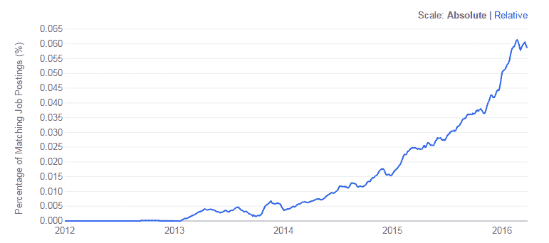
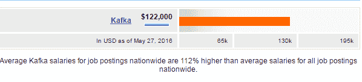
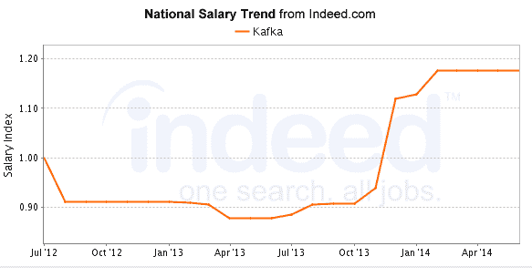

# Apache Kafka:实时分析职业生涯需要什么

> 原文：<https://www.edureka.co/blog/apache-kafka-career>

在这个数字时代，实时收集和分析数据的需求几乎已经成为强制性的，因为决策者已经开始理解反映当前业务状况的实时数据的价值。这在几乎每个工业领域都可以看到。实时数据现在是量化绩效和快速采取必要措施的方法之一。由于这些原因，实时分析越来越受欢迎，在未来的几个月里，我们可以期待见证大数据和分析的巨大转变，从批处理到近实时处理。谈到流处理，Kafka、Storm 和 Spark 等 Apache 项目仍然很受欢迎。这些年来，工程师们也开始将卡夫卡与《风暴》和《火花》进行整合。此外，由 Kafka 创始人创办的新创业公司 Confluent 正在加强 Kafka 游戏。这给全球的阿帕奇卡夫卡带来了大量的职业机会。

在我们进入主题的“实质”之前，让我们快速看一下 Apache Kafka 是什么，它做什么。

## **什么是阿帕奇卡夫卡？**

Kafka 是由 Apache 软件基金会开发的开源消息代理项目，用 Scala 语言编写。Kafka 的目标是为处理实时数据提供一个统一的、高吞吐量、低延迟的平台。Kafka 的设计主要基于事务日志。

当用于正确的用例时，Kafka 具有独特的属性，使其成为数据集成的一个极具吸引力的选项。可伸缩性、数据分区、低延迟以及处理大量不同消费者的能力等特性使其非常适合与数据集成相关的用例。

Kafka 的其他用途是网站活动跟踪、运营指标、日志聚合和流处理。

## **阿帕奇**卡夫卡的流行

Kafka 如此受欢迎，以至于在每天达到 1.1 万亿条消息后，它最近加入了四个逗号俱乐部(1，100，000，000，000–四个逗号…明白了吗？).LinkedIn 部署的 Apache Kafka 已超过 1.1 万亿，是迄今为止任何组织在生产中最大的 Kafka 部署。

Kafka 对 LinkedIn 处理数据的能力产生了严重影响，这些数据以前无法访问，但现在可以自发地进行处理。以前在 LinkedIn 的遗留系统中无法收集的数据，如用户活动数据和日志数据，现在可以使用 Kafka 轻松收集。Kafka 在塑造 LinkedIn 的基础设施以及采用 Kafka 的数百家其他组织的基础设施方面发挥了关键作用。

Dice 最近分析了其在线招聘信息，发现技术技能的需求急剧上升。结果是卡夫卡确实进入了前十名。很明显，卡夫卡的技巧变得至关重要。

## **阿帕奇**卡夫卡职业:

让我们从全球或某种全球的角度来看看卡夫卡的就业趋势。尽管人口普查只涉及英国和美国，但它确实让我们很好地了解了卡夫卡的作品(来源:就业趋势)

从上图可以看出，卡夫卡做得很好。与 2014 年相比，卡夫卡的排名有所上升，工作岗位数量增加了一倍多。

类似的趋势在美国著名的求职门户网站 Indeed 上也观察到了。

## **阿帕奇卡夫卡工资趋势:**

当谈到实时处理时，Kafka 最近成了时髦词。由于需求很大，技术本身也很好，拥有卡夫卡技能的专业人士的薪酬待遇符合行业标准。

事实上，Kafka 专业人员的平均年薪为**12.2 万美元**。这比其他工作的平均工资高出 112%。薪资趋势也表明，自 2015 年初以来，薪资稳步快速增长，目前仍处于上升趋势。

现在我们已经确立了阿帕奇卡夫卡是‘热’的，让我们来看看谁需要有这个技能。

## **谁该学阿帕奇卡夫卡？**

卡夫卡是想学习卡夫卡技巧的人的必备技能，强烈推荐给以下专业人士:

*   希望加速其职业生涯的“Kafka 大数据开发人员”的开发人员。
*   目前从事队列和消息传递系统的测试专业人员。
*   希望将 Kafka 纳入其生态系统的大数据架构师。
*   参与消息系统相关项目的项目经理。

### **结论:**

Apache Kafka 已经成为实时数据分析事实上的标准，LinkedIn 并不是唯一一家利用大量数据流的公司。有了 Kafka，人们可以在大数据分析职业生涯中脱颖而出。

有问题要问我们吗？请在评论区提到它们，我们会尽快回复你，或者今天就加入我们的[卡夫卡认证](https://www.edureka.co/kafka-certification-training)课程。