# Apache Sqoop 教程——在 HDFS 和 RDBMS 之间导入/导出数据

> 原文：<https://www.edureka.co/blog/apache-sqoop-tutorial/>

在开始这篇 Apache Sqoop 教程之前，让我们先回顾一下。你还记得数据摄取的重要性吗，正如我们在之前的博客[***Apache Flume***](https://www.edureka.co/blog/apache-flume-tutorial/)中讨论的那样。现在，正如我们所知，Apache Flume 是一个用于非结构化数据源的数据摄取工具，但是组织将其运营数据存储在关系数据库中。因此，需要一种可以从关系数据库导入和导出数据的工具。这也是 Apache Sqoop 诞生的原因。Sqoop 可以轻松地与 Hadoop 集成，并从 HDFS 上的关系数据库中转储结构化数据，从而增强了 Hadoop 的能力。这也是为什么， ***[大数据和 Hadoop 认证](https://www.edureka.co/big-data-and-hadoop)*** 强制要求具备扎实的 Apache Sqoop 和 Flume 知识。

最初，Sqoop 由 Cloudera 开发和维护。后来，在 2011 年 7 月 23 日，它被阿帕奇孵化。2012 年 4 月，Sqoop 项目被提升为 Apache 的顶级项目。

在这篇 Apache Flume 教程博客中，我们将讨论:

*   [Sqoop 简介](#SqoopIntroduction)
*   [为什么要 Sqoop](#WhySqoop)
*   [Sqoop 特性](#SqoopFeatures)
*   [水槽 vs Sqoop](#FlumeVsSqoop)
*   [Sqoop 架构&工作](#SqoopArchitecture)
*   [Sqoop 命令](#SqoopCommands)

我们将从介绍 Apache Sqoop 开始本 Apache Sqoop 教程。接下来，我们将了解使用 Apache Sqoop 的优势。

## **Apache Sqoop 教程:Sqoop 简介**

通常，应用程序使用 RDBMS 与关系数据库进行交互，因此这使得关系数据库成为生成大数据的最重要来源之一。这种数据以关系结构存储在 RDB 服务器中。在这里，Apache Sqoop 在 [***Hadoop 生态系统***](https://www.edureka.co/blog/hadoop-ecosystem) 中扮演着重要的角色，提供关系数据库服务器和 HDFS 之间可行的交互。

因此，Apache Sqoop 是 [***Hadoop 生态系统***](https://www.edureka.co/blog/hadoop-ecosystem) 中的一个工具，旨在[***【HDFS】***](https://www.edureka.co/blog/hdfs-tutorial)(Hadoop 存储)和关系数据库服务器(如 MySQL、Oracle RDB、SQLite、Teradata、Netezza、Postgres 等)之间传输数据。Apache Sqoop 将数据从关系数据库导入到 HDFS，将数据从 HDFS 导出到关系数据库。它在 Hadoop 和外部数据存储(如企业数据仓库、关系数据库等)之间高效地传输批量数据。

*这就是 Sqoop 得名的原因——“**SQ**L to Had**OOP**&Hadoop to SQL”。*

此外，Sqoop 还用于将数据从外部数据存储导入 Hadoop 生态系统的工具，如[***Hive***](https://www.edureka.co/blog/hive-tutorial/)&[***h base***](https://www.edureka.co/blog/hbase-tutorial)。

现在，我们知道什么是 Apache Sqoop。因此，让我们继续学习 Apache Sqoop 教程，理解为什么组织广泛使用 Sqoop。

## **Apache Sqoop 教程:为什么是 Sqoop？**

对于 Hadoop 开发者来说，在数据被加载到 HDFS 后，真正的游戏才开始。他们玩弄这些数据，以便获得隐藏在 HDFS 存储的数据中的各种洞察力。

因此，对于这种分析，驻留在关系数据库管理系统中的数据需要转移到 HDFS。编写[***MapReduce***](https://www.edureka.co/blog/mapreduce-tutorial)代码将数据从关系数据库导入和导出到 HDFS 的任务是乏味的&繁琐的。这就是 Apache Sqoop 来拯救他们并消除他们的痛苦的地方。它自动化了导入&导出数据的过程。

通过提供导入和导出数据的 CLI，Sqoop 简化了开发人员的工作。他们只需提供基本信息，如数据库认证、来源、目的地、操作等。它负责剩下的部分。

Sqoop 在内部将命令转换成 MapReduce 任务，然后在 HDFS 上执行。它使用 YARN 框架来导入和导出数据，这在并行性之上提供了容错。

在这篇 Sqoop 教程博客中，我们将了解 Sqoop 的主要特性，然后我们将继续学习 Apache Sqoop 架构。

## **Apache Sqoop 教程:Sqoop 的关键特性**

Sqoop 提供了许多显著的特性，例如:

1.  ***满载*** : Apache Sqoop 可以通过一条命令装载整个表。您还可以使用一个命令从数据库中加载所有的表。
2.  ***增量*** ***加载*** : Apache Sqoop 还提供了增量加载的功能，每当表被更新时，就可以加载表的一部分。
3.  ***并行*** ***导入/导出*** : Sqoop 使用 YARN 框架导入和导出数据，在并行之上提供容错。
4.  ***导入*** ***结果******SQL******查询*** :您也可以导入在 HDFS SQL 查询返回的结果。
5.  ***压缩*** :您可以使用 deflate(gzip)算法和–compress 参数，或者通过指定–Compression-codec 参数来压缩您的数据。也可以在 ***Apache Hive*** 中加载压缩表。
6.  ***连接器******for******all******major******RDBMS******Databases***:Apache Sqoop 提供了多个 RDBMS 数据库的连接器，几乎覆盖了整个圆周。
7.  ***Kerberos******安全性*** ***集成*** : Kerberos 是一种计算机网络认证协议，它基于“票证”工作，允许通过非安全网络通信的节点以安全的方式向彼此证明其身份。Sqoop 支持 Kerberos 认证。
8.  ***直接加载*** ***数据******到******HIVE/HBase***:你可以直接加载数据到 ***Apache Hive*** 进行分析，也可以把你的数据转储到 h base，这是一个 NoSQL 数据库。
9.  ***支持*** ***对于******Accumulo***:也可以指示 Sqoop 将表导入 Accumulo 中，而不是 HDFS 的某个目录中。

该架构为 Apache Sqoop 提供了这些优势。现在，我们知道了 Apache Sqoop 的特性，让我们继续了解 Apache Sqoop 的架构&的工作原理。

## **Apache Sqoop 教程:Sqoop 架构&工作**

让我们使用下面的图表来理解 Apache Sqoop 是如何工作的:

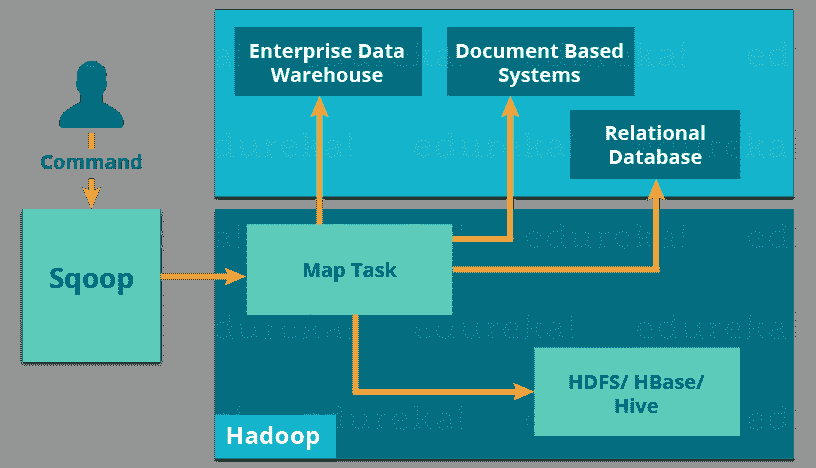导入工具将各个表从 RDBMS 导入到 HDFS。在 HDFS，表中的每一行都被视为一条记录。

当我们提交 Sqoop 命令时，我们的主任务被分成子任务，这些子任务由单独的 Map 任务在内部处理。Map 任务是子任务，它将部分数据导入 Hadoop 生态系统。总的来说，所有地图任务都会导入全部数据。

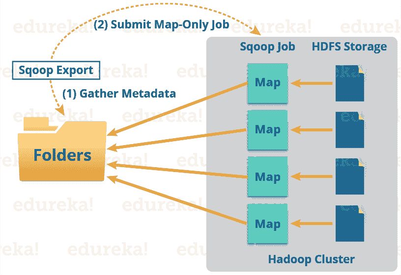导出也以类似的方式工作。

导出工具将一组文件从 HDFS 导出回 RDBMS。作为 Sqoop 输入的文件包含记录，这些记录在表中称为行。

当我们提交作业时，它会被映射到地图任务中，从而从 HDFS 获取大量数据。这些块被导出到结构化数据目标。结合所有这些导出的数据块，我们在目的地接收整个数据，在大多数情况下，目的地是 RDBMS (MYSQL/Oracle/SQL Server)。

在聚合的情况下需要减少阶段。但是，Apache Sqoop 只是导入和导出数据；它不执行任何聚合。映射作业根据用户定义的数量启动多个映射器。对于 Sqoop 导入，将为每个映射器任务分配一部分要导入的数据。Sqoop 在映射器之间平均分配输入数据以获得高性能。然后，每个映射器使用 JDBC 创建与数据库的连接，并获取由 Sqoop 分配的数据部分，并根据 CLI 中提供的参数将其写入 HDFS 或配置单元或 HBase。

现在我们已经了解了 Apache Sqoop 的架构和工作方式，让我们来了解一下 Apache Flume 和 Apache Sqoop 之间的区别。

## **Apache Sqoop 教程:Flume vs Sqoop**

【Flume 和 Sqoop 的主要区别在于:

*   Flume 只将非结构化数据或半结构化数据导入 HDFS。
*   而 Sqoop 可以将结构化数据从 RDBMS 或企业数据仓库导入导出到 HDFS，反之亦然。

现在，在我们的 Apache Sqoop 教程中，是时候学习 Apache Sqoop 命令了。

## **Apache Sqoop 教程:Sqoop 命令**

*   ### **Sqoop——导入命令**

Import 命令用于将一个表从关系数据库导入到 HDFS。在我们的例子中，我们将把表从 MySQL 数据库导入到 HDFS。

正如你在下图中看到的，我们在雇员数据库中有雇员表，我们将把它导入 HDFS。

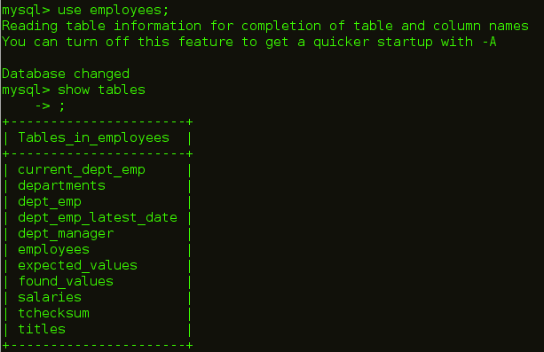

导入表格的命令是:

```

sqoop import --connect jdbc:mysql://localhost/employees --username edureka --table employees

```

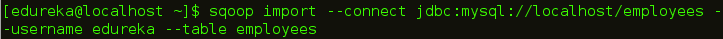

如下图所示，执行该命令后，地图任务将在后端执行。

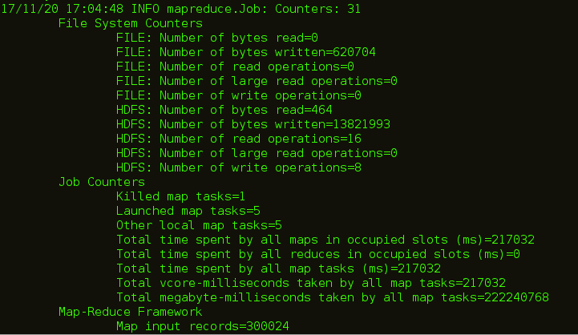

代码执行后，您可以查看 HDFS 的 Web UI，即数据导入的 localhost:50070。

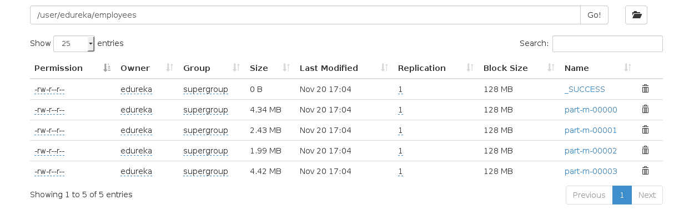

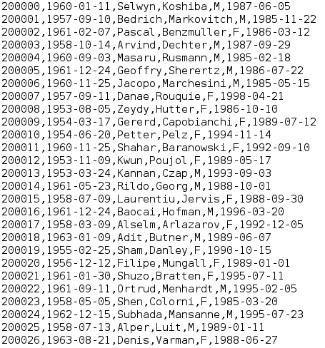

*   ### **sqoop–the import command takes the target directory**

您也可以使用下面的命令将表格导入 HDFS 的特定目录:

```

sqoop import --connect jdbc:mysql://localhost/employees --username edureka --table employees --m 1 --target-dir /employees

```

Sqoop 从大多数数据库源并行导入数据。 *-m* 属性用于指定要执行的映射器数量。

Sqoop 从大多数数据库源并行导入数据。您可以通过使用 *-m* 或*–num-mappers*参数来指定用于执行导入的映射任务(并行进程)的数量。这些参数中的每一个都采用一个与要使用的并行度相对应的整数值。

您可以独立于目录中的文件数量来控制映射器的数量。导出性能取决于并行度。默认情况下，Sqoop 将在导出过程中并行使用四个任务。这可能不是最佳选择，您需要尝试自己的特定设置。额外的任务可能提供更好的并发性，但是如果数据库已经在更新索引、调用触发器等方面遇到瓶颈，那么额外的负载可能会降低性能。

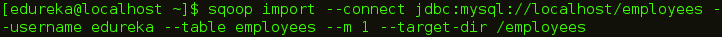

从下图中可以看出，映射器任务的数量是 1。

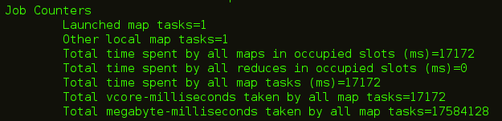

导入 MySQL 表时创建的文件数量等于创建的映射器数量。

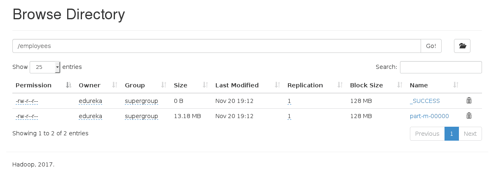

*   ### **sqoop–import command with Where clause**

您可以使用 Sqoop 导入工具中的‘where’子句导入表的子集。它在各自的数据库服务器中执行相应的 SQL 查询，并将结果存储在 HDFS 的目标目录中。您可以使用以下命令导入带有' *where* 子句的数据:

```

sqoop import --connect jdbc:mysql://localhost/employees --username edureka --table employees --m 3 --where "emp_no &gt; 49000" --target-dir /Latest_Employees

```

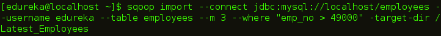

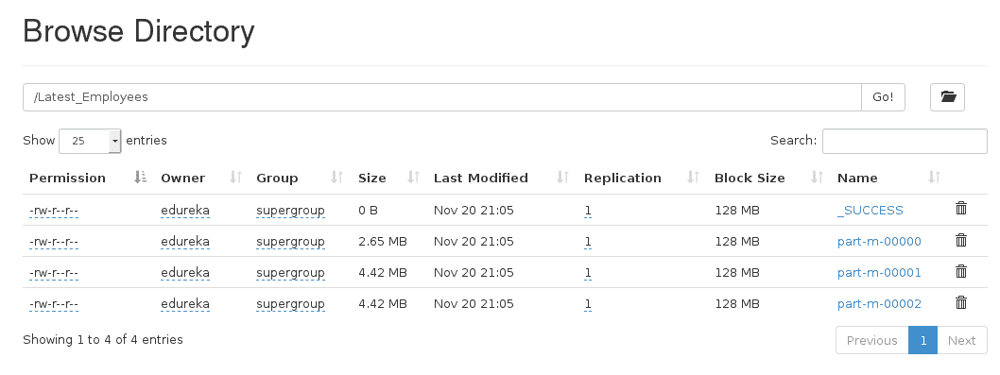

*   ### **Sqoop——增量导入**

Sqoop 提供了一种增量导入模式，可用于仅检索比之前导入的一组行更新的行。Sqoop 支持两种类型的增量导入: *append* 和 *lastmodified* 。您可以使用–incremental 参数来指定要执行的增量导入的类型。

当导入一个新行不断增加行 id 值的表时，您应该指定*追加*模式。用*–check-column*指定包含行 id 的列。Sqoop 导入校验列的值大于用*–最后一个值*指定的值的行。

由 Sqoop 支持的另一种表更新策略叫做 *lastmodified* 模式。当源表的行可能被更新时，应该使用这种方法，每次更新都会将 last-modified 列的值设置为当前时间戳。

当运行后续导入时，您应该以这种方式指定*–最后值*，以确保您只导入新的或更新的数据。这是通过将增量导入创建为保存的作业来自动处理的，这是执行重复增量导入的首选机制。

首先，我们插入一个新行，它将在我们的 HDFS 中更新。

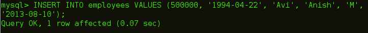

增量导入的命令是:

```

sqoop import --connect jdbc:mysql://localhost/employees --username edureka --table employees --target-dir /Latest_Employees --incremental append --check-column emp_no --last-value 499999

```

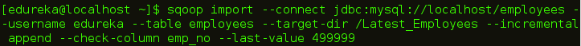

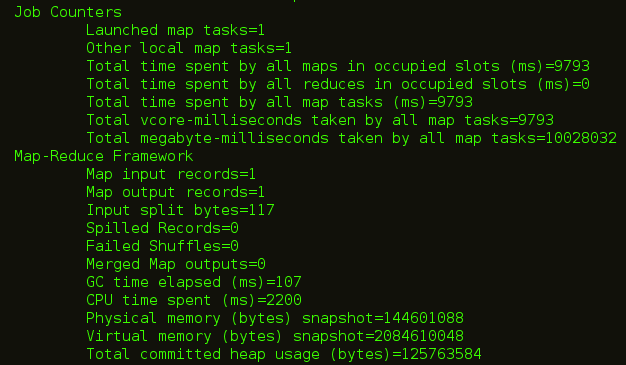

你可以在下图中看到，一个新文件用更新后的数据创建。


*   ### **sqoop–import all forms**

你可以将所有的表从 RDBMS 数据库服务器导入到 HDFS。每个表数据存储在单独的目录中，目录名与表名相同。数据库中的每个表都必须有一个主键字段，这是强制性的。从数据库导入所有表格的命令是:

```

sqoop import-all-tables --connect jdbc:mysql://localhost/employees --username edureka

```

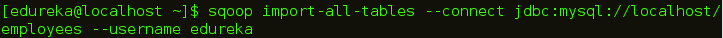

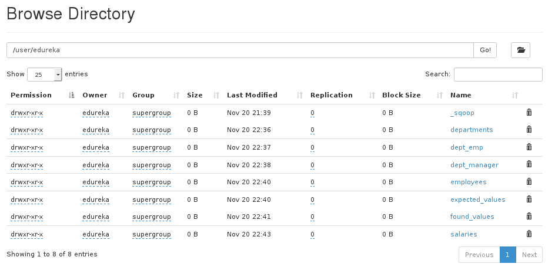

*   ### **sqoop–list database**

您可以使用 Sqoop 列出关系数据库中存在的数据库。Sqoop list-databases 工具针对数据库服务器解析并执行“显示数据库”查询。列出数据库的命令是:

```

sqoop list-databases --connect jdbc:mysql://localhost/ --username edureka

```


*   ### **Sqoop——列表表**

您还可以使用 Sqoop 列出 MySQL 数据库服务器中特定数据库的表。Sqoop list-tables 工具解析并执行“显示表格”查询。数据库列表的命令是:

```

sqoop list-tables --connect jdbc:mysql://localhost/employees --username edureka

```

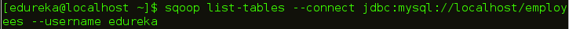

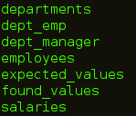

*   ### **Sqoop——导出**

正如我们上面讨论的，您还可以将数据从 HDFS 导出到 RDBMS 数据库。目标表必须存在于目标数据库中。 数据作为记录存储在 HDFS。这些记录被读取、解析并用用户指定的分隔符分隔。 默认操作是使用 insert 语句将输入文件中的所有记录插入到数据库表中。在更新模式下，Sqoop 生成 update 语句，将现有记录替换到数据库中。

因此，首先我们创建一个空表，我们将在其中导出数据。

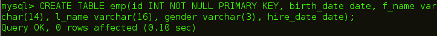

将数据从 HDFS 导出到关系数据库的命令是:

```

sqoop export --connect jdbc:mysql://localhost/employees --username edureka --table emp --export-dir /user/edureka/employees

```

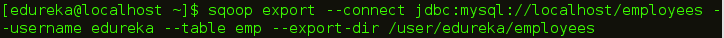

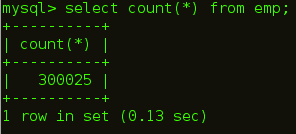

*   ### **Sqoop–Codegen**

在面向对象的应用程序中，每个数据库表都有一个数据访问对象类，它包含初始化对象的“getter”和“setter”方法。Codegen 自动生成 DAO 类。它基于表模式结构用 Java 生成 DAO 类。

生成 java 代码的命令是:

```

sqoop codegen --connect jdbc:mysql://localhost/employees --username edureka --table employees

```

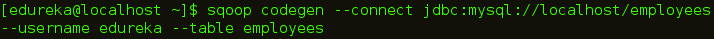

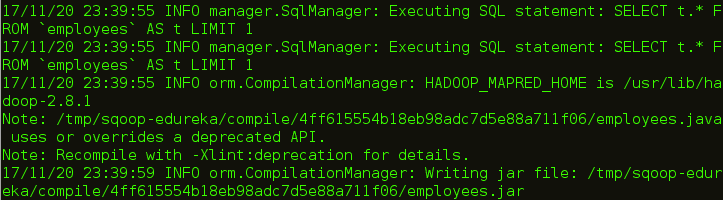

你可以在上图中看到代码生成的路径。让我们走这条路，检查创建的文件。

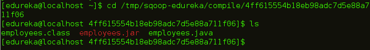

我希望这篇博客能给你带来信息和附加值。如果您有兴趣了解更多信息，可以浏览这个 ***[Hadoop 教程系列](https://www.edureka.co/blog/hadoop-tutorial/)*** ，它告诉您大数据以及 Hadoop 如何解决与大数据相关的挑战。

*现在您已经了解了 Apache Sqoop，请查看 Edureka 的 **[Hadoop 培训](https://www.edureka.co/big-data-and-hadoop)** ，edu reka 是一家值得信赖的在线学习公司，拥有遍布全球的 250，000 多名满意的学习者。Edureka 大数据 Hadoop 认证培训课程使用零售、社交媒体、航空、旅游和金融领域的实时用例，帮助学员成为 HDFS、Yarn、MapReduce、Pig、Hive、HBase、Oozie、Flume 和 Sqoop 领域的专家。*

*有问题吗？请在评论区提到它，我们会给你回复。*