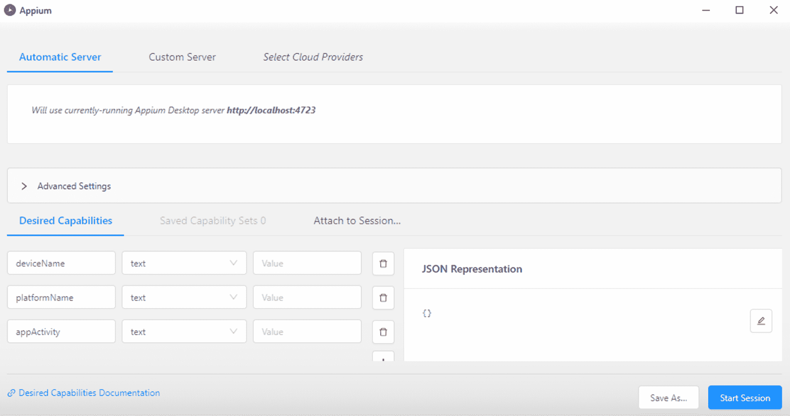
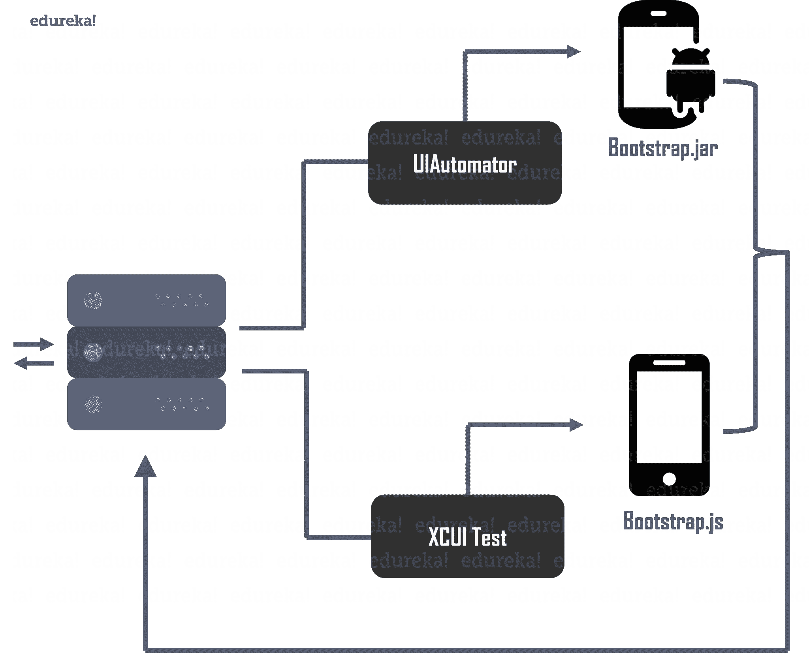
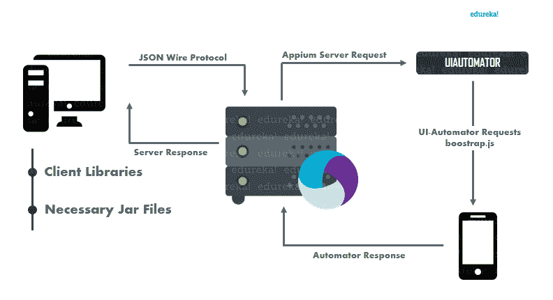
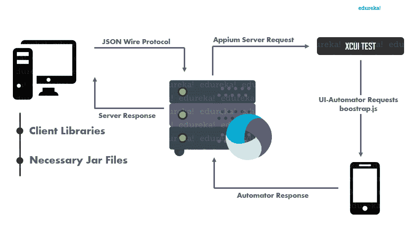

# 建筑的解构

> 原文：<https://www.edureka.co/blog/appium-architecture/>

了解一个工具的内部工作方式和架构很有帮助，尤其是如果你每天都在使用这个工具的话。错误修复和故障排除变得轻而易举，您可能会经常发现自己以新的和创造性的方式使用相同的平凡工具。在这篇文章中，我将写关于 **Appium** 的架构，这是一个在移动应用程序自动化测试领域广泛使用的工具。Appium 作为一种工具的成功证明了业内对 [Appium 专家](https://www.edureka.co/appium-training-mobile-automation-testing)的巨大需求。

在这个 Appium architecture 博客中，你将会经历以下主题:-

1.  [什么是 Appium？](#what_is_appium)
2.  
3.  [JSON 线协议](#JSON_Wire_Protocol)
4.  
5.  
6.  [iOS 上的 Appium](#appium_on_iOS)

## Appium 架构讲解| Appium 工作原理| app ium 在线培训| Edureka

[//www.youtube.com/embed/oPbVESfiiyE?rel=0&showinfo=0](//www.youtube.com/embed/oPbVESfiiyE?rel=0&showinfo=0)

这个 edu reka“Appium 架构”视频将解释 appi um 架构的关键组成部分。您将会理解所有这些元素是如何被编织在一起，形成一个最成功的自动化测试工具。

在我们深入 Appium 的架构之前，我只是为第一次访问我的[自动化测试博客系列](https://www.edureka.co/blog/category/software-testing/)的读者提供一个关于 Appium 的简要介绍。

## **什么是 Appium？**

[Appium](https://www.edureka.co/blog/appium-tutorial/) 是一款开源、跨平台的[自动化测试工具](https://www.edureka.co/blog/software-testing-tools/)。它目前致力于为运行在 Android 和 iOS 上的移动应用程序提供无缝自动化测试体验。

Appium 是一个服务器，使用 [node.js](https://www.edureka.co/blog/nodejs-tutorial/) 编写。几年前，Appium 是一个只有 CLI 的工具，它主要是使用节点包管理器安装的。归功于开发团队最近的开发，Appium 发布了一个基于 GUI 的桌面应用程序，可以安装在各种 Linux 发行版、微软 Windows 和 MAC OSx 上。Appium 的当前版本可以从 [Appium 的官方网站](http://appium.io/)下载。

值得一提的是，Appium 是一款跨平台应用:

*   Appium 可以用来测试移动应用程序，无论它们运行在 iOS 还是 Android 上。
*   Appium 可用于测试混合、本地和网络应用
*   Appium 运行在 Windows、Linux 和 MAC 上

现在让我们回顾一下关于 Appium 的一些关键概念，这将有助于您轻松理解其架构。

## **Appium Concepts**

在下面的部分，我们将讨论 Appium 架构中固有的三个关键概念。

### **Appium 客户端服务器架构**

Appium 的核心是一个用 node.js 编写的服务器，服务器采用客户端-服务器架构工作。根据客户端-服务器架构，客户端连接到服务器以利用服务器上托管的任何服务。客户端和服务器之间的任何通信都是以响应和请求的形式进行的。

在 Appium 中，客户端向 Appium 服务器发送有关自动化的请求。服务器以自己独特的方式处理请求，然后用测试结果或日志文件来响应。

### **Appium Sessions**

一切‘测试’，都是封装在一个会话中完成的。鉴于 Appium 是一个简单的基于客户端和服务器的机制，这一点非常明显。客户端向服务器发送 post 请求，**，也称为会话请求**。这些请求以 JSON 对象格式携带信息，并且使用 JSON Wire 协议执行通信。

### **期望能力**

Appium 在 iOS 和 Android 上的工作方式不同。既然它是一个“跨平台”工具，那么必须存在一种机制来区分两个操作系统的会话请求。这个特殊的问题陈述也在 JSON 对象的帮助下得到解决，JSON 对象被称为*期望的能力，*，如下图所示。

 期望的能力是区分用于测试 Android 应用的会话的建立和用于测试 iOS 应用的会话的建立的键值对信息。同论据一样- 

*   *平台名称*
*   *设备名称*
*   *app package*

对于服务器来说，区分两种操作系统变得相当容易。

了解了这几个关键概念之后，让我们来看看 JSON Wire 协议。

## **JSON 线协议**

JSON Wire 协议是用于客户端和服务器之间通信的机制。它是由[网络驱动](https://www.edureka.co/blog/selenium-tutorial)开发者开发的。根据他们的说法，该协议是一组标准化的端点，使用 RESTful API 向客户端公开。这允许 webdriver 与服务器和客户机建立通信以执行自动化。 Appium 使用移动 JSON Wire 协议，这是对 Selenium JSON Wire 协议的扩展。它用于控制不同的手机行为，而不仅仅是建立一个通信流。

现在让我们深入了解 Appium 架构。

## **Appium 建筑**

好的，正如我所承诺的，如果你已经通读了上面讨论的概念，那么掌握这个架构将是轻而易举的事情。为了更简单，让我以逐点的方式记下架构:

*   Appium 是一个 *HTTP 服务器* 使用*node . js*编写
*   客户端使用会话与服务器通信，其中通信过程的关键元素借助 *JSON* 对象发送。通信由移动 JSON 有线协议处理。
*   服务器使用*desired capabilities*参数区分 iOS 请求和 Android 请求。
*   Appium 服务器随后处理对各个 UI 自动机的请求，如下面的 **Appium 架构图**所示。
*   UI 自动机然后处理请求并在 *模拟器* / *仿真器* / *真实设备* 上执行命令。
*   然后，使用移动 JSON Wire 协议，将测试会话的结果以日志的形式传递给服务器，然后返回给客户端系统。

   Appium 在 Android 和 iOS 的执行方面略有差异。让我们看一看。

Android 上的 Appium 使用 UIAutomator 框架来实现自动化。UIAutomator 是 android 为自动化目的构建的框架。那么，让我们来看看 Appium 在 Android 上的确切工作方式。

1.  [Appium 客户端](https://www.edureka.co/blog/appium-installation/)(c/[Java](https://www.edureka.co/blog/java-tutorial/)/[Python](https://www.edureka.co/blog/python-tutorial/)/etc)连接 Appium 服务器，通过 JSON Wire 协议进行通信。
2.  然后，Appium Server 为客户端创建一个自动化会话，并检查客户端所需的功能。然后，它与各个供应商提供的框架(如 UIAutomator)相连接。
3.  然后，UIAutomator 将与运行在模拟器/仿真器/真实设备中的 bootstrap.jar 进行通信，以执行客户端操作。
4.  在这里， **bootstrap.jar** 扮演了一个 TCP 服务器的角色，我们可以使用它来发送测试命令，以便使用 UIAutomator 在 Android 设备上执行操作。

下面的 **Appium android 架构**图直观地展示了上述步骤。

## **iOS 上的 Appium**

在 iOS 设备上，Appium 使用苹果的 XCUI 测试 API 与 UI 元素进行交互。XCUITest 是苹果 XCode 附带的自动化框架。

1.  Appium 客户端(c/Java/Python/etc)连接 Appium 服务器，通过 JSON Wire 协议进行通信。
2.  然后，Appium Server 为客户端创建一个自动化会话，并检查客户端所需的功能，同时连接各个供应商提供的框架，如 XCUI Test。
3.  然后，XCUI 测试将与运行在模拟器/仿真器/真实设备中的 bootstrap.js 进行通信，以执行客户端操作。
4.  **Bootstrap.js** 将对我们正在测试的应用程序执行操作。执行完命令后，客户端将消息发送回 Appium 服务器，其中包含所执行命令的日志详细信息。

下面的 **Appium iOS 架构**图直观地展示了上述步骤。

这让我们结束了这场“Appium archi

建筑”博客。这是我在移动应用程序测试系列中的许多博客之一。如果你有兴趣阅读其他一些关于各种趋势技术的博客，你可以看看我们的[博客目录](https://www.edureka.co/blog/)。如果你希望学习[软件测试](https://www.edureka.co/blog/what-is-software-testing/)并建立一个丰富多彩的职业生涯，那么看看我们的 [***Appium 课程***](https://www.edureka.co/appium-training-mobile-automation-testing) ，它带有讲师指导的现场培训和真实的项目经验。本培训将帮助您深入理解使用 Appium 进行软件测试，并帮助您掌握该主题。

有问题要问我们吗？请在这个“Appium 建筑”博客的评论部分提到它，我们会尽快回复您。