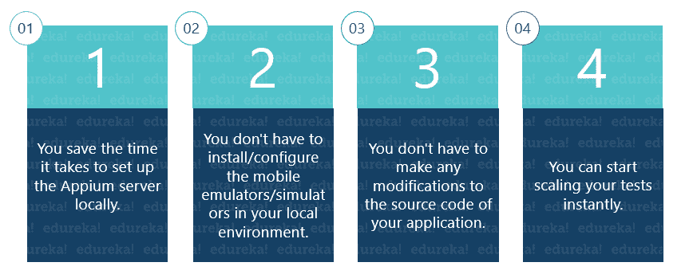
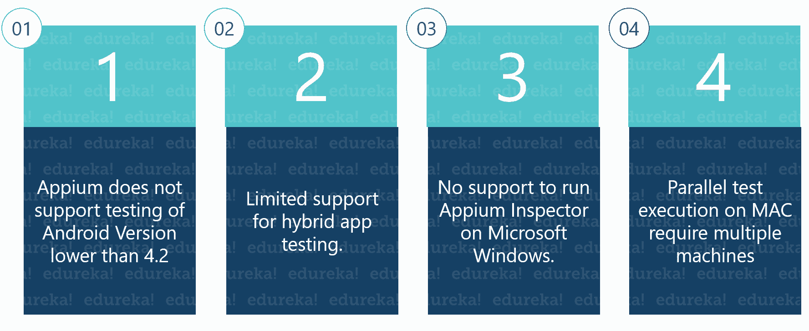
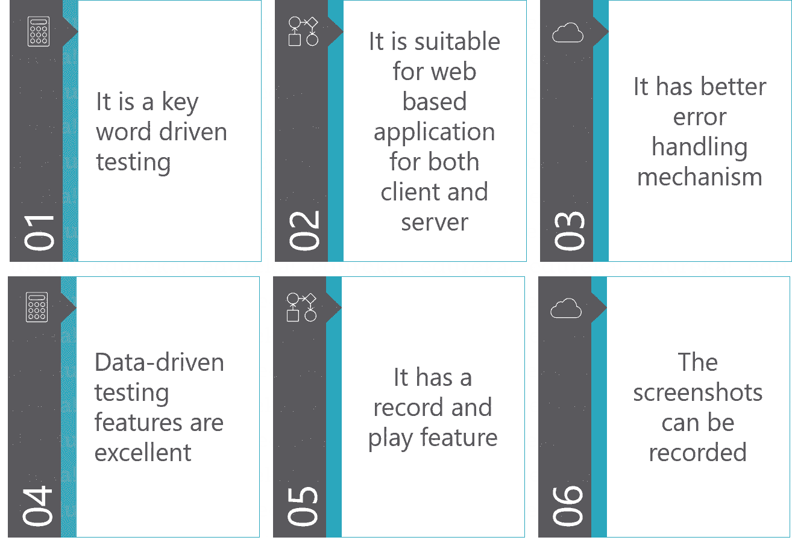
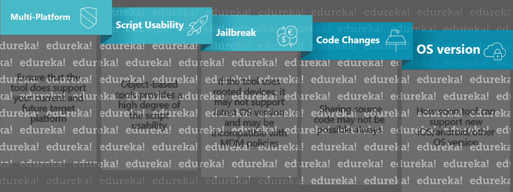
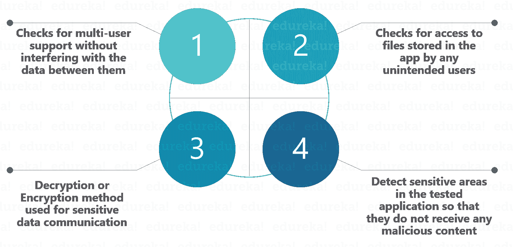

# 2023 年你必须准备的 50 个面试问题

> 原文：<https://www.edureka.co/blog/interview-questions/appium-interview-questions/>

Appium 已经在移动应用测试行业得到广泛认可。测试作为一门学科在当今世界已经变得非常重要，这样企业级的应用程序就可以被交付。这导致了对精通 Appium 的专业人士的需求。然而，这个博客的目的是让你准备好在求职面试中可能会遇到的与 Appium 相关的问题。

下面你会发现 50 个不同的面试问题，它们被分为:

*   [易题](#easy)
*   [中级题](#medium)
*   [进阶题](#hard)

This will make sure you’re thoroughly prepared for any sort of question you might face.

## Appium 面试问答| Edureka

[//www.youtube.com/embed/GEo6v9JAdmo?rel=0&showinfo=0](//www.youtube.com/embed/GEo6v9JAdmo?rel=0&showinfo=0)

这个 Edureka 关于 50 强 Appium 面试问题的视频将帮助你准备软件测试面试。它涵盖了初学者、中级和有经验的专业人士的问题。

## **易题**

### **问题 1。什么是移动应用测试，它与移动测试有什么不同？**

[移动应用测试](https://www.edureka.co/blog/mobile-application-testing/) (MAT)是对移动设备上的应用进行测试，它与移动测试(MT)的不同之处在于，在 MT 中，我们关注的是移动设备的原生应用特性，如通话、短信、媒体播放器等。同时，在 MAT 中，我们只关注被测应用程序的功能性&特性。

### **问题 2。解释模拟器和仿真器的区别？**

仿真是模仿表面上可观察到的行为以匹配现有目标的过程。仿真机制的内部状态不必精确地反映它正在仿真的目标的内部状态。

另一方面，模拟涉及对目标的底层状态进行建模。好的模拟的最终结果是模拟模型将模拟它正在模拟的目标。

理想情况下，你应该能够观察模拟，并观察如果你观察原始目标也会看到的特性。实际上，由于性能原因，模拟有一些捷径，也就是说，模拟的一些内部方面实际上可能是仿真。

### **问题 3。列出手机应用测试的类型。**

The types of mobile app testing include:

*   可用性测试
*   兼容性测试
*   接口测试
*   服务测试
*   低级资源测试
*   [性能测试](https://www.edureka.co/blog/performance-testing-tutorial/)
*   运行测试
*   安装测试
*   安全测试

**Question 4\. Explain the general structure of mobile application testing frameworks?**

移动应用测试框架包括三个部分:

**应用包:** 是需要测试的目标应用。

**Instrumentation test runner:**它是一个测试用例运行器，在目标应用上运行测试用例。它包括一个用于构建测试的 SDK 工具和一个为编写控制 Android 设备的程序提供 API 的工具，例如 MonkeyRunner。

**测试包:** 它包括两个类，测试用例类，和模拟对象。测试用例类包括在目标应用程序上执行的测试方法，而模拟对象包括将被用作测试用例的样本输入的模拟数据。

### **问题 5。提及移动测试时发现的常见 bug 有哪些？**

### **第六题。各种应用程序扩展的完整形式。**

*   **iPA:** iOS 应用商店包
*   **APK:** 安卓应用包文件
*   **exe:** 执行文件
*   **jad:**Java 应用描述符
*   **prc:** 掌上资源编译器

**Question 7\. Mention the Different Types of Mobile Applications.**

移动应用可以大致分为三类，即原生应用、网络应用和混合应用。

**Native App:**Native App 是专门为一个平台开发的，用特定的编程语言编码(像 iOS 的 Objective C，【Android 的 Java )，直接安装到设备上，可以充分利用设备的所有特性。本地应用可以使用设备的通知系统，并且可以离线工作。原生应用通过应用商店(如 Google Play 或苹果的应用商店)安装。原生移动应用提供了快速的性能和高度的可靠性。本地应用的例子:Temple Run、Candy Crush 等。

**Web App:** Web 应用是专门为移动设备设计、定制和托管的移动门户网站。使用 URL 通过移动设备的网络浏览器访问它们。当 HTML5 出现时，Web 应用程序变得非常流行，人们意识到他们可以在浏览器中获得类似本机的功能。移动 web 应用程序不能使用设备功能。web app 的例子:google.com、m.snapdeal.com、m.yahoo.com 等。

**混合应用:** 混合应用是嵌入在一个原生应用中的 web 应用，运行在设备上，用 web 技术编写(HTML5、CSS、 [JavaScript](https://www.edureka.co/blog/what-is-javascript/) )。混合应用在本地容器中运行，并利用设备的浏览器引擎(而不是浏览器)来呈现 HTML 并在本地处理 JavaScript。web-to-native 抽象层支持访问移动 web 应用中无法访问的设备功能，如加速度计、摄像头和本地存储。混合应用**不**依赖于任何平台或任何特定的移动设备。因此，它可以在任何设备上运行。混合应用的例子:Flipkart、脸书、Twitter 等。

**Question 8\. What is the Appium philosophy?**These are the four philosophies [Appium](https://www.edureka.co/blog/what-is-appium/) is based around-

*   测试你提交给市场的同一个应用
*   使用任何框架，用任何语言编写你的测试
*   使用标准自动化规范和 API
*   建立一个庞大而繁荣的开源社区

### **问题 9。在你看来 Appium 最强的一点是什么？**

Appium 基于谷歌设计的用于自动化浏览器的 HTTP 协议 [Selenium](https://www.edureka.co/blog/selenium-tutorial) 。这个想法实际上非常好，因为自动化一个应用程序(尤其是基于 webview 的应用程序)与自动化一个浏览器并没有太大的不同(就所需的 API 而言)。

Appium 还被设计成鼓励两层架构:一台机器运行用一种语言编写的测试(C#、[、Ruby](https://www.edureka.co/blog/ruby-on-rails-tutorial/) 、JavaScript 只是众多受支持语言中的几个)，另一台机器(测试服务器)实际执行它。此外，WebDriver 协议的目标是可伸缩性(因为基于 HTTP)，这使得 Appium 也非常可伸缩；请记住，您将需要编写一次测试，Appium 将负责在更多平台上执行它。

### **问题 10。什么是 Appium？**

Appium 是一款开源、跨平台的 [自动化](https://www.edureka.co/blog/rpa-tutorial/) 测试工具。它用于自动化本地、混合和 web 应用程序的测试用例。该工具主要关注 Android 和 [iOS 应用](https://www.edureka.co/blog/swift-tutorial) ，并且仅限于移动应用测试领域。最近，几个更新回来，Appium 还宣布，他们将支持 windows 桌面应用程序的测试。Appium 由 Sauce Labs 开发和维护。目前，Appium 版本 1.10 正在分发。Appium 最初是作为基于命令行的测试服务开始的，可以使用 [Node.js](https://www.edureka.co/blog/nodejs-tutorial/) 进行安装。在他们最新发布的名为“Appium desktop”的版本中，他们发布了一个强大而精致的工具，具有直观的图形用户界面。

### **问题 11。在酱料实验室上使用 Appium 的主要优势是什么？**

### **问题 12。列出所有的能力。**

**Appium 能力有:**

*   测试网
*   为本地和混合移动自动化提供跨平台
*   支持 JSON 有线协议
*   不需要重新编译 App
*   支持在物理设备以及模拟器或仿真器上进行自动化测试
*   它不依赖于移动设备

### **问题 13。你能评论一下 Appium 的表现吗？**

Appium 不是一个很大的应用程序，只需要很少的内存。它的架构实际上非常简单和轻便，因为 Appium 就像您的测试机器和每个平台自动化工具包之间的代理。一旦启动并运行，Appium 将监听来自您的测试的 HTTP 请求。创建新会话时，Appium 的 Node.js 代码中一个名为 *_proxy_* 的组件会将这些 Selenium 命令转发给活动的平台驱动程序。

例如，在 Android 的情况下，Appium 会将传入的命令转发给[chromedriver] (90%的情况下，Appium 甚至不会在路由命令时更改命令)，这是因为 [ChromeDriver 支持 WebDriver 和 Selenium](https://www.edureka.co/blog/selenium-chromedriver-and-geckodriver/) 。出于这个原因，Appium 本身不会分配太多内存，你会看到很多内存是由其他进程分配的，如[adb]，ChromeDriver 或 iOS automation toolkit(在测试和自动化时由 Appium 调用)。

### **问题 14。列出使用 Appium 的限制？**

### **第 15 题。在 Appium 上运行测试需要服务器吗？**

No! Appium promotes a 2-tier architecture where a test machine connects to a test server running Appium and automating the whole thing. However this configuration is not mandatory, you can have Appium running on the same machine where your test runs. Instead of connecting to a remote host, your test will connect to Appium using the loopback address.

## **中级题**

### **第 16 题。什么类型的测试适合 Appium？**

谈到测试，尤其是基于 webview 的应用，有很多场景可以测试，这也取决于你想要确保的功能覆盖范围。Appium 对于测试用户在使用你的应用时将要经历的场景非常方便。

但是，如果你需要测试比 UX 更简单的相互作用，那么 Appium 将成为一个限制。想想像键盘输入这样的功能。当涉及复杂的触摸/键盘混合场景时就不那么容易了，错误失败的概率很高；请不要误解我的意思:我并不是说这不可能做到，只是没有你想象的那么简单！

Appium 的另一个小噩梦是交换数据。当你的测试需要和你的 app 交换数据的时候(尤其是传入方向)，你就需要玩点花样了。因此，请始终考虑发送和接收信息并不那么简单。这不是 Appium 的错，WebDriver 规范是为自动化设计的，而不是交换数据！

### **第 17 题。列举一些跨平台测试面临的问题？**

一般来说，问题取决于不同的操作系统/设备版本。同样的应用程序可能在一个操作系统上运行，而在另一个版本上可能不运行。例如，我们面临的一个问题是，我们的应用程序在 iOS 6.x 版本的设备上运行良好，但在 iOS 5.x 设备上点击几个模块时，应用程序崩溃了，同样的情况也发生在 2.3.5 Vs.

### **第 18 题。解释 Appium 的设计理念。**

*   Appium 是使用 Node.js 平台编写的“HTTP 服务器”，使用 Webdriver JSON wire 协议驱动 iOS 和 Android 会话。因此，在初始化 Appium 服务器之前，Node.js 必须预先安装在系统上
*   当 Appium 被下载并安装后，一个服务器就被安装在一个公开 REST API 的机器上。
*   它接收来自客户端的连接和命令请求，并在移动设备(Android / iOS)上执行该命令
*   它用 HTTP 响应来回应。同样，为了执行这个请求，它使用移动测试自动化框架来驱动应用程序的用户界面。
*   用于 iOS 的 Apple Instruments(仪器仅在 Xcode 3.0 或更高版本以及 OS X v10.5 和更高版本中可用)。
*   【Android API 级或更高级别的 Google UIAutomator】
*   【Android API 级以下的 Selendroid】

### **第 19 题。我已经对我的应用程序进行了特定于平台的测试，我应该做些什么来迁移到 Appium？**

不幸的是，没有神奇的公式将您的测试转化为硒测试。如果您在不同的层上开发了一个测试框架，并且遵守了良好的编程原则，那么您应该能够在测试中对一些组件进行操作，以便将您的套件迁移到 Appium。

如果您当前的测试已经使用了自动化框架或者类似于基于命令的交互，那么它们将会很容易移植。说实话，您可能需要从头开始编写测试。

### **第 20 题。执行端到端移动测试时，需要考虑哪些主要标准？**

主要领域有

*   应用程序的安装。
*   第一次在无法访问网络的情况下启动应用程序。
*   卸载应用程序。
*   如果支持，应用程序的方向。
*   在不同种类的设备和网络场景下测试应用性能。
*   测试应用程序响应，以及在提供无效用户凭证时它如何响应。

另外，如果您的应用程序正在访问任何网络，那么您必须检查在此期间生成的日志，以便敏感信息始终以加密形式存在。

### **问题 21。你如何测试一个已经在生产中的应用程序的补丁？**

我们通常会对相关模块进行[回归测试](https://www.edureka.co/blog/regression-testing)，主要关注与开发者提供的 bug 修复相关的领域。这是因为我们不能在很短的时间内执行完整的回归测试。因此，我们只对应用程序的其余部分执行[健全性测试](https://www.edureka.co/blog/smoke-testing-and-sanity-testing)，但只针对高优先级设备。高优先级设备是运行最新版本操作系统的系统。

### **问题 22。对于一般的应用程序，您会执行什么样的测试？**

我们要进行的第一项测试是安装。之后，我们检查基本功能，然后检查应用程序与其外设的连接性。然后，我们卸载构建，并验证当我们在安装期间中断它时，应用程序如何响应。我们还检查应用程序请求网络调用时的中断场景。

我们还会在网络通话期间执行低网络/差连接测试。还测试了从旧版本升级到新版本的过程。在没有网络的应用中导航是在一般测试中测试的重要特征。此外，应用程序在不同类型手机上的兼容性是一般测试的一个主要标准。

### **问题 23。用 Appium 写一个测试需要多少时间？**

当然，要看考试。如果您的测试只是运行一个场景，那么它将使用与需要执行的交互数量一样多的命令(因此只有很少的几行)。如果你试图交换数据，那么你的测试肯定会花费更多的时间，测试也会变得难以阅读。

### **第 24 题。Appium 支持哪些测试框架？**

Appium 不支持测试框架，因为不需要支持。您可以将 Appium 用于各种测试框架。努尼特和。NET 单元测试框架只是几个例子。您将使用 Appium 的一个驱动程序来编写您的测试，因此您的测试将与 Appium 接口，就外部依赖而言。

### **第 25 题。什么是数据交换？**

当我说“数据交换”时，我并不是指获取或设置文本框或元素属性的值。所有这些都很容易在 Appium 中实现，因为 Selenium 提供了相应的命令。我所说的“数据交换”是指交换由复杂对象托管的信息，这些复杂对象存储在基于 webview 的应用程序的不同部分，如 window 对象。

当您分派和捕获事件时，请考虑场景。你的应用程序可以执行许多功能，处理数据流的方式也很多。一些对象可能也有一个状态，在你的应用程序中，一些场景背后的状态机可能很大，而且是铰接的。由于所有这些原因，您在测试时可能会遇到问题。

### **第 26 题。Quick Test Pro(qtp)有什么特点和好处？**

**以下是快测 Pro 的特点和好处:**

### **第 27 题。考虑一个场景，你不想建立一个完整的基础设施，也不想花钱。Appium 能在这种情况下提供帮助吗？**

如果你仔细想想，真正需要的是测试脚本。您必须在某个地方部署 Appium 服务器的事实只是一个额外的特性。 如果你想跳过这一部分，你可以依赖一些已经为你的测试部署了整个 Appium 服务器架构的 web 服务。其中大部分是在线实验室，它们支持 Selenium 和 Appium。这样，您就不会花费过多的资金，也不会在新的基础设施上投入时间和精力。

### **第 28 题。调试 Appium 难吗？**

不是，Appium 是 Node.js 应用，因此，本质上是 Javascript。该代码可以在 GitHub 上获得，并且可以在几秒钟内下载，因为它很小，也不复杂。根据您要调试的内容，您可能需要更深入地体验调试。然而，有一些关键点设置断点总是值得的，例如，代理组件值得一提。在**appi um/lib/server/proxy . js**中，您可以在函数 **doProxy(req，res)** 中设置一个断点，每次将命令发送到平台特定的组件以转换为自动化命令时，都会命中该断点。

### **第 29 题。提及编写应用程序测试的基本要求。**

**写应用题你需要:**

*   **驱动客户端:** Appium 像用户一样驱动移动应用。使用客户端库，您可以编写 Appium 测试，这些测试包装了您的测试步骤，并通过 HTTP 将它们发送到 Appium 服务器。
*   **应用程序会话:** 你必须首先初始化一个会话，因为这样的应用程序测试就发生在那个会话中。一旦一个会话的自动化完成，就可以结束了。
*   **所需功能:** 要初始化应用程序会话，您需要定义某些称为“所需功能”的参数，如平台名称、平台版本、设备名称等。它指定了从 Appium 服务器需要的自动化类型。
*   **驱动命令:** 你可以使用大量的、富有表现力的命令词汇表来编写你的测试步骤。

### **第 30 题。自动化测试的相关风险是什么？**

**自动化测试的风险有:**

*   **你有熟练资源吗？** 自动化测试需要具备一些编程知识的资源。首先，关注资源，然后识别资源是否具有自动化测试的适当知识。他们能够轻松适应新技术吗？这些措施对于建立一个自动化测试团队是很好的评估。
*   **自动化的初始成本很高。** 对于初始设置来说，自动化的初始成本太高。它包括购买自动化工具的成本，测试脚本的培训和维护。对于自动化测试他们的产品，不满意的客户群很高。应该确保成本补偿测试结果。
*   **如果 UI 不固定，就不要考虑自动化:** 在自动化用户界面之前，应该强烈确定 UI 是否在大范围变化，或者自动化脚本维护的成本是否很高。
*   **停止自动化运行一次的测试** :确保某些测试用例可能运行一次，并且不包括在回归测试中。避免自动化这样的测试模块。

### **问题 31。没有 Appium 怎么运行 Android 测试？**

对于旧版本的 Android，Appium 可能不被支持。例如，Appium 仅支持 Android 4.4 或更高版本的移动 Web 应用程序测试，Android 2.3、4.0 和更高版本的移动本地应用程序和移动混合应用程序测试。

对于那些不支持 Appium 的版本，可以请求 Webdriver 和 Selendroid 驱动的模拟器。您所需要做的就是，使用平台配置器并为 API 选择 Selenium 而不是 Appium。 在酱实验室测试中，你会注意到模拟器顶部写着“AndroidDriver Webview App”。此外，您会注意到您将获得一个“Selenium Log”选项卡，其中包含 Selenium droid 驱动程序的输出。

有了 Webdriver &驱动的模拟器，你将只能测试移动 Web 应用。你应该能够选择从 4.0 到最新版本的任何 Android 模拟器版本和任何 Android 模拟器皮肤(如“设备名称”:“三星 Galaxy Tab 3 模拟器”)。

### **问题 32。没有 Appium 怎么运行 iOS 测试？**

对于旧版本的 iOS，Appium 可能不被支持。例如，Appium 支持 6.1 及更高版本的 foriOS。对于 iOS 的早期版本，用于驱动移动应用程序自动化测试的工具或驱动程序称为 iWebdriver。

要获得由 iWebdriver 驱动的模拟器，请使用平台配置器并为 API 选择 Selenium，而不是 Appium。使用由 iWebdriver 驱动的模拟器，您将只能测试移动 Web 应用程序。此外，在 Sauce Labs 测试中，您会注意到一个“Selenium Log”选项卡，其中有 iWebdriver 的输出。

### **问题 33。** **你能解释一下你在检查日志时创建的过滤器吗？**

过滤器可帮助您找到应用程序的相关信息，您可以根据应用程序包名称(如*com.abc.com)创建过滤器。*你可以用任何名字保存这个过滤器。当您单击此过滤器时，您将只能看到来自您的应用程序的那些日志。

您可以基于与特定代码行相关的**日志标签**创建一个过滤器，例如，如果您已经放置了 *system.out* 来打印输出，那么您可以通过标签 *System.out.* 创建一个过滤器，然后它将列出代码中的所有打印输出。Y 你可以通过**编舞**创建一个过滤器，如果你想看的话，它可以帮助你找到被跳过的帧。 您可以创建与您的 **PID** 和**日志消息**相对应的过滤器。

### **第 34 题。提及移动测试自动化工具的选择标准。**

对于移动测试，[测试自动化工具](https://www.edureka.co/blog/software-testing-tools/#AutomationTestingTools)应该有以下标准

** **  

### **第 35 题。列出测试人员在云计算中执行移动测试时面临的最常见问题？**

**测试人员在进行移动测试时面临的挑战有:**

*   订阅模式
*   高成本
*   锁定
*   互联网连接问题
*   基于图像的自动化测试耗费大量时间。
*   自动化受到框架的限制

### 问题 36:你更喜欢在什么设备上测试你的应用——真实设备还是使用模拟器/仿真器？

这是面试中最常被问到的问题之一。回答这个问题时，你得有点逻辑和实际。不要简单地回答“这取决于你需要什么。”，因为这将是一个外行人的回答，面试官不会从你这里期待。相反，你应该用一个例子来解释。你可以回答说，在真实设备上测试总是最好的。因为它可以让你捕捉错误，否则你可能检测不到，但是，你必须用 Appium 服务器智能地配置设备，以便它可以检测设备。有时 ADB(Android Debug Bridge)可能会与设备断开连接，即使它仍然插着电源，这可能会导致您的测试失败。要处理这样的问题，您可以编写一个模块，在重新连接到设备一段时间后重置 ADB。

### **问题 37:什么是 Appium Inspector，为什么要用它？**

类似于 [Selenium IDE](https://www.edureka.co/blog/selenium-ide) 插件，启用 Appium 中的录制和回放支持。它通过检查 DOM 来捕捉本地应用程序的动作，并以任何期望的语言生成测试脚本。但是，Appium Inspector 不支持 Windows，使用**<*****ui automator*****>**查看器。

### **问题 38:你在使用 Appium 时可能会遇到哪些错误？**

以下是您可能会在 Appium 中观察到的错误。

*   **错误#1:** 缺少所需的功能，例如设备名称、平台名称。
*   **错误#2:** 找不到 **亚行** 。您可能错过了设置**<*****ANDROID _ HOME*****>**环境变量。
*   **错误#3:** 硒异常**<*****openqa . Selenium . sessionnotcreatedexception***>**。它表示创建新会话失败。**
*   **错误#4:** 定位 DOM 元素或确定 [XPath](https://www.edureka.co/blog/xpath-in-selenium/) 失败。

### **第 39 题。在多线程环境中运行测试会面临什么问题？**

You need special care while using Appium in a multithreaded environment. The problem does not rely on the fact of using threads in your tests. You can use them but, you must ensure that no more than one test runs at the same time against the same Appium server. Appium does not support multiple sessions, and unless you have implemented an additional layer on top of it to handle this case, multiple tests might fail.

## **进阶题**

### **问题 40:列出与 Appium 一起工作的 Selenium 命令。**

有许多 Selenium 命令可以与 Appium 工具一起使用。

*   使用 ID 或类名定位命令。
*   在元素 **上引发事件，例如 Click()** 。
*   文字命令类似类型。
*   **获取/设置** 元素属性。
*   运行 JavaScript 的命令。
*   在不同的 web 视图之间切换上下文，就像在 Selenium Webdriver 中切换**<*****iFrames*****>**一样。
*   管理警告框的命令

### 问题 41:列出一件你不能用模拟器做但可以用真实设备做的事情。

你可以像一样测试中断

*   电话& 短信
*   使用被测应用时电池电量耗尽
*   低电量情况
*   存储卡安装/卸载场景
*   您的应用程序的实际性能
*   蓝牙相关测试。

### **问题 42:哪些工具用于性能测试和自动化？**

对于 web 服务的性能测试，你可以使用 [JMeter](https://www.edureka.co/blog/jmeter-tutorial/) 。它是一个开源工具，可以用来测试 API 的性能。

对于自动化，市场上有几种付费工具，如 SeeTest、Ranorex、Silk Mobile 等，而免费的自动化工具有 Calabash、Appium、Robotium for Android、KIF for iOS。

### **问题 43:调试用的工具有哪些？**

我们通常使用日志来查看问题的原因，故障发生在哪里。所以对于 iOS 来说——**iPhone 配置实用程序** &对于 Android 来说 **Monitor.bat、**等都可以使用。如果您向开发人员提供这些工具的日志，他们可以很容易地理解问题的原因。

### **问题 44:解释移动安全测试包括哪些内容。**

移动安全测试包括

### **问题 45:什么时候选择自动化测试，什么时候选择手工测试？**

**手动测试**

*   如果应用具有新功能
*   如果应用需要测试一次或两次

自动化测试

*   如果回归测试重复进行
*   针对复杂场景测试 app

### **问题 46:提几个自动化测试的弊端** **。**

尽管有现成的框架和测试供工程师使用，但设计工具和测试来运行软件需要大量的手工和人力。即使有了自动化测试，人为错误仍然是一个因素——工具可能错误百出、效率低下、成本高昂，有时甚至在它们自己可以运行的测试种类上受到技术限制。

### **第 47 题。:开始自动化测试的先决条件是什么？**

第一步是分离不同的测试用例，这些测试用例将被自动化。接下来，您必须根据测试用例的需要准备测试数据。需要编写那些测试用例中经常使用的可重用函数。后面的测试脚本是通过使用可重用的函数和在必要的地方应用循环和条件来准备的。

### **问题 48:开源工具、厂商工具、内部工具有什么区别？**

开源工具可以免费使用框架和应用程序。工程师开发了这个工具，并在互联网上免费提供源代码给其他工程师使用。

厂商工具是由有使用许可的公司开发的，通常需要花钱。因为它们是由外部资源开发的，所以通常可以获得技术支持。供应商工具的例子包括 WinRunner，SilkTest，Rational Robot，QA Director，QTP，LR，QC，RFT 和 RPT。

内部工具是公司为自己使用而构建的工具，而不是购买供应商的工具或使用开源工具。

### **第 49 题。自动化测试能完全取代手工软件测试吗？**

不需要。适当的自动化需要尽可能少的人工干预，因为所使用的工具一旦建立起来就可以运行测试。尽管这可能很方便，但它不应该完全取代手动测试——只适用于像[负载测试](https://www.edureka.co/blog/load-testing-using-jmeter/)这样的重复性任务，那里需要数千名虚拟用户。如果测试脚本只能偶尔运行，工程师就不应该自动化测试脚本之类的东西，也不应该自动化代码审查，或者可能需要人工交互来检测问题的新软件版本的 bug 测试。我们可以得出这样的结论:大规模、重复性的任务更适合自动化。

### **第 50 题。自动化的规划阶段包括哪些要点？**

在自动化的规划阶段，需要考虑的要点如下:

*   选择 中的【右键】自动化工具
*   如果需要，选择自动化框架
*   自动化范围内和范围外项目清单
*   测试环境设置
*   为测试脚本开发&的执行准备项目时间表的甘特图。
*   确定测试可交付成果

那么，这就把我们带到了 Appium 面试问题博客的结尾。我希望这组实用的面试问题能帮助你在求职面试中胜出。**祝你面试顺利！**除了这个 Appium 面试问题博客，如果你想从专业人士那里获得这方面的培训，你可以选择 edureka 的[结构化培训！](https://www.edureka.co/appium-training-mobile-automation-testing)

如果你有任何问题或疑问，你可以在 Appium 面试问题博客的评论区留下你的评论，我们会尽快回复你。