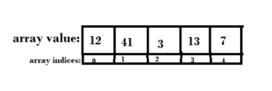
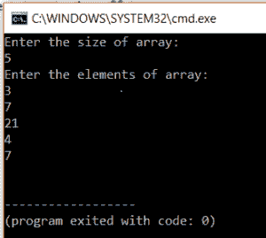
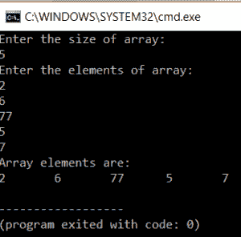
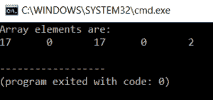
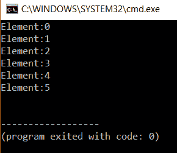

# 关于 C 编程中的数组，你需要知道的

> 原文：<https://www.edureka.co/blog/arrays-in-c/>

什么是数组？我们为什么需要它？在本文中，您将了解数据结构数组及其类型，以及为什么它是一种广泛使用的数据结构。让我们开始吧。

数组是数据类型相同的元素的有序集合。它们按顺序存储在内存中。数组是保存相似类型元素的数据结构。在 c 语言中，数组元素不像在 java 中那样被视为对象。

想象一下，你在一家乐器店，我让你把卡西欧品牌下的所有键盘一个接一个地放在一个地方。这种连续的记录集合称为数组。数组是相同数据类型的元素的有序集合。在我们上面的例子中，Casio 是数据类型，您收集的所有键盘都是 Casio 品牌的。数组中的所有元素都有一个共同的名称。

有两种类型的数组:

1.  [一维数组](#single)
2.  [数组初始化](#initialization)
3.  [在任意点访问阵列](#accessing)
4.  [多维数组](#multidimensional)

## **一维数组**

### **声明*一维数组的语法:***

`Datatype arrayName[arraySize];`

我们有一个数据类型，可以是任何基本数据类型，如 int、float 或 double。数组名是数组的名称，我们声明数组的大小。

在上面的例子中，数组是，

`Casio keyboardArray[100];`

让我们考虑另一个例子:

`int test[30];`

数组测试将保存 int 类型的元素，大小为 30。

### **数组大小:**

数组大小是在声明数组时给定的。一旦给定了数组的大小，就不能更改。然后，编译器将该内存空间分配给数组。

**考虑这个例子:**

`int test[20];`

在上面的例子中，我们有一个 int 类型的数组测试。我们将数组大小设为 20。这意味着将为存储器中的阵列留出 20 个连续的存储位置。

## **数组索引和初始化**

一个与数组中每个位置相关联的数字，这个数字称为*数组索引*。它从 0 开始，到最后一个元素，也就是数组的大小减 1。负一是因为我们从零开始计数，而不是从一开始计数。数组索引总是从零开始。

考虑这个例子，这是年龄数组。

这里，数组包含值 12，41，3，13，7，索引为 0，1，2，3，4。如果我们想要表示索引为 4 的元素，它将被表示为 age[4]并且将显示值 7。

默认情况下，数组包含所有零值。

数组初始化是在声明时完成的。如果用户在需要时输入数组值，这也可以在以后执行。

### **申报时初始化:**

数组可以在声明期间初始化。这是通过在声明时指定数组元素来实现的。这里数组的大小也是固定的，由我们决定。

###### **考虑代码，**

`#include<stdio.h>`

`int main()`

`{`

`int arr[] = { 10, 20, 30, 40 } ;`

`return 0;`

`}`

###### **说明:**

在上面的例子中，我们创建了一个类型为 int，名称为 arr 的数组。我们直接指定数组元素。数组的大小是通过计算数组中元素的数量来决定的。在这种情况下，大小是 4。

### **用户初始化:**

在这个方法中，我们让用户决定数组的大小。在这种情况下，我们需要一个变量来保存数组的大小，并需要一个 for 循环来接受数组的元素。我们在声明的时候分配一个随机的大小，只在需要的时候使用。开始时的尺寸通常偏高。我们有一个变量 I 来控制 for 循环。

考虑这个例子，

`#include<stdio.h>`

`int main()`

`{`

`int arr[50],n,i ;`

`printf("Enter the size of array:n");`

`scanf(“%d ”,n);`

`printf("Enter the elements of array:n");`

`for(i=0;i<n;i++)`

`{`

`            Scanf(“%d ”,arr[i]);`

`}`

`return 0;`

`}`

###### **输出:**

###### ****

###### **说明:**

在上面的程序中，我们声明了一个大小为 50 的数组。然后我们要求用户输入他希望在这个数组中输入的元素数量。然后，我们接受用户输入的数组元素。

### **显示数组:**

显示数组也需要 for 循环。我们遍历整个数组并显示数组的元素。

###### **这里有一个例子，**

`#include<stdio.h>`

`int main()`

`{`

`int arr[50],n,i ;`

`printf("Enter the size of array:n");`

`scanf(“%d ”,n);`

`printf("Enter the elements of array:n");`

`for(i=0;i<n;i++)`

`{`

`            Scanf(“%d ”,arr[i]);`

`}`

`printf("Array Elements are:n");`

`for(i=0;i<n;i++)`

`{`

`            Printf(“%d  ”,arr[i]);`

`}`

`return 0;`

`}`

###### **输出:**

###### ****

###### **说明:**

在上面的程序中，我们声明了一个大小为 50 的数组。然后我们要求用户输入他希望在这个数组中输入的元素数量。然后，我们接受用户输入的数组元素。然后我们再次使用 for 循环来显示数组元素。

## **在任一点访问数组:**

访问数组元素很简单，可以通过使用数组索引来完成。看看下面的代码。

`#include<stdio.h>`

`int main()`

`{`

`int arr[5],i ;`

`arr[4]=2;`

`arr[2]=17;`

`arr[0]=17;`

`printf("Array elements are: n");`

`for(i=0;i<5;i++)`

`{`

`            printf(“%d  ”,arr[i]);`

`}`

`return 0;`

`}`

###### **输出:**

###### ****

###### **说明:**

在上面的程序中，我们有一个大小为 5 的数组。我们使用数组索引在不同的位置输入元素。我们打印数组以获得上面的输出。

**默认情况下，所有数组元素都为零。** **如果我们越过数组大小会发生什么？**

在 c 中，如果我们试图访问越界的元素，编译器可能不会显示错误，但我们不会得到正确的输出。

## **多维数组:**

数组的数组是多维数组。这是因为多维数组中的每个元素都有自己的数组。我们需要 n for 循环来根据维度遍历多维数组。

###### **声明多维数组的语法:**

`Datatype arrayname[size1][size2]…..[size n];`

考虑这个例子，

`int a[10][20];`

上述数组的大小将是 10*20，即 200 个元素。

类似地，我们可以有二维或三维甚至更多维的数组。

每个维度都需要一个 for 循环。所以，二维数组需要两个，三维数组需要三个。

###### **考虑代码:**

#包括<stdio.h></stdio.h>

`int main()`

`{`

`            int arr[3][2] = {{0,1}, {2,3}, {4,5}};`

`            for (int i = 0; i < 3; i++)`

`            {`

`                        for (int j = 0; j < 2; j++)`

`                        {`

`                                    printf( "Element:  %d n”,arr[i][j]);`

`                        }`

`            }`

`            return 0;`

`}`

###### **输出:**

###### ****

###### **说明:**

在上面的代码中，我们显示了一个 3*2 的矩阵。该数组有 3 行 2 列。我们有两个循环。每个负责数组的一个维度。外部 for 循环负责行，内部负责列。

类似地，我们可以为三维数组编写一个代码，其中有三个 for 循环，每个维度由一个 for 循环控制。