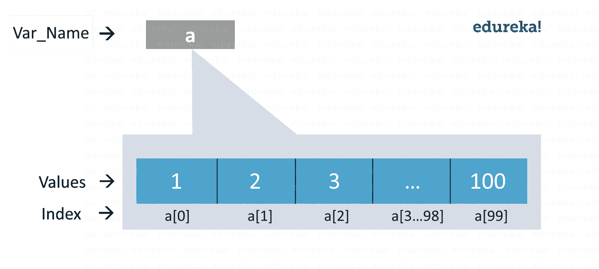
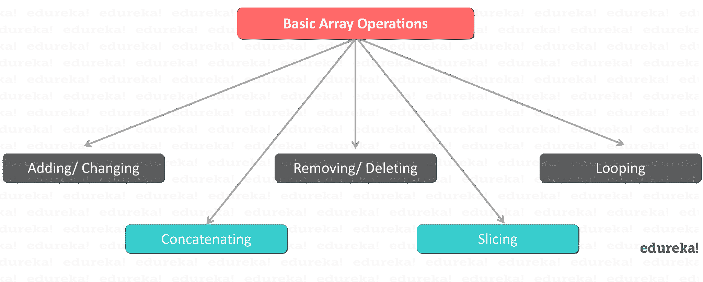

# Python 中的数组——什么是 Python 数组以及如何使用它们？

> 原文：<https://www.edureka.co/blog/arrays-in-python/>

Python 中的数组是可以保存同一类型的多个值的数据结构。通常，它们被误解为列表或 Numpy 数组。从技术上来说，Python 中的数组与这两者截然不同。所以让我们继续，看看什么是 [Python](https://www.edureka.co/blog/python-tutorial/) 中的数组以及如何实现。

这里有一个主题概述，解释了处理数组的所有方面:


## **Python 中的数组| Python 数组运算| edu reka**


[//www.youtube.com/embed/phRshQSU-xA?rel=0showinfo=0](//www.youtube.com/embed/phRshQSU-xA?rel=0showinfo=0)*This video will help you establish a strong hold on all the fundamentals in python programming language.*

**Python 中为什么要用数组？**

数组的组合，加上 Python 可以节省你很多时间。如前所述，与其他语言不同，数组帮助您减少代码的整体大小，而 [Python](https://www.edureka.co/blog/python-programming-language) 帮助您摆脱有问题的语法。 ***例如*** **:** 如果你必须存储 1-100 的整数，你将无法显式地记住 100 个变量名，因此，你可以使用数组轻松地保存它们。



现在你已经意识到了 Python 中数组的重要性，让我们更详细地研究一下。

## **Python 中什么是数组？**

数组基本上是一个*数据结构*，它可以一次保存多个值。它是同一类型元素的集合或有序序列。

**例子** :

```
a=arr.array('d',[1.2,1.3,2.3])

```

我们可以轻松地遍历数组项，并通过指定索引号来获取所需的值。数组也是可变的，因此，您可以根据需要执行各种操作。

现在，我们脑海中总会浮现一个问题—

## **Python list 和数组一样吗？**

Python 数组和列表以类似的方式存储值。但是两者之间有一个关键的区别，即它们存储的值。列表可以存储任何类型的值，如整数、字符串等。另一方面，数组存储单一数据类型值。因此，你可以有一个整数数组，一个字符串数组，等等。

Python 还提供了 [Numpy 数组](https://www.edureka.co/blog/python-numpy-tutorial/)，这是在[数据科学](https://www.edureka.co/blog/what-is-data-science/) [中使用的数值网格。](https://www.edureka.co/blog/python-numpy-tutorial/)你可以看看 [Numpy 数组 vs 列表](https://www.edureka.co/blog/python-numpy-tutorial/#NumpyVsList)了解更多。

### **在 Python 中创建数组 :**

Python 中的数组可以在导入数组模块后创建，如下-

→导入数组作为 arr

数组(数据类型，值列表)函数有两个参数，第一个是要存储的值的[数据类型](https://www.edureka.co/blog/python-programming-language#DataTypes)，第二个是值列表。数据类型可以是任何类型，如 int、float、double 等。请注意，arr 是别名，是为了方便使用。您也可以在没有别名的情况下导入。还有另一种方法来导入数组模块，即–

→ 从数组导入*

这意味着您想要从数组模块导入所有函数。

下面的语法用于创建一个数组。

**语法 :**

```

a=arr.array(data type,value list)           #when you import using arr alias

```

***或***

```

a=array(data type,value list)               #when you import using *

```

**示例** : a=arr.array( 'd '，[1.1，2.1，3.1] )

这里，第一个参数是“d ”,这是一种数据类型，即浮点，其值被指定为下一个参数。

**注** :

所有指定的值都是浮点型的。我们不能为单个数组指定不同数据类型的值。

下表显示了各种数据类型及其代码。

| **类型代码** | **Python 数据类型** | **字节大小** |
| 我 | （同 Internationalorganizations）国际组织 | Two |
| 我 | （同 Internationalorganizations）国际组织 | Two |
| u | unicode 字符 | Two |
| h | （同 Internationalorganizations）国际组织 | Two |
| H | （同 Internationalorganizations）国际组织 | Two |
| l | （同 Internationalorganizations）国际组织 | four |
| L | （同 Internationalorganizations）国际组织 | four |
| f | 漂浮物 | four |
| d | 漂浮物 | eight |

### **在 Python 中访问数组元素** :

要访问数组元素，需要指定索引值。索引从 0 开始，而不是从 1 开始。因此，索引号总是比数组长度小 1。

**语法** :

数组名称[索引值]

**例子** :

```
a=arr.array( 'd', [1.1 , 2.1 ,3.1] )
a[1]

```

**输出**–

```
2.1
```

返回的输出是数组中第二位的值 2.1。

现在让我们来看看一些基本的数组操作。

## **基本阵列操作** :

可以对阵列执行许多操作，如下所示—

### ** 求数组长度**

数组长度是数组中实际存在的元素个数。 你可以 利用 **len()** 函数来实现这一点。len()函数返回一个整数值，该值等于数组中元素的个数。

**语法** :

→ len(数组名)

**例子** :

```
a=arr.array('d', [1.1 , 2.1 ,3.1] )
len(a)

```

**输出-**3

这将返回一个等于数组元素数量的值 3。

## **增加/改变数组元素:**

我们可以通过使用 **append()** 、 **extend()** 和 **insert (i，x)** 函数给一个数组添加值。

当我们需要在数组末尾添加一个元素时，就使用 append()函数。

**例子** :

```
a=arr.array('d', [1.1 , 2.1 ,3.1] )
a.append(3.4)
print(a)

```

**输出**–

数组(' d '，[1.1，2.1，3.1，3.4])

产生的数组是实际的数组，在它的末尾添加了新的值。 要添加多个元素，可以使用 extend()函数。这个函数接受一个元素列表作为它的参数。该列表的内容是要添加到数组中的元素。

**例子** :

```
a=arr.array('d', [1.1 , 2.1 ,3.1] )
a.extend([4.5,6.3,6.8])
print(a)

```

**输出**–

数组(' d '，[1.1，2.1，3.1，4.5，6.3，6.8])

得到的数组将包含添加到数组末尾的所有 3 个新元素。

但是，当需要在数组中的特定位置添加特定元素时，可以使用 insert(i，x)函数。这个函数在数组中相应的索引处插入元素。它有两个参数，第一个参数是需要插入元素的索引，第二个参数是值。

**例子** :

```
a=arr.array('d', [1.1 , 2.1 ,3.1] )
a.insert(2,3.8)
print(a)

```

**输出**—

数组(' d '，[1.1，2.1，3.8，3.1])

得到的数组在数组的第三个位置包含值 3.8。

Arrays can be merged as well by performing array concatenation.

### **数组串联:**

任何两个数组都可以用+符号连接起来。

```
**Example**:
```

```
a=arr.array('d',[1.1 , 2.1 ,3.1,2.6,7.8])
b=arr.array('d',[3.7,8.6])
c=arr.array('d')
c=a+b
print("Array c = ",c)

```

**输出—**

数组 c=数组(' d '，[1.1，2.1，3.1，2.6，7.8，3.7，8.6])

得到的数组 c 包含数组 a 和 b 的连接元素。

现在，让我们看看如何从数组中移除或删除项目。

**了解我们在顶级城市/国家的 Python 培训**

| **印度** | **美国** | **其他城市/国家** |
| [班加罗尔](https://www.edureka.co/python-programming-certification-training-bangalore) | [纽约](https://www.edureka.co/python-programming-certification-training-new-york-city) | [英国](https://www.edureka.co/python-programming-certification-training-uk) |
| [海德拉巴](https://www.edureka.co/python-programming-certification-training-hyderabad) | [芝加哥](https://www.edureka.co/python-programming-certification-training-chicago) | 伦敦 |
| [德里](https://www.edureka.co/python-programming-certification-training-delhi) | 亚特兰大 | [加拿大](https://www.edureka.co/python-programming-certification-training-canada) |
| [钦奈](https://www.edureka.co/python-programming-certification-training-chennai) | [休斯顿](https://www.edureka.co/python-programming-certification-training-houston) | [多伦多](https://www.edureka.co/python-programming-certification-training-toronto) |
| [孟买](https://www.edureka.co/python-programming-certification-training-mumbai) | 洛杉矶 | [澳大利亚](https://www.edureka.co/python-programming-certification-training-australia) |
| [浦那](https://www.edureka.co/python-programming-certification-training-pune) | [波士顿](https://www.edureka.co/python-programming-certification-training-boston) | 阿联酋 |
| 加尔各答 | [迈阿密](https://www.edureka.co/python-programming-certification-training-miami) | [迪拜](https://www.edureka.co/python-programming-certification-training-dubai) |
| 艾哈迈达巴德 | [旧金山](https://www.edureka.co/python-programming-certification-training-san-francisco) | [菲律宾](https://www.edureka.co/python-programming-certification-training-philippines) |

### **移除/删除数组元素** :

数组元素可以使用 **pop()** 或 **remove()** 方法移除。这两个函数的区别在于前者返回删除的值，而后者不返回。

pop()函数要么不接受参数，要么接受索引值作为其参数。当没有给定参数时，这个函数弹出()最后一个元素并返回它。当您显式提供索引值时，pop()函数弹出所需的元素并返回它。

**例子** :

```
a=arr.array('d', [1.1, 2.2, 3.8, 3.1, 3.7, 1.2, 4.6])
print(a.pop())
print(a.pop(3))

```

**输出—**

```
4.6
3.1
```

第一个 pop()函数删除最后一个值 4.6 并返回相同的值，而第二个函数弹出第四个位置的值 3.1 并返回相同的值。

另一方面，remove()函数用于删除我们不需要返回的值。该函数将元素值本身作为参数。如果在参数槽中给出索引值，将会抛出一个错误。

**例子** :

```
a=arr.array('d',[1.1 , 2.1 ,3.1])
a.remove(1.1)
print(a)

```

**输出—**

数组(' d '，[2.1，3.1])

输出是一个包含除 1.1 以外的所有元素的数组。

当你想从一个数组中得到一个特定范围的值时，你可以对数组进行切片以返回相同的值，如下所示。

### **切阵** :

可以使用:符号对数组进行切片。这将返回我们通过索引号指定的一系列元素。

**例子** :

```
a=arr.array('d',[1.1 , 2.1 ,3.1,2.6,7.8])
print(a[0:3])

```

**输出**–

数组(' d '，[1.1，2.1，3.1])

结果将是出现在数组中第 1、第 2 和第 3 位置的元素。

### **循环数组:**

使用 for [循环](https://www.edureka.co/blog/loops-in-python/)，我们可以循环遍历一个数组。

```
**Example**:
```

```
a=arr.array('d', [1.1, 2.2, 3.8, 3.1, 3.7, 1.2, 4.6])
print("All values")
for x in a: 
print(x)
print("specific values")
for x in a[1:3]: 
print(x)

```

**输出**—

所有值

1.1 2.2 3.8 3.1 3.7 1.2 4.6 specific values 2.2 3.8The above output shows the result using for loop. When we use [for loop](https://www.edureka.co/blog/loops-in-python/#Whatisforloopandwhileloop?) without any specific parameters, the result contains all the elements of the array given one at a time. In the second for loop, the result contains only the elements that are specified using the index values. Please note that the result does not contain the value at index number 3. Hope you are clear with all that has been shared with you in this tutorial. This brings us to the end of our article on Arrays in Python. ***Make sure you practice as much as possible and revert your experience.*  **

*有问题吗？请在这个“Python 中的数组”博客的评论部分提到它，我们会尽快回复你或者加入我们的 [Python 大师课程](https://www.edureka.co/masters-program/python-developer-training)。*

*要深入了解 Python 及其各种应用，您可以注册参加实时 [**Python 在线培训**](https://www.edureka.co/python-programming-certification-training) ，该培训提供全天候支持和终身访问。*