# Automation Anywhere 示例–您可以练习的最佳示例

> 原文：<https://www.edureka.co/blog/automation-anywhere-examples>

**什么是自动化？如何使用 RPA 工具自动化任务？有哪些自动化无处不在的例子？**

我相信你可能想知道这些问题的答案。嗯，有了 [UiPath](https://www.edureka.co/blog/uipath-tutorial/) 、[蓝棱镜](https://www.edureka.co/blog/rpa-blue-prism/)或 [Automation Anywhere](https://www.edureka.co/blog/rpa-automation-anywhere/) ，你就可以用很少的动作命令轻松自动化多项任务。在这篇关于 Automation Anywhere 示例的文章中，我将讨论能够帮助您自动化繁琐任务的顶级自动化示例。这将帮助你提升职业技能，成为一名 **[RPA 认证专家](https://www.edureka.co/automation-anywhere-certification-training)** ，在当今市场脱颖而出。

本文将涵盖以下主题:

那么让我们开始吧！

## **什么是自动化无处不在？**

Automation Anywhere 是一款 [RPA 工具](https://www.edureka.co/blog/rpa-tools-list-and-comparison/)，旨在为其用户提供可扩展、安全且有弹性的服务。它提供了更好的性能，因为它能够集成到多个平台中，并且可以同时扩展。你也可以把这个工具总结为[机器人流程自动化](https://www.edureka.co/blog/what-is-robotic-process-automation/)、认知分析和劳动力分析的总和。参考下图。

除此之外，Automation Anywhere 最近推出了社区版/免费试用版，终身免费，并提供企业版，您可以免费试用 30 天。

现在，在这篇关于 Automation Anywhere 示例的文章中，让我们来看看 Automation Anywhere 的特性。

## **自动化随处功能**

自动化无处不在的特点可以参考下图:

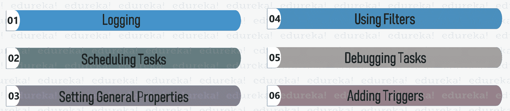

现在，你已经知道了什么是自动化，接下来让我们看看各种各样的自动化例子。

## **自动化随处可见的例子**

为了让你更好的理解，我把例子分成了两部分:

*   [基本自动化随处命令](#Basic%20Automation%20Anywhere%20Commands)
*   [复杂的例子](#Complex%20Examples)

### **基本自动化随处命令**

文章中关于 Automation Anywhere 示例的这一部分将包括基本命令和不同种类的自动化，这将帮助您更好地学习该工具。

那么，让我们开始吧。

**Windows 操作**

窗口操作用于自动化任务，如打开/关闭/最小化/最大化窗口，甚至获取活动窗口标题。

##### **问题陈述:**

自动获取活动窗口的标题。

##### **解:**

**第一步:**打开 Automation Anywhere Workbench，将 **Get Active Window Title** 命令拖拽到你的工作区。

**第二步:** **赋值一个变量**。这里，我将指定 Clipboard 系统变量。点击**保存**。

**第三步:**拖动一个**消息框**和**提到剪贴板变量**显示输出。点击**保存**。参考下图。

**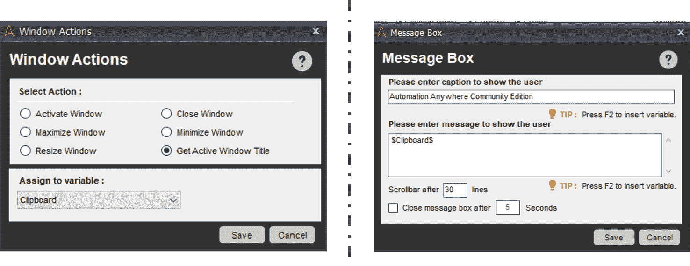第四步:**保存并执行任务。

当您执行任务时，您会看到活动窗口标题将会显示。这里的输出是运行时窗口，如下所示。

现在，这只是一个命令，伙计们，你可以使用其他命令来打开/关闭/调整窗口大小，只需在窗口上拖动鼠标即可。

**鼠标点击**

鼠标点击用于自动执行与点击应用程序或窗口的特定位置相关的任务

##### **问题陈述:**

自动关闭记事本窗口。

##### **解:**

**第一步:**打开 Automation Anywhere 工作台，将 **Insert Mouse Click** 命令拖动到您的工作区。

**第二步:** **选择你要点击的窗口**。这里我想点击记事本窗口。

**第三步:**现在点击**捕捉，将鼠标悬停在你要点击的区域**上。在这里，我想单击关闭符号。

**第四步:**现在，点击**保存**。参考下图。

**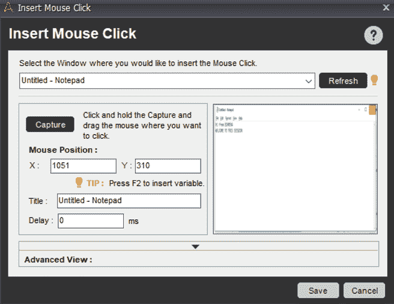第五步:**保存并执行任务。

当您执行任务时，您会看到记事本窗口自动关闭。

**字符串操作**

类似于任何其他编程知识中的字符串操作被用于执行各种操作，例如比较两个字符串、替换一个字符串、找出字符串的长度、反转一个字符串、拆分一个字符串等等。

##### **问题陈述:**

自动替换字符串中的几个字符。

##### **解:**

**步骤 1:** 打开 Automation Anywhere 工作台**分配源字符串，查找并替换值**到三个不同的变量。

**第二步:**现在，**从字符串操作部分拖动替换命令**。

**第三步:**源字符串段中的**提到**中的**初始字符串**或被赋值存储初始字符串的变量。

**第四步:**查找和替换部分的**提到了****查找和替换字符串**或分配给它的变量。

**第五步:**赋值**输出变量**。在这里，我已经将输出分配给剪贴板变量。现在，点击**保存。**参考下图。

**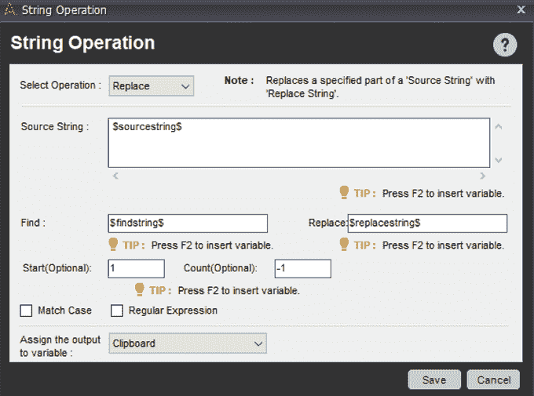**

*NOTE: Here our source string is edureka. Find value will be ‘reka’ and we have to replace it with ‘tech’.*

****第六步:**拖动一个**消息框**和**提到剪贴板变量**显示输出。点击**保存**。**

****第七步:**保存并执行你的任务。**

**当你执行任务时，你会看到字符串被替换如下。**

**现在，这只是一个命令，你可以使用其他命令来比较/查找长度/查找子字符串/修剪和对字符串进行许多其他操作。**

#### ****文件&文件夹****

**文件和文件夹命令处理你可以对文件或文件夹执行的各种操作，如复制/删除/重命名/移动/压缩/打印等。**

##### ****问题陈述:****

**自动将文件从源文件夹复制到目标文件夹。**

##### ****解:****

****步骤 1:** 打开 Automation Anywhere 工作台，并转到**文件/文件夹活动。**现在，选择**复制文件**动作并将其拖动到您的工作区。**

****第二步:**在这里选择**选项文件夹**，因为我们希望将一个文件夹从源路径移动到目标路径。**

****第三步:**然后提到源文件段中的**源路径和目的路径段**中的**目的路径。参考下文。****

****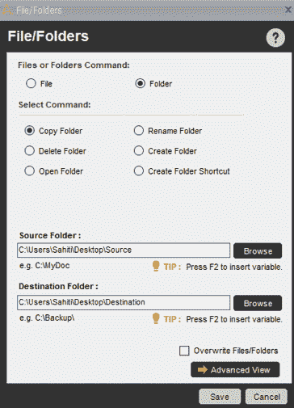第四步:**保存并执行您的任务。**

**执行该任务后，您会看到源路径中某个文件夹中的文件将被移至目标路径。**

**web 记录器可用于任何自动化领域，从 web 中提取文本、查找断开的链接、浏览 URL、管理 web 控件、下载文件等。**

##### ****问题陈述:****

**从网页中自动提取表格。**

##### ****解:****

****步骤 1:** 打开 Automation Anywhere 工作台，拖动 **Extract Table** 命令。**

****第二步:**现在，提到网址，点击**启动。**这将打开你的网站。**

****第三步:**接下来，点击**捕获表格**，将鼠标悬停在您想要提取的表格上。参考下文。**

****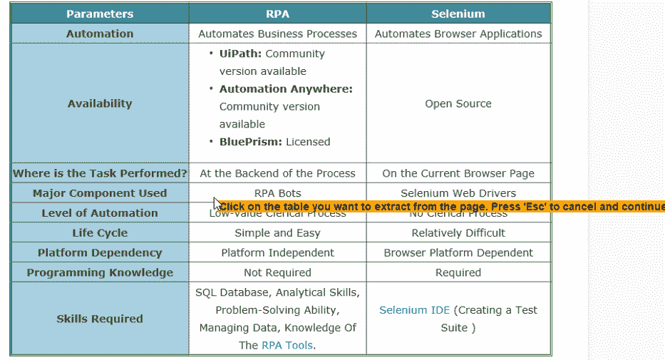第四步:**接下来，通过提及 CSV 文件的**路径，将表格数据提取到一个 **CSV 文件**。****

****第五步:**你也可以通过点击**查看提取表**选项来点击查看提取表。然后，点击**保存**。参考下文。**

****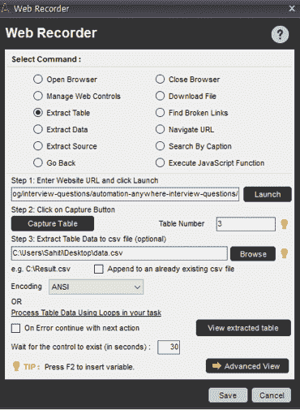第七步:**保存并执行你的任务。**

**当您执行您的任务时，您将看到该表被提取并存储到一个 CSV 文件中，如下所示。**

**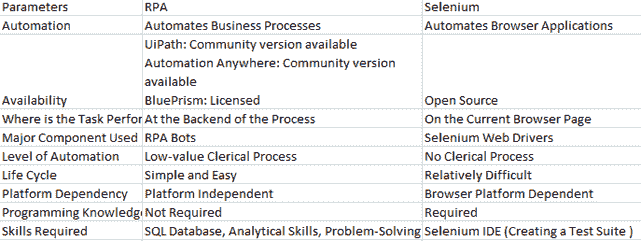**

#### **光学字符识别**

**光学字符识别又称 OCR，用于通过路径或 URL 捕获区域、窗口或图像。**

##### ****问题陈述:****

**从窗口中自动提取文本并显示输出。**

##### ****解:****

****步骤 1:** 打开 Automation Anywhere 工作台，从 OCR 部分拖动**捕获区域**命令。**

****第二步:**现在，**选择您希望从中提取文本的窗口**，然后**选择 OCR 引擎**。默认情况下，选择“立方体”。**

****第三步:**接下来，点击**采集区域**，将鼠标拖至您希望提取数据的区域。参考下文。**

**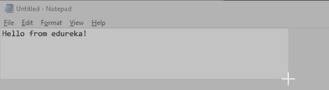**

****第四步:**点击**查看抓取文本**也可以查看**抓取文本**。然后点击**保存**。参考下文。**

****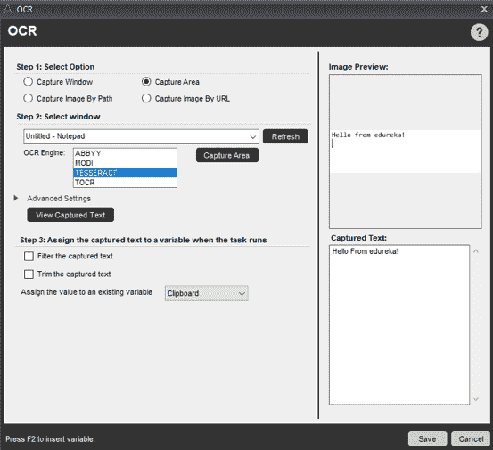第五步:**将**输出赋值给一个变量。**在这里，我将变量赋值给剪贴板变量。**

****第六步:**现在，拖拽一个**消息框**，提到输出变量，显示输出。**

****第七步:**保存并执行任务。**

**当您执行任务时，您将看到文本从记事本中提取出来，并显示在如下消息框中。**

**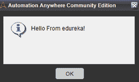**

#### ****击键****

**按键被用来自动将文本写入应用程序。在击键的帮助下，你可以确保以你希望的任何方式输入文本。**

##### ****问题陈述:****

**将文本写入记事本文件的任务自动化。**

##### ****解:****

****第一步:**打开 Automation Anywhere 工作台，拖放 **Insert Keystrokes 命令。****

****第二步:** **通过击键输入你想要在记事本上显示的文本**。在下面的快照中，我使用了回车，大写锁定键。**

****第三步:**保存并执行任务。**

**执行任务后，您会看到下面自动提到的文本。**

**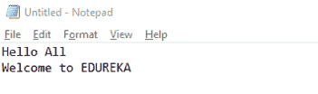**

#### ****休息网页服务****

**Rest Web 服务用于自动执行从 JSON APIs 获取数据并存储的任务。**

##### ****问题陈述:****

**从 JSON 文件中自动提取数据并在消息框中显示输出。**

##### ****解:****

****第一步:**打开 Automation Anywhere 工作台**拖拽 REST Web 服务**命令。**

****第二步:**现在**提到 JSON API 的 URL****选择方法为 GET。****

****步骤** **3:** 现在，转到**响应部分**保存 r **对变量的响应。****

****第四步** **:** 拖动一个**消息框**并提及变量。参考下文。**

****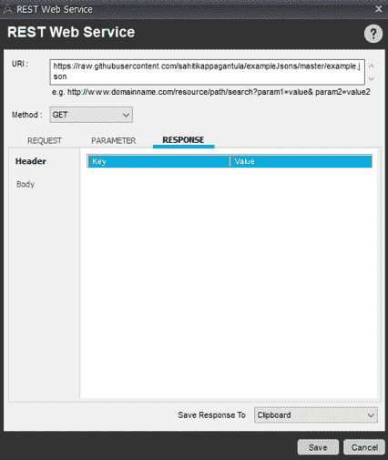第五步:**保存并执行任务。**

**执行任务后，您将看到数据从 JSON 文件中提取出来，并显示在消息框上。参考下文。**

**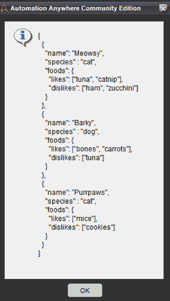**

**现在，我们就此结束本文中关于自动化 Anywhere 示例的这一部分。接下来，在这篇文章中，我将向您展示一些复杂的自动化，如 Excel 和 PDF。**

### ****复杂的例子****

**在这篇关于 Automation Anywhere 示例的文章中，我将讨论 Excel 和 PDF 的自动化。**

**那么，让我们开始吧，伙计们！**

#### ****Excel 自动化****

**Excel Automation 用于与 Excel 相关的任务，如打开/关闭电子表格、激活单元格、转到特定单元格等。**

##### ****问题陈述****

**根据某种条件自动从 Excel 文件中提取数据，并将提取的数据存储在另一个文件中。**

##### ****解****

****第一步:**打开 Automation Anywhere 工作台。**

**在我继续这些步骤之前，让我展示一下我们要从中提取数据的文件和输出文件。**

**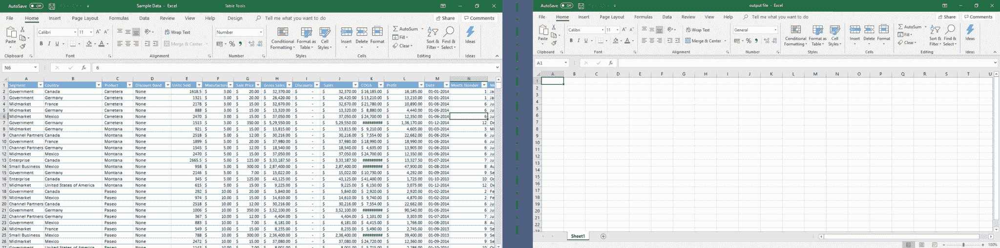**

**第二步:现在，你的下一步是打开两个电子表格。为此，**从 Excel 部分拖动打开电子表格命令**。**

****第三步:**提及第一个电子表格的**路径(你必须从那里提取数据)，在包含标题**的框中勾选**，点击**保存**。参考下文。****

**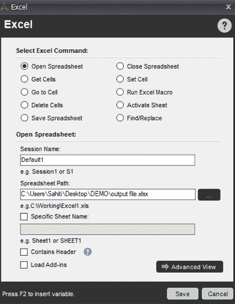 **步骤 4:** 对**的第二个电子表格重复上述两个步骤**和**将会话名称更改为 Default1** ，这样就不会与第一个电子表格的会话名称冲突。参考下文。**

#### ****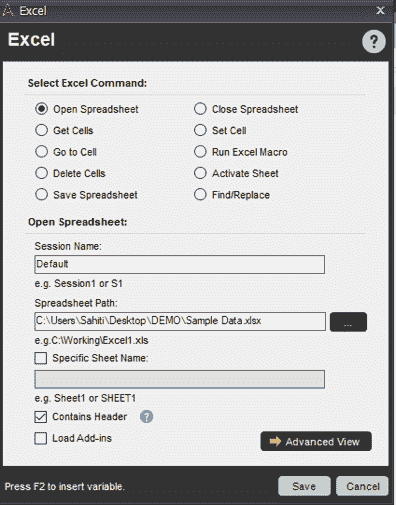****

****第五步:**现在，**拖动获取单元格命令**，**选择获取所有单元格选项。**然后，提及会话名称为 **Default** (这是第一个电子表格的会话名称)。然后点击**保存。**参考下文。**

**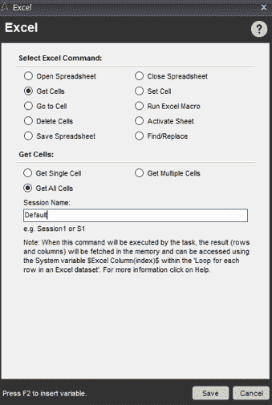**

****第六步:**在打开两个电子表格的动作之间拖动**获取所有单元格动作**。这一步将帮助您从第一个电子表格的所有单元格中获取数据。**

**您的任务窗格应该如下图所示:**

**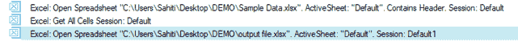**

****第七步:**现在，你要开始一个循环。为此，**从循环部分拖动 Excel 数据集中的每一行命令**。提及会话名称作为**默认值。然后，点击**保存**。参考下文。****

**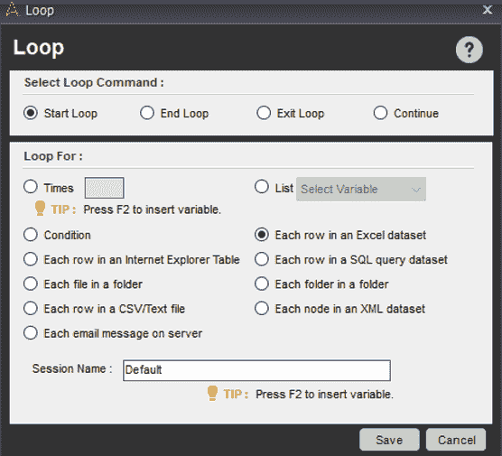**

****第八步:**现在，你要提到你希望提取数据的条件。为此，请遵循以下步骤。**

****步骤 8.1:** 从 **If 段拖拽**变量命令**。****

****步骤 8.2:** 现在点击**编辑选项**，使用以下步骤设置条件:**

****步骤 8.2.1:** 通过按下 **CTRL + F2** 将**变量作为 Excel 列**，然后点击 **Insert** 。之后提到值 **12** ，因为我们想要在数据集的第**12 列上设置一个条件。按下**确定。******

***NOTE: Here the 12th column in the dataset is the Sales column. The condition is to extract data of all those rows whose sales < 10000\.***

******步骤 8.2.2:** 现在，**选择操作员。**这里我将选择**小于(<)运算符。******

******步骤 8 . 2 . 3:**值部分的**提及**值 **10000** 并点击**保存**。参考下文。****

****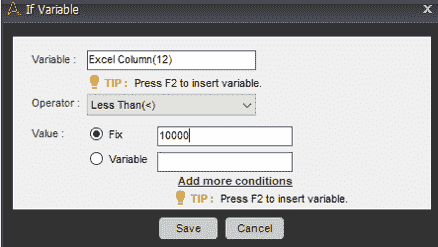****

******第 9 步:**接下来，您必须针对数据集中存在的列数迭代填充数据的循环。由于数据集中有 16 列，您必须**迭代循环 16 次**。为此，从循环部分拖动**时间命令**，并在时间部分提及 **16。然后点击**保存**。参考下文。******

****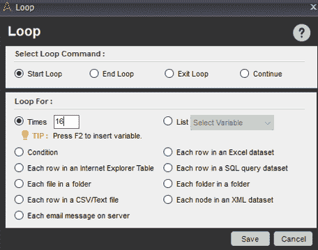****

******第十步:**现在，你要把数据填入特定的单元格。为此，您必须按如下方式设置单元格:****

******第 10.1 步:**从 **Excel 命令**中拖动**设置单元格命令**，在**单元格数值部分**中提及变量 **ExcelColumn** ，点击**插入。**然后按下 **CTRL + F2** 提及**计数器变量**。最后，点击**保存。******

****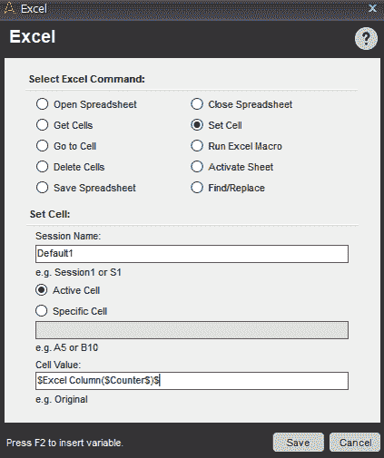****

******第十一步:**接下来，你要去活动单元格右边的一个单元格，存储下一个提取的数据。因此，要做到这一点，**从 **Excel 部分**中拖动** **转到单元格命令**，并**选择一个单元格右**。参考下文。****

******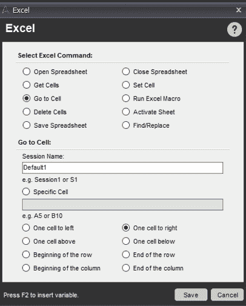第 12 步:**一旦存储了特定行的数据，就要去下一行存储下一组数据。要做到这一点，您必须转到一行的开头，从活动单元格向下一个单元格。****

******步骤 12.1:** 为此，**从 Excel 部分拖动“转到单元格”命令**，然后**选择行的开头。**参考下文。****

******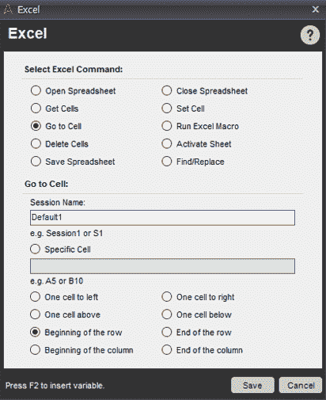第 12.2 步:再次****拖动 Excel 部分的**到单元格命令**选择** **下一个单元格。**参考下文。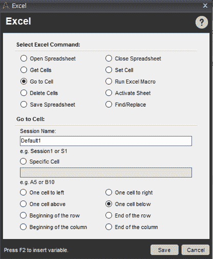****

****你最终的任务清单应该如下所示:****

#### ******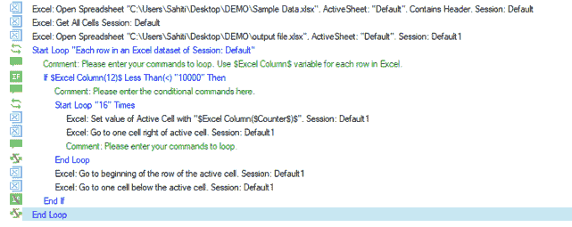******

******第十三步:**现在，点击**保存**按钮，保存您的任务，并通过点击**运行**按钮执行任务。****

****您会看到下面的输出。****

#### ******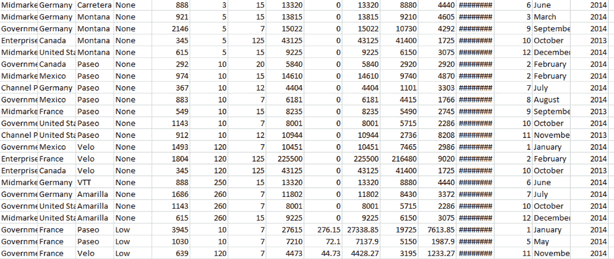******

#### ******PDF 自动化******

****PDF Automation 或 PDF Integration 命令在 Automation Anywhere 中用于自动执行 PDF 上的任务，例如合并两个文档、提取文本、分割文档、将 PDF 转换为图像以及加密/解密文档。****

##### ******问题陈述******

****自动从多个 PDF 文档中提取数据并将数据存储到 CSV 文件中。****

##### ******解******

******第一步:**打开 Automation Anywhere 工作台。****

******第二步:**现在选择您要从中提取数据的 PDF，并记下您要提取数据的所有字段。下面的快照显示了我想要从中提取数据的文档。这里我要提取 RecieptNo，TransactionID，StudentEnrolmentNo，StudentName，Grade，FeeModeofPayment，TotalAmount，DateofPayment。****

****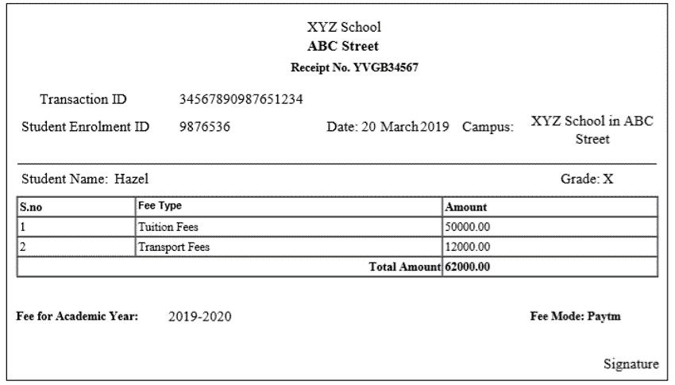****

******第三步:**现在，到你工作台右手边的**变量管理器**，为你想要提取数据的所有字段**添加变量**。这里你必须创建 8 个变量。让我向您展示如何创建单个变量。****

******步骤 3.1:** 点击**添加选项。**在打开的对话框中，在**名称字段**中输入变量的名称，点击**保存**。参考下文。****

****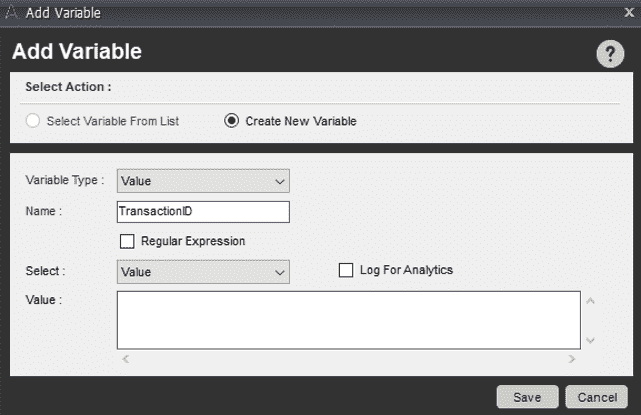 **步骤 3.2:** 重复上述步骤创建另外 7 个变量。****

******第四步:**现在点击左边面板的 **Excel** 命令，双击**打开电子表格**子命令。这将打开一个对话框。****

******步骤 4.1:** 现在转到**省略号按钮**和**提及你要存储提取数据的 Excel 文件路径**。然后，点击**保存**。这一步将设计打开 Excel 文件的任务。参考下文。****

****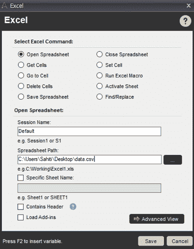****

******第五步:**现在，你必须确保提取的数据从 A2 单元格开始自动填充。要为这个**创建一个动作，双击转到单元格**子命令，并在**特定单元格部分**中输入 A2 。之后点击**保存**。参考下文。****

****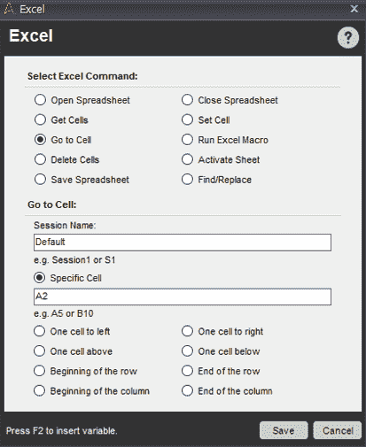****

****这一步将设计一个任务，将光标放在打开的电子表格的 A2 单元格上。****

******第六步:**现在，你要开始从 PDF 文件中提取数据了。为此，请遵循以下步骤。****

******步骤 6.1:** 点击 **PDF-Integration** 命令，双击**提取表单字段**子命令。****

******第 6.2 步:**现在点击**省略号按钮**和**选择你想要提取数据的 PDF 文件**。****

******步骤 6.3:** 之后，从**插入字段**部分，选择**添加**选项，并将鼠标拖动到所需字段上。****

******第 6.4 步:**现在，右击选中的字段，选择**添加**字段。参考下文。****

****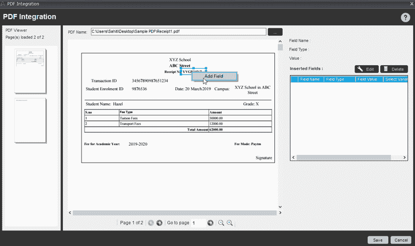****

******步骤 6.5:** 在提取文本窗口中，选择合适的变量名，输入字段名。然后点击**确定**。这将为指定的变量和字段名存储提取的数据。参考下文。****

********

******步骤 6.6:** 类似地，对其他 7 个字段/变量重复上述步骤。****

******第 6.7 步:**最后点击**保存**。****

******第七步:**现在，你要将提取的数据存储到 Excel 文件中各自的单元格中。为此，请遵循以下步骤:****

******步骤 7.1:** 点击 **Excel** 命令，双击**设置单元格**子命令。****

******第 7.2 步:**在打开的对话框中，转到**单元格数值部分**，**按 F2** 和**选择您想要选择的变量** **名称**。然后点击**插入**。这里我会选择 RecieptNo。参考下文。****

****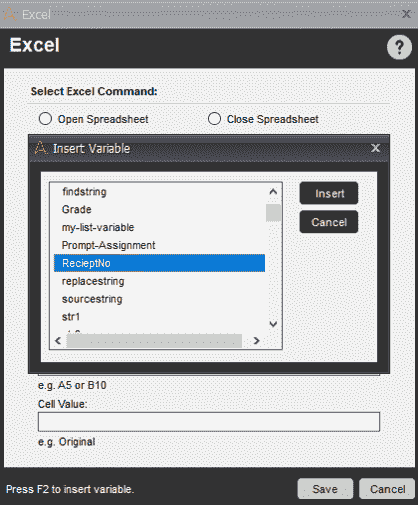****

****该操作将使您将数据存储在 **A2 单元格**中。****

******步骤 7.3:** 现在，下一个提取的数据应该存储在下一个单元格中，该单元格是 B2(在同一行，但不同列)。为此，双击**转到单元格**子命令，选择选项**向右一个单元格。**之后点击**保存。******

****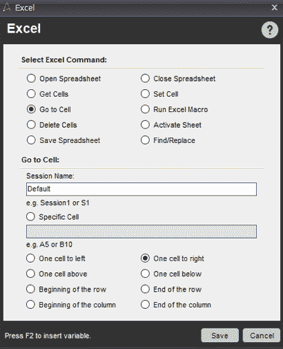****

******步骤 7.4:** 现在，要将值插入 B2 单元格，再次双击**设置单元格**子命令，并按 F2。选择变量名并点击**插入**。****

******步骤 7.5:** 现在，将下一个值插入到 C2 单元格中。为此，重复上述步骤。****

****现在，您已经提取了单个 PDF 的数据，如果您想从各种其他 PDF 中提取数据。你必须把数据存储在下一行，对吗？****

******第 8 步:**为此，双击**转到单元格**子命令，并选择**下一个单元格**。****

****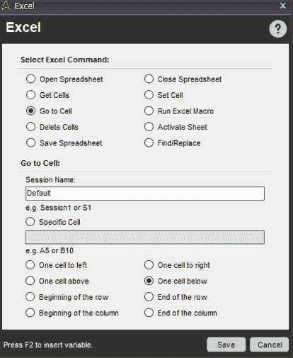****

******第 9 步:**要转到起始单元格，即该行的第一个单元格，选择**转到单元格**子命令，并选择**该行的开头**。参考下文。****

****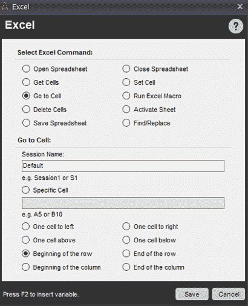****

******第十步:**现在，以上所有操作都是从一个 PDF 文件中提取数据。要从多个 PDF 文件中提取数据，请遵循以下步骤。****

******步骤 10.1:** 点击任务窗格中的部分动作，然后**双击左侧面板中的循环**命令。****

******步骤 10.2:** 在这里选择双击**文件夹中的每个文件**命令，从**浏览**选项中提到包含所有 PDF 文件的文件夹的路径。然后点击**保存。******

****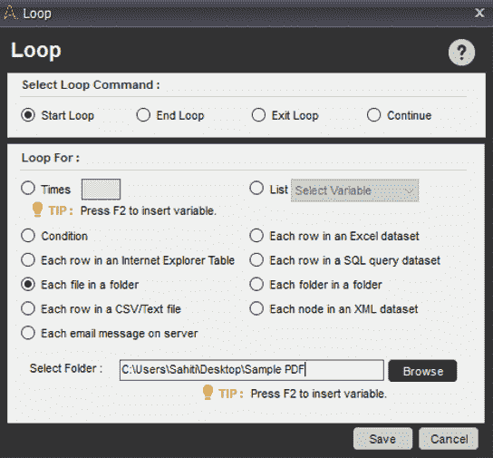****

******步骤 10.3:** 将**结束循环**命令移动到动作列表的最后一行。****

******步骤 10.4:** 双击 **PDF 整合**命令，在 **PDF 名称部分插入所需变量( **$FileName$** )。******

****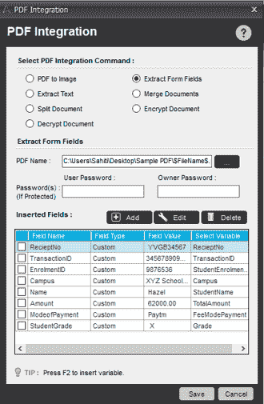****

****这就是你最终任务清单的样子。****

******步骤 11:** 现在，点击**保存**按钮，保存您的任务，并通过点击**运行**按钮执行任务。****

****您会看到下面的输出。****

****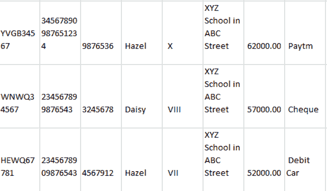所以，乡亲们！至此，我们结束了这篇关于自动化 Anywhere 示例的文章。如果你希望作为一名 [RPA 开发人员](https://www.edureka.co/blog/rpa-developer-roles-and-responsibilities/)的职业生涯有一个飞跃，那么开始学习 RPA 及其各种工具。****

****我们在 Edureka！，提供面授 ***[自动化随处课程](https://www.edureka.co/automation-anywhere-certification-training)*** 在线。爱德华卡。是一家值得信赖的在线学习公司，在全球拥有超过 250，000 名满意的学习者。本培训将帮助您获得 [***机器人过程自动化***](https://www.edureka.co/blog/robotic-process-automation/) 方面的深入知识以及任何地方的自动化实践经验。****

*****有问题吗？请在这个**自动化无处不在的例子**的评论部分提到它，我们会回复你*****