# AWS code commit–存储库的新家

> 原文：<https://www.edureka.co/blog/aws-codecommit/>

作为一名开发人员，难道您不想将全部精力放在生产上，而不是存储库的管理和维护上吗？这就是 AWS CodeCommit 发挥作用的地方。事实证明，通过提供安全且全面管理的服务，它可以在各个方面提升组织的绩效。

涵盖的主题:

*   [AWS 代码提交简介](#IntroductiontoCodeCommit)
*   [AWS code commit vs GitHub](#CodeCommitvsGitHub)
*   [AWS 代码提交工作流程](#CodeCommitWorkflow)
*   [案例分析:Edmunds.com 如何减少管理&维护时间 95%](#CaseStudy)
*   [演示:在 CodeCommit 中创建一个存储库并探索其特性](#Demo)

## **AWS 代码提交简介**

AWS CodeCommit 是 Amazon 提供的源代码控制存储和版本代码服务。它利用 CI/CD 的优势，帮助团队更好地进行代码管理和协作。它消除了对第三方版本控制的需要。该服务可用于存储文档、源代码和二进制文件等资产。它还可以帮助您管理这些资产。管理包括缩放、集成、合并、推送和拉取代码变更。让我们更好地了解一下 CodeCommit 提供的服务:

### **完全托管服务:**

如果您是一名 DevOps 工程师，难道您不想将全部精力放在生产上，而不是维护更新、管理自己的硬件或软件吗？AWS CodeCommit 消除了管理资源的枯燥任务，提供了高可用性和持久性的服务。

**安全存储代码:**

因为它是一个版本控制系统，它存储你的代码。事实上，它存储任何类型的数据，无论是文档还是二进制文件。存储的数据非常安全，因为它们在静态和传输过程中都是加密的。

### **与代码协同工作:**

AWS CodeCommit 允许您协作处理代码。您可以在代码的一部分工作，而其他人/团队可以在另一部分工作，变更/更新可以在存储库中进行推送和合并。用户可以检查、评论彼此的代码，帮助他们最大限度地开发代码。

### **高度可扩展:**

AWS CodeCommit 允许您根据自己的需要进行伸缩。该服务可以处理大型存储库、大量具有大型分支的文件和冗长的提交历史。

### **整合:**

您可以轻松地将 AWS CodeCommit 与其他 AWS 服务集成在一起。它使这些服务靠近其他资源，使得获取和使用更容易、更快，从而提高了开发生命周期的速度和频率。它还可以让您非常容易地集成第三方服务。

### **迁移**:

您可以轻松地将任何基于 Git 的存储库迁移到 CodeCommit。

### **使用 Git 的交互:**

与 CodeCommit 交互非常简单，因为它是基于 Git 的。您可以使用 Git 命令来拉、推、合并或执行其他操作。它还为您提供了使用 AWS CLI 命令及其自己的 API 的功能。

### **跨账户访问:**

CodeCommit 允许您交叉链接两个不同的 AWS 帐户，从而更容易在两个帐户之间安全地共享存储库。有一些事情要记住，比如你不应该共享你的 ssh 密钥或 AWS 凭证。

## **AWS code commit 介绍| AWS 认证 DevOps 工程师培训**

[//www.youtube.com/embed/ik4VE1O4OBo?rel=0&showinfo=0](//www.youtube.com/embed/ik4VE1O4OBo?rel=0&showinfo=0)

本视频将向您介绍版本控制系统，例如使用 AWS DevOps 服务(CodeCommit)推送、提取、合并和提交代码。

**AWS CodeCommit vs GitHub**

GitHub 也是版本控制系统之一。我们先来看看 GitHub 和 CodeCommit 的相似之处。

1.  CodeCommit 和 GitHub 使用 Git 库。
2.  两者都支持代码审查。
3.  它们可以与 AWS CodeBuild 集成。
4.  它们都使用两种认证方法，SSH 和 HTTPS。

现在让我们来看看它们之间的区别。

1.  **安全性:** Git 由 GitHub 用户管理，而 CodeCommit 使用 AWS 的 IAM 角色和用户。这使得它非常安全。使用 IAM 角色可以让您只与特定的人共享存储库，同时限制他们对存储库的访问。例如，很少用户可以查看存储库，很少人可以进行编辑，等等。CodeCommit 允许您使用 MFA 进行第三步身份验证。
2.  托管: Git 就像 GitHub 的家，但与 AWS 一起使用时就不一样了。因此，当 GitHub 与 AWS 一起使用时，它就像一个第三方工具。然而，CodeCommit 托管在 AWS 上并由 AWS 管理，使得与 CodeBuild 的集成及其使用更加简单。
3.  用户界面: GitHub 功能齐全，有一个非常好的用户界面。而 CodeCommit 用户界面相当普通。

**查看我们在顶级城市的 AWS 认证培训**

| 印度 | 美国 | 其他国家 |
| [在海德拉巴的 AWS 培训](https://www.edureka.co/aws-certification-training-hyderabad) | [亚特兰大 AWS 培训](https://www.edureka.co/aws-certification-training-atlanta) | [AWS 伦敦培训](https://www.edureka.co/aws-certification-training-london) |
| [班加罗尔的 AWS 培训](https://www.edureka.co/aws-certification-training-bangalore) | [波士顿 AWS 培训](https://www.edureka.co/aws-certification-training-boston) | [阿德莱德的 AWS 培训](https://www.edureka.co/aws-certification-training-adelaide) |
| [钦奈的 AWS 培训](https://www.edureka.co/aws-certification-training-chennai) | [纽约市的 AWS 培训](https://www.edureka.co/aws-certification-training-new-york-city) | [新加坡 AWS 培训](https://www.edureka.co/aws-certification-training-singapore) |

## **AWS 代码提交工作流程**

看看下面的流程图，了解 CodeCommit 的工作流程。它由三部分组成——**开发机**、 **AWS CLI/CodeCommit 控制台**、 **AWS CodeCommit 服务**。

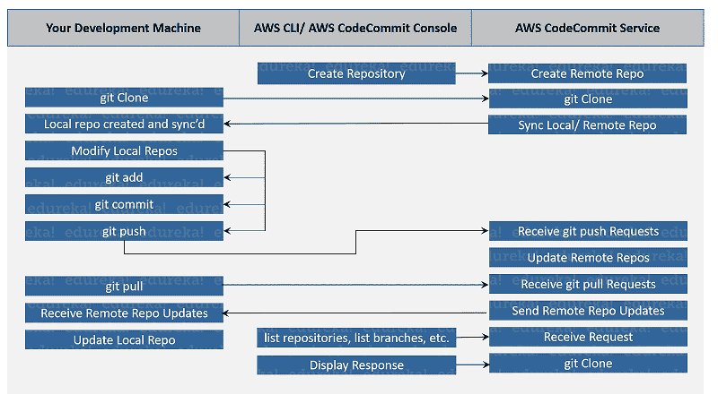

*   您可以使用 AWS CLI 或 AWS CodeCommit 控制台创建一个存储库(远程),该存储库将反映到您的 AWS CodeCommit 服务中，以启动您的项目。
*   从你的开发机器上做一个 **git 克隆**，在 CodeCommit 服务端会收到一个 **git 克隆** **reques** t。这将最终同步步骤 1 中创建的远程存储库和刚刚克隆的本地存储库。
*   使用开发机器上的本地存储库来修改代码。运行 **git add** 在本地暂存修改后的文件， **git commit** 在本地提交文件， **git push** 将修改后的更改推送到 CodeCommit。这将依次修改远程存储库。
*   使用 **git pull** 下载在同一个存储库中工作的其他团队成员所做的变更或修改。更新远程存储库，并将这些更新发送到您的开发机器，以保持本地存储库的更新。

## **案例研究**

让我们来看一个案例研究，以便更好地指出我的观点。

### **关于公司:**

我要谈谈这家名为 Edmunds.com 的公司。这是一个在线网站/应用程序，让买家浏览汽车，查看待售汽车的照片、视频等。

### **挑战:**

以前使用的内部 SCM 存在一些问题，如下所述:

*   向 SCM 添加新用户很困难
*   供应链管理有着巨大的运营负担
*   管理和维护硬件和软件既困难又耗时
*   存储库缺乏备份
*   存储库缺乏集群能力
*   服务将受到停机时间的影响

### **AWS code commit to the rescue:**

在研究了许多其他服务之后，Edmunds.com 开始使用 AWS 的 CodeCommit。他们将 1000 多个存储库和 270 多个用户迁移到 AWS。CodeCommit 为公司处理托管、维护、备份和扩展。

1.  **完全管理:**该公司的管理和维护时间减少了约 95%。
2.  **高可用性:**通过使用亚马逊的 S3 跨不同的可用性区域存储备份，使得 git 存储库高度可用。
3.  **代码高效:**公司手动为每位用户节省了 450 美元。
4.  **灵活:**使用亚马逊的 CodeCommit 使他们的网站在用户数量方面很容易扩展，非常灵活。

## **演示:在 CodeCommit 中创建一个存储库并探索其特性**

在这一节中，我将演示在 CodeCommit 上创建一个存储库，创建一个分支，提交更改，查看更改并合并存储库。让我们看一看。

**第一步:**进入您的 [AWS 登录页面](https://aws.amazon.com/)，登录您的 AWS 账户。如果您没有帐户，请创建一个免费帐户。登录后，您应该会看到如下所示的页面:

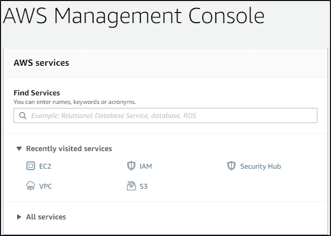

搜索 CodeCommit 并单击该服务。此外，单击 Create Repository 创建一个存储库。

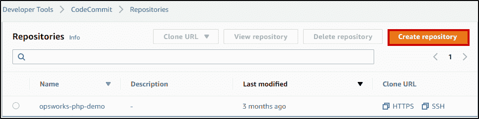

系统会提示您添加您的**存储库名称**和**描述**。添加这些并点击**创建**。

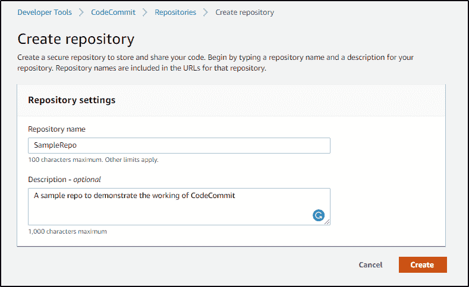

你应该和我一样得到一个成功的消息。

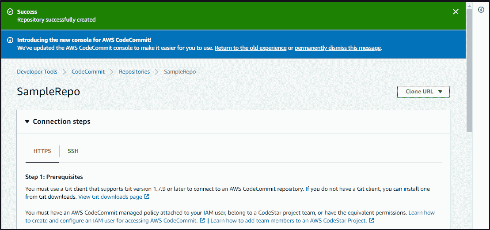

有两种方法连接您的存储库——SSH 和 HTTPS。在这种情况下，我将使用 HTTPS。现在已经创建了一个存储库，接下来在存储库中创建文件。创建存储库时，它总是空的。你必须创建和添加文件。进入您创建的存储库，点击**创建文件。**

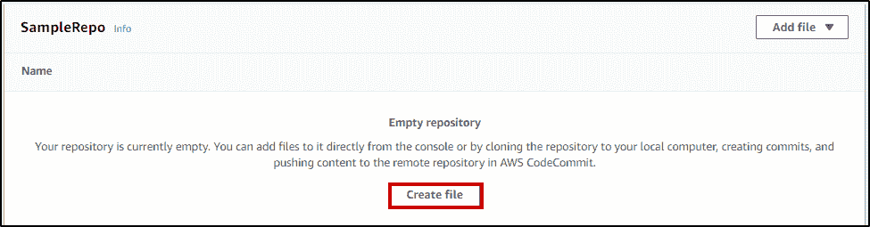

一旦你创建了文件。继续将代码添加到文件中。

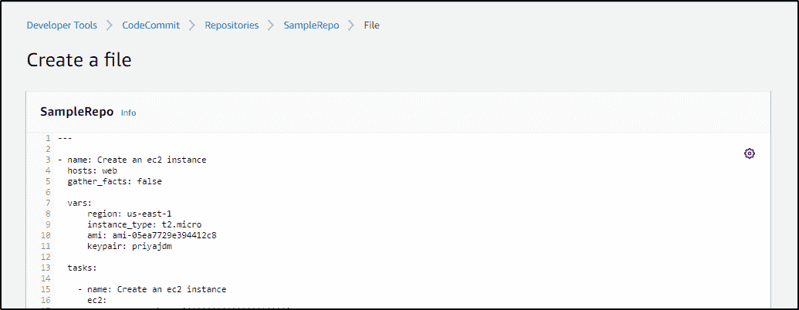

现在您已经编写了代码，您需要提交这些更改。添加**文件名**、**作者姓名**、**电子邮件 ID** 、**提交消息**，点击**提交更改**。

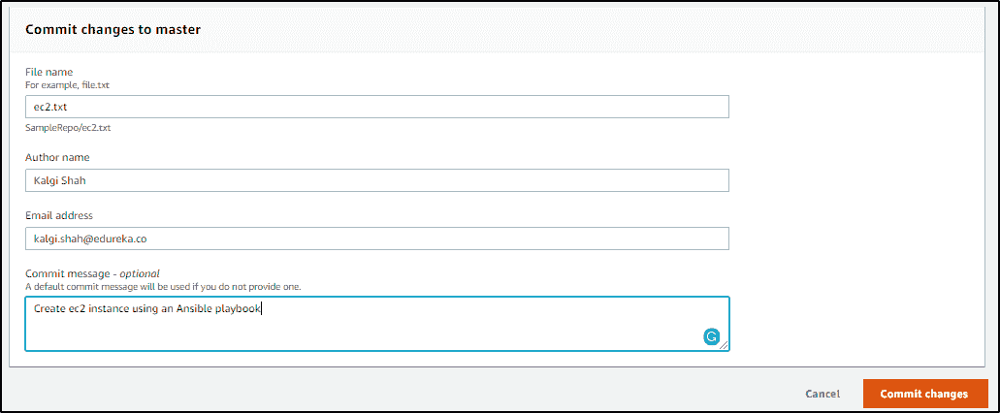

现在，当您通过单击**存储库**导航到存储库部分时，您应该会在那里看到您的存储库。

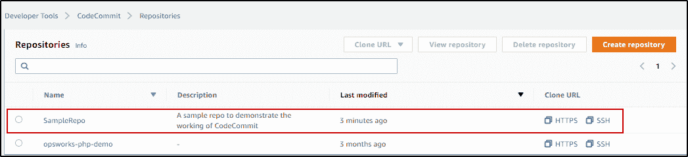

继续点击你的仓库，你应该看到你刚刚创建的文件。

### **什么是分支，为什么使用分支**

既然您已经创建了一个存储库、一个文件并将代码添加到文件中，那么让我们学习如何创建分支。你们知道为什么要用树枝吗？在开发或生产环境中，您不是唯一一个处理这些存储库的人。将会有其他人在同一个存储库的不同部分工作。不同的人处理同一个文件会让人感到困惑。

在这种情况下，最好使用分支。分支基本上是原始文件的副本，可以分配给不同的人。他们可以进行更改，提交更改并将其推送到 CodeCommit。在某些测试之后，当这些代码被验证时，它们可以与主分支合并。在下一节中，我将解释如何创建分支、编辑分支、查看和比较更改、查看提交历史以及如何将这些分支与主分支合并。

**步骤 2:** 要创建分支，点击最右边的分支。

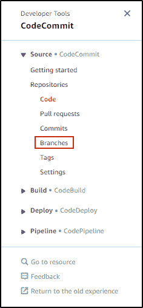

然后点击右上角的**创建分支**，如下图所示:

添加分支名称和描述，并点击**创建分支**。

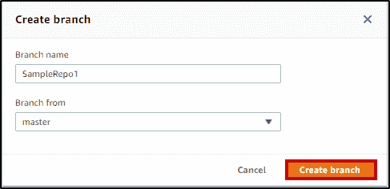

您应该会看到类似这样的内容:

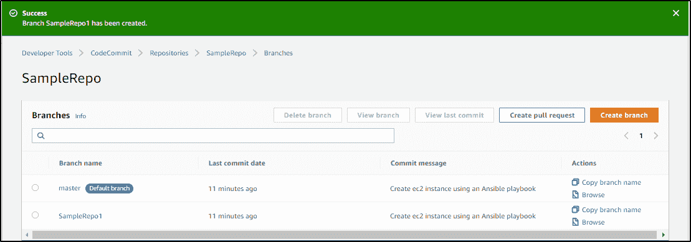

单击该分支后，您会看到它包含了主分支上存在的所有文件。

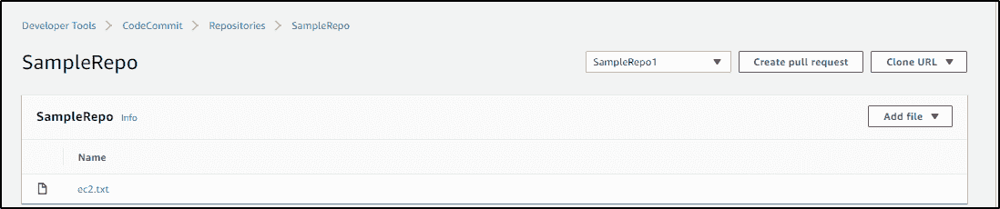

让我们继续对这个分支进行更改。点击文件 **ec2.txt** 。

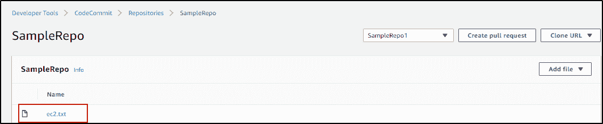

点击**编辑**，如下图所示。

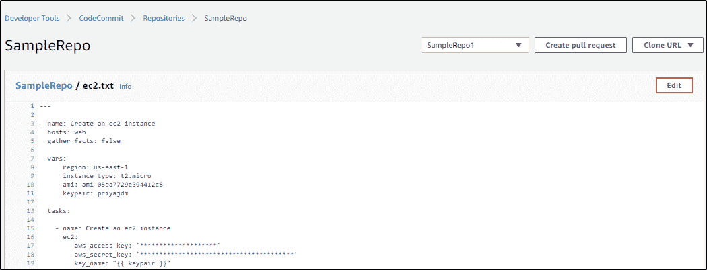

根据您的意愿进行更改，并通过添加**作者姓名**、**电子邮件地址**、**提交消息**来提交这些更改。继续点击**提交更改**。

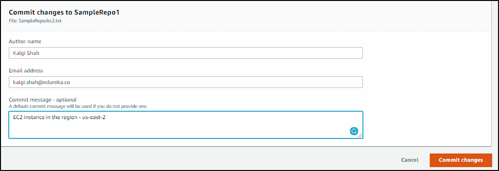

你应该和我一样得到一个成功的消息。

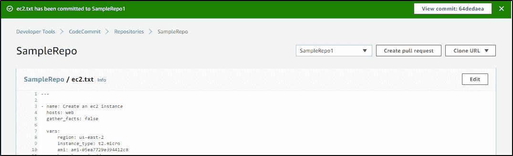

现在您有了一个主分支和另一个与主分支稍有不同的分支，让我们比较它们以寻找不同之处。点击**创建拉动请求**。

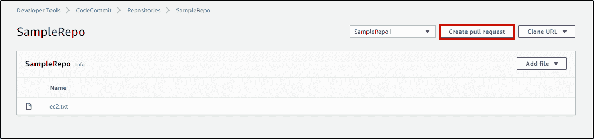

在比较当前分支和主分支时，选择主分支。点击**比较**。

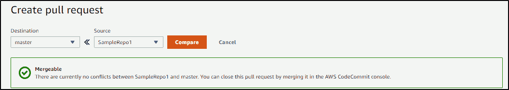

这突出了主分支和另一个分支的所有差异。

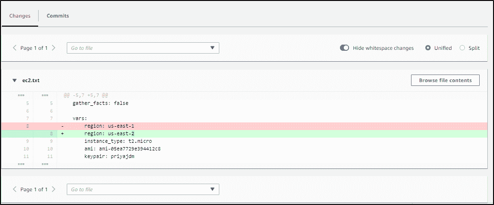

您还可以检查提交历史。只需点击更改旁边的**提交**。

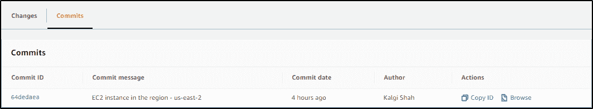

**步骤 3:** 假设您同意在这个分支中所做的更改，并且您想要将这些更改反映到您的主分支中，您可以合并这两个分支。增加**标题**和**描述**。

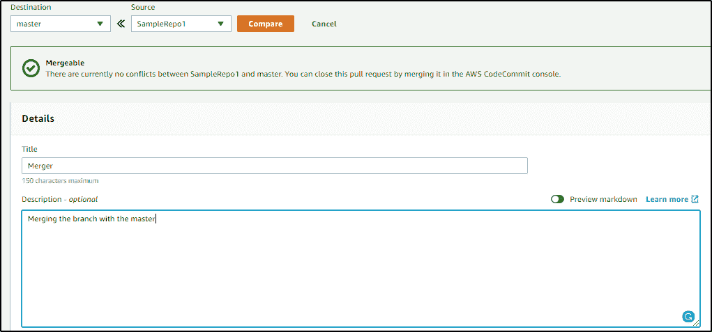

并点击**创建**。

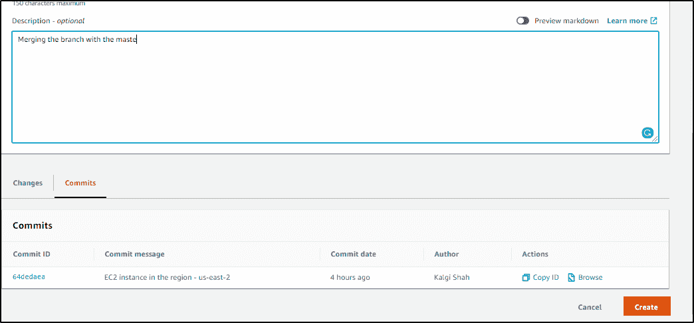

您会收到成功拉取请求的通知。

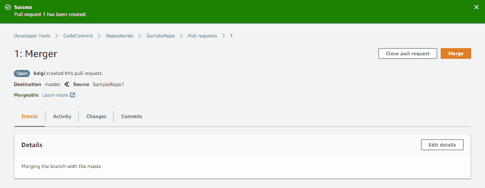

点击**合并**最终合并两个分支。

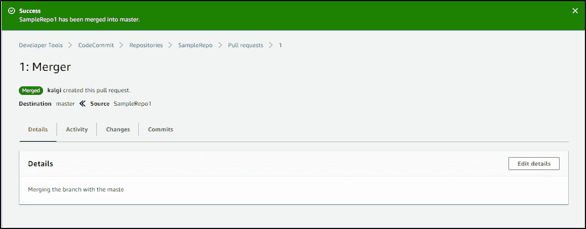

这就把我们带到了 AWS CodeCommit 博客的结尾。您可以将该服务与各种 DevOps 工具集成在一起，从而简化构建过程。我希望这篇博客对你有所帮助。

*如果您希望了解更多关于云计算的知识，并在云计算领域建立自己的事业，那么请参加我们的 [AWS 培训](https://www.edureka.co/aws-certification-training)，该培训包含讲师指导的现场培训和真实项目体验。本培训将帮助您深入了解云计算，并帮助您掌握这门学科。*

*有疑问？请在评论区提及它或将其发布在 [**Edureka 社区**](https://www.edureka.co/community) 上，我们将会回复您。在 Edureka 社区，我们有超过 100，000 名技术狂热分子随时准备提供帮助。*