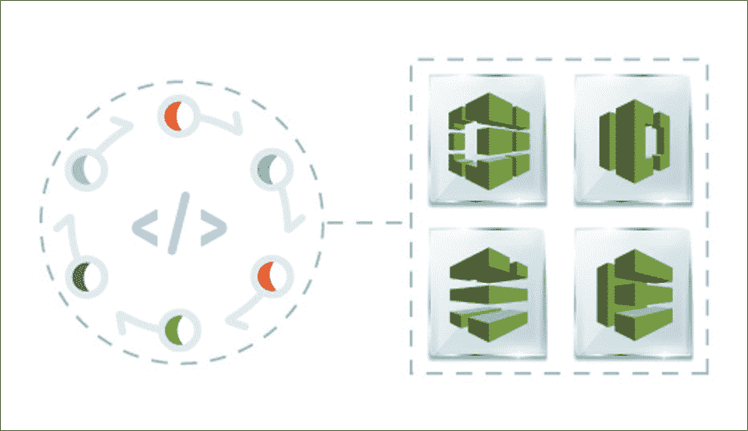

# AWS CodeStar 教程:AWS CodeStar 一瞥

> 原文：<https://www.edureka.co/blog/aws-codestar/>

随着 AWS 上 DevOps 服务需求的增长，AWS 推出了大量服务来满足不断增长的 DevOps 需求。AWS 还推出了一项名为 AWS CodeStar 的服务，将所有 AWS DevOps 服务整合在一起。在本文中，我们将详细讨论 AWS CodeStar。通过 [AWS 在线培训](https://www.edureka.co/aws-certification-training)更好地理解这些概念。

以下是这篇 AWS CodeStar 文章中将要讨论的要点:

那么，让我们开始吧，

## **什么是 AWS CodeStar？**

AWS CodeStar 帮助您在 Amazon Web Services 上创建、管理和使用软件开发项目。该服务帮助您完成各种 Devops 操作，以便您可以在 AWS 上开发、构建和部署应用程序。如前所述，它有助于简化 DevOps 流程，为此，它将流行的 AWS DevOps 服务整合在一起。这些服务是:

*   为了构建代码，你有**AWS code build**
*   部署由 [**负责 AWS CodeDeploy**](https://www.edureka.co/blog/aws-codedeploy/)
*   对于版本控制，我们有[**AWS code commit**](https://www.youtube.com/watch?v=ik4VE1O4OBo)
*   **AWS CodePipeline** 用于建立 CI/CD 管道

项目让你为软件开发工具链创建和集成 AWS 服务。项目模板可能包括源代码管理、构建、部署、虚拟服务器或无服务器资源等等。

您可以看看这个视频，了解更多关于上述服务的信息:

## **CodeBuild code pipeline code deploy code commit in AWS | AWS devo PS 认证培训| Edureka**

[https://www.youtube.com/embed/h0p4dxuwv1s?rel=0&showinfo=0](https://www.youtube.com/embed/h0p4dxuwv1s?rel=0&showinfo=0)*This Edureka “CodeBuild CodePipeline CodeDeploy CodeCommit in AWS” video will give you a thorough and insightful overview of all the concepts related to CI/CD services in AWS.*

那么这就是关于什么是 AWS CodeStar，让我们现在了解它能做什么？

## **我可以用这个服务做什么？**

AWS CodeStar 提供以下功能:

#### 在几分钟内启动新项目

AWS CodeStar 为您提供不同的平台和工具来创建和托管您的应用程序。因为它负责设置您的项目资源，所以您可以协作并使不同的工具一起工作。这反过来帮助你在更短的时间内非常容易地启动新项目。

协作过程变得更加容易，因为该服务的仪表盘让您可以直观地看到项目开发过程中执行的所有操作。

#### **用需要的工具快速迭代**

AWS CodeStar 为您的项目配备了集成开发工具链。您可以推送代码，更改可以自动部署。与问题跟踪的集成允许您跟踪下一步需要做什么。 您和您的团队可以在代码交付的所有阶段更加快速有效地合作。

现在让我们来看看这项服务的一些重要组成部分:

## **重要部件**

该服务有四个组成部分，它们是:

*   项目模板
*   团队
*   仪表盘
*   扩展

让我们试着一个一个去理解这些:

#### **项目模板**

这些确保你有样本模板可以使用。

此模板可确保您花更少的时间配置资源，将更多的时间放在业务目标上。它允许您选择以下选项进行自动配置，

*   应用类型
*   编程语言
*   计算平台

如果需要，稍后您可以选择用其他应用程序替换您的示例应用程序。

#### **组队**

一旦模板和项目需求完全满足，你需要专注于授予适当的访问权限和管理将要参与项目的团队。在 AWS CodeStar 中，每个项目都有一个*项目团队*。一个用户可以属于多个 AWS CodeStar 项目，并在每个项目中拥有不同的 AWS CodeStar 角色(因此拥有不同的权限)。

在 AWS CodeStar 中，团队成员可以选择别名。他们还可以添加电子邮件地址，以便其他团队成员可以联系他们。不是所有者的团队成员不能更改他们在项目中的 AWS CodeStar 角色。

**查看我们在顶级城市的 AWS 认证培训**

| 印度 | 美国 | 其他国家 |
| [在海德拉巴的 AWS 培训](https://www.edureka.co/aws-certification-training-hyderabad) | [亚特兰大 AWS 培训](https://www.edureka.co/aws-certification-training-atlanta) | [AWS 伦敦培训](https://www.edureka.co/aws-certification-training-london) |
| [班加罗尔的 AWS 培训](https://www.edureka.co/aws-certification-training-bangalore) | [波士顿 AWS 培训](https://www.edureka.co/aws-certification-training-boston) | [阿德莱德的 AWS 培训](https://www.edureka.co/aws-certification-training-adelaide) |
| [钦奈的 AWS 培训](https://www.edureka.co/aws-certification-training-chennai) | [纽约市的 AWS 培训](https://www.edureka.co/aws-certification-training-new-york-city) | [新加坡 AWS 培训](https://www.edureka.co/aws-certification-training-singapore) |

#### **仪表盘**

AWS CodeStar 为您提供了一个仪表板，它非常具有交互性和直观性，让您可以执行以下操作:

*   添加、移除或移动仪表板上的互动程序
*   向您的仪表板添加项目扩展
*   定制团队维基磁贴

#### **分机**

该服务还为您提供了扩展功能，让您可以向仪表盘添加磁贴和功能。 要做到这一点，选择**扩展**。在扩展旁边有一个名为**的选项，显示在仪表盘**上。您必须选择它。 要设置显示在仪表板上的分机，请选择分机上的连接按钮或命令，然后按照说明完成设置。

扩展是非常重要的，这项服务也让你可以自由添加 JIRA 扩展，尤其是在 CI/CD 项目中。 如果你对使用这项服务创建项目或应用感兴趣，你可能想看看这个**视频** :

## **AWS CodeStar:使用 AWS CodeStar 部署项目应用| AWS devo PS Training | edu reka**

[https://www.youtube.com/embed/3eu1US49Ddo?rel=0&showinfo=0](https://www.youtube.com/embed/3eu1US49Ddo?rel=0&showinfo=0)*This Edureka live session on ‘AWS CodeStar’ will help you get acclimatized with the nitty-gritty of this AWS Service and help you deploy a Project Application using the same.*

这就是这篇文章的结尾。如果您希望将您的知识提升到一个新的水平，并以培训的形式采取结构化的方法，那么 Edureka 的这个 **[AWS Certified DevOps 工程师认证培训](https://www.edureka.co/aws-certified-devops-training)** 就是专门为满足您的需求而设计的。

如有任何疑问，请在下面的评论区提出，我们会尽快回复您。