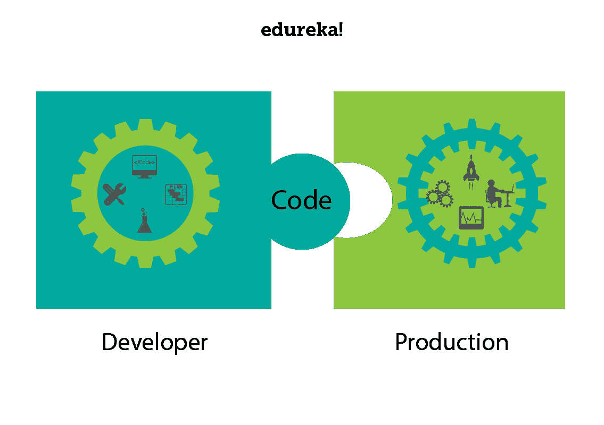

# AWS DevOps:AWS 上的 devo PS 简介

> 原文：<https://www.edureka.co/blog/aws-devops-a-new-approach-to-software-deployment/>

随着时间的推移，技术也在不断发展。随着技术的发展，处理技术的方式和需求也发生了变化。过去的二十年见证了计算和软件开发生命周期的巨大转变。 我们看到了在线 [DevOps 培训](https://www.edureka.co/devops-certification-training) & [AWS 认证](https://www.edureka.co/aws-certification-training)的巨大需求。 今天的博客重点关注一种被称为 **DevOps** 和 **AWS DevOps** 的方法。

本博客关注以下几点:

1.  [什么是 DevOps？](#WhatIsDevOps?)
2.  [什么是 AWS？](#WhatIsAWS?)
3.  [AWS DevOps](#AWSDevOps)

那么让我们开始吧，好吗？

## **什么是 DevOps？**

在这个快节奏的时代，我们看到人们更加重视软件部署的快速交付。因为为了在市场上保持竞争力，公司被期望在规定的时间内部署高质量的软件。因此，软件开发人员和系统管理员的角色变得非常重要。这两个团队之间发生了许多职责的转换。让我们来看看这些人是如何对部署过程做出贡献的。

程序员或软件开发者负责开发软件。简单地说，他应该开发一个软件，它有:

*   新功能
*   安全升级
*   Bug 修复

但是开发者可能需要等待数周的时间来部署产品，这在商业术语中也被称为**‘上市时间’**。因此，这种延迟可能会给开发人员带来压力，因为他被迫重新调整他的依赖活动，例如:

*   待定代码
*   旧代码
*   新产品
*   新功能

此外，当产品投入生产环境时，产品可能会出现一些不可预见的错误。这是因为开发人员在可能不同于生产环境的开发环境中编写代码。

让我们从运营的角度来看一下这个过程。现在，运营团队或系统管理员团队负责维护和保证生产环境的正常运行时间。现在，随着公司在更多的产品和服务上投入了时间和资金，管理员需要管理的服务器数量也在不断增长。

这带来了更多的挑战，因为用于管理早期数量的服务器的工具可能不足以满足未来和不断增长的服务器数量的需求。运营团队还需要对代码进行细微的修改，以使其适应生产环境。因此，相应地安排这些部署的需求也在增长，这导致了时间延迟。

部署代码时，运营团队还负责处理代码变更或代码的小错误。有时，运营团队可能会感到压力，似乎开发人员已经将他们的责任推到了责任墙的运营一边。你可能会意识到，任何一方都不是罪魁祸首。

详情你甚至可以通过 [AWS 云迁移认证](https://www.edureka.co/migrating-to-aws)查看迁移到 AWS 的细节。

如果这两个团队能够合作会怎么样？如果他们:怎么办

*   可能会打破筒仓
*   分担责任
*   开始思维一致
*   团队合作

嗯，这就是 DevOps 的作用，它帮助你让软件开发人员和运营部门保持同步，从而提高工作效率。用行话术语简单定义一下。 *DevOps 是整合开发人员和运营团队以提高协作和生产力的过程。这是通过工作流和生产力的自动化以及对应用程序性能的持续测量来实现的。*

DevOps 专注于将一切自动化，让他们编写小块代码，这些代码可以在几个小时内进行测试、监控和部署，这与编写大块代码需要几个星期才能部署不同。所以这和德沃普斯有关。让我们向前看，了解什么是 AWS，以及它如何与 DevOps 形成重要的组合，为您提供 AWS DevOps。

## **什么是 AWS？**

如果回到十年前，处理或更准确地说存储数据的场景是不同的。公司更喜欢使用他们的私人服务器存储数据。然而，随着互联网越来越好的使用，趋势已经看到了公司的范式转变，因为他们正在将他们的数据转移到云。这使得公司能够更加专注于核心竞争力，不再担心存储和计算。下面这两点说说云的意义:

***事实:*** 网飞是当今全世界都在使用的流行视频流媒体服务，早在 2008 年，网飞就遭遇了严重的数据库损坏，他们的运营暂停了三天。问题是扩大规模，这时他们意识到需要一个高度可靠、可水平扩展的云中分布式系统。从那时起，他们的增长就一落千丈。

***预测:*** Gartner 说，*到 2020 年，企业的“无云”政策将像今天的“无互联网”政策一样罕见*。很有趣，不是吗？

因为每个公司都开始采用云服务。可以说，云是人们谈论的话题。特别是 AWS，它是市场上领先的云服务提供商。让我们对它有更多的了解。

### **AWS**T5

代表亚马逊网络服务的 AWS 是 Amazon.com 的一家子公司，以非常实惠的价格提供云计算服务，因此它的客户群从 Pinterest(只有 5 名员工)这样的小公司到 D-Link 这样的大企业都很强大。

从巴特那的 [AWS 培训中了解更多信息。](https://www.edureka.co/aws-certification-training-patna)

### **什么是云计算？**

它使用互联网上的远程服务器来存储、管理和处理数据，而不是本地服务器或个人电脑。

云计算基本上有 3 类:

### **【基础设施即服务】**

*   IaaS 在云中给你一个**服务器**，你可以完全控制它。
*   在 Iaas 中，你负责管理从操作系统到你运行的应用程序的一切。

### **【平台即服务】**

*   有了 PaaS，您就拥有了灵活性和简单性的结合。
*   灵活，因为它可以根据应用需求进行定制。
*   简单到不需要操作系统维护、版本、补丁。

### **【SaaS】**

*   第三方提供商托管应用程序的软件分发模式。
*   您只需通过互联网访问软件，而不是安装和维护软件。
*   自动更新减轻了内部 IT 人员的负担。

当我们提到 AWS 时，它更多的是一个 **IAAS。**

如果你想详细了解云计算，请参考此链接 [*什么是云计算？*](https://www.edureka.co/blog/what-is-cloud-computing/)

## **AWS devo PS**

AWS 是最好的云服务提供商之一，而 DevOps 则是软件开发生命周期的“*当务之急”*。以下原因使 AWS DevOps 成为一个非常受欢迎的合并:

### **自动气象站云形成**

与传统开发团队相比，开发运维团队需要更频繁地创建和发布云实例和服务。AWS CloudFormation 能让你做到这一点。像 EC2 实例、ECS 容器和 S3 存储桶这样的 AWS 资源的模板让您可以设置整个堆栈，而不必自己将所有的东西放在一起。

### **AWS EC2**

AWS EC2 不言自明。您可以在 EC2 实例中运行容器。因此，您可以利用 AWS 安全和管理特性。AWS DevOps 是致命组合的另一个原因。

### **AWS cloud watch**

这个监控工具可以让你跟踪 AWS 提供的每一项资源。此外，它使得使用第三方工具进行监控变得非常容易，如相扑逻辑等

### **AWS 代码管道**

CodePipeline 是 AWS 的一个流行功能，它极大地简化了您管理 CI/CD 工具集的方式。它允许您与 GitHub、Jenkins 和 CodeDeploy 等工具集成，使您能够直观地控制从构建到生产的应用程序更新流程。

### **AWS 中的实例**

AWS 经常创建新实例并将其添加到列表中，这些实例的定制级别使您可以轻松地一起使用 AWS DevOps。

所有这些原因使得 AWS 成为 DevOps 的最佳平台。你可以从浦那的 [AWS 课程中了解更多关于 AWS 的服务。](https://www.edureka.co/aws-certification-training-pune)

此外，如果你正在寻找一份既有挑战性又有回报的职业。 不管你是已经在 DevOps 工作过的人，还是这个领域的新手，DevOps 专业证书课程正是你需要学习的获得成功的方法。 从最基础到最先进的方法，我们无所不包。*您也可以查看我们的 [DevOps 工程师课程](https://www.edureka.co/masters-program/devops-engineer-training)。它将帮助您获得 DevOps 工具方面的专业知识。*

有问题要问我们吗？请在评论区提到它，我们会给你回复。