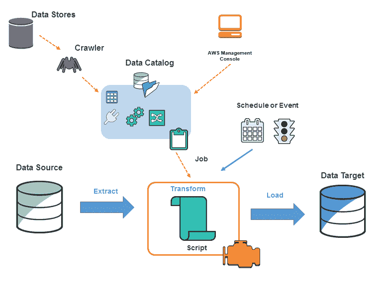
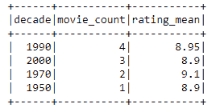

# AWS Glue——简化 ETL 流程所需的一切

> 原文：<https://www.edureka.co/blog/aws-glue/>

ETL 过程  是专门为将数据从源数据库转移到数据仓库而设计的。然而，ETL 的挑战和复杂性使得它很难成功地实现所有的企业数据。为此，亚马逊推出了 AWS Glue。你可以通过 [AWS 培训和认证](https://www.edureka.co/aws-certification-training)了解更多关于亚马逊网络服务的信息。[займыкруглосуточнобезотказа](http://webbanki.ru/zaimy-kruglosutochno)。

在本文中，我们将要讨论的要点如下:

让我们从第一个话题开始。

## **什么是 AWS 胶水？**


*   AWS Glue 是一个完全托管的 ETL 服务。这项服务使数据分类、清理、丰富以及在各种数据存储之间快速可靠地移动变得简单而经济。

*   它由一些组件组成，如一个称为 AWS Glue Data Catalog 的中央元数据存储库、一个自动生成 Python 或 Scala 代码的 ETL 引擎，以及一个灵活的调度程序，用于处理依赖关系解析、作业监控和重试。

*   AWS Glue 是无服务器的，这意味着不需要设置或管理基础设施。

## 什么时候应该使用 AWS 胶水？

### **1。构建数据仓库来组织、清理、验证和格式化数据。**

*   您可以将 [AWS](https://www.edureka.co/blog/videos/aws-tutorial/) 云数据转换并移动到您的数据存储中。

*   您还可以将不同来源的数据加载到您的数据仓库中，以便进行定期报告和分析。

*   通过将信息存储在数据仓库中，您可以集成来自业务不同部分的信息，并为决策提供一个公共数据源。

### **2。当您对亚马逊 S3 数据湖运行无服务器查询时。**

*   AWS Glue 可以对您的亚马逊简单存储服务(亚马逊 S3)数据进行编目，使其可用于使用亚马逊 Athena 和亚马逊 Redshift Spectrum 进行查询。

*   使用爬网程序，您的元数据与底层数据保持同步。Athena 和 Redshift Spectrum 可以在 AWS Glue 数据目录的帮助下直接查询你的[亚马逊 S3](https://www.edureka.co/blog/s3-aws-amazon-simple-storage-service/) 数据湖。

*   借助 AWS Glue，您可以通过一个统一的界面访问和分析数据，而无需将数据加载到多个数据仓库中。

### **3。当你想创建事件驱动的 ETL 管道时**

*   通过从 AWS Lambda 函数调用 AWS Glue ETL 作业，您可以在 Amazon S3 获得新数据后立即运行 ETL 作业。

*   您还可以在 AWS Glue 数据目录中注册这个新数据集，将其视为 ETL 作业的一部分。

**4。了解您的数据资产。**

*   您可以使用各种 AWS 服务存储数据，并使用 AWS Glue 数据目录维护数据的统一视图。

*   查看数据目录以快速搜索和发现您拥有的数据集，并在一个中央存储库中维护相关元数据。

*   数据目录还可以作为外部 Apache Hive Metastore 的替代产品。

    **查看我们在顶级城市的 AWS 认证培训**

    | 印度 | 美国 | 其他国家 |
    | [在海德拉巴的 AWS 培训](https://www.edureka.co/aws-certification-training-hyderabad) | [亚特兰大 AWS 培训](https://www.edureka.co/aws-certification-training-atlanta) | [AWS 伦敦培训](https://www.edureka.co/aws-certification-training-london) |
    | [班加罗尔的 AWS 培训](https://www.edureka.co/aws-certification-training-bangalore) | [波士顿 AWS 培训](https://www.edureka.co/aws-certification-training-boston) | [阿德莱德的 AWS 培训](https://www.edureka.co/aws-certification-training-adelaide) |
    | [钦奈的 AWS 培训](https://www.edureka.co/aws-certification-training-chennai) | [纽约市的 AWS 培训](https://www.edureka.co/aws-certification-training-new-york-city) | [新加坡 AWS 培训](https://www.edureka.co/aws-certification-training-singapore) |

## **AWS 胶水的好处**

### **1。更少的麻烦**

AWS Glue 被集成到非常广泛的 AWS 服务中。AWS Glue 本机支持存储在亚马逊 Aurora 和所有其他亚马逊 RDS 引擎、亚马逊红移和亚马逊 S3 中的数据，以及运行在亚马逊 EC2 上的虚拟私有云(亚马逊 VPC)中的常见数据库引擎和数据库。

### **2。性价比高**

 AWS 胶水无服务器。没有要供应或管理的基础架构。AWS Glue 处理在完全托管的、可扩展的 Apache Spark 环境上运行 ETL 作业所需的资源的供应、配置和扩展。您只需为作业运行时使用的资源付费。

### **3。更多动力**

AWS Glue 自动化了构建、维护和运行 ETL 作业的大量工作。它抓取您的数据源，识别数据格式以及建议模式和转换。AWS Glue 自动生成代码来执行数据转换和加载过程。

## **AWS 胶水概念**

您在 AWS Glue 中定义  *作业* 来完成从数据源提取、转换和加载(ETL)数据到数据目标所需的工作。您通常会执行以下操作:



*   首先，定义一个  *爬虫* ，用元数据表定义填充 AWS 胶合数据目录。您将爬行器指向数据存储，爬行器在数据目录中创建表定义。除了表定义之外，数据目录还包含定义 ETL 作业所需的其他元数据。当您定义转换数据的作业时，可以使用此元数据。

*   AWS Glue 可以生成一个脚本来转换您的数据，或者您也可以在 AWS Glue 控制台或 API 中提供脚本。
*   您可以按需运行作业，也可以将其设置为在指定的  *触发* 发生时启动。触发器可以是基于时间的计划或事件。

*   当作业运行时，脚本从数据源中提取数据，转换数据，并将其加载到数据目标中。这个脚本在 AWS Glue 的 Apache [Spark](https://www.edureka.co/blog/spark-architecture/) 环境中运行。

你可以从 [AWS 云课程](https://www.edureka.co/masters-program/aws-cloud-certification-training)中了解更多关于 AWS 及其服务的知识。

### **AWS 胶水术语**

| **术语** | **描述** |
| **数据目录** | 持久元数据存储在 AWS Glue 中。它包含表定义、作业定义和管理 AWS Glue 环境的其他控制信息。 |
| **分类器** | 决定数据的模式。AWS Glue 为常见的文件类型提供了分类器，比如 CSV、JSON、AVRO、XML 等等。 |
| **连接** | 它包含连接到您的数据存储所需的属性。 |
| **爬虫** | 连接到数据存储(源或目标)的程序，通过分类器的优先列表来确定数据的模式，然后在数据目录中创建元数据表。 |
| **数据库** | AWS Glue 中组织成逻辑组的一组相关数据目录表定义。 |
| **数据存储、数据源、数据目标** | 一个 *数据仓库* 是一个持久存储你的数据的仓库。 D *数据源* 是用作流程或转换输入的数据存储。 *数据目标* 是进程或转换写入的数据存储。 |
| **开发终点** | 一个可以用来开发和测试 AWS Glue ETL 脚本的环境。 |
| **工作** | 执行 ETL 工作需要业务逻辑。它由转换脚本、数据源和数据目标组成。 |
| **笔记本服务器** | 一个基于网络的环境，您可以使用它来运行您的 PySpark 语句。PySpark 是用于 ETL 编程的 Python 方言。 |
| **脚本** | 从源中提取数据、转换数据并加载到目标中的代码。AWS Glue 生成 PySpark 或 Scala 脚本。 |
| **表** | 代表你的数据的是元数据定义。表格定义了数据的模式。 |
| **变换** | 你使用代码逻辑将数据转换成不同的格式。 |
| **触发** | 启动 ETL 作业。您可以根据预定的时间或事件定义触发器。 |

**AWS 胶水是如何工作的？**

在这里，我将演示一个例子，我将使用 [Python](https://www.edureka.co/blog/whats-new-python-3-8/) 和 Spark 创建一个转换脚本。我还将介绍一些基本的粘合概念，如爬虫、数据库、表和作业。

1.  ### **为 AWS Glue 创建一个数据源:**

    [胶可以从数据库或 S3 桶中读取](https://docs.aws.amazon.com/glue/latest/dg/add-crawler.html#crawler-data-stores) 的数据。例如，我创建了一个名为 *glue-bucket-edureka* 的 S3 桶T5。**从 S3 控制台创建两个文件夹** ，命名为  *读作**写作*。现在用下面的数据创建一个文本文件，并上传到 S3 桶的 read 文件夹。

    排名、电影 _ 片名、年份、评分 1、《肖申克的救赎》1994 年 9.2 2、《教父》1972 年 9.2 3、《教父:第二部》1974 年 9.0 4、《黑暗骑士》2008 年 9.0 5、《12 怒汉》1957 年 8.9 6、《辛德勒的名单》1993 年 8.9 7、《魔君》

2.  ### **Grab the data source to the data directory:**

在这一步中，我们将创建一个爬虫。爬虫将在指定的 S3 桶和前缀中编目所有文件。所有文件应该具有相同的模式。在 Glue crawler 术语中，该文件格式被称为*分类器*。爬虫[自动识别最常见的分类器](https://docs.aws.amazon.com/glue/latest/dg/add-classifier.html#classifier-built-in)，包括 CSV、json 和 parquet。我们的样本文件是 CSV 格式，将被自动识别。

当您回到所有爬虫列表时，勾选您创建的爬虫。点击 **运行爬虫** 。

### **3。胶表中抓取的元数据:**

一旦爬取了数据，爬虫就会从数据中创建一个元数据表。你可以从胶水控制台的表格部分找到结果。您在爬虫设置期间创建的 *数据库* 只是一种任意的表分组方式。粘合表不包含数据，只包含如何访问数据的指令。

### **4。用于数据转换的 AWS 粘合作业:**

从胶水控制台左侧面板进入**作业** ，点击蓝色  **添加作业** 按钮。按照以下说明创建粘合作业:

### **5。用 Python 和 Spark 编辑 Glue 脚本转换数据:**

将以下代码复制到您的 Glue 脚本编辑器中，记住将 **的桶名** 改为 *s3_write_path* 变量。**在编辑器中保存**代码，点击**运行作业**。

```
#########################################
### IMPORT LIBRARIES AND SET VARIABLES
#########################################

#Import python modules
from datetime import datetime

#Import pyspark modules
from pyspark.context import SparkContext
import pyspark.sql.functions as f

#Import glue modules
from awsglue.utils import getResolvedOptions
from awsglue.context import GlueContext
from awsglue.dynamicframe import DynamicFrame
from awsglue.job import Job

#Initialize contexts and session
spark_context = SparkContext.getOrCreate()
glue_context = GlueContext(spark_context)
session = glue_context.spark_session

#Parameters
glue_db = "glue-demo-edureka-db"
glue_tbl = "read"
s3_write_path = "s3://glue-demo-bucket-edureka/write"

#########################################
### EXTRACT (READ DATA)
#########################################

#Log starting time
dt_start = datetime.now().strftime("%Y-%m-%d %H:%M:%S")
print("Start time:", dt_start)

#Read movie data to Glue dynamic frame
dynamic_frame_read = glue_context.create_dynamic_frame.from_catalog(database = glue_db, table_name = glue_tbl)

#Convert dynamic frame to data frame to use standard pyspark functions
data_frame = dynamic_frame_read.toDF()

#########################################
### TRANSFORM (MODIFY DATA)
#########################################

#Create a decade column from year
decade_col = f.floor(data_frame["year"]/10)*10
data_frame = data_frame.withColumn("decade", decade_col)

#Group by decade: Count movies, get average rating
data_frame_aggregated = data_frame.groupby("decade").agg(
f.count(f.col("movie_title")).alias('movie_count'),
f.mean(f.col("rating")).alias('rating_mean'),
)

#Sort by the number of movies per the decade
data_frame_aggregated = data_frame_aggregated.orderBy(f.desc("movie_count"))

#Print result table
#Note: Show function is an action. Actions force the execution of the data frame plan.
#With big data the slowdown would be significant without cacching.
data_frame_aggregated.show(10)

#########################################
### LOAD (WRITE DATA)
#########################################

#Create just 1 partition, because there is so little data
data_frame_aggregated = data_frame_aggregated.repartition(1)

#Convert back to dynamic frame
dynamic_frame_write = DynamicFrame.fromDF(data_frame_aggregated, glue_context, "dynamic_frame_write")

#Write data back to S3
glue_context.write_dynamic_frame.from_options(
frame = dynamic_frame_write,
connection_type = "s3",
connection_options = {
"path": s3_write_path,
#Here you could create S3 prefixes according to a values in specified columns
#"partitionKeys": ["decade"]
},
format = "csv"
)

#Log end time
dt_end = datetime.now().strftime("%Y-%m-%d %H:%M:%S")
print("Start time:", dt_end)

```

详细的解释在代码中有注释。以下是高层次的描述:

两个数据处理单元(DPU)的执行时间约为 40 秒。相对较长的持续时间是由启动开销造成的。

数据转换脚本创建汇总的电影数据。例如，2000 decade 有 3 部电影进入 IMDB top 10，平均评分为 8.9。你可以从你的 S3 桶的 *写* 文件夹下载结果文件。调查这项工作的另一种方法是查看 CloudWatch 日志。

数据以 CSV 格式存储回 S3 的“写入”前缀中。分区的数量等于输出文件的数量。

至此，关于 AWS Glue 的这篇文章到此结束。我希望你已经理解了我在这里解释的一切。您可以在下面的视频中了解 AWS Glue 的特性和优势

[https://www.youtube.com/embed/Qpv7BzOM-UI](https://www.youtube.com/embed/Qpv7BzOM-UI)

*如果您发现这篇 AWS Glue 文章相关，您可以查看 Edureka 在钦奈举办的关于 [AWS 培训的现场和讲师指导课程，该课程由行业从业者共同创建。](https://www.edureka.co/aws-certification-training-chennai)*

*有问题吗？请在如何在 AWS 中部署 Java Web 应用程序的评论部分提到它，我们会回复您。*