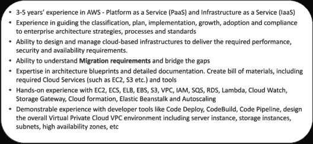
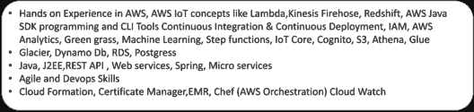

# AWS 简历:如何让自己的专业羊皮纸看起来有吸引力？

> 原文：<https://www.edureka.co/blog/aws-resume/>

在我之前的文章中，我谈到了如何成为一名优秀的云工程师，以及如何成为一名优秀的云工程师。。AWS 是市场上领先的服务供应商之一，许多人都希望在该领域抓住一个可能的机会。因此，我们看到很多人希望获得 AWS 认证。一旦获得认证，下一步就是建立一份简历，这将有助于你获得认可，从而最终获得一份工作机会。在这篇文章中，我将讨论关于 AWS 简历的所有细节。

在我们开始之前，如果你有兴趣了解亚马逊网络服务，请查看这个 [AWS 认证在线培训](https://www.edureka.co/aws-certification-training)请注意，经验&技能是你简历的重要组成部分。确保这些符合工作要求。

事实上，你的简历会被不同的公司筛选，了解行业要求是很重要的，这里有一些公司要求你具备的职位描述样本。

#### **IBM 为 AWS 解决方案架构师提供的 JD**

#### **由 TCS 为 AWS IOT 架构师提供的 JD**

#### **AWS 架构师 JD Brillio】**

从上面的 JD 可以清楚地看出，各行业正在寻找具有不同技能和工作角色的专业人士，这些技能和工作角色可能会涉及不同的角色。AWS 工程师通常分为三类，涉及三种不同的工作角色:

#### **AWS 方案架构师**

这些人将参与基础设施和应用程序的设计。因此，他们必须拥有在云平台上设计分布式应用程序和系统的高级技术技能和经验。简单地说，他们负责创建应用程序设计的蓝图。通过 [AWS 云课程](https://www.edureka.co/masters-program/aws-cloud-certification-training)，深入了解云计算、AWS 架构原则、云上迁移应用等知识。

以下是他们的部分职责:

*   在云上设计和部署动态可扩展、可用、容错和可靠的应用
*   根据给定的需求选择合适的云服务来设计和部署应用
*   在云平台上迁移复杂的多层应用
*   在云平台上设计和部署企业级可扩展运营
*   实施成本控制策略

## AWS 云从业者| AWS 认证云从业者–完整课程| AWS 培训| Edureka

[https://www.youtube.com/embed/XjPUyGKRjZs?rel=0&showinfo=0](https://www.youtube.com/embed/XjPUyGKRjZs?rel=0&showinfo=0)This ‘AWS Cloud Practitioner’ tutorial video will give you a complete understanding of the AWS Cloud platform and help you prepare for the AWS Certified Cloud Practitioner Examination.

#### **AWS 开发者**

从标题可以清楚地看出，这些人负责应用程序的编码和开发。他们应该了解与云架构相关的最佳实践。云开发人员还参与开发、部署和调试基于云的应用程序。他们预计有: 

*   至少精通一门高级编程语言
*   开发、部署&调试云应用的技能
*   使用 API、命令行界面和 SDK 编写应用程序的技能
*   了解云服务提供商的关键特性
*   了解应用生命周期管理
*   能够使用持续集成和分发管道来部署应用
*   编码实现基本安全措施的能力
*   编写、修改和调试代码模块的技能
*   无服务器应用的代码编写技巧
*   了解在开发过程中容器的使用

你甚至可以通过 [AWS 开发者认证](https://www.edureka.co/aws-developer-certification-training)查看 AWS 开发者的详细信息。

#### **AWS 系统运营工程师**

这些人是系统管理员，一旦应用程序被设计和开发出来，他们就接管工作。他们负责管理和监控开发过程中的大部分活动。他们应具备以下技能:

*   在系统运营部门担任系统管理员的相关经验
*   使用虚拟化技术的能力
*   在监控和审计系统方面的经验
*   了解网络概念(例如，DNS、TCP/IP 和防火墙)
*   翻译架构需求的能力
*   部署、管理和操作可扩展、高可用性和容错系统的能力
*   知道如何实施和控制与服务提供商之间的数据流动
*   能够根据计算、数据或安全需求选择适当的服务
*   估算使用成本和确定运营成本控制机制的能力
*   将内部工作负载迁移至服务提供商的能力

既然对标准 AWS 简历重要的所有细节都已经讨论过了，那么让我们看看如何实际制作一份 AWS 简历:

## **简历**

简历是你在面试官面前的第一印象。这是朝着你的目标迈出的第一步&也是最关键的一步。有两种方法可以制作你的简历:

*   按时间顺序:这是制作简历的传统方式，你可以用经历发生的方式来提及你的经历。保守领域首选这类简历。
*   **【功能:】这是一种全新的方式，你可以根据所需的技能来提及你最相关的经验。在这种情况下，你的招聘人员不必浏览整个简历来找出所需的技能。这是一种在面试官面前更专注、更简洁地展示自己的方式。**

你甚至可以通过 [AWS 云迁移认证](https://www.edureka.co/migrating-to-aws)查看迁移到 AWS 的细节。

你需要记住的第一件事是，你的简历应该前后一致、简洁&格式清晰&你想传达的信息

*   不断更新你的简历。建立或更新你的简历真的很累，但是你投入的时间越多，你被选中的几率就越高。招聘人员会收到数百份简历来应聘一份工作，而你的简历将会帮你通过第一轮面试。
*   对于工作经验少于 8 年的人来说，应该有一份单页简历。你最多应该带一份两页的简历。两页之后，简历变得冗长，面试官对阅读它失去了兴趣。
*   如果你有 2 年以上的工作经验，试着写一份功能性简历，只写相关的经历，而不是充斥所有的内容。
*   优先考虑特定工作所需的技能。为每一份&每一份工作制作一份定制简历总是更好的。
*   列出活动&提及你在活动中的角色。这是你展示你的人际交往能力的地方，比如领导力、团队精神等。此外，列出你所获得的奖项，以证明你在不同领域的潜力。
*   你的兴趣爱好在打破与面试官的僵局中起着重要的作用。这部分也表明你是一个拥有各种技能&爱好的多面手。

**查看我们在顶级城市的 AWS 认证培训**

| 印度 | 美国 | 其他国家 |
| [在海德拉巴的 AWS 培训](https://www.edureka.co/aws-certification-training-hyderabad) | [亚特兰大 AWS 培训](https://www.edureka.co/aws-certification-training-atlanta) | [AWS 伦敦培训](https://www.edureka.co/aws-certification-training-london) |
| [班加罗尔的 AWS 培训](https://www.edureka.co/aws-certification-training-bangalore) | [波士顿 AWS 培训](https://www.edureka.co/aws-certification-training-boston) | [阿德莱德的 AWS 培训](https://www.edureka.co/aws-certification-training-adelaide) |
| [钦奈的 AWS 培训](https://www.edureka.co/aws-certification-training-chennai) | [纽约市的 AWS 培训](https://www.edureka.co/aws-certification-training-new-york-city) | [新加坡 AWS 培训](https://www.edureka.co/aws-certification-training-singapore) |

现在让我们进入 AWS 简历博客中最令人期待的部分:

## **AWS 简历**

现在具体说大数据工程师简历，除了你的名字&个人详情，第一节应该是你的工作经历。

### **工作经历**

你应该总是从相关的工作经历开始，这将很快吸引招聘人员的注意。它应该以一种简洁、明快、清晰的方式陈述你所承担的责任&你从他们身上学到的东西。

你可以把你的经历分成以下几个部分:

*   名称
*   组织名称
*   雇佣期限
*   工作职责简述
*   你从那份工作中学到的东西或经验

以下是一份 AWS 简历样本:

**经历: AWS 解决方案架构师——网飞**

**2015 年 7 月至今**

我在团队中担任 AWS 解决方案架构师，负责构建和维护能够存储、处理&和管理从各种来源收集的大量数据的基础设施。众所周知，网飞同时处理流数据和静态数据，因此考虑可伸缩性需求非常重要。

*   与各种团队和管理层合作，了解需求并设计完整的系统
*   在指导企业架构战略、流程和标准的分类、计划、实施、发展、采用和遵从方面的经验
*   设计和开发高度可扩展和可用的系统
*   与 EC2、Lamba、SES、SNS、VPC、CloudFront、CloudFormation 等服务合作过
*   在创建架构蓝图和详细文档方面表现出专业技能。创建物料清单，包括所需的云服务(如 EC2、S3 等。)和工具
*   参与端到端部署流程
*   在制作简历时，有一些要点需要牢记。

上面的简历中有一些关键因素，它们不仅会让你占上风，还会给你的雇主留下深刻印象。请注意以下指针:

*   试提软件版本&框架。
*   查看职位描述，你同样可以调整你的经历&提及那些组织需要的工具&技能。
*   你需要明白，有太多的服务和工具是为了一个单一的目的，你不可能掌握所有的。所以，我的建议是，不要仅仅提到工具或框架的名字，而是添加一个关于你对工具的了解&的小描述。这也有助于面试官了解，如果你没有使用相同工具的经验，你有使用另一种工具的经验。

### **技术技能**

在工作经历之后，我建议你创建一个技能部分，在那里你可以列出你的技能。你可以把你认为工作角色需要的所有技能，或者你有自信的技能都放进去。这是一个示例技能集的样子:

***举例:***

**技术技能:**

*   能够理解**迁移要求**并弥合差距
*   架构蓝图和详细文档方面的专业知识。创建物料清单，包括所需的云服务(如 EC2、S3 等。)和工具
*   EC2、ECS、ELB、EBS、S3、VPC、IAM、SQS、RDS、Lambda、云监控、存储网关、云形成、弹性 Beanstalk 和自动扩展的实践经验
*   具有开发人员工具(如代码部署、代码构建、代码管道)的丰富经验，能够设计整体虚拟私有云 VPC 环境，包括服务器实例、存储实例、子网、高可用性区域等

### **成就&爱好**

这之后，下一节应该是成就&的爱好。尽量不要提及太多的 成就或爱好，因为这会分散面试官的注意力&他/她可能会错过重要的。说几个和你有信心的&相关的。

伙计们，我希望这个 AWS 简历博客能帮助你们弄清楚如何制作一份有吸引力的&有效简历。我还写了一篇关于 AWS 薪水的博客，你可能想看看，这样你就能获得作为一名 AWS 专业人员能挣多少钱的详细信息。

如有疑问，您可以在下面的评论区提出，我们会尽快回复。