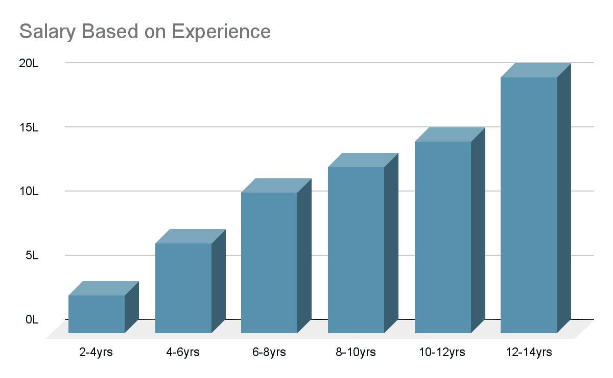
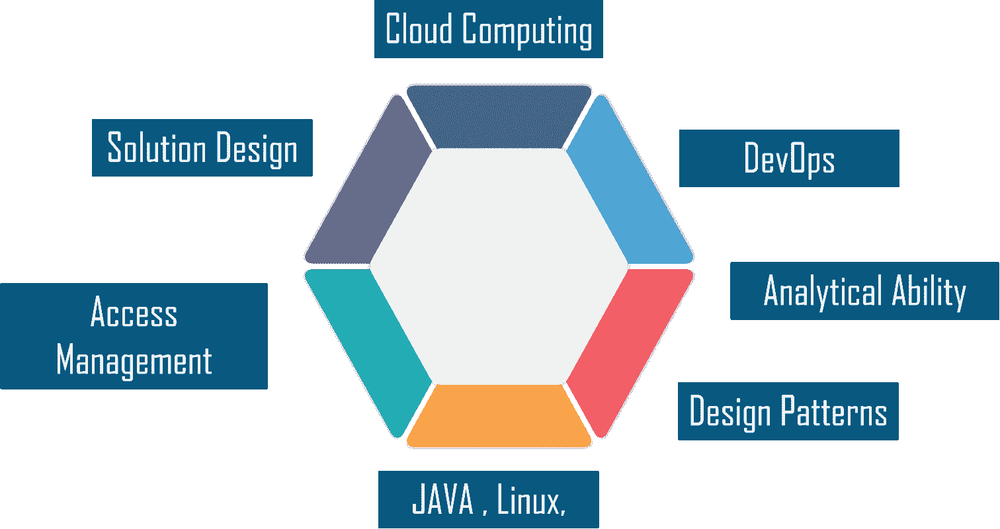
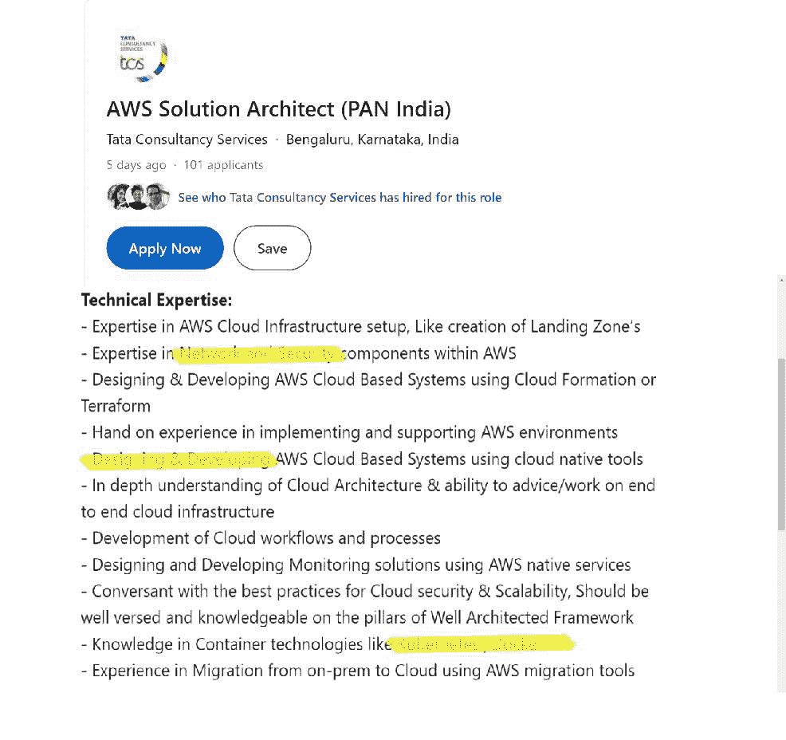
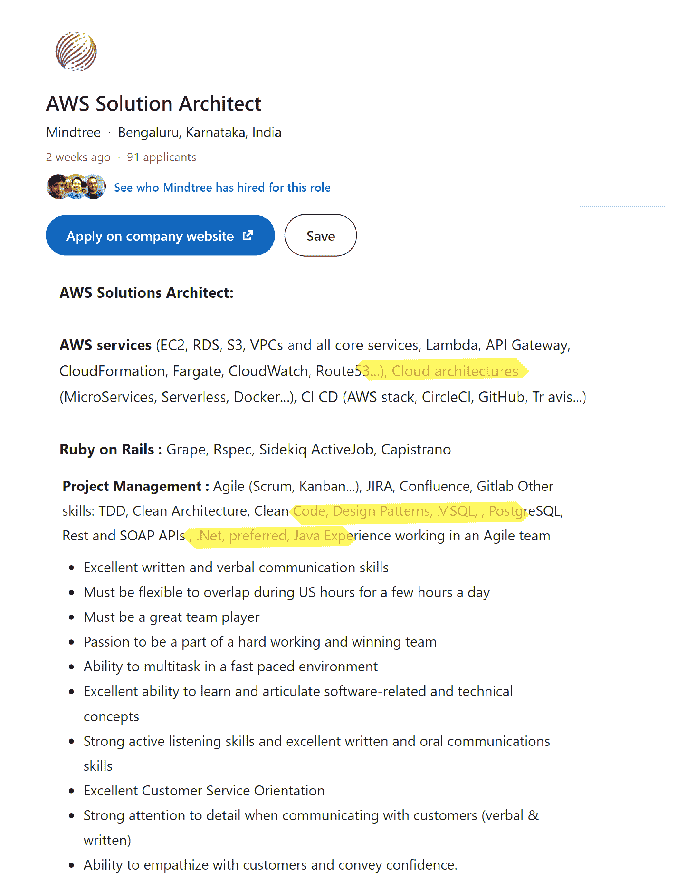
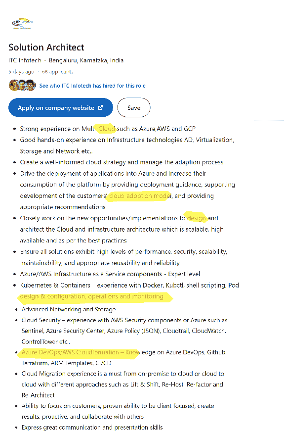
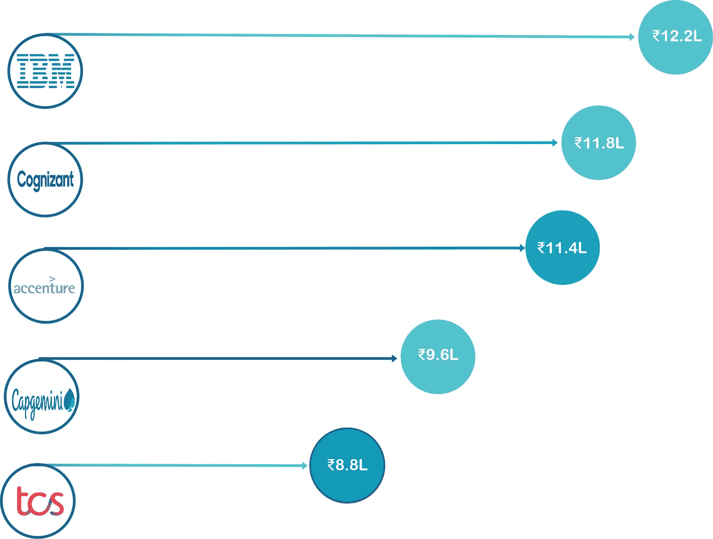
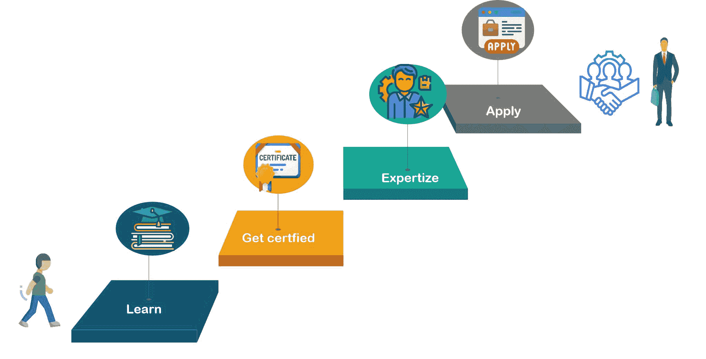

# 印度 AWS 解决方案架构师薪资[2023 年更新]

> 原文：<https://www.edureka.co/blog/aws-solution-architect-salary-india/>

## **印度 AWS 解决方案架构师工资**

在印度，一个入门级的 ***AWS 解决方案架构师*** 每年大约挣。一个中等水平的专业人员每年大概能挣【₹13,86,744】，而一个经验丰富的专业人员每年能挣得比【₹24,67,543】多。寻求 AWS 架构师或开发人员职业的人有一个光明的未来，不仅仅是在薪酬方面，还包括职业发展方面。随着你逐渐适应这份工作，获得更多的经验，学会做生意的诀窍，你能赚多少钱是没有限制的。在这个博客中，你将通过以下话题了解 AWS 的薪水

*   [**AWS 印度解决方案架构师薪资**](#India)
*   [**按经验平均年薪**](#Average)
*   [**AWS 解决方案架构师的顶级技能**](#Skills)
*   [**AWS 解决方案架构师职位描述**](#Description)
*   [**【AWS 解决方案架构岗位职责及薪资】**](#Salary)
*   [**公司招聘 AWS 解决方案架构师**](#Companies)
*   [**AWS 解决方案架构师职业道路**](#Path)

## **经验平均年薪**

印度 2 年至 14 年经验的 AWS 解决方案架构师收入在 37 万卢比至 27 万卢比之间。在印度，AWS 解决方案架构师的全国平均工资约为 70-80 万₹。

## **AWS 解决方案架构师的顶级技能**

要成为 AWS 上的解决方案架构师，你必须首先掌握多种技能。云计算，开发运维，设计模式，Java，Linux，PAAS，解决方案设计，故障排除。Net，访问管理，分析能力和其他技能是必需的。让我们来看看成为 AWS 解决方案架构师的资格。

****

**云计算**

重要 AWS 服务的职责知识，如 EC2、S3 等。在评估客户端工作负载和云就绪技术环境，以及开发业务案例和云采用路线图方面的成熟专业知识。需要对 AWS 平台和工具有充分的了解，有创建新架构的经验，并有能力从架构的角度推动项目。

**DevOps**

具有基于 Linux 的基础设施经验，精通 Python、数据库设置和管理。配置和管理数据库不需要 SQL 和 SQL 选择和实施合适的 CI/CD 工具，需要 Gitlab、SonarQube、Python、Selenium、Docker 和 Kubernetes 的知识。

**设计模式**

*   对面向对象编程原则和设计模式有很好的理解
*   需要 Java 经验和能力。
*   理解 Spring Boot、客户端技术和数据库原理将是有利的。
*   最好对 Rest Web 服务有所了解。
*   了解 SAPUI5 和 xsjs 也是有益的。
*   云软件开发经验

**Java**

*   良好的 PYTHON 编程知识，具有面向对象原则和任何标准测试框架(如 pytest、unittest 等)
*   –对 web 应用程序自动化工具/包(如 selenium 或其他替代产品)有广泛的了解
*   –各种测试程序的优秀经验 QA 经验–各种工具的实践经验–测试软件、版本控制系统(Git)、测试管理软件、缺陷跟踪软件和持续集成工具(Jenkins 等)。)

**Linux**

*   云铸造和 Kubernetes 原则的基础知识。
*   了解 Unix/Linux 内部机制，并渴望解决系统工程挑战
*   接触一个或多个超大规模基础架构层(例如，AWS/ Azure/ GCP/ Openstack/ VMware)。

**解决方案设计**

应具备为内部和基于云的安全系统开发逻辑和物理安全架构的经验。根据需求创建安全解决方案的解决方案蓝图。了解 RFP 技术要求、服务水平协议、资源、交付期限等。

**分析能力**

*   为了满足期望的准确度和生产率，根据预先定义的流程、规则和标准操作程序完成审计任务。
*   表现出杰出的时间管理和解决问题的能力。
*   彻底检查产品信息，保证数据的准确性和完整性。
*   分析数据并发现新的趋势/模式，以提高公司绩效。

**门禁管理**

*   应该了解敏捷 Scrum 原则。回顾/任务会议
*   已经演示了相对估计和基于故事的开发。
*   能够召开迭代/冲刺计划会议和解决争议。
*   在业务分析规划和监控、企业分析、需求管理和沟通方面有很强的背景。
*   提供不带个人或政治偏见的客观建议。
*   在各种文化和环境中部署敏捷方法的丰富经验。

## **AWS 解决方案架构师职位描述**

让我们来看看知名公司招聘人员根据我们之前介绍的资格条件招聘的 AWS 解决方案架构师的一些职位描述。

## ****

## ****

## ****

## **AWS 解决方案架构职位角色和工资**

根据 LinkedIn 的数据，印度有超过 11，000 个 AWS 解决方案架构师职位空缺。

因此，这些是招聘人员中最受欢迎的 AWS 解决方案架构师职位简介。

| 工作角色 | 工资 |
| 解决方案架构师 | 10 LPA |
| AWS 开发工程师 | 6.1LPA |
| 解决方案集成商 | 6.3 LPA |
| AWS 云工程师 | 5.8 LPA |
| AWS 工程师 | 5.1 LPA |
| 助理解决方案架构师 | 12 LPA |
| 技术解决方案架构师 | 10.8 LPA |
| 高级解决方案架构师 | 29 LPA |

## **招聘 AWS 解决方案架构师的公司** :

让我们来看看一些寻找 AWS 解决方案架构师的顶级 IT 公司及其薪酬方案。

## ****

## **AWS 解决方案架构师职业道路**

了解如何发展自己的技能和教育，让自己成为一名 AWS 解决方案架构师，以及在职业道路的每个阶段期望的薪资。

****

1.  **学习必要的技能**

如果你想成为一名 AWS 解决方案架构师，你应该具备相关的能力。了解基本技能。发展必要的技能和专业知识。最重要的是，你必须熟悉云计算。您还应该精通特定于角色的技能，例如设计模式、解决方案设计、虚拟化和网络。从 [AWS 云迁移培训](https://www.edureka.co/migrating-to-aws)中了解更多关于迁移到 AWS 及其框架的信息。

2.  **获得认证**

AWS 解决方案架构师认证培训被认为是全球 IT 行业最受欢迎、最有利可图的云认证之一。向未来的雇主和客户展示你的技能需要官方的 AWS 建筑师认证。获得认证可以让您展示自己在 AWS 解决方案架构师培训方面的知识。您应该参加 AWS 认证解决方案架构师助理考试，开始您的 AWS 解决方案架构师职业生涯。SAA 二氧化碳。

3.  **参与现实生活中的项目**

寻找并实践现实世界中的项目想法是练习新技能的最好方法。

参与真实世界的项目并进行实践培训将教会你如何构建和支持 AWS 环境，以及如何利用云原生技术设计和开发基于云的 AWS 系统。

对云架构的深入了解以及在端到端云基础架构上提供建议/工作的能力随着申请人加入一个不断扩展的云平台，AWS 解决方案架构师有各种各样的职业机会，该平台也取得了巨大的成功。

如果您想详细了解 AWS，我建议您观看此视频:

## **AWS 初学者教程| Edureka**

[https://www.youtube.com/embed/k1RI5locZE4](https://www.youtube.com/embed/k1RI5locZE4)

在本文中，您将了解到 ***AWS 架构师的工资*** 以及成为 ***AWS 解决方案架构师所需的技能。*** Do 查看 Edureka ***[AWS 解决方案架构师认证培训课程](https://www.edureka.co/aws-certification-training)*** Edureka 的 AWS 认证 由行业专家精心打造，以满足业务的需求和要求。本次亚马逊网络服务培训将帮助您通过 AWS 认证解决方案架构师助理测试。safe 通过 Edureka 的面授课程，你将能够使用 AWS 构建和部署安全且有弹性的应用。该 AWS 解决方案架构师认证将帮助您确定哪些 Amazon Web 服务最适合您的数据库、网络、存储、成本优化、计算和安全需求。