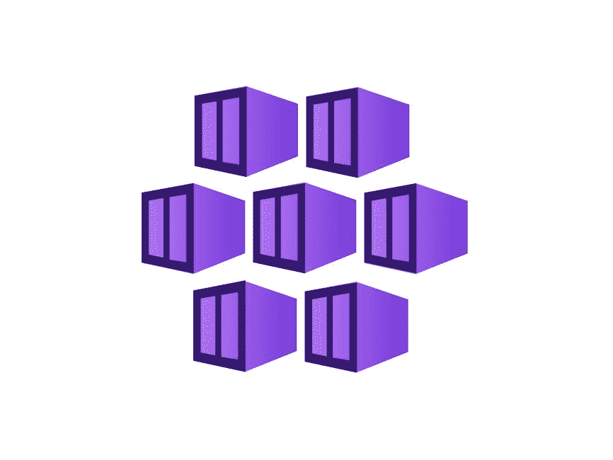

# 什么是 Azure Kubernetes 服务-什么是 AKS，我们为什么使用它？

> 原文：<https://www.edureka.co/blog/azure-kubernetes-service-tutorial/>

尽管 ***Kubernetes*** 已经成为管理生产中集装箱化工作负载的事实上的编排引擎，但操作该技术的复杂性导致了近年来对完全托管的 Kubernetes 服务的需求。虽然 ***Azure*** 提供了多种解决方案，但它目前最关注的是 Azure Kubernetes 服务，并将在今年逐步淘汰之前的相关服务。在这篇 ***Azure Kubernetes 服务教程*** 的博客中，我们将尝试清除所有关于 Azure 上 Kubernetes 的疑问。

据《福布斯》报道，微软 Azure 的收入连续四个季度增长超过 90%，因为它提供了企业客户想要的东西:稳定性。这个全新的 Azure Kubernetes 服务(AKS)使得使用最新版本的开源编排引擎在 Azure 云上设置 Kubernetes 集群变得非常简单。

微软的 AKS 是针对谷歌的，谷歌在将 Kubernetes 移交给开源世界之前培养了它。谷歌 Kubernetes 引擎(GKE)是最早的公共云管理的 Kubernetes 产品之一。与微软不同，谷歌对管理有六个或更多节点的 GKE 集群收取每个节点 0.15 美元的固定费用，因此每月费用为 110 美元，微软通过 AKS 放弃了这一费用。在这篇 Azure Kubernetes 服务教程博客中，我们将先浏览 Kubernetes 和 AKS 的基础知识，然后再深入研究使用 Azure Kubernetes 服务的真实用例。

*   [*什么是 Azure Kubernetes 服务？*](#What)
*   *[【蔚蓝库伯】服务福利](#Benifits)*
*   *[蔚蓝 Kubernetes 服务特色](#Features)*
*   *[现实生活发展](#Development)*
*   *[蔚蓝 Kubernetes 服务定价](#Pricing)*
*   *[结论](#Conclusion)*

## **什么是 Azure Kubernetes 服务？**

AKS 是一款开源的全托管容器编排服务，于 2018 年 6 月发布，可在微软 Azure 公共云上访问，用于在集群环境中部署、扩展和管理 Docker 容器和基于容器的应用。Azure Kubernetes 服务以最短的停机时间在 Kubernetes 群集中按需提供、扩展和升级资源，最重要的是，您不需要容器编排方面的丰富知识和专业技能来管理 AKS。

## **Azure Kubernetes 服务(AKS)福利**

AKS 现在与 Azure Monitor for containers 合并在一起，使得监控和调试您的部署变得更加容易。下面列出了一些最大的好处:

*   **资源高效利用:**

完全托管的 AKS 支持容器化应用的简单部署和维护，以及灵活调配额外资源的有效资源使用，无需维护 Kubernetes 基础设施。

*   **应用开发时间减少:**

开发人员大部分时间都花在了 bug 修复上。AKS 缩短了调试时间，同时处理修补、自动升级和自我修复，并简化了容器管理。这无疑节省了时间，开发人员将能够专注于创建他们的产品，同时更有效率。

*   **安全与合规:**

现代应用和企业最显著的特征之一就是网络安全。AKS 与 Azure Active Directory (AD)连接，为用户提供按需访问，显著降低威胁和风险。AKS 还符合所有标准和法规要求，包括系统和组织控制(SOC)、HIPAA、ISO 和 PCI DSS。

*   **快速发展与融合:**

Azure Kubernetes Service(AKS)支持自动升级、监控和扩展，同时减少基础架构维护，从而加快开发和集成速度。它还允许在无服务器的 Kubernetes 中即时部署额外的计算资源，而无需管理 Kubernetes 基础设施。

*   **支持敏捷项目管理:**

AKS 的主要优势之一是支持敏捷开发项目，如持续集成(CI)、持续交付/持续部署(CD)和 DevOps。

## **蔚蓝 Kubernetes 服务特色**

微软 Azure 提供 Azure Kubernetes 服务，便于在公共云环境中设置托管 Kubernetes 集群，同时维护托管 Kubernetes 服务的健康和监控。客户可以使用 Azure 接口或 Azure CLI 管理代理节点和构建 AKS 集群。高级网络、监控和 Azure 广告集成是可能设置的许多功能中的一部分。我们来看看 Azure Kubernetes Service (AKS)提供的功能:

*   **开源环境下的企业承诺:**

微软在最近几年雇佣了大量人员，让 Kubernetes 更容易被企业和开发者使用，参与开源项目。通过将来自不同客户和用户的最佳实践和高级学习带到 Kubernetes 社区，微软是使 Kubernetes 更加面向业务、云原生和可访问的第三大贡献者。

*   **集群和节点:**

应用和支持服务在 AKS 中的 Kubernetes 节点上执行，AKS 集群由一个或多个节点组成。这些 AKS 节点也托管在 Azure 虚拟机上。具有相同配置的节点群集在一起，称为节点池。Kubernetes 集群中的节点根据集群所需的资源进行伸缩。因此，Azure Kubernetes 架构中最明显的组件是节点、集群和节点池。

*   **【RBAC】(基于角色的访问控制):**

AKS 与 Azure Active Directory (AD)无缝连接，实现 Kubernetes 架构的基于身份和组成员资格的基于角色的访问、安全和监控。您还可以跟踪您的 AK 和应用程序的执行情况。

*   **开发工具集成:**

AKS 的另一个关键元素是 Helm 和 Draft 等开发工具可以很容易地与 AKS 集成，让 Azure Dev Spaces 给开发者带来更快、更迭代的 Kubernetes 开发体验。容器可以在 Azure Kubernetes 环境中直接操作和调试，减少了设置负载。AKS 还可以与 Azure Container Registry (ACR)接口，为 Docker 图像启用私有存储，并支持 Docker 图像格式。

*   **任何工作负载都可以在 Azure Kubernetes 服务中运行:**

在 AKS 系统中，你可以编排任何形式的任务。您可以将应用程序 migrate.NET 到 Windows 服务器容器，在 Linux 容器中更新 Java 应用程序，并在 Azure Kubernetes 服务中执行微服务。在集群设置中，AKS 可以执行任何形式的工作负载。让我们继续这个 Azure Kubernetes 服务教程，看看 Azure Kubernetes 服务的一个真实用例。

## **真实生活用例蔚蓝 Kubernetes 服务**

Logicworks 是为 AWS 和 Azure 提供云迁移和托管云服务的领先提供商，是微软 Azure 金牌合作伙伴，帮助企业将其应用迁移到 Azure。他们与一位客户分享了他们的经验，该客户希望在 AKS 上部署和发展面向公众的 web 应用程序，以解决以下业务用例:

*   实现跨内部和公共云的可移植性

Logicworks 在 AKS (Azure Kubernetes Service)的帮助下，构建了一个解决方案架构，该架构融合了几种常见的最佳实践，以保证它们能够满足客户的业务和运营需求:

*   **集群多租户**

SDLC 环境分为两个集群，将生产与较低级别的 SDLC 环境(如开发/阶段)隔离开来。名称空间的使用提供了相同的操作优势，同时通过不在每个 SDLC 环境中部署 AKS 集群而节省了成本和操作复杂性。

由于多个 SDLC 环境和其他应用程序共享同一个集群，因此必须建立调度和资源配额，以确保应用程序及其依赖的服务获得运行所需的资源。当与集群自动缩放器结合使用时，我们可以确保我们的应用获得所需的资源，并在需要时扩展计算基础架构。

*   **蔚蓝广告集成**

利用 Azure AD 来验证/授权用户访问和启动针对 AKS 集群的 CRUD(创建、更新和删除)操作。AAD 集成使统一身份验证层(Azure 和 Kubernetes)变得方便而简单，并为适当的人员提供他们履行职责所需的访问级别，同时遵守最小权限原则

*   **荚身份**

Pod 身份被部署到默认名称空间中，并动态地将托管身份分配给由标签确定的适当 Pod，而不是在我们的容器中硬编码静态凭证。这为我们的示例应用程序提供了写入 Cosmos DB 的能力，为我们的 CI/CD 管道提供了将容器部署到生产集群和登台集群的能力。

*   **入口控制器**

入口控制器通过创建入口规则和路由将流量引入 AKS 集群，为应用服务提供反向代理、流量路由/负载平衡和 TLS 终止。这使我们能够在我们的应用服务之间均匀地分配流量，以确保可伸缩性并满足可靠性要求。

*   **监控**

自然，监控我们 AKS 集群的日常性能和运营是维持正常运行时间和主动解决潜在问题的关键。使用 AKS 基于切换的实现，托管在 AKS 集群上的应用服务可以很容易地使用 Azure Monitor 进行监控和调试。

## **蔚蓝 Kubernetes 服务定价**

AKS 是一项免费的容器编排服务，不收取 Kubernetes 集群管理费用。这是市场上最具成本效益的容器编排解决方案，因为您只需为您使用的云资源(如虚拟机、存储和网络资源)付费。微软 Azure 推出了容器服务计算器，以评估所用资源或必要资源的成本。您只需注册一个免费帐户，部署和管理您的 Kubernetes 环境，同时开发微服务，部署 Kubernetes 集群，监控和控制您的 Kubernetes 环境。

## **结论**

企业正在快速地从内部迁移到 ***云*** ，同时开发和维护当代和云原生应用。通过这个 ***Azure Kubernetes 服务教程*** ，我们想要强调的是，AKS 是一个强大且经济高效的容器编排服务，使您能够在几秒钟内构建和管理容器化的应用程序，自动分配额外的资源，而无需维护额外的服务器。随着需求的增长，AKS 节点会自动向外扩展。它提供了各种优势，包括基于角色访问的安全性、与其他开发工具的简单接口，以及在 ***Kubernetes 集群环境*** 中执行任何工作负载的能力。它还提供了有效的资源利用，消除了复杂性，易于横向扩展，并将任何现有工作负载迁移到容器化的环境中，所有容器化的资源都可以通过 AKS 管理界面或 AKS CLI 进行访问。为了更多地了解 Azure，我们提供 [Azure Cloud 工程师课程](https://www.edureka.co/masters-program/azure-cloud-engineer-certification-training) 、帮助你获得认证，从而帮助你追逐你梦想的工作轮廓。

有关 Azure 的更详细教程:

[https://www.youtube.com/embed/tDuruX7XSac?version=3&rel=1&fs=1&autohide=2&showsearch=0&showinfo=1&iv_load_policy=1&wmode=transparent](https://www.youtube.com/embed/tDuruX7XSac?version=3&rel=1&fs=1&autohide=2&showsearch=0&showinfo=1&iv_load_policy=1&wmode=transparent)

我希望这篇 Azure Kubernetes 服务教程对你有用。本博客涵盖的主题是专业人士最需要的技能。如果你有兴趣掌握 Azure，请访问我们的 Edureka 网站并报名参加 [**微软 Azure 认证培训课程**。](https://www.edureka.co/microsoft-certified-azure-solution-architect-certification-training)