# 如何在 CSS 中实现背景图片？

> 原文：<https://www.edureka.co/blog/backgroung-image-in-css/>

CSS 是级联样式表的缩写。它是一种简单而强大的设计语言，能够转换网页。简单来说，它简化了在 HTML 的帮助下使网页变得可展示并吸引用户的过程。在本文中，我们将按照以下顺序了解如何在 CSS 中实现各种背景图像:

*   [CSS 属性中的背景图像](#cssproperties)
*   [CSS 中的背景图片](#backgroundimage)
*   [背景重复](#backgroundrepeat)
*   [背景附件](#backgroundattachment)
*   [背景位置](#backgroundposition)
*   [CSS 中的背景图片尺寸](#csssize)
*   [背景颜色](#backgroundcolor)

## **CSS 属性中的背景图像**

有许多属性用于控制图像的行为和定位。这些属性是:

*   背景图像
*   背景——重复
*   背景-附件
*   背景位置
*   背景尺寸
*   背景色

我们将通过一些有趣的演示来熟悉这些属性，并了解何时以及如何使用它们。

**CSS 中的背景图片**

顾名思义，**背景图像**属性只是用来通过网页中的一个元素来指示和设置背景图像。默认情况下，背景图像位于元素的左上角。

**语法:**背景-图像:url |无|线性-渐变|径向-渐变；

```

<html>
<head>
<style>
body {
background-image: url("apple.jpg");
}
</style>
</head>
<body>

<h3>background using url</h3>

</body>
</html>

```

让我们了解一下参数:

*   **url:** 该参数的输入允许我们指定任何图像的文件路径或需要设置为背景的图像的 url。为了声明多个图像，Url 之间用逗号分隔。

```

body {
background-image: url("apple.jpg");
}

```

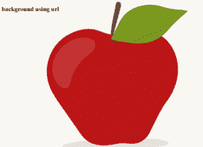

*   **none:** 这是该属性的默认值，如果指定了该值，则不呈现背景图像。

```

body {
background: none;
}

```

*   **linear-gradient():** 背景图像设置为线性渐变。该属性要求至少指定两种颜色，即从上到下。

```

body {
background-color:#001;
background-image: linear-gradient(white 15%, transparent 16%),
linear-gradient(white 15%, transparent 16%);
background-size: 60px 60px;
background-position: 0 0, 30px 30px;
}

```

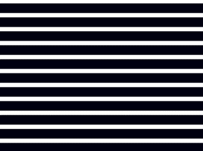

*   **radial-gradient():** 背景图片设置为径向渐变。该属性要求至少指定两种颜色，即从中心到边缘。

```

body {
background-color:#001;
background-image: radial-gradient(white 15%, transparent 16%),
radial-gradient(white 15%, transparent 16%);
background-size: 60px 60px;
background-position: 0 0, 30px 30px;
}

```

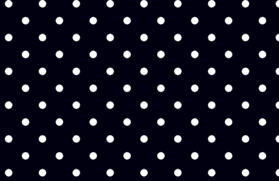

*   **重复-线性-渐变():** 它重复一个线性渐变。让我们使用相同的例子，我们在上面看到的线性梯度重复线性梯度，看看不同之处。

```

body {
background-color:#001;
background-image: repeating-linear-gradient(white 15%, transparent 16%),
repeating-linear-gradient(white 15%, transparent 16%);
background-size: 60px 60px;
background-position: 0 0, 30px 30px;
}

```

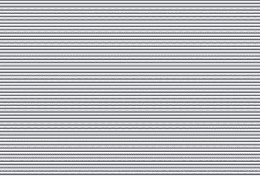

*   **repeating-radial-gradient():**它重复一个径向渐变。让我们来看看上面在径向渐变中使用的同一个例子。

```

body {
background-color:#001;
background-image: repeating-radial-gradient(white 15%, transparent 16%),
repeating-radial-gradient(white 15%, transparent 16%);
background-size: 60px 60px;
background-position: 0 0, 30px 30px;
}

```

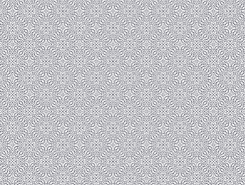

**回退背景**

作为专业建议，添加背景色作为后备选项总是明智的。当背景图片无法加载或者我们在开发时设置的渐变背景不被一些旧的浏览器所支持时，它就可以拯救我们了。

这不会破坏用户体验，可以这样声明:

```

body {
background: url(apple_lost.jpg) pink;
}

```

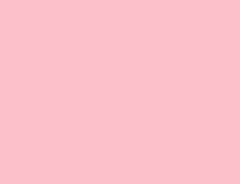

**多重背景**

我们还可以选择设置多个背景图像，这在大多数情况下都是必需的，比如前景和背景图像。这里图像的顺序很重要，首先声明应该在前面的图像，然后声明应该在后面的图像。

下面是多个背景图像的例子:

```

body {
background-image: url("small-heart.jpg"), url("background.jpg");
}

```

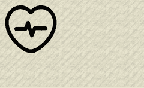

## **背景重复**

背景重复属性与背景图像一起使用，定义图像的重复行为。它指定是否以及如何重复背景图像。默认情况下，背景图像垂直和水平重复。

可能的值有:

*   重复-图像水平和垂直重复
*   不重复–图像不重复
*   重复-x–图像水平重复
*   重复-y–图像垂直重复
*   间隔——图像以均匀的间隔重复出现。
*   圆形–重复图像以填充区域，其间没有任何间隙。

背景重复属性的 CSS 语法是:

**背景-重复:**重复|重复-x |重复-y |无重复|空格|圆形；

```

body {
background-image: url("heart.png"), url("background.png");
background-repeat: repeat-y, repeat-x;
background-color: #ffffff;
}

```

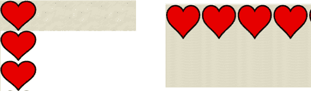

## **背景附件**

**background-attachment**属性与背景图像一起使用，用于声明当内容滚动时，图像是否应该滚动。它表示背景图像应该是固定的，或者应该相对于浏览器窗口视图随文档一起滚动。默认值是滚动。

可能的值有:

*   scroll–图像随页面一起滚动。
*   固定–图像不会随页面一起滚动

背景附件的 CSS 语法是:

**背景-附件:**卷轴|固定；

```

body {
background-image: url("heart.png"), url("background.png");
background-repeat: space, round;
}

```

## **背景位置**

**背景位置**属性用于表示背景图像的位置或定位。可能的值有:

*   榜首
*   右
*   底部
*   左
*   居中
*   这些值的组合(如左上)

背景位置的 CSS 语法是:

**背景-位置:**顶部|右侧|左侧|底部|中心；

```

body {
background-image: url("heart.png");
background-repeat: no-repeat;
background-attachment: scroll;
}

```

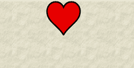

## **CSS 尺寸的背景图像**

这个属性是最有用的，因为它允许我们控制背景图片的大小。有不同的组合，我们可以利用这个属性，并得到相应的结果。默认值为自动。

以下值可用于背景尺寸:

*   自动
*   图像的长度-高度和宽度，例如 20px 40px。
*   百分比-图像的高度和宽度占父元素的百分比，例如 50% 50%。
*   居中-将图像居中对齐
*   覆盖，缩放图像到完全被背景覆盖的区域。
*   包含，缩放图像以适合直到它的实际高度和宽度。

背景位置的 CSS 语法是:

**背景-大小:** *数值*；

```

body {
background-image: url("heart.png"), url("background.png");
background-repeat: no-repeat, repeat;
background-size: 400px 150px, cover;
}

```

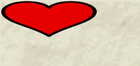

```

body {
background-image: url("heart.png"), url("background.png");
background-repeat: no-repeat, repeat;
background-size: contain, 400px 150px;
}

```

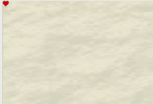

**背景颜色**

这是 CSS 中最简单的属性。它将纯色应用于页面的背景。该属性的值可以用颜色(如红色、蓝色等)、十六进制值和 RGB 值来指定。

背景色的 CSS 语法是:

背景-颜色: *数值*；

```

body {
background-image: url(small-heart.jpg);
background-color: #22a8e3;
}

```


这包括了我们可以在背景中使用的所有属性。正如我们在演示中看到的，我们总是可以尝试不同的属性组合。

CSS 是必不可少的，也是每个前端 web 开发人员必须掌握的技能。它有助于设计和样式的背景，并建立令人印象深刻的网站和丰富用户体验。最好的办法是不断尝试，充分利用这种特殊的前端技术，因为它可以创造奇迹，动态地转换页面。

*查看我们的  [全栈 Web 开发人员硕士课程](https://www.edureka.co/masters-program/full-stack-developer-training) ，该课程包含讲师指导的现场培训和真实项目体验。本培训使您精通使用后端和前端 web 技术的技能。它包括关于 Web 开发、jQuery、Angular、NodeJS、ExpressJS 和 MongoDB 的培训。*

有问题要问我们吗？请在“CSS 中的背景图片”博客的评论部分提到它，我们会给你回复。