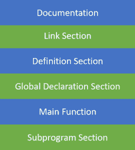
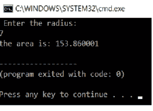

# 关于 C 程序的基本结构，你需要知道的一切

> 原文：<https://www.edureka.co/blog/basic-structure-of-a-c-program/>

在这篇文章中，我们将学习 C 程序的基本结构。一个 [C 程序](https://www.edureka.co/blog/c-data-structures)被分成不同的段。一个基本的 c 程序有六个主要部分。

这六个部分是，

*   [文档](#Documentation)
*   [链接](#Link)
*   [定义](#Definition)
*   [全局声明](#GlobalDeclaration)
*   [主要功能](#Mainfunctions)
*   [子程序](#Subprograms)

既然介绍已经结束了，让我们进入主要讨论。整个代码遵循这个大纲。每个代码都有相似的轮廓。现在让我们详细了解这一层中的每一层。

 **图:**C 程序的基本结构

继续讨论 C 程序文章的下一个基本结构，

## **文档部分**

文档部分是程序的一部分，程序员在这里给出与程序相关的细节。他通常会给出程序的名称、作者的详细信息以及其他细节，如编码和描述的时间。它给任何阅读代码的人提供了代码的概述。

**例子**

/**

*文件名:Helloworld.c

*作者:曼坦·纳伊克

*日期:2019 年 8 月 9 日

*描述:显示 hello world 的程序

*不需要输入

*/

继续讨论 C 程序文章的下一个基本结构，

## **链接部分**

这部分代码用于声明程序中将使用的所有头文件。这导致编译器被告知将头文件链接到系统库。

**例子**

```
#include<stdio.h>
```

继续讨论 C 程序文章的下一个基本结构，

## **定义部分**

在本节中，我们定义不同的常数。该部分使用了关键字 define。

```
#define PI=3.14
```

继续讨论 C 程序文章的下一个基本结构，

## **全局声明部分**

这部分代码是声明全局变量的部分。所有使用的全局变量都在这一部分声明。用户定义的函数也在这部分代码中声明。

```

float area(float r);
int a=7;

```

继续讨论 C 程序文章的下一个基本结构，

## **主要功能部分**

每个 C 程序都需要有主函数。每个主要功能包含两个部分。声明部分和执行部分。声明部分是声明所有变量的部分。执行部分以花括号开始，以花括号结束。声明和执行部分都在花括号内。

```

int main(void)
{
int a=10;
printf(" %d", a);
return 0;
}

```

继续讨论 C 程序文章的下一个基本结构，

## **子程序段**

所有用户定义的函数都在程序的这一部分中定义。

```

int add(int a, int b)
{
return a+b;
}

```

## **样本程序**

这里的 C 程序将使用一个用户定义的函数和一个保存 pi 值的全局变量 pi 来计算圆的面积

```
* File Name: areaofcircle.c
* Author: Manthan Naik
* date: 09/08/2019
* description: a program to calculate area of circle
*user enters the radius
**/
#include<stdio.h>//link section
#define pi 3.14;//defination section
float area(float r);//global declaration 
int main()//main function
{
float r;
printf(" Enter the radius:n");
scanf("%f",&r);
printf("the area is: %f",area(r));
return 0;
}
float area(float r)
{
return pi * r * r;//sub program
}

```

**输出**



这就是 C 程序的基本结构。我希望这篇文章对你有所帮助，请继续关注更多类似主题的教程。您也可以查看我们的培训计划 ，您可以 [**在此**](https://www.edureka.co) 报名参加实时在线培训，享受全天候支持和终身访问。

有问题要问我们吗？在评论区提到它们，我们会回复你