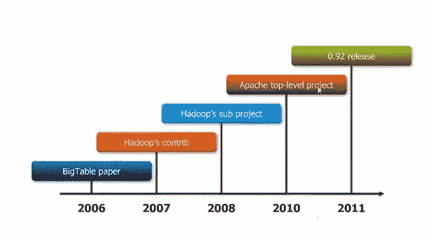

# HBase 基础知识

> 原文：<https://www.edureka.co/blog/basics-of-hbase/>

[//www.youtube.com/embed/fg0RMflDFPI](//www.youtube.com/embed/fg0RMflDFPI)

HBase 是一个开源的、非关系的分布式数据库，模仿 Google 的 BigTable，用 Java 编写。它由 Apache 软件基金会开发，是 Apache Hadoop 项目的一部分。HBase 运行在 HDFS (Hadoop 分布式文件系统)之上，为 Hadoop 提供类似大表的功能。

HBase 是一个键/值存储。HBase 具体来说是稀疏的、分布式的、多维的、排序的映射和一致的。

成为一名数据工程师的最佳途径是获得班加罗尔 的 [Azure 数据工程认证。](https://www.edureka.co/microsoft-azure-data-engineering-certification-course-bangalore)

HBase 可用于以下情况:

*   庞大的数据
*   快速随机存取
*   结构化数据
*   变量模式
*   需要压缩
*   需要分片

**NoSQL 风景:**

NoSQL 数据库可以分类如下:

*   **键值商店**——迪纳摩(亚马逊)、伏地魔(LinkedIn)、Citrusleaf、Membasae、Riak、东京柜等。
*   **大表克隆**——BigTable(谷歌)、Cassandra、 **HBase** 、Hypertable 等。
*   **文档数据库**——couch one、MongoDB、Terrastore、OrientDB 等。
*   **图数据库**——FlockDB(Twitter)、AllegroGraph、DEX、InfoGRid、Neo4J、Sones 等。 有了 [Azure 数据工程认证](https://www.edureka.co/microsoft-azure-data-engineering-certification-course) 可以更好的理解。

## **h base 的特性:**

## **历史背景:**

## **h base 基础:**

要了解构成 HBase 核心基础的主题，需要以下关键词:

*   Rowkey
*   列族
*   栏
*   时间戳

HBase 表包含列族，列族是列的逻辑和物理分组。柱族包含带有时间戳版本的柱。列只有在插入时才存在。同一列族的所有列关联都具有相同的列族前缀。每个列值由一个键标识。行键是隐式主键。行按行键排序。

有问题要问我们吗？在评论区提到它们，我们会给你回复。

**相关帖子:**

[大数据和 Hadoop 培训](https://www.edureka.co/big-data-and-hadoop)

[h base 存储架构概述](https://www.edureka.co/blog/overview-of-hbase-storage-architecture/ "Overview of HBase Storage Architecture")