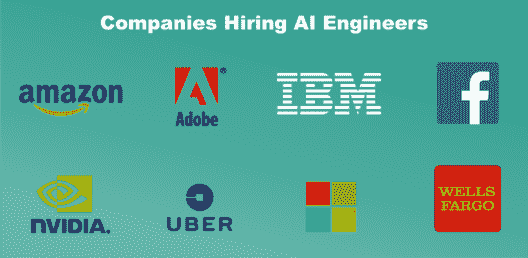

# 如何成为一名人工智能工程师？通向未来的路线图

> 原文：<https://www.edureka.co/blog/become-artificial-intelligence-engineer/>

[**人工智能**](https://www.edureka.co/masters-program/machine-learning-engineer-training) 或 AI 是一种新兴的技术趋势，这不是什么秘密。根据 Gartner 的一份报告，到 2020 年，人工智能将创造**230 万个**工作岗位，取代它将淘汰的**180 万个**。就业增长已经淹没了这个行业，因为对拥有人工智能技能的人的需求在过去几年中已经翻了一番。因此，在这篇文章中，我将按照以下顺序引导你通过 ***如何成为一名人工智能工程师*** :

*   [什么是人工智能？](#what-is-ai)
*   [谁是人工智能工程师？](#who-is-ai-engineer)
*   [如何成为一名人工智能工程师:路线图](#roadmap)
*   [所需技能](#skills-required)
*   人工智能工程师的角色和职责
*   [薪资趋势和公司招聘](#salary-trends)

## 什么是人工智能？

人工智能是一种使机器能够模仿人类行为的技术。人工智能是计算机系统的理论和发展，能够执行通常需要人类智能的任务，如视觉感知、语音识别、决策和语言之间的翻译。

如果你问我，AI 是由我们编程的机器对人类智能的模拟。机器需要学习如何推理，并根据需要进行自我修正。

*要了解更多关于 AI ML 的知识，那就去读人工智能教程吧。此外，报名参加 NIT Warangal 的 PGP [人工智能和机器学习课程](https://www.edureka.co/executive-programs/machine-learning-and-ai)以达到精通。*

## 谁是人工智能工程师？

人工智能工程师使用算法、神经网络和其他工具，以某种方式推进人工智能领域。例如，这些专业人员可能在不同行业从事各种类型的人工智能工作

*   卫生保健
*   零售

人工智能工程师是研究人工智能问题或技术的人。工程师也可以在涉及弱人工智能或强人工智能的项目之间进行选择，不同的设置侧重于不同的能力。那是另一个讨论的话题。现在有很多方法可以到达那里。所以，我们来看看如何成为一名人工智能工程师。

## 如何成为一名人工智能工程师

**1。**现在，如果我们从基础开始，一个人需要先获得**学士学位**。它可以来自以下领域或主题:

*   计算机科学
*   数学
*   信息技术
*   统计数字
*   金融
*   经济学

**2。**下一步是微调你的**技能**。这里需要注意的一件重要事情是，为了成为一名人工智能工程师，你不仅需要擅长编程，还需要擅长软件开发技术和实践。他们需要在理论和实践上了解以下主题:

*   软件开发生命周期
*   模块化，哎呀，类
*   设计模式
*   统计和数学
*   机器学习
*   深度学习和神经网络
*   电子、机器人和仪器仪表(非强制性要求)

**3。除了技术技能，在计划如何成为一名成功的人工智能工程师时，还必须拥有**商业技能**。这些技能包括:**

*   分析解决问题
*   有效沟通
*   创造性思维
*   行业知识

**4。现在，这些技能既可以通过实践获得，也可以通过选择**硕士学位**获得。由于人工智能是当今世界的一个新兴话题，许多最近的发现和研究正在进行中，这可能对你的论文有用。建议攻读数据科学、机器学习或计算机科学的硕士学位。**

另一个选择是去申请**行业认证**申请[机器学习](https://edureka.co/masters-program/machine-learning-engineer-training)、[深度学习](https://www.edureka.co/ai-deep-learning-with-tensorflow)或[数据科学](https://www.edureka.co/masters-program/data-scientist-certification)。这将为你的简历增加很多价值，并有助于你在理论和实践方面获得深入的知识。这反过来会帮助你获得超过其他竞争对手的优势。

## 所需技能

在如何成为一名人工智能工程师的路线图中，我们看到了一些所需的技术和业务技能。让我们仔细看看那些技能。从技术技能开始:

### 技术

*   **编程语言(R/Java/Python/C++)**

一个人需要擅长编程语言，不仅如此，对类和数据结构有扎实的理解也很重要。

有时候 [**Python**](https://www.edureka.co/blog/python-tutorial/) 都不够用。您经常会遇到需要利用硬件来提高速度的项目。确保您熟悉基本算法，以及类、内存管理和链接。

*   **线性代数/微积分/统计**

你需要非常熟悉矩阵、向量和矩阵乘法。如果你了解导数和积分，你应该很清楚。统计数据会出现很多。

至少确保你熟悉高斯分布、均值和标准差。你需要对概率有很深的理解才能理解模型，比如

*   [朴素贝叶斯](https://www.edureka.co/blog/naive-bayes-tutorial/)
*   高斯混合模型和
*   隐马尔可夫模型

*   **应用数学和算法**

对算法理论有一个牢固的理解，知道算法是如何工作的非常重要。你将需要了解诸如梯度下降，凸优化，拉格朗日，二次规划，偏微分方程，和总结等科目。

如果你已经远离它一段时间，所有这些数学一开始可能看起来令人生畏。是的，机器学习和人工智能比前端开发之类的东西更需要数学。

*   **语言、音频和视频处理**

自然语言处理结合了两个主要的工作领域。语言学和计算机科学，在某些时候，你可能会用到文本、音频或视频。

因此，有必要很好地控制像 Gensim、NLTK 这样的库，以及像 word2vec、情感分析和摘要这样的技术。

*   **神经网络架构**

对于人类无法直接编码的复杂任务，我们需要机器学习，即复杂到不切实际的任务。神经网络是迄今为止处理许多问题最准确的方式，如翻译、语音识别和图像分类，这些在人工智能领域发挥着非常重要的作用。

除了这些技术技能，还有一些非技术技能或商业技能也是成为一名成功的人工智能工程师所必需的。所以，让我们继续这篇如何成为人工智能工程师的文章，来理解我所说的非技术技能到底是什么意思。

### 商业/非技术技能

*   **通信**

你需要向在这个领域没有专业知识的人解释 ML 和 AI 的概念。你可能还需要向电气和机器人专家学习。交流将使这一切变得更加容易。

*   **创造性和批判性思维**

人工智能工程师必须查看数字、趋势和数据，并根据发现得出新的结论。质疑现有的商业实践，集思广益，探索人工智能的新方法。

无论你对人工智能的崛起是兴奋还是恐惧，机器人都会以这样或那样的形式存在。将这项新技术与独特的人类思维的最强特征相结合，提供了一个尚未被充分探索的潜力世界。

*   **快速成型**

尽可能快地重复想法对于找到一个可行的想法是强制性的。在机器学习中，这适用于从选择正确的模型到从事 A/B 测试等项目的所有事情。您需要使用一组技术，使用三维计算机辅助设计快速制作物理零件或组件的比例模型，尤其是在处理 3D 模型时。

*   **行业知识**

最成功的人工智能项目将是那些解决真正痛点的项目。无论你在哪个行业工作。你应该知道这个行业是如何运作的，以及什么对企业有利。

如果一名人工智能工程师没有商业头脑，也不知道构成成功商业模式的要素，那么所有这些技术技能都无法得到有效利用。

现在，有了这些技能，你肯定可以找到一份人工智能工程师的工作，但一旦你开始工作，你还需要知道你在日常生活中到底要做什么。因此，这里是一个人工智能工程师的关键角色和职责。

## 角色和职责

根据他们的专业水平，人工智能工程师通常:

*   研究和转换数据科学原型
*   研究并实现合适的 ML 算法和 AI 工具
*   根据需求开发机器学习应用
*   与电气工程师和机器人团队合作
*   选择合适的数据集和数据表示方法
*   运行机器学习/人工智能测试和实验
*   必要时对系统进行培训和再培训
*   跟上该领域的发展

## 薪资趋势和公司招聘

根据 [**的确**](http://www.indeed.com) 人工智能工程师的平均年薪在**11 万美元**左右，最低**105244 美元**，最高**144611 美元。让我们进入“如何成为人工智能工程师”的最后一部分，看看哪些公司正在**招聘这些专业人士**。**

雇佣顶级人工智能人才的公司从 Argo AI 这样的初创公司到 IBM 这样的科技巨头都有。根据 Glassdoor 的说法，这些是过去一年雇用顶级人工智能人才的领先雇主。

所以，就这样，我们来结束这篇文章。我希望你对人工智能工程师的简介有所了解，知道一个人需要什么样的正确途径，以及让这份工作独一无二所需的技能。既然你已经知道如何成为一名人工智能工程师，那么你一定要看看 Edureka 的 ***[机器学习硕士项目](https://www.edureka.co/masters-program/machine-learning-engineer-training)。***

*Edureka 的机器学习工程师硕士项目让你精通监督学习、非监督学习*和*自然语言处理等技术。它包括人工智能&机器学习领域最新进展和技术方法的培训，如深度学习、图形模型和强化学习。*

*如果您对本文有任何疑问，请在下面的**评论区**留言，我们将尽快回复。*