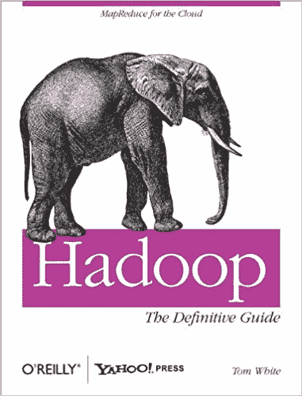
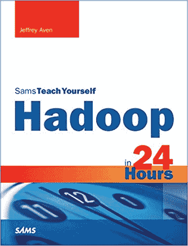
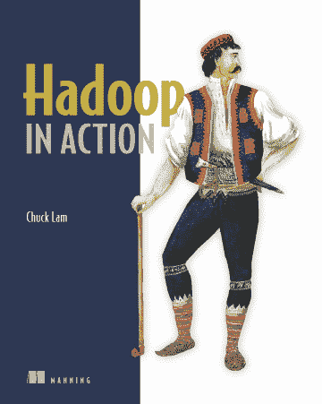
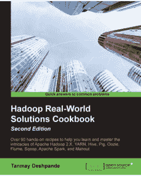
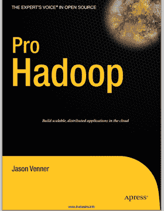
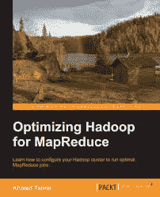
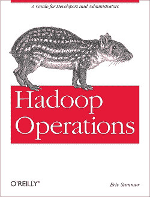
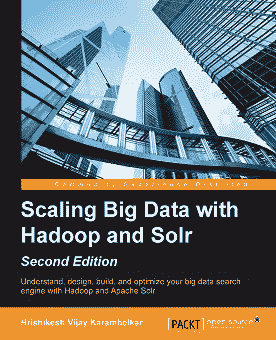
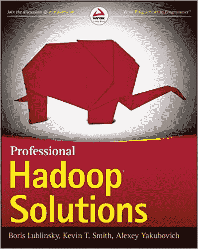
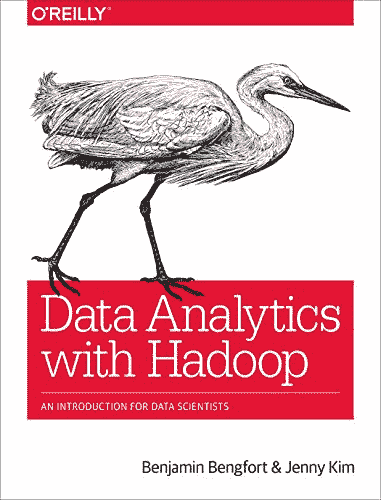

# 有哪些适合 Hadoop 的书籍？

> 原文：<https://www.edureka.co/blog/best-books-for-hadoop/>

[**Apache Hadoop**](https://www.edureka.co/big-data-hadoop-training-certification) 是推动当前 IT 行业的杰出技术。许多高端数据处理框架，如亚马逊 S3、Apache Spark、Databricks，都是基于 Hadoop 构建的。学习 Hadoop 是软件工程师的首要任务之一，没有比读书更好的地方了。因此，我向您展示了 Hadoop 的 10 本最佳书籍。

**初学者**

1.  [Hadoop 权威指南](#book1)
2.  [24 小时内的 Hadoop](#book2)
3.  [Hadoop 正在运行](#book3)
4.  [Hadoop 现实世界解决方案](#book4)

**经历过的**

5.  [Pro Hadoop](#book5)
6.  [针对 MapReduce 优化 Hadoop](#book6)
7.  [Hadoop 操作](#book7)
8.  [使用 Hadoop Solr 扩展大数据](#book8)
9.  [专业的 Hadoop 解决方案](#book9)
10.  [使用 Hadoop 进行数据分析](#book10)

## **初学者**

### **Hadoop 权威指南**

 **作者:**汤姆·怀特 **出版商:** 奥赖利传媒 **概述:**

如果你是一个完全的初学者，那么没有比 [**Hadoop 权威指南**](http://shop.oreilly.com/product/0636920033448.do) 更好的书了。这本书指导初学者构建一个可靠且易于维护的 Hadoop 配置。无论数据集的大小和类型如何，它都有助于处理数据集。它有许多任务可以帮助你更好地理解 **[Hadoop 实时功能](https://www.edureka.co/blog/videos/hadoop-tutorial/)** 。通读这本书会帮助你很容易地理解最新的变化。

### **24 小时内的 Hadoop**

 **作者:** 杰弗里·艾文 **出版商:** 奥赖利传媒 **概述:**

如果你已经对 Hadoop 有了一个简单的概念，并想快速回顾一下该技术的，那么这本书就是为你准备的。这本书为您提供了一个构建功能性 Hadoop 平台、接口和所有 Hadoop 生态系统组件的完美概述。此外，如果您正在寻找一些实时示例，那么它有同类最佳的 Hadoop 解决方案可供下载。

### **Hadoop 在行动**

**作者:**林超群 出版商:曼宁 概述:

[**Hadoop 在行动**](https://www.edureka.co/blog/hadoop-ecosystem) 就像是从零开始学习 Hadoop 的一站式解决方案。这本书基本上从默认的 Hadoop 安装程序开始。接下来是安装，它解释了 Hadoop 最重要的组件 MapReduce。此外，这本书还涉及 Hadoop 和 MapReduce 的实时应用，包括数据分析中使用的主要大数据框架。

### **Hadoop 现实世界解决方案**

 **作者:** 布莱恩·费米亚诺，乔恩·伦茨，乔纳森·欧文斯， **出版商:**  Packt 出版 **概述:**

这本书是为那些寻求尝试多种方法来解决问题的中级学习者准备的。这本书对概念、问题陈述、技术挑战、要遵循的步骤有深入的解释，对使用的代码有清晰的解释。您还将了解使用 Apache Hive、 [**Apache pig、**](https://www.edureka.co/blog/pig-tutorial/) [**Mahout**](https://www.edureka.co/blog/overview-of-apache-mahout) 、 **Giraph、** [**、HDFS**](https://www.edureka.co/blog/hdfs-tutorial) 等工具以及许多更重要的组件来构建解决方案的过程。

现在，我们将学习一些给有经验的程序员看的书。

## **经历过的**

### **Pro Hadoop**

 **作者:** 杰森·韦纳 **出版商:** 出版社 **概述:**

这本书给了读者一个玩 Hadoop 的升级舞台。Hadoop 集群，这本书涵盖了与Hadoop 集群相关的每一个细节，从建立 Hadoop 集群开始，到分析和获取有价值的信息，为商业和科学研究做准备。您可以理解使用 MapReduce 方式解决实时大数据问题，方法是将问题划分为多个块，然后将块分布在集群中，并在短时间内并行解决。

### **针对 MapReduce 优化 Hadoop**

作者:卡勒德·坦尼尔 出版商:帕克特出版 **概述:**

这本书讲的都是解决 Hadoop 和 [**MapReduce**](https://www.edureka.co/blog/videos/mapreduce-tutorial/) 实时应用的重大漏洞。这本书主要集中在 MapReduce 作业的优化过程。基本上从 MapReduce 的介绍开始，然后发展到 MapReduce 的实时应用程序，让我们深入了解 MapReduce，这样我们就可以调整代码以获得最佳性能。

### **Hadoop 操作**

**作者:** 埃里克·萨默斯出版商: 奥赖利传媒 **概述:**

管理特定于运营的数据的必要性呈指数级增长，Hadoop 已成为所有大数据问题的标准解决方案。处理这些大规模行业级问题需要全新的不同级别的方法和 **[Hadoop 集群配置](https://www.edureka.co/blog/hadoop-cluster-capacity-planning/)。**这本书完全解释了这一点，并简要介绍了如何管理大规模数据集和 Hadoop 集群。

### **使用 Hadoop Solr 扩展大数据**

 **作者:** 赫里什克什·卡兰贝尔卡尔 **出版商:** 帕克特出版 **概述:**

这本书是关于借助 **Apache Hadoop** 和 **Solr 的大数据企业搜索引擎。**Apache Hadoop 和 Apache Solr 共同提出了一种方法，通过其具有非凡多面搜索功能的惊人解决方案，帮助组织处理大数据并解决信息提取的问题。这本书对此做了完整的介绍。

### **专业的 Hadoop 解决方案**

 **作者:**鲍里斯·鲁宾斯基、凯文·t·史密斯、阿列克谢·雅科博维奇 **出版商:** Wrox 出版物 **概述:** 本书面向高级或专业级 Hadoop 开发人员。这本书涉及一个概念，即增加 Hadoop 的能力并最大化其性能。 [** Hadoop 开发人员**](https://www.edureka.co/blog/top-hadoop-developer-skills/) 和 **Hadoop 架构师**的重要职责是了解 Hadoop 框架和 Hadoop API之间的兼容性，以及如何集成它们以提供优化的性能和交付实时解决方案。

### **使用 Hadoop 进行数据分析**

 **作者:**本杰明·本特、珍妮·金 **出版商:** 奥赖利传媒 **概述:**

最近几天，**机器学习**和**人工智能**正在接管，Hadoop 也没有放弃这场竞赛。它不断尝试将自己与数据科学相结合。Hadoop 框架现已成为数据分析的标准。这本书是理解数据仓库技术和高阶工作流的完美指南，Hadoop 可以在数据分析过程中执行。

就这样，我们来到了本文的结尾**。**我希望我已经让你了解了关于 **学习 Hadoop 的最佳书籍** 以及每本书的所有详细描述。

*既然您已经了解了大数据及其技术，请查看 Edureka 的  **[Hadoop 培训](https://www.edureka.co/big-data-and-hadoop/)*** *，edu reka 是一家值得信赖的在线学习公司，拥有遍布全球的 250，000 多名满意的学习者。Edureka 大数据 Hadoop 认证培训课程使用零售、社交媒体、航空、旅游、金融领域的实时用例，帮助学员成为 HDFS、Yarn、  [MapReduce](https://hadoop.apache.org/docs/current/hadoop-mapreduce-client/hadoop-mapreduce-client-core/MapReduceTutorial.html) 、Pig、Hive、HBase、Oozie、Flume 和 Sqoop 领域的专家。*

如果您对这篇“学习 Hadoop 的最佳书籍”有任何疑问，请在下面的评论区给我们写信，我们会尽快回复您。