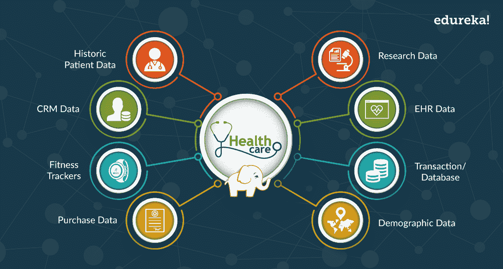
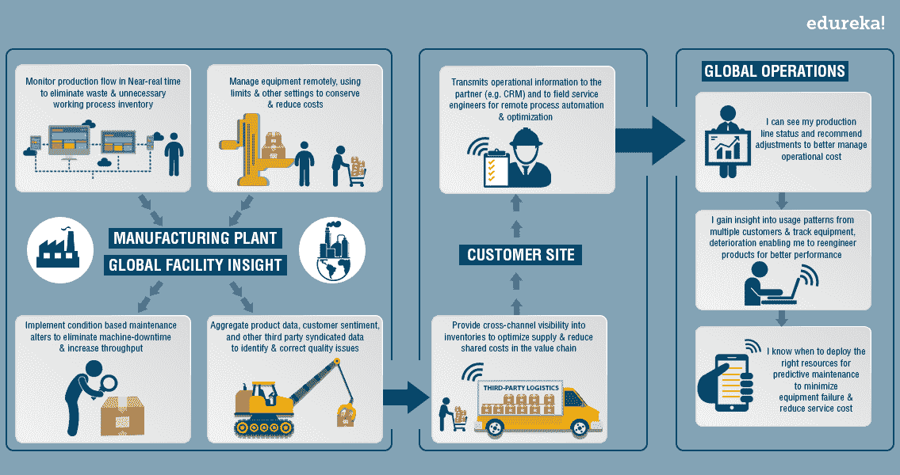
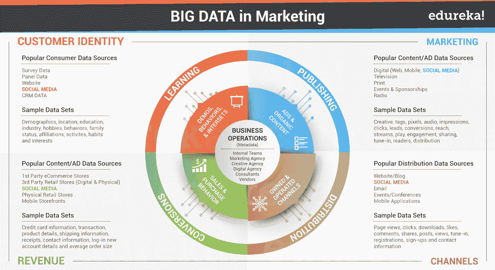
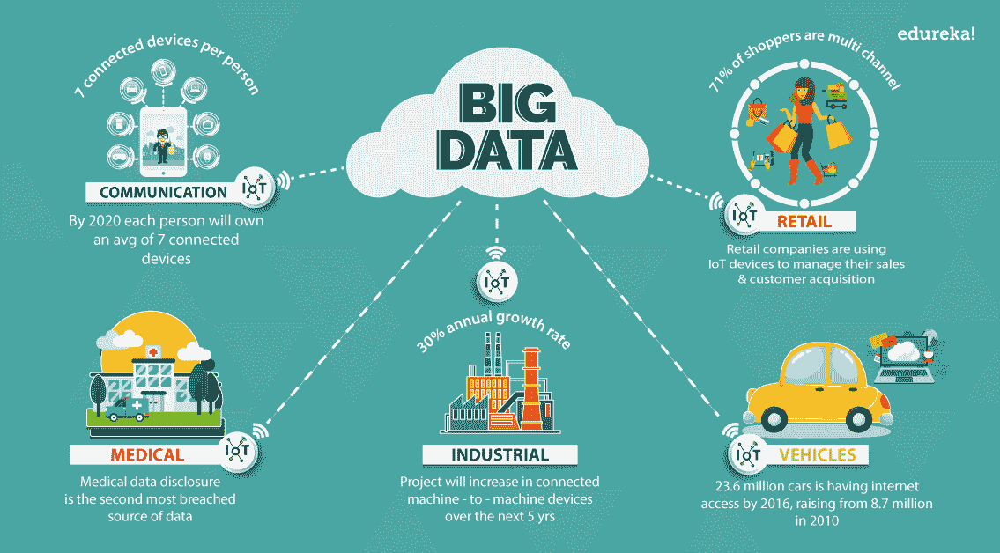
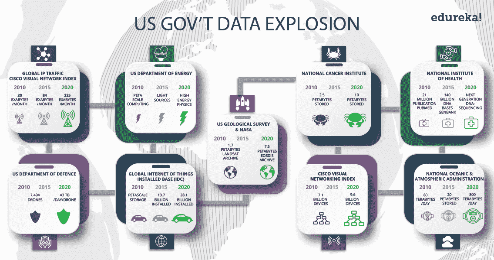

# 各种领域的实时大数据应用

> 原文：<https://www.edureka.co/blog/big-data-applications-revolutionizing-various-domains/>

在过去的几年里，大数据在大多数行业中扮演着重大的游戏规则改变者的角色。根据 Wikibon、 的数据，软件和服务的全球大数据市场收入预计将从 2018 年的 420 亿美元增长到 2027 年的 1030 亿美元，实现 10.48%的复合年增长率(CAGR)。这也是为什么， ***[大数据硕士项目](https://www.edureka.co/masters-program/big-data-architect-training)*** 是业内最引人入胜的技能之一。 在这篇大数据应用博客中，我将带您了解各个行业领域，并解释大数据是如何改变这些领域的。

## **大数据应用**

大数据应用的主要目标是通过分析大量数据，帮助公司做出更具信息性的商业决策。它可能包括 web 服务器日志、互联网点击流数据、社交媒体内容和活动报告、客户电子邮件文本、移动电话通话细节和多个传感器捕获的机器数据。

来自不同领域的组织正在投资大数据应用，以检查大型数据集来揭示所有隐藏的模式、未知的相关性、市场趋势、客户偏好和其他有用的商业信息。在这篇博客中，我们将介绍:

*   [医疗大数据应用](#Big_Data_in_Healthcare)
*   大数据在制造业的应用
*   [媒体大数据应用&娱乐](#Big_Data_in_Media)
*   [物联网中的大数据应用](#Big_Data_in_IoT)
*   大数据在政府中的应用

让我们了解大数据应用如何在不同领域发挥重要作用。

## **大数据应用:** **医疗**

医疗保健系统中产生的数据量并不小。传统上，医疗保健行业在使用大数据方面落后，因为标准化和整合数据的能力有限。

但是现在，大数据分析通过提供个性化药物和处方分析改善了医疗保健。研究人员正在挖掘这些数据，以了解对于特定情况，什么样的治疗方法更有效，确定与药物副作用相关的模式，并获得其他可以帮助患者和降低成本的重要信息。

随着移动医疗、电子医疗和可穿戴技术的采用，数据量正以指数速度增长。这包括电子健康记录数据、成像数据、患者生成的数据、传感器数据和其他形式的数据。

在[大数据 Hadoop 课程](https://www.edureka.co/big-data-hadoop-training-certification)中了解更多关于大数据及其各种应用的重要性。

通过将医疗保健数据与地理数据集对应起来，有可能预测特定地区将会升级的疾病。基于预测，更容易制定诊断策略和计划储备血清和疫苗。

## **大数据应用:制造业**

预测制造提供接近零的停机时间和透明度。它需要大量的数据和先进的预测工具，将数据系统化为有用的信息。

在制造业中使用大数据应用的主要好处是:

*   产品质量和缺陷跟踪
*   供应计划
*   制造过程缺陷跟踪
*   产量预测
*   提高能效
*   新制造工艺的测试和模拟
*   支持制造业大规模定制

## ****

## **大数据应用:媒体&娱乐**

媒体和娱乐行业的各种公司正面临着新的商业模式，因为它们创造、营销和分发内容的方式不同。这是因为当前 消费者的 搜索和随时随地在任何设备上访问内容的需求。

大数据提供了数百万个人的可操作信息点。现在，出版环境正在裁剪广告和内容来吸引消费者。这些见解是通过各种数据挖掘活动收集的。从[数据工程师认证](https://www.edureka.co/microsoft-azure-data-engineering-certification-course)了解更多大数据及其应用。大数据应用惠及媒体和娱乐行业:

*   预测观众想要什么
*   调度优化
*   增加获取和保持
*   广告定位
*   内容货币化和新产品开发

## ****

## **大数据应用:物联网**

从 [***物联网***](https://www.edureka.co/blog/iot-tutorial/) 设备提取的数据提供了设备互连性的映射。各种公司和政府都使用这种映射来提高效率。物联网也越来越多地被用作收集传感数据的手段，这些传感数据被用于医疗和制造领域。

## **大数据应用:政府**

在政府流程中使用和采用大数据可以提高成本、生产率和创新效率。在政府使用案例中，相同的数据集通常应用于多个应用&它需要多个部门协同工作。

通过钦奈的[大数据培训学习大数据的各种应用。](https://www.edureka.co/big-data-hadoop-training-certification-chennai)

由于政府主要在所有领域采取行动，因此它在每个领域的大数据应用创新中发挥着重要作用。让我谈谈一些主要领域:

### **网络安全&情报**

联邦政府启动了一项网络安全研发计划，该计划依靠分析大型数据集的能力来提高美国计算机网络的安全性。

国家地理空间情报局正在创建一个“世界地图”,它可以收集和分析来自各种来源的数据，如卫星和社交媒体数据。它包含来自机密、非机密和绝密网络的各种数据。

### **犯罪预测与预防**

警察部门可以利用先进的实时分析提供可操作的情报，用于了解犯罪行为、识别犯罪/事件模式以及发现基于位置的威胁。

### **医药药品评价**

根据麦肯锡的一份报告，大数据技术可以为制药商降低 400 亿至 700 亿美元的研发成本。FDA 和 NIH 使用大数据技术来访问大量数据，以评估药物和治疗。

### **科研**

美国国家科学基金会启动了一项长期计划:

*   实施从数据中获取知识的新方法
*   开发新的教育方法
*   创建一个新的基础设施来“管理、管理和向社区提供数据”。

### **天气预报**

美国国家海洋和大气管理局(NOAA)每天每分钟都从陆地、海洋和太空传感器收集数据。每日 NOAA 使用大数据从超过 20tb 的数据中分析和提取价值。

### **纳税遵从**

税务组织可以使用大数据应用程序来分析各种来源的非结构化和结构化数据，以便识别可疑行为和多重身份。这将有助于识别税务欺诈。

### **交通优化**

大数据有助于整合从道路传感器、GPS 设备和摄像机收集的实时交通数据。通过实时调整公共交通路线，可以预防密集区域的潜在交通问题。可以通过 [蔚蓝数据工程印度培训](https://www.edureka.co/microsoft-azure-data-engineering-certification-course-india) 更好的了解。

我刚刚介绍了一些大数据应用的突出例子，但是大数据正在以无数种方式改变着每一个领域。我希望你觉得这个博客足够丰富。在我的下一篇博客中，我将谈论大数据和 Hadoop 中的 ***[职业机会](https://www.edureka.co/blog/hadoop-career/)*** 。

*现在您已经了解了各种 Hadoop 认证，请查看 Edureka 在海德拉巴 举办的 **[Hadoop 培训，edu reka 是一家值得信赖的在线学习公司，拥有遍布全球的 250，000 多名满意的学习者。Edureka 大数据 Hadoop 认证培训课程使用零售、社交媒体、航空、旅游和金融领域的实时用例，帮助学员成为 HDFS、Yarn、MapReduce、Pig、Hive、HBase、Oozie、Flume 和 Sqoop 领域的专家。](https://www.edureka.co/big-data-and-hadoop-training-hyderabad)***

*有问题吗？请在评论区提到它，我们会给你回复。*